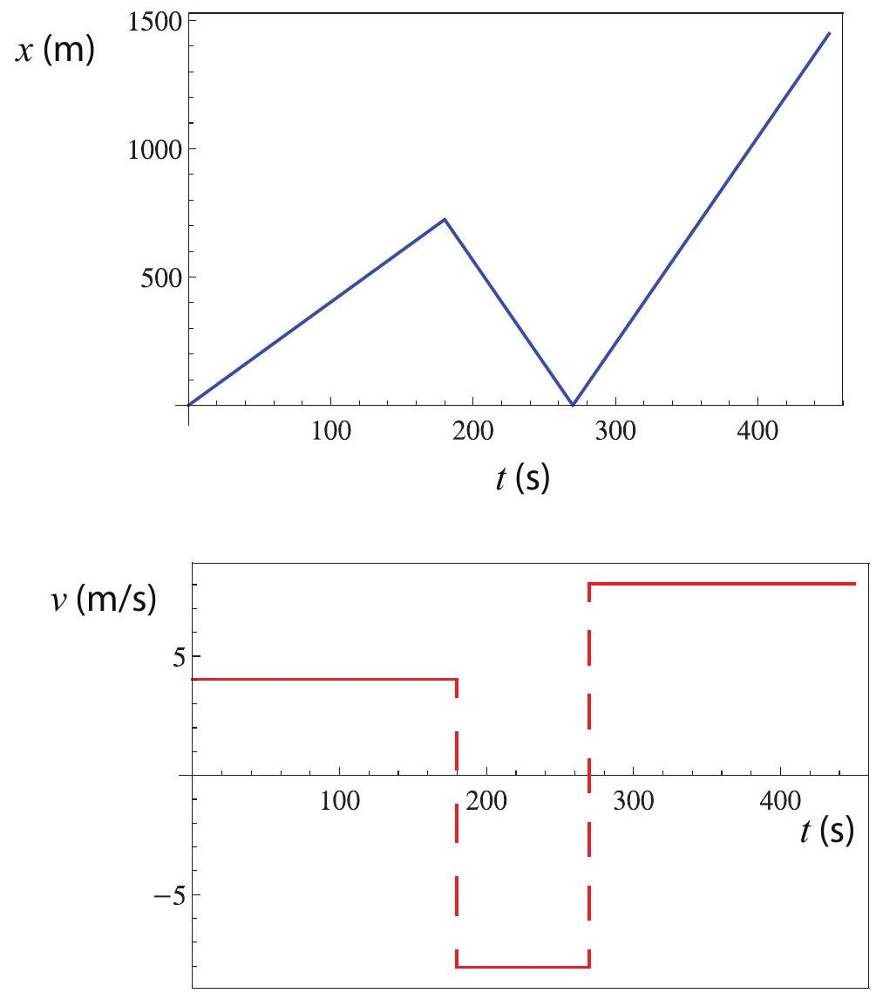
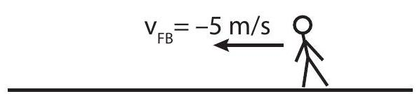
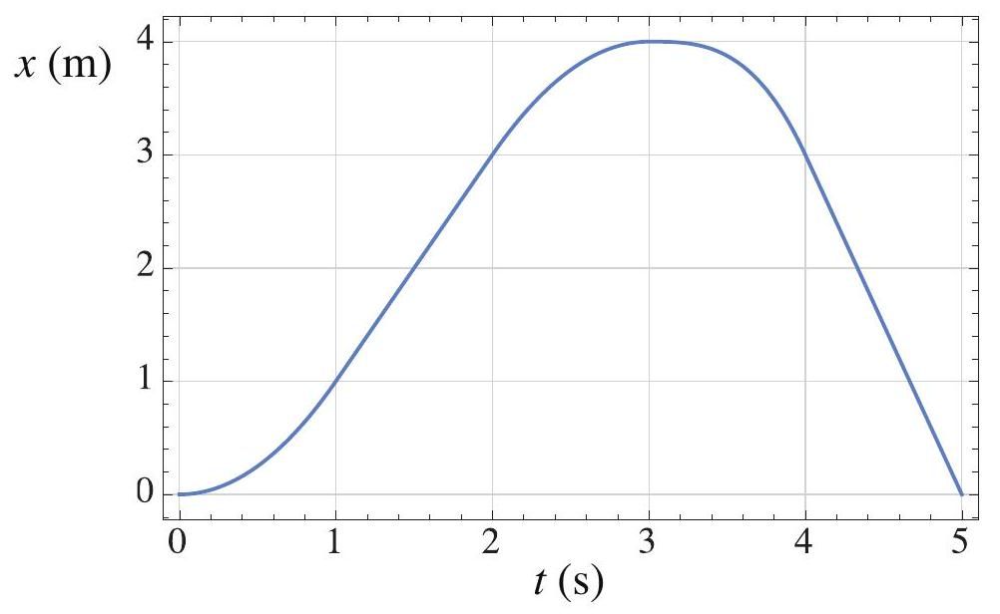
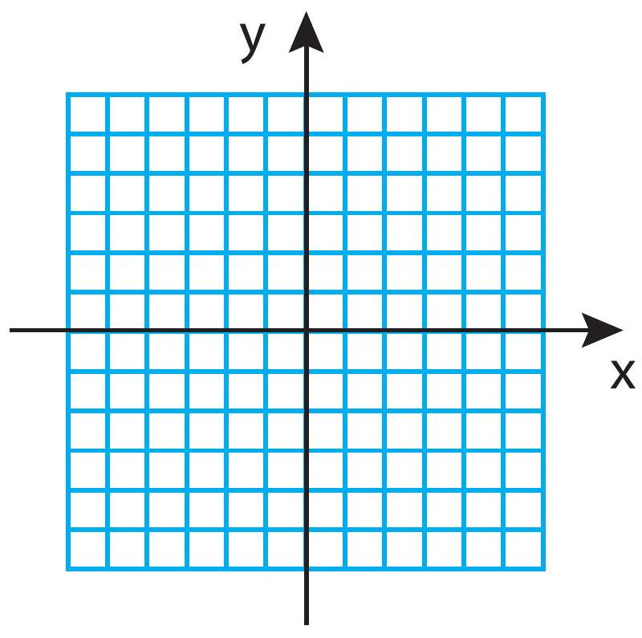

(sec-1.1)=
## 1.1 Introduction

Classical mechanics is the branch of physics that deals with the study of the motion of anything (roughly speaking) larger than an atom or a molecule. That is a lot of territory, and the methods and concepts of classical mechanics are at the foundation of any branch of science or engineering that is concerned with the motion of anything from a star to an amoeba-fluids, rocks, animals, planets, and any and all kinds of machines. Moreover, even though the accurate description of processes at the atomic level requires the (formally very different) methods of quantum mechanics, at least three of the basic concepts of classical mechanics that we are going to study this semester, namely, momentum, energy, and angular momentum, carry over into quantum mechanics as well, with the last two playing, in fact, an essential role.

(sec-1.1.1)=
### 1.1.1 Particles in classical mechanics

In the study of motion, the most basic starting point is the concept of the position of an object. Clearly, if we want to describe accurately the position of a macroscopic object such as a car, we may need a lot of information, including the precise shape of the car, whether it is turned this way or that way, and so on; however, if all we want to know is how far the car is from Fort Smith or Fayetteville, we do not need any of that: we can just treat the car as a dot, or mathematical point, on the map - which is the way your GPS screen will show it, anyway. When we do this, we say that are describing the car (or whatever the macroscopic object may be) as a particle.

In classical mechanics, an \"ideal\" particle is an object with no appreciable size - a mathematical point. In one dimension (that is to say, along a straight line), its position can be specified just by giving a single number, the distance from some reference point, as we shall see in a moment (in three dimensions, of course, three numbers are required). In terms of energy (which is perhaps the most important concept in all of physics, and which we will introduce properly in due course), an ideal particle has only one kind of energy, what we will later call translational kinetic energy; it cannot have, for instance, rotational kinetic energy (since it has \"no shape\" for practical purposes), or any form of internal energy (elastic, thermal, etc.), since we assume it is too small to have any internal structure in the first place.

The reason this is a useful concept is not just that we can often treat extended objects as particles in an approximate way (like the car in the example above), but also, and most importantly, that if we want to be more precise in our calculations, we can always treat an extended object (mathematically) as a collection of \"particles.\" The physical properties of the object, such as its energy, momentum, rotational inertia, and so forth, can then be obtained by adding up the corresponding quantities for all the particles making up the object. Not only that, but the interactions between two extended objects can also be calculated by adding up the interactions between all the particles making up the two objects. This is how, once we know the form of the gravitational force between two particles (which is fairly simple, as we will see in {ref}`Chapter 10 <ch-10>`), we can use that to calculate the force of gravity between a planet and its satellites, which can be fairly complicated in detail, depending, for instance, on the relative orientation of the planet and the satellite.

The mathematical tool we use to calculate these \"sums\" is calculus - specifically, integration-and you will see many examples of this\... in your calculus courses. Calculus I is only a corequisite for this course, so we will not make a lot of use of it here, and in any case you would need multidimensional integrals, which are an even more advanced subject, to do these kinds of calculations. But it may be good for you to keep these ideas on the back of your mind. Calculus was, in fact, invented by Sir Isaac Newton precisely for this purpose, and the developments of physics and mathematics have been closely linked together ever since.

Anyway, back to particles, the plan for this semester is as follows: we will start our description of motion by treating every object (even fairly large ones, such as cars) as a \"particle,\" because we will only be concerned at first with its translational motion and the corresponding energy. Then we will progressively make things more complex: by considering systems of two or more particles, we will start to deal with the internal energy of a system. Then we will move to the study of rigid bodies, which are another important idealization: extended objects whose parts all move together as the object undergoes a translation or a rotation. This will allow us to introduce the concept of rotational kinetic energy. Eventually we will consider wave motion, where different parts of an extended object (or \"medium\") move relative to each other. So, you see, there is a logical progression here, with most parts of the course building on top of the previous ones, and energy as one of the main connecting themes.

(sec-1.1.2)=
### 1.1.2 Aside: the atomic perspective

As an aside, it should perhaps be mentioned that the building up of classical mechanics around this concept of ideal particles had nothing to do, initially, with any belief in \"atoms,\" or an atomic theory of matter. Indeed, for most 18th and 19th century physicists, matter was supposed to be a continuous medium, and its (mental) division into particles was just a mathematical convenience.

The atomic hypothesis became increasingly more plausible as the 19th century wore on, and by the 1920's, when quantum mechanics came along, physicists had to face a surprising development: matter, it turned out, was indeed made up of \"elementary particles,\" but these particles could not, in fact, be themselves described by the laws of classical mechanics. One could not, for instance, attribute to them simultaneously well-defined positions and velocities. Yet, in spite of this, most of the conclusions of classical mechanics remain valid for macroscopic objects, because, most of the time, it is OK to (formally) \"break up\" extended objects into chunks that are small enough to be treated as particles, but large enough that one does not need quantum mechanics to describe their behavior.

Quantum properties were first found to manifest themselves at the macroscopic level when dealing with thermal energy, because at one point it really became necessary to figure out where and how the energy was stored at the truly microscopic (atomic) level. Thus, after centuries of successes, classical mechanics met its first failure with the so-called problem of the specific heats, and a completely new physical theory-quantum mechanics - had to be developed in order to deal with the newly-discovered atomic world. But all this, as they say, is another story, and for our very brief dealings with thermal physics - the last chapter in this book-we will just take specific heats as given, that is to say, something you measure (or look up in a table), rather than something you try to calculate from theory.

(sec-1.2)=
## 1.2 Position, displacement, velocity

Kinematics is the part of mechanics that deals with the mathematical description of motion, leaving aside the question of what causes an object to move in a certain way. Kinematics, therefore, does not include such things as forces or energy, which fall instead under the heading of dynamics. It may be said, then, that kinematics by itself is not true physics, but only applied mathematics; yet it is still an essential part of classical mechanics, and its most natural starting point. This chapter (and parts of the next one) will introduce the basic concepts and methods of kinematics in one dimension.

(sec-1.2.1)=
### 1.2.1 Position

As stated in the previous section, we are initially interested only in describing the motion of a \"particle,\" which can be thought of as a mathematical point in space. (Later on we will see that, even for an extended object or system, it is often useful to consider the motion of a specific point that we call the system's center of mass.) A point in three dimensions can be located by giving three numbers, known as its Cartesian coordinates (or, more simply, its coordinates). In two dimensions, this works as shown in {numref}`Figure %s <fig-1.1>` below. As you can see, the coordinates of a point just tell us how to find it by first moving a certain distance $x$, from a previously-agreed origin, along a horizontal (or $x$ ) axis, and then a certain distance $y$ along a vertical (or $y$ ) axis. (Or, of course, you could equally well first move vertically and then horizontally.)

:::{figure} ../images/2024_09_14_9969b06773f10b6936e8g-022.jpg
:label: fig-1.1
:alt: The position vector, r vector, of a point, and its x and y components (the point's coordinates).
The position vector, $\vec{r}$, of a point, and its $x$ and $y$ components (the point's coordinates).
:::

The quantities $x$ and $y$ are taken to be positive or negative depending on what side of the origin the point is on. Typically, we will always start by choosing a positive direction for each axis, as the direction along which the algebraic value of the corresponding coordinate increases. This is often chosen to be to the right for the horizontal axis, and upwards for the vertical axis, but there is nothing that says we cannot choose a different convention if it turns out to be more convenient. In {numref}`Figure %s <fig-1.1>`, the arrows on the axes denote the positive direction for each. Going by the grid, the coordinates of the point shown are $x=4$ units, $y=3$ units.

In two or three dimensions (and even, in a sense, in one dimension), the coordinates of a point can\
be interpreted as the components of a vector that we call the point's position vector, and denote by $\vec{r}$ (sometimes boldface letters are used for vectors, instead of an arrow on top; in that case, the position vector would be denoted by $\mathbf{r}$ ). A vector is a mathematical object, with specific geometric and algebraic properties, that physicists use to represent a quantity that has both a magnitude and a direction. The magnitude of the position vector in {numref}`Fig. %s <fig-1.1>` is just the length of the arrow, which is to say, 5 length units (by the Pythagorean theorem, the length of $\vec{r}$, which we will often write using absolute value bars as $|\vec{r}|$, is equal to $\sqrt{x^{2}+y^{2}}$ ); this is just the straight-line distance of the point to the origin. The direction of $\vec{r}$, on the other hand, can be specified in a number of ways; a common convention is to give the value of the angle that it makes with the positive $x$ axis, which I have denoted in the figure as $\theta$ (in this case, you can verify that $\left.\theta=\tan ^{-1}(y / x)=36.9^{\circ}\right)$. In three dimensions, two angles would be needed to completely specify the direction of $\vec{r}$.

As you can see, giving the magnitude and direction of $\vec{r}$ is a way to locate the point that is completely equivalent to giving its coordinates $x$ and $y$. By the same token, the coordinates $x$ and $y$ are a way to specify the vector $\vec{r}$ that is completely equivalent to giving its magnitude and direction. As I stated above, we call $x$ and $y$ the components (or sometimes, to be more specific, the Cartesian components) of the vector $\vec{r}$. In a sense all the vectors that will be introduced later on this semester will derive their geometric and algebraic properties from the position vector $\vec{r}$, so once you know how to deal with one vector, you can deal with them all. The geometric properties (by which I mean, how to relate a vector's components to its magnitude and direction) I have just covered, and will come back to later on in this chapter, and again in {ref}`Chapter 8 <ch-8>`; the algebraic properties (how to add vectors and multiply them by ordinary numbers, which are called scalars in this context) I will introduce along the way.

For the first few chapters this semester, we are going to be primarily concerned with motion in one dimension (that is to say, along a straight line, backwards or forwards), in which case all we need to locate a point is one number, its $x$ (or $y$, or $z$ ) coordinate; we do not then need to worry particularly about vector algebra. Alternatively, we can simply say that a vector in one dimension is essentially the same as its only component, which is just a positive or negative number (the magnitude of the number being the magnitude of the vector, and its sign indicating its direction), and has the algebraic properties that follow naturally from that.

The description of the motion that we are aiming for is to find a function of time, which we denote by $x(t)$, that gives us the point's position (that is to say, the value of $x$ ) for any value of the time parameter, $t$. (See {numref}`Eq. %s <eq-1.10>`, below, for an example.) Remember that $x$ stands for a number that can be positive or negative (depending on the side of the origin the point is on), and has dimensions of length, so when giving a numerical value for it you must always include the appropriate units (meters, centimeters, miles\...). Similarly, $t$ stands for the time elapsed since some more or less arbitrary \"origin of time,\" or time zero. Normally $t$ should always be positive, but in special cases it may make sense to consider negative times (think of how we count years: \"AD\" would correspond to \"positive\" and \"BC\" would correspond to negative - the difference being that there is actually no year zero!). Anyway, $t$ also is a number with dimensions, and must be reported with its appropriate\
units: seconds, minutes, hours, etc.

:::{figure} ../images/2024_09_14_9969b06773f10b6936e8g-024.jpg
:label: fig-1.2
:alt: A possible position vs. time graph for an object moving in one dimension.
A possible position vs. time graph for an object moving in one dimension.
:::

We will be often interested in plotting the position of an object as a function of time - that is to say, the graph of the function $x(t)$. This may, in principle, have any shape, as you can see in {numref}`Figure %s <fig-1.2>` above. In the lab, you will have a chance to use a position sensor that will automatically generate graphs like that for you on the computer, for any moving object that you aim the position sensor at. It is, therefore, important that you learn how to \"read\" such graphs. For example, {numref}`Figure %s <fig-1.2>` shows an object that starts, at the time $t=0$, a distance 0.2 m away and to the right of the origin (so $x(0)=0.2 \mathrm{~m}$ ), then moves in the negative direction to $x=-0.15 \mathrm{~m}$, which it reaches at $t=0.5 \mathrm{~s}$; then turns back and moves in the opposite direction until it reaches the point $x=0.1 \mathrm{~m}$, turns again, and so on. Physically, this could be tracking the damped oscillations of a system such as an object attached to a spring and sliding over a surface that exerts a friction force on it (see Example 11.5.1).

(sec-1.2.2)=
### 1.2.2 Displacement

In one dimension, the displacement of an object over a given time interval is a quantity that we denote as $\Delta x$, and equals the difference between the object's initial and final positions (in one dimension, we will often call the \"position coordinate\" simply the \"position,\" for short):

:::{math}
:label: eq-1.1
\Delta x=x_{f}-x_{i}
:::

Here the subscript $i$ denotes the object's position at the beginning of the time interval considered, and the subscript $f$ its position at the end of the interval. The symbol $\Delta$ will consistently be used throughout this book to denote a change in the quantity following the symbol, meaning the\
difference between its initial value and its final value. The time interval itself will be written as $\Delta t$ and can be expressed as

:::{math}
:label: eq-1.2
\Delta t=t_{f}-t_{i}
:::

where again $t_{i}$ and $t_{f}$ are the initial and final values of the time parameter (imagine, for instance, that you are reading time in seconds on a digital clock, and you are interested in the change in the object's position between second 130 and second 132: then $t_{i}=130 \mathrm{~s}, t_{2}=132 \mathrm{~s}$, and $\Delta t=2 \mathrm{~s}$ ).

You can practice reading off displacements from {numref}`Figure %s <fig-1.2>`. The displacement between $t_{i}=0.5 \mathrm{~s}$ and $t_{f}=1 \mathrm{~s}$, for instance, is $0.25 \mathrm{~m}\left(x_{i}=-0.15 \mathrm{~m}, x_{f}=0.1 \mathrm{~m}\right)$. On the other hand, between $t_{i}=1 \mathrm{~s}$ and $t_{f}=1.3 \mathrm{~s}$, the displacement is $\Delta x=0-0.1=-0.1 \mathrm{~m}$.

Notice two important things about the displacement. First, it can be positive or negative. Positive means the object moved, overall, in the positive direction; negative means it moved, overall, in the negative direction. Second, even when it is positive, the displacement does not always equal the distance traveled by the object (distance, of course, is always defined as a positive quantity), because if the object \"doubles back\" on its tracks for some distance, that distance does not count towards the overall displacement. For instance, looking again at {numref}`Figure %s <fig-1.2>`, in between the times $t_{i}=0.5 \mathrm{~s}$ and $t_{f}=1.5 \mathrm{~s}$ the object moved first 0.25 m in the positive direction, and then 0.15 m in the negative direction, for a total distance traveled of 0.4 m ; however, the total displacement was just 0.1 m .

In spite of these quirks, the total displacement is, mathematically, a useful quantity, because often we will have a way (that is to say, an equation) to calculate $\Delta x$ for a given interval, and then we can rewrite {numref}`Eq. %s <eq-1.1>` so that it reads

:::{math}
:label: eq-1.3
x_{f}=x_{i}+\Delta x
:::

That is to say, if we know where the object started, and we have a way to calculate $\Delta x$, we can easily figure out where it ended up. You will see examples of this sort of calculation in the homework later on.

(ch-1-extension-to-two-dimensions)=
### Extension to two dimensions

In two dimensions, we write the displacement as the vector

:::{math}
:label: eq-1.4
\Delta \vec{r}=\vec{r}_{f}-\vec{r}_{i}
:::

The components of this vector are just the differences in the position coordinates of the two points involved; that is, $(\Delta \vec{r})_{x}$ (a subscript $x, y$, etc., is a standard way to represent the $x, y \ldots$ component of a vector) is equal to $x_{f}-x_{i}$, and similarly $(\Delta \vec{r})_{y}=y_{f}-y_{i}$.

:::{figure} ../images/2024_09_14_9969b06773f10b6936e8g-026.jpg
:label: fig-1.3
:alt: The displacement vector for a particle that was initially at a point with position vector r vectori and ended up at a point with position vector r vectorf is the difference of the position vectors.
The displacement vector for a particle that was initially at a point with position vector $\vec{r}_{i}$ and ended up at a point with position vector $\vec{r}_{f}$ is the difference of the position vectors.
:::

{numref}`Figure %s <fig-1.3>` shows how this makes sense. The $x$ component of $\Delta \vec{r}$ in the figure is $\Delta x=3-7=-4 \mathrm{~m}$; the $y$ component is $\Delta y=8-4=4 \mathrm{~m}$. This basically shows you how to subtract (and, by extension, add, since $\vec{r}_{f}=\vec{r}_{i}+\Delta \vec{r}$ ) vectors: you just subtract (or add) the corresponding components. Note how, by the Pythagorean theorem, the length (or magnitude) of the displacement vector, $|\Delta \vec{r}|=\sqrt{\left(x_{f}-x_{i}\right)^{2}+\left(y_{f}-y_{i}\right)^{2}}$, equals the straight-line distance between the initial point and the final point, just as in one dimension; of course, the particle could have actually followed a very different path from the initial to the final point, and therefore traveled a different distance.

(sec-1.2.3)=
### 1.2.3 Velocity

(ch-1-average-velocity)=
### Average velocity

If you drive from Fayetteville to Fort Smith in 50 minutes, your average speed for the trip is calculated by dividing the distance of 59.2 mi by the time interval:

:::{math}
:label: eq-1.5
\text { average speed }=\frac{\text { distance }}{\Delta t}=\frac{59.2 \mathrm{mi}}{50 \mathrm{~min}}=\frac{59.2 \mathrm{mi}}{50 \mathrm{~min}} \times \frac{60 \mathrm{~min}}{1 \mathrm{hr}}=71.0 \mathrm{mph}
:::

(this equation, incidentally, also shows you how to convert units, and how you will be expected to\
work with significant figures this semester: the rule of thumb is, keep four significant figures in all intermediate calculations, and report three in the final result).

The way we define average velocity is similar to average speed, but with one important difference: we use the displacement, instead of the distance. So, the average velocity $v_{a v}$ of an object, moving along a straight line, over a time interval $\Delta t$ is

:::{math}
:label: eq-1.6
v_{a v}=\frac{\Delta x}{\Delta t}
:::

This definition has all the advantages and the quirks of the displacement itself. On the one hand, it automatically comes with a sign (the same sign as the displacement, since $\Delta t$ will always be positive), which tells us in what direction we have been traveling. On the other hand, it may not be an accurate estimate of our average speed, if we doubled back at all. In the most extreme case, for a roundtrip (leave Fayetteville and return to Fayetteville), the average velocity would be zero, since $x_{f}=x_{i}$ and therefore $\Delta x=0$.

It is clear that this concept is not going to be very useful in general, if the object we are tracking has a chance to double back in the time interval $\Delta t$. A way to prevent this from happening, and also getting a more meaningful estimate of the object's speed at any instant, is to make the time interval very small. This leads to a new concept, that of instantaneous velocity.

(ch-1-instantaneous-velocity)=
### Instantaneous velocity

We define the instantaneous velocity of an object (a \"particle\"), at the time $t=t_{i}$, as the mathematical limit

:::{math}
:label: eq-1.7
v=\lim _{\Delta t \rightarrow 0} \frac{\Delta x}{\Delta t}
:::

The meaning of this is the following. Suppose we compute the ratio $\Delta x / \Delta t$ over successively smaller time intervals $\Delta t$ (all of them starting at the same time $t_{i}$ ). For instance, we can start by making $t_{f}=t_{i}+1 \mathrm{~s}$, then try $t_{f}=t_{i}+0.5 \mathrm{~s}$, then $t_{f}=t_{i}+0.1 \mathrm{~s}$, and so on. Naturally, as the time interval becomes smaller, the corresponding displacement will also become smaller-the particle has less and less time to move away from its initial position, $x_{i}$. The hope is that the successive ratios $\Delta x / \Delta t$ will converge to a definite value: that is to say, that at some point we will start getting very similar values, and that beyond a certain point making $\Delta t$ any smaller will not change any of the significant digits of the result that we care about. This limit value is the instantaneous velocity of the object at the time $t_{i}$.

When you think about it, there is something almost a bit self-contradictory about the concept of instantaneous velocity. You cannot (in practice) determine the velocity of an object if all you are given is a literal instant. You cannot even tell if the object is moving, if all you have is one instant! Motion requires more than one instant, the passage of time. In fact, all the \"instantaneous\" velocities that we can measure, with any instrument, are always really average velocities, only the\
average is taken over very short time intervals. Nevertheless, the fact is that for any reasonably well-behaved position function $x(t)$, the limit in {numref}`Eq. %s <eq-1.7>` is mathematically well-defined, and it equals what we call, in calculus, the derivative of the function $x(t)$ :

:::{math}
:label: eq-1.8
v=\lim _{\Delta t \rightarrow 0} \frac{\Delta x}{\Delta t}=\frac{d x}{d t}
:::

:::{figure} ../images/2024_09_14_9969b06773f10b6936e8g-028.jpg
:label: fig-1.4
:alt: The slope of the green segment is the average velocity for the time interval delta t shown. As delta t becomes smaller, this approaches the slope of the tangent at the point (ti, xi)
The slope of the green segment is the average velocity for the time interval $\Delta t$ shown. As $\Delta t$ becomes smaller, this approaches the slope of the tangent at the point $\left(t_{i}, x_{i}\right)$
:::

In fact, there is a nice geometric interpretation for this quantity: namely, it is the slope of a line tangent to the $x$-vs- $t$ curve at the point $\left(t_{i}, x_{i}\right)$. As {numref}`Figure %s <fig-1.4>` shows, the average velocity $\Delta x / \Delta t$ is the slope (rise over run) of a line segment drawn from the point $\left(t_{i}, x_{i}\right)$ to the point $\left(t_{f}, x_{f}\right)$ (the green line in the figure). As we make the time interval smaller, by bringing $t_{f}$ closer to $t_{i}$ (and hence, also, $x_{f}$ closer to $x_{i}$ ), the slope of this segment will approach the slope of the tangent line at $\left(t_{i}, x_{i}\right)$ (the blue line), and this will be, by the definition {eq}`eq-1.7`, the instantaneous velocity at that point.

This geometric interpretation makes it easy to get a qualitative feeling, from the position-vs-time graph, for when the particle is moving more or less fast. A large slope means a steep rise or fall, and that is when the velocity will be largest - in magnitude. A steep rise means a large positive velocity, whereas a steep drop means a large negative velocity, by which I mean a velocity that is given by a negative number which is large in absolute value. In the future, to simplify sentences like this one, I will just use the word \"speed\" to refer to the magnitude (that is to say, the absolute value) of the instantaneous velocity. Thus, speed (like distance) is always a positive number, by definition, whereas velocity can be positive or negative; and a steep slope (positive or negative) means the speed is large there.

Conversely, looking at the sample $x$-vs- $t$ graphs in this chapter, you may notice that there are times when the tangent is horizontal, meaning it has zero slope, and so the instantaneous velocity at those times is zero (for instance, at the time $t=1.0 \mathrm{~s}$ in {numref}`Figure %s <fig-1.2>`). This makes sense when you think of what the particle is actually doing at those special times: it is just changing direction, so its velocity is going, for instance, from positive to negative. The way this happens is, it slows down, down\... the velocity gets smaller and smaller, and then, for just an instant (literally, a mathematical point in time), it becomes zero before, the next instant, going negative.

We will be coming back to this \"reading of graphs\" in the lab and the homework, as well as in the next chapter, when we introduce the concept of acceleration.

(ch-1-motion-with-constant-velocity)=
### Motion with constant velocity

If the instantaneous velocity of an object never changes, it means that it is always moving in the same direction with the same speed. In that case, the instantaneous velocity and the average velocity coincide, and that means we can write $v=\Delta x / \Delta t$ (where the size of the interval $\Delta t$ could now be anything), and rewrite this equation in the form

:::{math}
:label: eq-1.9
\Delta x=v \Delta t
:::

which is the same as

$$x_{f}-x_{i}=v\left(t_{f}-t_{i}\right)$$

Now suppose we keep $t_{i}$ constant (that is, we fix the initial instant) but allow the time $t_{f}$ to change, so we will just write $t$ for an arbitrary value of $t_{f}$, and $x$ for the corresponding value of $x_{f}$. We end up with the equation

$$x-x_{i}=v\left(t-t_{i}\right)$$

which we can also write as

:::{math}
x(t)=x_{i}+v\left(t-t_{i}\right)
:::

after some rearranging, and where the notation $x(t)$ has been introduced to emphasize that we want to think of $x$ as a function of $t$. This is, not surprisingly, the equation of a straight line - a \"curve\" which is its own tangent and always has the same slope.\
(Please make sure that you are not confused by the notation in {numref}`Eq. %s <eq-1.10>`. The parentheses around the $t$ on the left-hand side mean that we are considering the position $x$ as a function of $t$. On the other hand, the parentheses around the quantity $t-t_{i}$ on the right-hand side mean that we are multiplying this quantity by $v$, which is a constant here. This distinction will be particularly important when we introduce the function $v(t)$ next.)

Either one of equations {eq}`eq-1.9` or {eq}`eq-1.11` can be used to solve problems involving motion with constant velocity, and again you will see examples of this in the homework.

(ch-1-motion-with-changing-velocity)=
### Motion with changing velocity

If the velocity changes with time, obtaining an expression for the position of the object as a function of time may be a nontrivial task. In the next chapter we will study an important special case, namely, when the velocity changes at a constant rate (constant acceleration).

For the most general case, a graphical method that is sometimes useful is the following. Suppose that we know the function $v(t)$, and we graph it, as in {numref}`Figure %s <fig-1.5>` below. Then the area under the curve in between any two instants, say $t_{i}$ and $t_{f}$, is equal to the total displacement of the object over that time interval.

The idea involved is known in calculus as integration, and it goes as follows. Suppose that I break

:::{figure} ../images/2024_09_14_9969b06773f10b6936e8g-030.jpg
:label: fig-1.5
:alt: How to get the displacement from the area under the v-vs- t curve.
How to get the displacement from the area under the $v$-vs- $t$ curve.\
:::

down the interval from $t_{i}$ to $t_{f}$ into equally spaced subintervals, beginning at the time $t_{i}$ (which I am, equivalently, going to call $t_{1}$, that is, $t_{1} \equiv t_{i}$, so I have now $t_{1}, t_{2}, t_{3}, \ldots t_{f}$ ). Now suppose I treat the object's motion over each subinterval as if it were motion with constant velocity, the velocity being that at the beginning of the subinterval. This, of course, is only an approximation, since the velocity is constantly changing; but, if you look at {numref}`Figure %s <fig-1.5>`, you can convince yourself that it will become a better and better approximation as I increase the number of intermediate points and the rectangles shown in the figure become narrower and narrower. In this approximation, the displacement during the first subinterval would be

:::{math}
:label: eq-1.11
\Delta x_{1}=v_{1}\left(t_{2}-t_{1}\right)
:::

where $v_{1}=v\left(t_{1}\right)$; similarly, $\Delta x_{2}=v_{2}\left(t_{3}-t_{2}\right)$, and so on.

However, {numref}`Eq. %s <eq-1.11>` is just the area of the first rectangle shown under the curve in {numref}`Figure %s <fig-1.5>` (the base of the rectangle has \"length\" $t_{2}-t_{1}$, and its height is $v_{1}$ ). Similarly for the second rectangle, and so on. So the sum $\Delta x_{1}+\Delta x_{2}+\ldots$ is both an approximation to the area under the $v$-vs-t curve, and an approximation to the total displacement $\Delta t$. As the subdivision becomes finer and finer, and the rectangles narrower and narrower (and more numerous), both approximations become more and more accurate. In the limit of \"infinitely many,\" infinitely narrow rectangles, you get both the total displacement and the area under the curve exactly, and they are both equal to each other. Mathematically, we would write

:::{math}
:label: eq-1.12
\Delta x=\int_{t_{i}}^{t_{f}} v(t) d t
:::

where the stylized \"S\" (for \"sum\") on the right-hand side is the symbol of the operation known as integration in calculus. This is essentially the inverse of the process know as differentiation, by which we got the velocity function from the position function, back in {numref}`Eq. %s <eq-1.8>`.

This graphical method to obtain the displacement from the velocity function is sometimes useful, if you can estimate the area under the $v$-vs- $t$ graph reliably. An important point to keep in mind is that rectangles under the horizontal axis (corresponding to negative velocities) have to be added as having negative area (since the corresponding displacement is negative); see example 1.5.1 at the end of this chapter.

(ch-1-extension-to-two-dimensions-1)=
### Extension to two dimensions

In two (or more) dimensions, you define the average velocity vector as a vector $\vec{v}_{a v}$ whose components are $v_{a v, x}=\Delta x / \Delta t, v_{a v, y}=\Delta y / \Delta t$, and so on (where $\Delta x, \Delta y, \ldots$ are the corresponding components of the displacement vector $\Delta \vec{r})$. This can be written equivalently as the single vector equation

:::{math}
:label: eq-1.13
\vec{v}_{a v}=\frac{\Delta \vec{r}}{\Delta t}
:::

This tells you how to multiply (or divide) a vector by an ordinary number: you just multiply (or divide) each component by that number. Note that, if the number in question is positive, this operation does not change the direction of the vector at all, it just scales it up or down (which is why ordinary numbers, in this context, are called scalars). If the scalar is negative, the vector's direction is flipped as a result of the multiplication. Since $\Delta t$ in the definition of velocity is always positive, it follows that the average velocity vector always points in the same direction as the displacement, which makes sense.

To get the instantaneous velocity, you just take the limit of the expression {eq}`eq-1.13` as $\Delta t \rightarrow 0$, for each component separately. The resulting vector $\vec{v}$ has components $v_{x}=\lim _{\Delta t \rightarrow 0} \Delta x / \Delta t$, etc., which can also be written as $v_{x}=d x / d t, v_{y}=d y / d t, \ldots$.

All the results derived above hold for each spatial dimension and its corresponding velocity component. For instance, the graphical method shown in {numref}`Figure %s <fig-1.5>` can always be used to get $\Delta x$ if\
the function $v_{x}(t)$ is known, or equivalently to get $\Delta y$ if you know $v_{y}(t)$, and so on.\
Introducing the velocity vector at this point does cause a little bit of a notational difficulty. For quantities like $x$ and $\Delta x$, it is pretty obvious that they are the $x$ components of the vectors $\vec{r}$ and $\Delta \vec{r}$, respectively; however, the quantity that we have so far been calling simply $v$ should more properly be denoted as $v_{x}$ (or $v_{y}$ if the motion is along the $y$ axis). In fact, there is a convention that if you use the symbol for a vector without the arrow on top or any $x, y, \ldots$ subscripts, you must mean the magnitude of the vector. In this book, however, I have decided not to follow that convention, at least not until we get to {ref}`Chapter 8 <ch-8>` (and even then I will use it only for forces). This is because we will spend most of our time dealing with motion in only one dimension, and it makes the notation unnecessarily cumbersome to keep having to write the $x$ or $y$ subscripts on every component of every vector, when you really only have one dimension to worry about in the first place. So $v$ will, throughout, refer to the relevant component of the velocity vector, to be inferred from the context, until we get to {ref}`Chapter 8 <ch-8>` and actually need to deal with both a $v_{x}$ and a $v_{y}$ explicitly.

Finally, notice that the magnitude of the velocity vector, $|\vec{v}|=\sqrt{v_{x}^{2}+v_{y}^{2}+v_{z}^{2}}$, is equal to the instantaneous speed, since, as $\Delta t \rightarrow 0$, the magnitude of the displacement vector, $|\Delta \vec{r}|$, becomes the actual distance traveled by the object in the time interval $\Delta t$.

(sec-1.3)=
## 1.3 Reference frame changes and relative motion

Everything up to this point assumes that we are using a fixed, previously agreed upon reference frame. Basically, this is just an origin and a set of axes along which to measure our coordinates, as shown in Figure 1.

There are, however, a number of situations in physics that call for the use of different reference frames, and, more importantly, that require us to convert various physical quantities from one reference frame to another. For instance, imagine you are on a boat on a river, rowing downstream. You are moving with a certain velocity relative to the water around you, but the water itself is flowing with a different velocity relative to the shore, and your actual velocity relative to the shore is the sum of those two quantities. Ships generally have to do this kind of calculation all the time, as do airplanes: the \"airspeed\" is the speed of a plane relative to the air around it, but that air is usually moving at a substantial speed relative to the earth.

The way we deal with all these situations is by introducing two reference frames, which here I am going to call A and B. One of them, say A, is \"at rest\" relative to the earth, and the other one is \"at rest\" relative to something else-which means, really, moving along with that something else. (For instance, a reference frame at rest \"relative to the river\" would be a frame that's moving along\
with the river water, like a piece of driftwood that you could measure your progress relative to.)\
In any case, graphically, this will look as in {numref}`Figure %s <fig-1.6>`, which I have drawn for the two-dimensional case because I think it makes it easier to visualize what's going on:

:::{figure} ../images/2024_09_14_9969b06773f10b6936e8g-033.jpg
:label: fig-1.6
:alt: Position vectors and coordinates of a point P in two different reference frames, A and B.
Position vectors and coordinates of a point $P$ in two different reference frames, A and B .
:::

In the reference frame A, the point $P$ has position coordinates $\left(x_{A P}, y_{A P}\right)$. Likewise, in the reference frame B, its coordinates are $\left(x_{B P}, y_{B P}\right)$. As you can see, the notation chosen is such that every coordinate in A will have an \"A\" as a first subscript, while the second subscript indicates the object to which it refers, and similarly for coordinates in B.

The coordinates $\left(x_{A B}, y_{A B}\right)$ are special: they are the coordinates, in the reference frame A , of the origin of reference frame B. This is enough to fully locate the frame B in A, as long as the frames are not rotated relative to each other.

The thin colored lines I have drawn along the axes in {numref}`Figure %s <fig-1.6>` are intended to make it clear that the following equations hold:

:::{math}
:label: eq-1.14
\begin{align*}
x_{A P} & =x_{A B}+x_{B P} \\
y_{A P} & =y_{A B}+y_{B P}
\end{align*}
:::

Although the figure is drawn for the easy case where all these quantities are positive, you should be able to convince yourself that Eqs. {eq}`eq-1.14` hold also when one or more of the coordinates have negative values.

All these coordinates are also the components of the respective position vectors, shown in the figure and color-coded by reference frame (so, for instance, $\vec{r}_{A P}$ is the position vector of $P$ in the frame A), so the equations {eq}`eq-1.14` can be written more compactly as the single vector equation

:::{math}
:label: eq-1.15
\vec{r}_{A P}=\vec{r}_{A B}+\vec{r}_{B P}
:::

From all this you can see how to add vectors: algebraically, you just add their components separately, as in Eqs. {eq}`eq-1.14`; graphically, you draw them so the tip of one vector coincides with the tail of the other (we call this \"tip-to-tail\"), and then draw the sum vector from the tail of the first one to the tip of the other one. (In general, to get two arbitrary vectors tip-to-tail you may need to displace one of them; this is OK provided you do not change its orientation, that is, provided you only displace it, not rotate it. We'll see how this works in a moment with velocities, and later on with forces.)

Of course, I showed you already how to subtract vectors with {numref}`Fig. %s <fig-1.3>`: again, algebraically, you just subtract the corresponding coordinates, whereas graphically you draw them with a common origin, and then draw the vector from the tip of the vector you are subtracting to the tip of the other one. If you read the previous paragraph again, you can see that {numref}`Fig. %s <fig-1.3>` can equally well be used to show that $\Delta \vec{r}=\vec{r}_{f}-\vec{r}_{i}$, as to show that $\vec{r}_{f}=\vec{r}_{i}+\Delta \vec{r}$.

In a similar way, you can see graphically from {numref}`Fig. %s <fig-1.6>` (or algebraically from {numref}`Eq. %s <eq-1.15>`) that the position vector of $P$ in the frame B is given by $\vec{r}_{B P}=\vec{r}_{A P}-\vec{r}_{A B}$. The last term in this expression can be written in a different way, as follows. If I follow the convention I have introduced above, the quantity $x_{B A}$ (with the order of the subscripts reversed) would be the $x$ coordinate of the origin of frame A in frame B, and algebraically that would be equal to $-x_{A B}$, and similarly $y_{B A}=-y_{A B}$. Hence the vector equality $\vec{r}_{A B}=-\vec{r}_{B A}$ holds. Then,

:::{math}
:label: eq-1.16
\vec{r}_{B P}=\vec{r}_{A P}-\vec{r}_{A B}=\vec{r}_{A P}+\vec{r}_{B A}
:::

This is, in a way, the \"inverse\" of {numref}`Eq. %s <eq-1.15>`: it tells us how to get the position of $P$ in the frame B if we know its position in the frame A.

Let me show next you how all this extends to displacements and velocities. Suppose the point $P$ indicates the position of a particle at the time $t$. Over a time interval $\Delta t$, both the position of the particle and the relative position of the two reference frames may change. We can add yet another subscript, $i$ or $f$, (for initial and final) to the coordinates, and write, for example,

:::{math}
:label: eq-1.17
\begin{align*}
x_{A P, i} & =x_{A B, i}+x_{B P, i} \\
x_{A P, f} & =x_{A B, f}+x_{B P, f}
\end{align*}
:::

Subtracting these equations gives us the corresponding displacements:

:::{math}
:label: eq-1.18
\Delta x_{A P}=\Delta x_{A B}+\Delta x_{B P}
:::

Dividing {numref}`Eq. %s <eq-1.18>` by $\Delta t$ we get the average velocities ${ }^{1}$, and then taking the limit $\Delta t \rightarrow 0$ we get the instantaneous velocities. This applies in the same way to the $y$ coordinates, and the result is the vector equation

:::{math}
\vec{v}_{A P}=\vec{v}_{B P}+\vec{v}_{A B}
:::

I have rearranged the terms on the right-hand side to (hopefully) make it easier to visualize what's going on. In words: the velocity of the particle $P$ relative to (or measured in) frame A is equal to the (vector) sum of the velocity of the particle as measured in frame B, plus the velocity of frame B relative to frame A.

The result {eq}`eq-1.19` is just what we would have expected from the examples I mentioned at the beginning of this section, like rowing in a river or an airplane flying in the wind. For instance, for the airplane $\vec{v}_{B P}$ could be its \"airspeed\" (only it has to be a vector, so it would be more like its \"airvelocity\": that is, its velocity relative to the air around it), and $\vec{v}_{A B}$ would be the velocity of the air relative to the earth (the wind velocity, at the location of the airplane). In other words, A represents the earth frame of reference and B the air, or wind, frame of reference. Then, $\vec{v}_{A P}$ would be the \"true\" velocity of the airplane relative to the earth. You can see how it would be important to add these quantities as vectors, in general, by considering what happens when you fly in a cross wind, or try to row across a river, as in {numref}`Figure %s <fig-1.7>` below.

:::{figure} ../images/2024_09_14_9969b06773f10b6936e8g-035.jpg
:label: fig-1.7
:alt: Rowing across a river. If you head "straight across" the river (with velocity vector v vectorR b in the moving frame of the river, which is flowing with velocity v vectorE R in the frame of the earth), your actual velocity relative to the shore will be the vector v vectorE b. This is an instance of, with frame A being E (the earth), frame B being R (the river), and "b" (for "boat") standing for the point P we are tracking.
Rowing across a river. If you head \"straight across\" the river (with velocity vector $\vec{v}_{R b}$ in the moving frame of the river, which is flowing with velocity $\vec{v}_{E R}$ in the frame of the earth), your actual velocity relative to the shore will be the vector $\vec{v}_{E b}$. This is an instance of {numref}`Eq. %s <eq-1.19>`, with frame A being E (the earth), frame B being R (the river), and \"b\" (for \"boat\") standing for the point P we are tracking.
:::

As you can see from this couple of examples, {numref}`Equation %s <eq-1.19>` is often useful as it is written, but

sometimes the information we have is given to us in a different way: for instance, we could be given the velocity of the object in frame A $\left(\vec{v}_{A P}\right)$, and the velocity of frame B as seen in frame $\mathrm{A}\left(\vec{v}_{A B}\right)$, and told to calculate the velocity of the object as seen in frame B. This can be easily accomplished if we note that the vector $\vec{v}_{A B}$ is equal to $-\vec{v}_{B A}$; that is to say, the velocity of frame B as seen from frame A is just the opposite of the velocity of frame A as seen from frame B. Hence, {numref}`Eq. %s <eq-1.19>` can be rewritten as\
\$\$

:::{math}
:label: eq-1.20
\vec{v}_{A P}=\vec{v}_{B P}-\vec{v}_{B A}
:::

\$\$

For most of the next few chapters we are going to be considering only motion in one dimension, and so we will write {numref}`Eq. %s <eq-1.19>` (or {eq}`eq-1.20`) without the vector symbols, and it will be understood that $v$ refers to the component of the vector $\vec{v}$ along the coordinate axis of interest.

A quantity that will be particularly important later on is the relative velocity of two objects, which we could label 1 and 2 . The velocity of object 2 relative to object 1 is, by definition, the velocity which an observer moving along with 1 would measure for object 2 . So it is just a simple frame change: let the earth frame be frame E and the frame moving with object 1 be frame 1 , then the velocity we want is $v_{12}$ (\"velocity of object 2 in frame 1 \"). If we make the change $\mathrm{A} \rightarrow 1, \mathrm{~B} \rightarrow E$, and $\mathrm{P} \rightarrow 2$ in {numref}`Eq. %s <eq-1.20>`, we get

:::{math}
:label: eq-1.21
v_{12}=v_{E 2}-v_{E 1}
:::

In other words, the velocity of 2 relative to 1 is just the velocity of 2 minus the velocity of 1 . This is again a familiar effect: if you are driving down the highway at 50 miles per hour, and the car in front of you is driving at 55 , then its velocity relative to you is 5 mph , which is the rate at which it is moving away from you (in the forward direction, assumed to be the positive one).

It is important to realize that all these velocities are real velocities, each in its own reference frame. Something may be said to be truly moving at some velocity in one reference frame, and just as truly moving with a different velocity in a different reference frame. I will have a lot more to say about this in the next chapter, but in the meantime you can reflect on the fact that, if a car moving at 55 mph collides with another one moving at 50 mph in the same direction, the damage will be basically the same as if the first car had been moving at 5 mph and the second one had been at rest. For practical purposes, where you are concerned, another car's velocity relative to yours is that car's \"real\" velocity.

(ch-1-resources)=
### Resources

A good app for practicing how to add vectors (and how to break them up into components, magnitude and direction, etc.) may be found here:\
<https://phet.colorado.edu/en/simulation/vector-addition>.\
Perhaps the most dramatic demonstration of how {numref}`Eq. %s <eq-1.19>` works in the real world is in this episode of Mythbusters: <https://www.youtube.com/watch?v=BLuI118nhzc>. (If this link does not work, do a search for \"Mythbusters cancel momentum.\") They shoot a ball from the bed of a truck,\
with a velocity (relative to the truck) of 60 mph backwards, while the truck is moving forward at 60 mph. I think the result is worth watching. (Do not be distracted by their talk about momentum. We will get there, in time.)

A very old, but also very good, educational video about different frames of reference is this one: <https://www.youtube.com/watch?v=sS17fComONs>. You should try to watch at least part of it. Many things will be relevant to later parts of the course, including projectile motion, and the whole discussion of relative motion coming up next, in {ref}`Chapter 2 <ch-2>`.

(sec-1.4)=
## 1.4 In summary

1.  To describe the motion of an object in one dimension we treat it as a mathematical point, and consider its position coordinate, $x$ (often shortened to just the position), as a function of time: $x(t)$.

2.  Numerically, the position coordinate is the distance to a chosen origin, with a positive or negative sign depending on which side of the origin the point is. For every problem, when we introduce a coordinate axis we need to specify a positive direction. Starting from the origin in that direction, the position coordinate is positive and increasing, whereas going from the origin in the opposite direction (negative direction) it becomes increasingly negative.

3.  The displacement of an object over a time interval from an initial time $t_{i}$ to a final time $t_{f}$ is the quantity $\Delta x=x_{f}-x_{i}$, where $x_{f}$ is the position of the object at the final time (or, the final position), and $x_{i}$ the position at the initial time (or initial position).

4.  The average velocity of an object over the time interval from $t_{i}$ to $t_{f}$ is defined as $v_{a v}=\Delta x / \Delta t$, where $\Delta t=t_{f}-t_{i}$.

5.  The instantaneous velocity (often just called the velocity) of an object at the time $t$ is the limit value of the quantity $\Delta x / \Delta t$, calculated for successively shorter time intervals $\Delta t$, all with the same initial time $t_{i}=t$. This is, mathematically, the definition of the derivative of the function $x(t)$ at the time $t$, which we express as $v=d x / d t$.

6.  Graphically, the instantaneous velocity of the object at the time $t$ is the slope of the tangent line to the $x$-vs-t graph at the time $t$.

7.  The instantaneous velocity of an object is a positive or negative quantity depending on whether the object, at that instant, is moving in the positive or the negative direction.

8.  For an object moving with constant velocity $v$, the position function is given by \[{numref}`Eq. %s <eq-1.10>`\]:

:::{math}
:label: eq-1.10
x(t)=x_{i}+v\left(t-t_{i}\right)
:::

where $t_{i}$ is an arbitrarily chosen initial time and $x_{i}$ the position at that time. This can also be written in the form given by {numref}`Eq. %s <eq-1.9>`. The argument $(t)$ on the left-hand side of {eq}`eq-1.10` is optional, and $t_{i}$ is often set equal to zero, giving just $x=x_{i}+v t$. This, however, is not quite as generally applicable as the result {eq}`eq-1.9` or {eq}`eq-1.10`.\
9. For an object moving with changing velocity, the total displacement in between times $t_{i}$ and $t_{f}$ is equal to the total area under the $v$-vs- $t$ curve in between those times; areas below the horizontal $(t)$ axis must be treated as negative.\
10. In two or more dimensions one introduces, for every point in space, a position vector whose components are just the Cartesian coordinates of that point; then the displacement vector is defined as $\Delta \vec{r}=\vec{r}_{f}-\vec{r}_{i}$, the average velocity vector is $\vec{v}_{a v}=\Delta \vec{r} / \Delta t$, and the instantaneous velocity vector is the limit of this as $\Delta t$ goes to zero. Vectors are added by adding their components separately; to multiply a vector by an ordinary number, or scalar, we just multiply each component by that number.\
11. When tracking the motion of an object, \"P\", in two different reference frames, A and B , the position vectors are related by $\vec{r}_{A P}=\vec{r}_{A B}+\vec{r}_{B P}$, and likewise the velocity vectors: $\vec{v}_{A P}=\vec{v}_{A B}+\vec{v}_{B P}$. Here, the first subscript tells you in which reference frame you are measuring, and the second subscript what it is that you are looking at; $\vec{r}_{A B}$ is the position vector of the origin of frame B as seen in frame A , and $\vec{v}_{A B}$ its velocity.

(sec-1.5)=
## 1.5 Examples

(sec-1.5.1)=
### 1.5.1 Motion with (piecewise) constant velocity

You leave your house on your bicycle to go visit a friend. At your normal speed of 9 mph , you know it takes you 6 minutes to get there. This time, though, when you have traveled half the distance you realize you forgot a book at home that you were going to return to your friend, so you turn around and pedal at twice your normal speed, get back home, grab the book, and start off again for your friend's house at 18 mph (imagine you are really fit to pull this off!)\
(a) How far away from you does your friend live?\
(b) What is the total distance you travel on this trip?\
(c) How long did the whole trip take?\
(d) Draw a position versus time and a velocity versus time graph for the whole trip. Use SI units for both graphs. Neglect the time it takes you to stop and turn around, and also the time it takes you to run into your house and grab the book (in other words, assume those changes in your direction of motion happen instantly).\
(e) Show explicitly, using your $v$-vs- $t$ graph, that the graphical method of {numref}`Figure %s <fig-1.5>` gives you the total displacement for your trip.

(ch-1-solution)=
### Solution

I am going to work out this problem using both miles and SI units, the first because it seems most natural, and the second because we are asked to use SI units for part (d), so we might as well use them from the start. In general, you should use SI units whenever you can. If you are unsure of what to do in a specific problem, ask your instructor!\
(a) We are told that at 9 miles per hour it would take 6 minutes to get there, so let us use

:::{math}
\Delta x=v \Delta t
:::

with $v=9 \mathrm{mph}$ and $\Delta t=6 \mathrm{~min}$. We have to either convert the hours to minutes, or vice-versa. Again, in this case it seems easiest to realize that 6 min equals $1 / 10$ of an hour, so:

:::{math}
:label: eq-1.23
\Delta x=\left(9 \frac{\text { miles }}{\mathrm{hr}}\right) \times 0.1 \mathrm{hr}=0.9 \text { miles }
:::

In SI units, $9 \mathrm{mph}=4.023 \mathrm{~m} / \mathrm{s}$, and $6 \mathrm{~min}=360 \mathrm{~s}$, so $\Delta x=1448 \mathrm{~m}$.\
(b) This is just a matter of keeping track of the distance traveled in the various parts of the trip. You start by riding half the distance to your friend's house, which is to say, 0.45 miles, and then you ride that again back home, so that's 0.9 miles, and then you're back where you started, so you still have to go the 0.9 miles to your friend's house. So overall, you ride for 1.8 miles, or 2897 m .\
(c) The whole trip consists, as detailed above, of 0.45 miles at 9 mph , and the rest, which is 1.35 miles, at 18 mph . Applying $\Delta t=\Delta x / v$ to each of these intervals, we get a total time of

:::{math}
:label: eq-1.24
\begin{align*}
\Delta t & =\frac{0.45 \mathrm{miles}}{9 \mathrm{mph}}+\frac{1.35 \mathrm{miles}}{18 \mathrm{mph}}=0.125 \text { hours } \\
& =0.125 \times 60 \mathrm{~min}=7.5 \mathrm{~min} \\
& =7.5 \times 60 \mathrm{~s}=450 \mathrm{~s}
\end{align*}
:::

\(d\) The graphs are shown below. Details on how to get them follow.

- First interval: from $t=0$ to $t=180 \mathrm{~s}$ ( 3 min , which is what it would take to cover half the distance to your friend's house at 9 mph ). The velocity is a constant $v=4.023 \mathrm{~m} / \mathrm{s}$. For the position graph, use {numref}`Eq. %s <eq-1.10>` with $x_{i}=0, t_{i}=0$ and $v=4.023 \mathrm{~m} / \mathrm{s}$.

- Second interval: from $t=180 \mathrm{~s}$ to $t=270 \mathrm{~s}$ (it takes you half of 3 min , which is to say 90 s , to cover the same distance as above at twice the speed). The velocity is a constant $v=-8.046 \mathrm{~m} / \mathrm{s}$\
  (twice what it was earlier, but in the opposite direction). For the position graph, use {numref}`Eq. %s <eq-1.10>` with $x_{i}=724 \mathrm{~m}$ (this is half of the distance to your friend's house, and the starting position for this interval), $t_{i}=180 \mathrm{~s}$ and $v=-8.046 \mathrm{~m} / \mathrm{s}$.

- Third interval: from $t=270 \mathrm{~s}$ to $t=450 \mathrm{~s}$. The velocity is a constant $v=8.046 \mathrm{~m} / \mathrm{s}$ (same speed as just before, but in the opposite direction). For the position graph, use {numref}`Eq. %s <eq-1.10>` with $x_{i}=0 \mathrm{~m}$ (you start back at your house), $t_{i}=270 \mathrm{~s}$ and $v=8.046 \mathrm{~m} / \mathrm{s}$.

If you are familiar with the software package Mathematica, the position graph was produced using the command\
$\operatorname{Plot}\left[\mathrm{If}\left[\mathrm{t}<180,4.023 \mathrm{t}, \mathrm{If}\left[\mathrm{t}<270,4.023^{*} 180-8.046(\mathrm{t}-180), 8.046(\mathrm{t}-270)\right]\right],\{\mathrm{t}, 0,450\}\right]$\
and the velocity graph was produced using\
Plot\[If\[t\<180, 4.023, If $[\mathrm{t}<270,-8.046,8.046]],\{\mathrm{t}, 0,450\}]$\
(and then connecting the horizontal lines by hand, which is not necessary, but helps to visualize what's going on).

The graphs could also have been produced using the free plotting software package Gnuplot (available here: <http://www.gnuplot.info/download.html>) with the following commands: gnuplot $>$ set dummy $t$\
gnuplot $>\mathrm{f}(\mathrm{t})=\mathrm{t}<180 ? 4.023^{*} \mathrm{t}: \mathrm{t}<270 ? 4.023^{*} 180-8.046^{*}(\mathrm{t}-180): 8.046^{*}(\mathrm{t}-270)$\
gnuplot\> plot $[0: 450] \mathrm{f}(\mathrm{t})$\
The first line sets the default independent variable to $t$ (instead of $x$, which is what Gnuplot expects). The second line defines the piecewise function using the ternary operator (? :) borrowed from the C programming language. The third line plots the function over the range indicated.\
(e) For this we need to find the area under the $v$-vs- $t$ graph we just plotted. Basically, we have three rectangles: the first one has base 180 units ( s ) and height 4 units ( $\mathrm{m} / \mathrm{s}$ ), so its area is $4 \times 180=720$ (m). The second rectangle has base 90 units and height -8 (negative, because it is below the horizontal axis!), so its area is -720 . The last one has base 180 units again (from 270 to 450 ) and height 8 , so its area is $8 \times 180=1440$. So the total area \"under\" the $v$-vs- $t$ curve is

$$720-720+1440=1440 \text { meters }$$

which is (approximately) your total displacement, that is, the 9 miles to your friend's house. (Of course, we would have obtained a more accurate result if we had used the more accurate values for the \"heights\" of $4.023,-8.046$, and 8.046 , but if all we have to go by is the graph, such accuracy is pretty much impossible.)

(sec-1.5.2)=
### 1.5.2 Addition of velocities, relative motion

This example was inspired by the \"race on a moving sidewalk\" demo at <http://physics.bu.edu/> duffy/classroom.html.\
Please go take a look at it!\
Two girls, Ann and Becky (yes, A and B) decide to have a race while they wait for a plane at a nearly-deserted airport. Ann will run on the moving walkway, to the end of it (which is 30 m away) and back, whereas Becky will run alongside her on the (non-moving) floor, also 30 m out and back. The walkway moves at $1 \mathrm{~m} / \mathrm{s}$, and the girls both run at the same constant speed of $5 \mathrm{~m} / \mathrm{s}$ relative to the surface they are standing on.\
(a) Relative to the (non-moving) floor, what is Ann's velocity for the first leg of her race, when she is moving in the same direction as the walkway (take that to be the positive direction)? What is her velocity for the return leg?\
(b) How long does it take each of the girls to complete their race?\
(c) When both girls are running in the positive direction, what is Becky's velocity relative to Ann? (That is, how fast does Ann see Becky move, and in what direction?)\
(d) When Ann turns around and starts running in the negative direction, but Becky is still running in the positive direction, what is Becky's velocity relative to Ann?\
(e) What is the total distance Ann runs in the moving walkway's frame of reference?

(ch-1-solution-1)=
### Solution

I am going to solve this in the format that you will be required to use this semester for most of the homework and exam problems. I will not be able to do this for every single example, but you should! Please follow this carefully.

To begin with, you must draw a sketch of the situation described in the problem, detailed enough to include all the relevant information you are given. Here is mine:\
.jpg)
going out

coming back

Note that I have drawn one picture for each half of the race, and that all the information given in the text of the problem is there. The figure makes it clear also the notation I will be using for each of the girls' velocities, and to see at a glance what is happening.

You should next state what kind of problem this is and what basic result (theorem, principle, or equation(s)) you are going to use to solve it. For this problem, you could say:\
\"This is a relative motion/reference frame transformation problem. I will use {numref}`Eq. %s <eq-1.19>`

:::{math}
:label: eq-1.19
\vec{v}_{A P}=\vec{v}_{B P}+\vec{v}_{A B}
:::

as well as the basic equation for motion with constant velocity:\"

:::{math}
:label: eq-1.22
\Delta x=v \Delta t
:::

After that, solve each part in turn, and make sure to show all your work!\
Part (a): Let $F$ stand for the floor frame of reference, and $W$ the walkway frame. In the notation of {ref}`Section 1.3 <sec-1.3>`, we have $v_{F W}=1 \mathrm{~m} / \mathrm{s}$. For the first leg of her race, we are told that Ann's velocity relative to the walkway is $5 \mathrm{~m} / \mathrm{s}$, so $v_{W A}=5 \mathrm{~m} / \mathrm{s}$. Then, by {numref}`Eq. %s <eq-1.19>` (with the following change of indices: $A \rightarrow F, B \rightarrow W$, and $P \rightarrow A$,

:::{math}
:label: eq-1.25
v_{F A}=v_{F W}+v_{W A}=1 \frac{\mathrm{m}}{\mathrm{s}}+5 \frac{\mathrm{m}}{\mathrm{s}}=6 \frac{\mathrm{m}}{\mathrm{s}}
:::

(when you see an equation like this, full of subscripts, it is a good practice to read it out, mentally, to yourself: \"Ann's velocity relative to the floor equals the velocity of the walkway relative to the floor plus Ann's velocity relative to the walkway.\" Then take a moment to see if it makes sense! Here is a place where the picture can be really helpful.)

For the return leg, use the same formula, but note that now her velocity relative to the walkway is negative, $v_{W A}=-5 \mathrm{~m} / \mathrm{s}$, since she is moving in the opposite direction:

:::{math}
:label: eq-1.26
v_{F A}=v_{F W}+v_{W A}=1 \frac{\mathrm{m}}{\mathrm{s}}-5 \frac{\mathrm{m}}{\mathrm{s}}=-4 \frac{\mathrm{m}}{\mathrm{s}}
:::

Part (b): Relative to the floor reference frame, we have just seen that Ann first covers 30 m at a speed of $6 \mathrm{~m} / \mathrm{s}$, and then the same 30 m at a speed of $4 \mathrm{~m} / \mathrm{s}$, so her total time is

:::{math}
:label: eq-1.27
\Delta t_{A}=\frac{30 \mathrm{~m}}{6 \mathrm{~m} / \mathrm{s}}+\frac{30 \mathrm{~m}}{4 \mathrm{~m} / \mathrm{s}}=5 \mathrm{~s}+7.5 \mathrm{~s}=12.5 \mathrm{~s}
:::

whereas Becky just runs 30 m at $5 \mathrm{~m} / \mathrm{s}$ both ways, so it takes her 6 s either way, for a total of 12 s , which means she wins the race.

Part (c): The quantity we want is written, in the notation of {ref}`Section 1.3 <sec-1.3>`, $v_{A B}$ (\"velocity of Becky relative to Ann\"). To calculate this, we just need to know the velocities of both girls in some frame of reference (the same for both!), then subtract Ann's velocity from Becky's (this is what {numref}`Eq. %s <eq-1.21>` is saying). In this case, if we just choose the floor's reference frame, we have $v_{F A}=6 \mathrm{~m} / \mathrm{s}$ and $v_{F B}=5 \mathrm{~m} / \mathrm{s}$, so

:::{math}
:label: eq-1.28
v_{A B}=v_{F B}-v_{F A}=5 \frac{\mathrm{m}}{\mathrm{s}}-6 \frac{\mathrm{m}}{\mathrm{s}}=-1 \frac{\mathrm{m}}{\mathrm{s}}
:::

The negative sign makes sense: Ann sees Becky falling behind her, so relative to her Becky is moving backwards, which is to say, in the direction we have identified as negative.

Part (d): Again we use the same equation, and Becky's velocity is still the same, but now Ann's velocity is $v_{F A}=-4 \mathrm{~m} / \mathrm{s}$ (note the negative sign!), so

:::{math}
:label: eq-1.29
v_{A B}=v_{F B}-v_{F A}=5 \frac{\mathrm{m}}{\mathrm{s}}-\left(-4 \frac{\mathrm{m}}{\mathrm{s}}\right)=9 \frac{\mathrm{m}}{\mathrm{s}}
:::

Part (e): You may find this a bit surprising, but if you think about it the explanation for why Ann lost the race, despite her running at the same speed as Becky relative to the surface she was standing on, has to be that she actually ran a longer distance on that surface! Since she was running for a total of 12.5 s at a constant speed (not velocity!) of $5 \mathrm{~m} / \mathrm{s}$ in the walkway frame, then in that frame she ran a distance $d=|v| \Delta t=5 \times 12.5=62.5 \mathrm{~m}$. That is the total length of walkway that she actually stepped on.

(sec-1.6)=
## 1.6 Problems

(ch-1-problem-1)=
### Problem 1

The above figure is the position (in meters) versus time (in seconds) graph of an object in motion. Only the segments between $t=1 \mathrm{~s}$ and $t=2 \mathrm{~s}$, and between $t=4 \mathrm{~s}$ and $t=5 \mathrm{~s}$, are straight lines. The peak of the curve is at $t=3 \mathrm{~s}, x=4 \mathrm{~m}$.

Answer the following questions, and provide a brief justification for your answer in every case.\
(a) At what time(s) is the object's velocity equal to zero?\
(b) For what range(s) of times is the object moving with constant velocity?\
(c) What is the object's position coordinate at $t=1 \mathrm{~s}$ ?\
(d) What is the displacement of the object between $t=1 \mathrm{~s}$ and $t=4 \mathrm{~s}$ ?\
(e) What is the distance traveled between $t=1 \mathrm{~s}$ and $t=4 \mathrm{~s}$ ?\
(f) What is the instantaneous velocity of the object at $t=1.5 \mathrm{~s}$ ?\
(g) What is its average velocity between $t=1 \mathrm{~s}$ and $t=3 \mathrm{~s}$ ?

(ch-1-problem-2)=
### Problem 2

A particle is initially at $x_{i}=3 \mathrm{~m}, y_{i}=-5 \mathrm{~m}$, and after a while it is found at the coordinates $x_{f}=-4 \mathrm{~m}, y_{f}=2 \mathrm{~m}$.\
(a) On the grid below (next page), draw the initial and final position vectors, and the displacement vector.\
(b) What are the components of the displacement vector?\
(c) What are the magnitude and direction of the displacement vector? (You can specify the direction by the angle it makes with either the positive $x$ or the positive $y$ axis.)

(ch-1-problem-3)=
### Problem 3

Marshall Dillon is riding at 30 mph after the robber of the Dodge City bank, who has a head start of 15 minutes, but whose horse can only make 25 mph on a good day. How long does it take for Dillon to catch up with the bad guy, and how far from Dodge City are they when this happens? (Assume the road is straight, for simplicity.)

(ch-1-problem-4)=
### Problem 4

The picture below shows the velocity versus time graph of the first 21 seconds of a race between two friends, \"Red\" and \"Green.\"\
(a) Who is ahead at $t=10 \mathrm{~s}$, and by how much?\
(b) Who passes the 100 m marker first?

.jpg)

(ch-1-problem-5)=
### Problem 5

You are trying to pass a truck on the highway. The truck is driving at 55 mph , so you speed up to 60 mph and move over to the left lane. If the truck is 17 m long, and your car is 3 m long\
(a) how long does it take you to pass the truck completely?\
(b) How far (along the highway) have you traveled in that time?

Note: to answer part (a) look at the problem from the perspective of the truck driver. How far are you going relative to him, and how far would it take you to cover 20 m at that speed?

(ch-1-problem-6)=
### Problem 6

Suppose the position function of a particle moving in one dimension is given by

:::{math}
:label: eq-1.30
x(t)=5+3 t+2 t^{2}-0.5 t^{3}
:::

where the coefficients are such that the result will be in meters if you enter the time in seconds. What is the particle's velocity at $t=2 \mathrm{~s}$ ? There are two ways you can do this:

- If you know calculus, calculate the derivative of {eq}`eq-1.30` and evaluate it at $t=2 \mathrm{~s}$.

- If you do not yet know how to take derivatives, calculate the limit in the definition {eq}`eq-1.8`. That is to say, calculate $\Delta x / \Delta t$ with $t_{i}=2 \mathrm{~s}$ and $\Delta t$ equal, first, to 0.1 s , then to 0.01 s , and then to 0.001 s . You will need to keep more than the usual 4 decimals in the intermediate calculations if you want an accurate result, but you should still report only 3 significant digits in the final result.

(ch-1-problem-7)=
### Problem 7

Suppose you are rowing across a river, as in {numref}`Figure %s <fig-1.7>`. Your speed is 2 miles per hour relative to the current, which is moving at a leisurely 1 mile per hour. If the river is 10 m wide,\
(a) How far downstream do you end up?\
(b) To row straight across you would need to have an upstream velocity component (relative to the current). How large would that be?\
(c) If your rowing speed is still only 2 miles per hour, how long does it take you to row across the river now?
