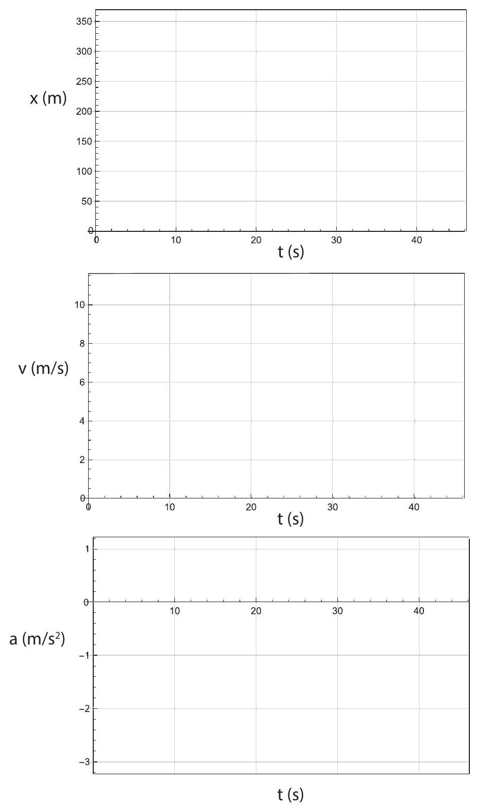

(sec-2.1)=
## 2.1 The law of inertia

There is something funny about motion with constant velocity: it is indistinguishable from rest. Of course, you can usually tell whether you are moving relative to something else. But if you are enjoying a smooth airplane ride, without looking out the window, you have no idea how fast you are moving, or even, indeed (if the flight is exceptionally smooth) whether you are moving at all. I am actually writing this on an airplane. The flight screen informs me that I am moving at 480 mph relative to the ground, but I do not feel anything like that: just a gentle rocking up and down and sideways that gives me no clue as to what my forward velocity is.

If I were to drop something, I know from experience that it would fall on a straight line - relative to me, that is. If it falls from my hand it will land at my feet, just as if we were all at rest. But we are not at rest. In the half second or so it takes for the object to fall, the airplane has moved forward 111 meters relative to the ground. Yet the (hypothetical) object I drop does not land 300 feet behind me! It moves forward with me as it falls, even though I am not touching it. It keeps its initial forward velocity, even though it is no longer in contact with me or anything connected to the airplane.\
(At this point you might think that the object is still in contact with the air inside the plane, which is moving with the plane, and conjecture that maybe it is the air inside the plane that \"pushes forward\" on the object as it falls and keeps it from moving backwards. This is not necessarily a dumb idea, but a moment's reflection will convince you that it is impossible. We are all familiar with the way air pushes on things moving through it, and we know that the force an object experiences depends on its mass and its shape, so if that was what was happening, dropping objects of different masses and shapes I would see them falling in all kind of different ways-as I would, in fact, if I\
were dropping things from rest outdoors in a strong wind. But that is not what we experience on an airplane at all. The air, in fact, has no effect on the forward motion of the falling object. It does not push it in any way, because it is moving at the same velocity. This, in fact, reinforces our previous conclusion: the object keeps its forward velocity while it is falling, in the absence of any external influence.)

This remarkable observation is one of the most fundamental principles of physics (yes, we have started to learn physics now!), which we call the law of inertia. It can be stated as follows: in the absence of any external influence (or force) acting on it, an object at rest will stay at rest, while an object that is already moving with some velocity will keep that same velocity (speed and direction of motion) - at least until it is, in fact, acted upon by some force.

Please let that sink in for a moment, before we start backtracking, which we have to do now on several accounts. First, I have used repeatedly the term \"force,\" but I have not defined it properly. Or have I? What if I just said that forces are precisely any \"external influences\" that may cause a change in the velocity of an object? That will work, I think, until it is time to explore the concept in more detail, a few chapters from now.

Next, I need to draw your attention to the fact that the object I (hypothetically) dropped did not actually keep its total initial velocity: it only kept its initial forward velocity. In the downward direction, it was speeding up from the moment it left my hand, as would any other falling object (and as we shall see later in this chapter). But this actually makes sense in a certain way: there was no forward force, so the forward velocity remained constant; there was, however, a vertical force acting all along (the force of gravity), and so the object did speed up in that direction. This observation is, in fact, telling us something profound about the world's geometry: namely, that forces and velocities are vectors, and laws such as the law of inertia will typically apply to the vector as a whole, as well as to each component separately (that is to say, each dimension of space). This anticipates, in fact, the way we will deal, later on, with motion in two or more dimensions; but we do not need to worry about that for a few chapters still.

Finally, it is worth spending a moment reflecting on how radically the law of inertia seems to contradict our intuition about the way the world works. What it seems to be telling us is that, if we throw or push an object, it should continue to move forever with the same speed and in the same direction with which it set out - something that we know is certainly not true. But what's happening in \"real life\" is that, just because we have left something alone, it doesn't mean the world has left it alone. After we lose contact with the object, all sorts of other forces will continue to act on it. A ball we throw, for instance, will experience air resistance or drag (the same effect I was worrying about in that paragraph in parenthesis in the previous page), and that will slow it down. An object sliding on a surface will experience friction, and that will slow it down too. Perhaps the closest thing to the law of inertia in action that you may get to see is a hockey puck sliding on the ice: it is remarkable (perhaps even a bit frightening) to see how little it slows down, but even so the ice does a exert a (very small) frictional force that would bring the puck to a stop eventually.

This is why, historically, the law of inertia was not discovered until people started developing an appreciation for frictional forces, and the way they are constantly acting all around us to oppose the relative motion of any objects trying to slide past each other.

This mention of relative motion, in a way, brings us full circle. Yes, relative motion is certainly detectable, and for objects in contact it actually results in the occurrence of forces of the frictional, or drag, variety. But absolute (that is, without reference to anything external) motion with constant velocity is fundamentally undetectable. And in view of the law of inertia, it makes sense: if no force is required to keep me moving with constant velocity, it follows that as long as I am moving with constant velocity I should not be feeling any net force acting on me; nor would any other detection apparatus I might be carrying with me.

What we do feel in our bodies, and what we can detect with our inertial navigation systems (now you may start to guess why they are called \"inertial\"), is a change in our velocity, which is to say, our acceleration (to be defined properly in a moment). We rely, ultimately, on the law of inertia to detect accelerations: if my plane is shaking up and down, because of turbulence (as, in fact, it is right now!), the water in my cup may not stay put. Or, rather, the water may try to stay put (really, to keep moving, at any moment, with whatever velocity it has at that moment), but if the cup, which is connected to my hand which is connected, ultimately, to this bouncy plane, moves suddenly out from under it, not all of the water's parts will be able to adjust their velocities to the new velocity of the cup in time to prevent a spill.

This is the next very interesting fact about the physical world that we are about to discover: forces cause accelerations, or changes in velocity, but they do so in different degrees for different objects; and, moreover, the ultimate change in velocity takes time. The first part of this statement has to do with the concept of inertial mass, to be introduced in the next chapter; the second part we are going to explore right now, after a brief detour to define inertial reference frames.

(sec-2.1.1)=
### 2.1.1 Inertial reference frames

The example I just gave you of what happens when a plane in flight experiences turbulence points to an important phenomenon, namely, that there may be times where the law of inertia may not seem to apply in a certain reference frame. By this I mean that an object that I left at rest, like the water in my cup, may suddenly start to move - relative to the reference frame coordinates - even though nothing and nobody is acting on it. More dramatically still, if a car comes to a sudden stop, the passengers may be \"projected forward\" - they were initially at rest relative to the car frame, but now they find themselves moving forward (always in the car reference frame), to the point that, if they are not wearing seat belts, they may end up hitting the dashboard, or the seat in front of them.

Again, nobody has pushed on them, and in fact what we can see in this case, from outside the car, is nothing but the law of inertia at work: the passengers were just keeping their initial velocity, when the car suddenly slowed down under and around them. So there is nothing wrong with the law of inertia, but there is a problem with the reference frame: if I want to describe the motion of objects in a reference frame like a plane being shaken up or a car that is speeding up or slowing down, I need to allow for the fact that objects may move - always relative to that frame - in an apparent violation of the law of inertia.

The way we deal with this in physics is by introducing the very important concept of an inertial reference frame, by which we mean a reference frame in which all objects will, at all times, be observed to move (or not move) in a way fully consistent with the law of inertia. In other words, the law of inertia has to hold when we use that frame's own coordinates to calculate the objects' velocities. This, of course, is what we always do instinctively: when I am on a plane I locate the various objects around me relative to the plane frame itself, not relative to the distant ground.

To ascertain whether a frame is inertial or not, we start by checking to see if the description of motion using that frame's coordinates obeys the law of inertia: does an object left at rest on the counter in the laboratory stay at rest? If set in motion, does it move with constant velocity on a straight line? The Earth's surface, as it turns out, is not quite a perfect inertial reference frame, but it is good enough that it made it possible for us to discover the law of inertia in the first place!

What spoils the inertial-ness of an Earth-bound reference frame is the Earth's rotation, which, as we shall see later, is an example of accelerated motion. In fact, if you think about the grossly non-inertial frames I have introduced above - the bouncy plane, the braking car-they all have this in common: that their velocities are changing; they are not moving with constant speed on a straight line.

So, once you have found an inertial reference frame, to decide whether another one is inertial or not is simple: if it is moving with constant velocity (relative to the first, inertial frame), then it is itself inertial; if not, it is not. I will show you how this works, formally, in a little bit ({ref}`section 2.2.4 <sec-2.2.4>`, below), after I (finally!) get around to properly introducing the concept of acceleration.

It is a fundamental principle of physics that the laws of physics take the same form in all inertial reference frames. The law of inertia is, of course, an example of such a law. Since all inertial frames are moving with constant velocity relative to each other, this is another way to say that absolute motion is undetectable, and all motion is ultimately relative. Accordingly, this principle is known as the principle of relativity.

(sec-2.2)=
## 2.2 Acceleration

(sec-2.2.1)=
### 2.2.1 Average and instantaneous acceleration

Just as we defined average velocity in the previous chapter, using the concept of displacement (or change in position) over a time interval $\Delta t$, we define average acceleration over the time $\Delta t$ using the change in velocity:

:::{math}
:label: eq-2.1
a_{a v}=\frac{\Delta v}{\Delta t}=\frac{v_{f}-v_{i}}{t_{f}-t_{i}}
:::

Here, $v_{i}$ and $v_{f}$ are the initial and final velocities, respectively, that is to say, the velocities at the beginning and the end of the time interval $\Delta t$. As was the case with the average velocity, though, the average acceleration is a concept of somewhat limited usefulness, so we might as well proceed straight away to the definition of the instantaneous acceleration (or just \"the\" acceleration, without modifiers), through the same sort of limiting process by which we defined the instantaneous velocity:

:::{math}
:label: eq-2.2
a=\lim _{\Delta t \rightarrow 0} \frac{\Delta v}{\Delta t}
:::

Everything that we said in the previous chapter about the relationship between velocity and position can now be said about the relationship between acceleration and velocity. For instance (if you know calculus), the acceleration as a function of time is the derivative of the velocity as a function of time, which makes it the second derivative of the position function:

:::{math}
:label: eq-2.3
a=\frac{d v}{d t}=\frac{d^{2} x}{d t^{2}}
:::

(and if you do not know calculus yet, do not worry about the superscripts \"2\" on that last expression! It is just a weird notation that you will learn someday.)

Similarly, we can \"read off\" the instantaneous acceleration from a velocity versus time graph, by looking at the slope of the line tangent to the curve at any point. However, if what we are given is a position versus time graph, the connection to the acceleration is more indirect. {numref}`Figure %s <fig-2.1>` (next page) provides you with such an example. See if you can guess at what points along this curve the acceleration is positive, negative, or zero.

The way to do this \"from scratch,\" as it were, is to try to figure out what the velocity is doing, first, and infer the acceleration from that. Here is how that would go:

Starting at $t=0$, and keeping an eye on the slope of the $x$-vs- $t$ curve, we can see that the velocity starts at zero or near zero and increases steadily for a while, until $t$ is a little bit more than 2 s (let us say, $t=2.2 \mathrm{~s}$ for definiteness). That would correspond to a period of positive acceleration, since $\Delta v$ would be positive for every $\Delta t$ in that range.

:::{figure} ../images/2024_09_14_9969b06773f10b6936e8g-054.jpg
:label: fig-2.1
:alt: A possible position vs. time graph for an object whose acceleration changes with time.
A possible position vs. time graph for an object whose acceleration changes with time.
:::

Between $t=2.2 \mathrm{~s}$ and $t=2.5 \mathrm{~s}$, as the object moves from $x=2 \mathrm{~m}$ to $x=4 \mathrm{~m}$, the velocity does not appear to change very much, and the acceleration would correspondingly be zero or near zero. Then, around $t=2.5 \mathrm{~s}$, the velocity starts to decrease noticeably, becoming (instantaneously) zero at $t=3 \mathrm{~s}(x=6 \mathrm{~m})$. That would correspond to a negative acceleration. Note, however, that the velocity afterwards continues to decrease, becoming more and more negative until around $t=4$ s. This also corresponds to a negative acceleration: even though the object is speeding up, it is speeding up in the negative direction, so $\Delta v$, and hence $a$, is negative for every time interval there. We conclude that $a<0$ for all times between $t=2.5 \mathrm{~s}$ and $t=4 \mathrm{~s}$.

Next, as we just look past $t=4 \mathrm{~s}$, something else interesting happens: the object is still going in the negative direction (negative velocity), but now it is slowing down. Mathematically, that corresponds to a positive acceleration, since the algebraic value of the velocity is in fact increasing (a number like -3 is larger than a number like -5 ). Another way to think about it is that, if we have less and less of a negative thing, our overall trend is positive. So the acceleration is positive all the way from $t=4 \mathrm{~s}$ through $t=5 \mathrm{~s}$ (where the velocity is instantaneously zero as the object's direction of motion reverses), and beyond, until about $t=6 \mathrm{~s}$, since between $t=5 \mathrm{~s}$ and $t=6 \mathrm{~s}$ the velocity is positive and growing.

You can probably figure out on your own now what happens after $t=6 \mathrm{~s}$, reasoning as I did above, but you may also have noticed a pattern that makes this kind of analysis a lot easier. The acceleration (as those with a knowledge of calculus may have understood already), being proportional to the second derivative of the function $x(t)$ with respect to $t$, is directly related to the curvature of the $x$-vs- $t$ graph. As {numref}`Figure %s <fig-2.2>` below shows, if the graph is concave (sometimes\
called \"concave upwards\"), the acceleration is positive, whereas it is negative whenever the graph is convex (or \"concave downwards\"). It is (instantly) zero at those points where the curvature changes (which you may know as inflection points), as well as over stretches of time when the $x$-vs- $t$ graph is a straight line (motion with constant velocity).

.jpg)
$a>0$

:::{figure} ../images/2024_09_14_9969b06773f10b6936e8g-055.jpg
:label: fig-2.2
:alt: What the x-vs- t curves look like for the different possible signs of the acceleration.
What the $x$-vs- $t$ curves look like for the different possible signs of the acceleration.
:::

$a<0$

.jpg)
$a=0$\

{numref}`Figure %s <fig-2.3>` (in the next page) shows position, velocity, and acceleration versus time for a hypothetical motion case. Please study it carefully until every feature of every graph makes sense, relative to the other two! You will see many other examples of this in the homework and the lab.

Notice that, in all these figures, the sign of $x$ or $v$ at any given time has nothing to do with the sign of $a$ at that same time. It is true that, for instance, a negative $a$, if sustained for a sufficiently long time, will eventually result in a negative $v$ (as happens, for instance, in {numref}`Fig. %s <fig-2.3>` over the interval from $t=1$ to $t=4 \mathrm{~s}$ ) but this may take a long time, depending on the size of $a$ and the initial value of $v$. The graphical clues to follow, instead, are: the acceleration is given by the slope of the tangent to the $v$-vs- $t$ curve, or the curvature of the $x$-vs- $t$ curve, as explained in {numref}`Fig. %s <fig-2.2>`; and the velocity is given by the slope of the tangent to the $x$-vs- $t$ curve.\
(Note: To make the interpretation of {numref}`Figure %s <fig-2.3>` simpler, I have chosen the acceleration to be \"piecewise constant,\" that is to say, constant over extended time intervals and changing in value discontinuously from one interval to the next. This is physically unrealistic: in any real-life situation, the acceleration would be expected to change more or less smoothly from instant to instant. We will see examples of that later on, when we start looking at realistic models of collisions.)

:::{figure} ../images/2024_09_14_9969b06773f10b6936e8g-056.jpg
:label: fig-2.3
:alt: Sample position, velocity and acceleration vs. time graphs for motion with piecewise-constant acceleration.
Sample position, velocity and acceleration vs. time graphs for motion with piecewise-constant acceleration.
:::

(sec-2.2.2)=
### 2.2.2 Motion with constant acceleration

A particular kind of motion that is both relatively simple and very important in practice is motion with constant acceleration (see {numref}`Figure %s <fig-2.3>` again for examples). If $a$ is constant, it means that the velocity changes with time at a constant rate, by a fixed number of $\mathrm{m} / \mathrm{s}$ each second. (These are, incidentally, the units of acceleration: meters per second per second, or $\mathrm{m} / \mathrm{s}^{2}$.) The change in velocity over a time interval $\Delta t$ is then given by

:::{math}
:label: eq-2.4
\Delta v=a \Delta t
:::

which can also be written

:::{math}
:label: eq-2.5
v=v_{i}+a\left(t-t_{i}\right)
:::

{numref}`Equation %s <eq-2.5>` is the form of the velocity function ( $v$ as a function of $t$ ) for motion with constant acceleration. This, in turn, has to be the derivative with respect to time of the corresponding position function. If you know simple derivatives, then, you can verify that the appropriate form of the position function must be

:::{math}
:label: eq-2.6
x=x_{i}+v_{i}\left(t-t_{i}\right)+\frac{1}{2} a\left(t-t_{i}\right)^{2}
:::

or in terms of intervals,

:::{math}
:label: eq-2.7
\Delta x=v_{i} \Delta t+\frac{1}{2} a(\Delta t)^{2}
:::

Most often {numref}`Eq. %s <eq-2.6>` is written with the implicit assumption that the initial value of $t$ is zero:

:::{math}
:label: eq-2.8
x=x_{i}+v_{i} t+\frac{1}{2} a t^{2}
:::

This is simpler, but not as general as {numref}`Eq. %s <eq-2.6>`. Always make sure that you know what conditions apply for any equation you decide to use!

As you can see from {numref}`Eq. %s <eq-2.5>`, for intervals during which the acceleration is constant, the velocity vs. time curve should be a straight line. {numref}`Figure %s <fig-2.3>` (previous page) illustrates this. {numref}`Equation %s <eq-2.6>`, on the other hand, shows that for those same intervals the position vs. time curve should be a (portion of a) parabola, and again this can be seen in {numref}`Figure %s <fig-2.3>` (sometimes, if the acceleration is small, the curvature of the graph may be hard to see; this happens in {numref}`Figure %s <fig-2.3>` for the interval between $t=4 \mathrm{~s}$ and $t=5 \mathrm{~s})$.

The observation that $v$-vs- $t$ is a straight line when the acceleration is constant provides us with a simple way to derive {numref}`Eq. %s <eq-2.7>`, when combined with the result (from the end of the previous chapter) that the displacement over a time interval $\Delta t$ equals the area under the $v$-vs- $t$ curve for that time interval. Indeed, consider the situation shown in {numref}`Figure %s <fig-2.4>`. The total area under the segment shown is equal to the area of a rectangle of base $\Delta t$ and height $v_{i}$, plus the area of a\
triangle of base $\Delta t$ and height $v_{f}-v_{i}$. Since $v_{f}-v_{i}=a \Delta t$, simple geometry immediately yields {numref}`Eq. %s <eq-2.7>`, or its equivalent {eq}`eq-2.6`.

:::{figure} ../images/2024_09_14_9969b06773f10b6936e8g-058.jpg
:label: fig-2.4
:alt: Graphical way to find the displacement for motion with constant acceleration.
Graphical way to find the displacement for motion with constant acceleration.
:::

Lastly, consider what happens if we solve {numref}`Eq. %s <eq-2.4>` for $\Delta t$ and substitute the result in {eq}`eq-2.7`. We get

:::{math}
:label: eq-2.9
\Delta x=\frac{v_{i} \Delta v}{a}+\frac{(\Delta v)^{2}}{2 a}
:::

Letting $\Delta v=v_{f}-v_{i}$, a little algebra yields

:::{math}
:label: eq-2.10
v_{f}^{2}-v_{i}^{2}=2 a \Delta x
:::

This is a handy little result that can also be seen to follow, more directly, from the work-energy theorems to be introduced in Chapter $7^{1}$.

(sec-2.2.3)=
### 2.2.3 Acceleration as a vector

In two (or more) dimensions we introduce the average acceleration vector

:::{math}
:label: eq-2.11
\vec{a}_{a v}=\frac{\Delta \vec{v}}{\Delta t}=\frac{1}{\Delta t}\left(\vec{v}_{f}-\vec{v}_{i}\right)
:::

whose components are $a_{a v, x}=\Delta v_{x} / \Delta t$, etc.. The instantaneous acceleration is then the vector given by the limit of {numref}`Eq. %s <eq-2.11>` as $\Delta t \rightarrow 0$, and its components are, therefore, $a_{x}=d v_{x} / d t, a_{y}=d v_{y} / d t, \ldots$

Note that, since $\vec{v}_{i}$ and $\vec{v}_{f}$ in {numref}`Eq. %s <eq-2.11>` are vectors, and have to be subtracted as such, the acceleration vector will be nonzero whenever $\vec{v}_{i}$ and $\vec{v}_{f}$ are different, even if, for instance, their magnitudes (which are equal to the object's speed) are the same. In other words, you have accelerated motion whenever the direction of motion changes, even if the speed does not.

As long as we are working in one dimension, I will follow the same convention for the acceleration as the one I introduced for the velocity in {ref}`Chapter 1 <ch-1>`: namely, I will use the symbol $a$, without a subscript, to refer to the relevant component of the acceleration $\left(a_{x}, a_{y}, \ldots\right)$, and not to the magnitude of the vector $\vec{a}$.

(sec-2.2.4)=
### 2.2.4 Acceleration in different reference frames

In {ref}`Chapter 1 <ch-1>` you saw that the following relation ({numref}`Eq. %s <eq-1.19>`) holds between the velocities of a particle P measured in two different reference frames, A and B :

:::{math}
:label: eq-2.12
\vec{v}_{A P}=\vec{v}_{A B}+\vec{v}_{B P}
:::

What about the acceleration? An equation like {eq}`eq-2.12` will hold for the initial and final velocities, and subtracting them we will get

:::{math}
:label: eq-2.13
\Delta \vec{v}_{A P}=\Delta \vec{v}_{A B}+\Delta \vec{v}_{B P}
:::

Now suppose that reference frame B moves with constant velocity relative to frame A. In that case, $\vec{v}_{A B, f}=\vec{v}_{A B, i}$, so $\Delta \vec{v}_{A B}=0$, and then, dividing {numref}`Eq. %s <eq-2.13>` by $\Delta t$, and taking the limit $\Delta t \rightarrow 0$, we get

:::{math}
:label: eq-2.14
\vec{a}_{A P}=\vec{a}_{B P} \quad\left(\text { for constant } \vec{v}_{A B}\right)
:::

So, if two reference frames are moving at constant velocity relative to each other, observers in both frames measure the same acceleration for any object they might both be tracking.

The result {eq}`eq-2.14` means, in particular, that if we have an inertial frame then any frame moving at constant velocity relative to it will be inertial too, since the respective observers' measurements\
will agree that an object's velocity does not change (otherwise put, its acceleration is zero) when no forces act on it. Conversely, an accelerated frame will not be an inertial frame, because {numref}`Eq. %s <eq-2.14>` will not hold. This is consistent with the examples I mentioned in {ref}`Section 2.1 <sec-2.1>` (the bouncing plane, the car coming to a stop). Another example of a non-inertial frame would be a car going around a curve, even if it is going at constant speed, since, as I just pointed out above, this is also an accelerated system. This is confirmed by the fact that objects in such a car tend to move - relative to the car-towards the outside of the curve, even though no actual force is acting on them.

(sec-2.3)=
## 2.3 Free fall

An important example of motion with (approximately) constant acceleration is provided by free fall near the surface of the Earth. We say that an object is in \"free fall\" when the only force acting on it is the force of gravity (the word \"fall\" here may be a bit misleading, since the object could actually be moving upwards some of the time, if it has been thrown straight up, for instance). The space station is in free fall, but because it is nowhere near the surface of the earth its direction of motion (and hence its acceleration, regarded as a two-dimensional vector) is constantly changing. Right next to the surface of the earth, on the other hand, the planet's curvature is pretty much negligible and gravity provides an approximately constant, vertical acceleration, which, in the absence of other forces, turns out to be the same for every object, regardless of its size, shape, or weight.

The above result - that, in the absence of other forces, all objects should fall to the earth at the same rate, regardless of how big or heavy they are - is so contrary to our common experience that it took many centuries to discover it. The key, of course, as with the law of inertia, is to realize that, under normal circumstances, frictional forces are, in fact, acting all the time, so an object falling through the atmosphere is never really in \"free\" fall: there is always, at a minimum, and in addition to the force of gravity, an air drag force that opposes its motion. The magnitude of this force does depend on the object's size and shape (basically, on how \"aerodynamic\" the object is); and thus a golf ball, for instance, falls much faster than a flat sheet of paper. Yet, if you crumple up the sheet of paper till it has the same size and shape as the golf ball, you can see for yourself that they do fall at approximately the same rate! The equality can never be exact, however, unless you get rid completely of air drag, either by doing the experiment in an evacuated tube, or (in a somewhat extreme way), by doing it on the surface of the moon, as the Apollo 15 astronauts did with a hammer and a feather back in $1971^{2}$.

This still leaves us with something of a mystery, however: the force of gravity is the only force known to have the property that it imparts all objects the same acceleration, regardless of their mass or constitution. A way to put this technically is that the force of gravity on an object is

proportional to that object's inertial mass, a quantity that we will introduce properly in the next chapter. For the time being, we will simply record here that this acceleration, near the surface of the earth, has a magnitude of approximately $9.8 \mathrm{~m} / \mathrm{s}^{2}$, a quantity that is denoted by the symbol $g$. Thus, if we take the upwards direction as positive (as is usually done), we get for the acceleration of an object in free fall $a=-g$, and the equations of motion become\
\$\$

:::{math}
:label: eq-2.15
\Delta v=-g \Delta t
:::

:::{math}
:label: eq-2.16
\Delta y=v_{i} \Delta t-\frac{1}{2} g(\Delta t)^{2}
:::

\$\$\
where I have used $y$ instead of $x$ for the position coordinate, since that is a more common choice for a vertical axis. Note that we could as well have chosen the downward direction as positive, and that may be a more natural choice in some problems. Regardless, the quantity $g$ is always defined to be positive: $g=9.8 \mathrm{~m} / \mathrm{s}^{2}$. The acceleration, then, is $g$ or $-g$, depending on which direction we take to be positive.

In practice, the value of $g$ changes a little from place to place around the earth, for various reasons (it is somewhat sensitive to the density of the ground below you, and it decreases as you climb higher away from the center of the earth). In a later chapter we will see how to calculate the value of $g$ from the mass and radius of the earth, and also how to calculate the equivalent quantity for other planets.

In the meantime, we can use equations like {eq}`eq-2.15` and {eq}`eq-2.16` (as well as {eq}`eq-2.10`, with the appropriate substitutions) to answer a number of interesting questions about objects thrown or dropped straight up or down (always, of course, assuming that air drag is negligible). For instance, back at the beginning of this chapter I mentioned that if I dropped an object it might take about half a second to hit the ground. If you use {numref}`Eq. %s <eq-2.16>` with $v_{i}=0$ (since I am dropping the object, not throwing it down, its initial velocity is zero), and substitute $\Delta t=0.5 \mathrm{~s}$, you get $\Delta y=1.23 \mathrm{~m}$ (about 4 feet). This is a reasonable height from which to drop something.

On the other hand, you may note that half a second is not a very long time in which to make accurate observations (especially if you do not have modern electronic equipment), and as a result of that there was considerable confusion for many centuries as to the precise way in which objects fell. Some people believed that the speed did increase in some way as the object fell, while others appear to have believed that an object dropped would \"instantaneously\" (that is, at soon as it left your hand) acquire some speed and keep that unchanged all the way down. In reality, in the presence of air drag, what happens is a combination of both: initially the speed increases at an approximately constant rate (free, or nearly free fall), but the drag force increases with the speed as well, until eventually it balances out the force of gravity, and from that point on the speed does not increase anymore: we say that the object has reached \"terminal velocity.\" Some objects reach terminal velocity almost instantly, whereas others (the more \"aerodynamic\" ones) may take a long time to do so. This accounts for the confusion that prevailed before Galileo's experiments in the early 1600 's.

Galileo's main insight, on the theoretical side, was the realization that it was necessary to separate clearly the effect of gravity and the effect of the drag force. Experimentally, his big idea was to use an inclined plane to slow down the \"fall\" of an object, so as to make accurate measurements possible (and also, incidentally, reduce the air drag force!). These \"inclined planes\" were just basically ramps down which he sent small balls (like marbles) rolling. By changing the steepness of the ramp he could control how slowly the balls moved. He reasoned that, ultimately, the force that made the balls go down was essentially the same force of gravity, only not the whole force, but just a fraction of it. Today we know that, in fact, an object sliding (not rolling!) up or down on a frictionless incline will experience an acceleration directed downwards along the incline and with a magnitude equal to $g \sin \theta$, where $\theta$ is the angle that the slope makes with the horizontal:

:::{math}
:label: eq-2.17
a=g \sin \theta \quad \text { (inclined plane, taking downwards to be positive) }
:::

(for some reason, it seems more natural, when dealing with inclined planes, to take the downward direction as positive!). {numref}`Equation %s <eq-2.17>` makes sense in the two extreme cases in which the plane is completely vertical $\left(\theta=90^{\circ}, a=g\right)$ and completely horizontal $\left(\theta=0^{\circ}, a=0\right)$. For intermediate values, you will carry out experiments in the lab to verify this result.

We will show, in a later chapter, how {numref}`Eq. %s <eq-2.17>` comes about from a careful consideration of all the forces acting on the object; we will also see, later on, how it needs to be modified for the case of a rolling, rather than a sliding, object. This modification does not affect Galileo's main conclusion, which was, basically, that the natural falling motion in the absence of friction or drag forces is motion with constant acceleration (at least, near the surface of the earth, where $g$ is constant to a very good approximation).

(sec-2.4)=
## 2.4 In summary

1.  The law of inertia states that, if no external influences (forces) are acting on an object, then, if the object is initially at rest it will stay at rest, and if it is initially moving it will continue to move with constant velocity (unchanging speed and direction).

2.  Reference frames in which the law of inertia is seen to hold (when the velocities of objects are calculated from their coordinates in that frame) are called inertial. A reference frame that is moving at constant velocity relative to an inertial frame is also an inertial frame. Conversely, accelerated reference frames are non-inertial.

3.  Motion with constant velocity is fundamentally indistinguishable from no motion at all (i.e., rest). As long as the velocity (of the objects involved) does not change, only relative motion can be detected. This is known as the principle of relativity. Another way to state it is that the laws of physics must take the same form in all inertial reference frames (so you cannot single out one as being in \"absolute rest\" or \"absolute motion\").

4.  Changes in velocity are detectable, and, by (1) above, are evidence of unbalanced forces acting on an object.

5.  The rate of change of an object's velocity is the object's acceleration: the average acceleration over a time interval $\Delta t$ is $a_{a v}=\Delta v / \Delta t$, and the instantaneous acceleration at a time $t$ is the limit of the average acceleration calculated for successively shorter time intervals $\Delta t$, all with the same initial time $t_{i}=t$. Mathematically, this means the acceleration is the derivative of the velocity function, $a=d v / d t$.

6.  In a velocity versus time graph, the acceleration can be read from the slope of the line tangent to the curve (just like the velocity in a position versus time graph).

7.  In a position versus time graph, the regions with positive acceleration correspond to a concave curvature (like a parabola opening up), and those with negative acceleration correspond to a convex curvature (like a parabola opening down). Points of inflection (where the curvature changes) and straight lines correspond to points where the acceleration is zero.

8.  The basic equations used to describe motion with constant acceleration are {eq}`eq-2.4`, {eq}`eq-2.7` and {eq}`eq-2.10` above. Alternative forms of these are also provided in the text.

9.  In more than one dimension, a change in the direction of the velocity vector results in a nonzero acceleration, even if the object's speed does not change.

10. An object is said to be in free fall when the only force acting on it is gravity. All objects in free fall experience the same acceleration at the same point in their motion, regardless of their mass or composition. Near the surface of the earth, this acceleration is approximately constant and has a magnitude $g=9.8 \mathrm{~m} / \mathrm{s}^{2}$.

11. An object sliding on a frictionless inclined plane experiences (if air drag is negligible) an acceleration directed downward along the incline and with a magnitude $g \sin \theta$, where $\theta$ is the angle the incline makes with the horizontal.

(sec-2.5)=
## 2.5 Examples

(sec-2.5.1)=
### 2.5.1 Motion with piecewise constant acceleration

Construct the position vs. time, velocity vs. time, and acceleration vs. time graphs for the motion described below. For each of the intervals (a)-(d) you'll need to figure out the position (height) and velocity of the rocket at the beginning and the end of the interval, and the acceleration for the interval. In addition, for interval (b) you need to figure out the maximum height reached by the rocket and the time at which it occurs. For interval (d) you need to figure out its duration, that is to say, the time at which the rocket hits the ground.\
(a) A rocket is shot upwards, accelerating from rest to a final velocity of $20 \mathrm{~m} / \mathrm{s}$ in 1 s as it burns its fuel. (Treat the acceleration as constant during this interval.)\
(b) From $t=1 \mathrm{~s}$ to $t=4 \mathrm{~s}$, with the fuel exhausted, the rocket flies under the influence of gravity alone. At some point during this time interval (you need to figure out when!) it stops climbing and starts falling.\
(c) At $t=4 \mathrm{~s}$ a parachute opens, suddenly causing an upwards acceleration (again, treat it as constant) lasting 1 s ; at the end of this interval, the rocket's velocity is $5 \mathrm{~m} / \mathrm{s}$ downwards.\
(d) The last part of the motion, with the parachute deployed, is with constant velocity of $5 \mathrm{~m} / \mathrm{s}$ downwards until the rocket hits the ground.

(ch-2-solution)=
### Solution:

\(a\) For this first interval (for which I will use a subscript \" 1 \" throughout) we have

:::{math}
:label: eq-2.18
\Delta y_{1}=\frac{1}{2} a_{1}\left(\Delta t_{1}\right)^{2}
:::

using {numref}`Eq. %s <eq-2.6>` for motion with constant acceleration with zero initial velocity (I am using the variable $y$, instead of $x$, for the vertical coordinate; this is more or less customary, but, of course, I could have used $x$ just as well).

Since the acceleration is constant, it is equal to its average value:

$$a_{1}=\frac{\Delta v}{\Delta t}=20 \frac{\mathrm{m}}{\mathrm{s}^{2}}$$

Substituting this into {eq}`eq-2.18` we get the height at $t=1 \mathrm{~s}$ is 10 m . The velocity at that time, of course, is $v_{f 1}=20 \mathrm{~m} / \mathrm{s}$, as we were told in the statement of the problem.\
(b) This part is free fall with initial velocity $v_{i 2}=20 \mathrm{~m} / \mathrm{s}$. To find how high the rocket climbs, use {numref}`Eq. %s <eq-2.15>` in the form $v_{\text {top }}-v_{i 2}=-g\left(t_{\text {top }}-t_{i 2}\right)$, with $v_{\text {top }}=0$ (as the rocket climbs, its velocity decreases, and it stops climbing when its velocity is zero). This gives us $t_{\text {top }}=3.04 \mathrm{~s}$ as the time at\
which the rocket reaches the top of its trajectory, and then starts coming down. The corresponding displacement is, by {numref}`Eq. %s <eq-2.16>`,

$$\Delta y_{\text {top }}=v_{i 2}\left(t_{t o p}-t_{i 2}\right)-\frac{1}{2} g\left(t_{t o p}-t_{i 2}\right)^{2}=20.4 \mathrm{~m}$$

so the maximum height it reaches is 30.4 m .\
At the end of the full 3 -second interval, the rocket's displacement is

$$\Delta y_{2}=v_{i 2} \Delta t_{2}-\frac{1}{2} g\left(\Delta t_{2}\right)^{2}=15.9 \mathrm{~m}$$

(so its height is 25.9 m above the ground), and the final velocity is

$$v_{f 2}=v_{i 2}-g \Delta t_{2}=-9.43 \frac{\mathrm{m}}{\mathrm{s}}$$

\(c\) The acceleration for this part is $\left(v_{f 3}-v_{i 3}\right) / \Delta t_{3}=(-5+9.43) / 1=4.43 \mathrm{~m} / \mathrm{s}^{2}$. Note the positive sign. The displacement is

$$\Delta y_{3}=-9.43 \times 1+\frac{1}{2} \times 4.43 \times 1^{2}=-7.22 \mathrm{~m}$$

so the final height is $25.9-7.21=18.7 \mathrm{~m}$.\
(d) This is just motion with constant speed to cover 18.7 m at $5 \mathrm{~m} / \mathrm{s}$. The time it takes is 3.74 s .

The graphs for this motion are shown earlier in the chapter, in {numref}`Figure %s <fig-2.3>`.

(sec-2.6)=
## 2.6 Problems

(ch-2-problem-1)=
### Problem 1

You get on your bicycle and ride it with a constant acceleration of $0.5 \mathrm{~m} / \mathrm{s}^{2}$ for 20 s . After that, you continue riding at a constant velocity for a distance of 200 m . Finally, you slow to a stop, with a constant acceleration, over a distance of 20 m .

(a) How far did you travel while you were accelerating at $0.5 \mathrm{~m} / \mathrm{s}^{2}$, and what was your velocity at the end of that interval?\
(b) After that, how long did it take you to cover the next 200 m ?\
(c) What was your acceleration while you were slowing down to a stop, and how long did it take you to come to a stop?\
(d) Considering the whole trip, what was your average velocity?\
(e) Plot the position versus time, velocity versus time, and acceleration versus time graphs for the whole trip, in the grids provided above. Values at the beginning and end of each interval must be exact. Slopes and curvatures must be represented accurately. Do not draw any of the curves beyond the time the rider stops (or, if you do, make sure what you draw makes sense!).

(ch-2-problem-2)=
### Problem 2

You throw an object straight upwards and catch it again, when it comes down to the same initial height, 2 s later.\
(a) How high did it rise above its initial height?\
(b) With what initial speed did you throw it?\
(Note: for this problem you should use the fact that, if air drag is negligible, the object will return to its initial height with the same speed it had initially.)

(ch-2-problem-3)=
### Problem 3

You are trying to catch up with a car that is in front of you on the highway. Initially you are both moving at $25 \mathrm{~m} / \mathrm{s}$, and the distance between you is 100 m . You step on the gas and sustain a constant acceleration for a time $\Delta t=30 \mathrm{~s}$, at which point you have pulled even with the other car.\
(a) What is $25 \mathrm{~m} / \mathrm{s}$, in miles per hour?\
(b) What was your acceleration over the 30 s time interval?\
(c) How fast were you going when you caught up with the other car?

(ch-2-problem-4)=
### Problem 4

Go back to Problem 4 of {ref}`Chapter 1 <ch-1>`, and use the information in the figure to draw an accurate position vs. time graph for both runners.

(ch-2-problem-5)=
### Problem 5

A child on a sled slides (starting from rest) down an icy slope that makes an angle of $15^{\circ}$ with the horizontal. After sliding 20 m down the slope, the child enters a flat, slushy region, where she slides for 2.0 s with a constant negative acceleration of $-1.5 \mathrm{~m} / \mathrm{s}^{2}$ with respect to her direction of motion. She then slides up another icy slope that makes a $20^{\circ}$ angle with the horizontal.\
(a) How fast was the child going when she reached the bottom of the first slope? How long did it take her to get there?\
(b) How long was the flat stretch at the bottom?\
(c) How fast was the child going as she started up the second slope?\
(d) How far up the second slope did she slide?
