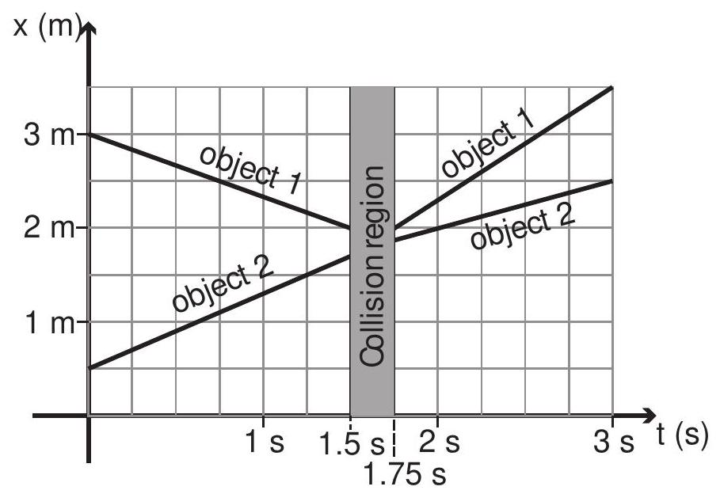

(sec-3.1)=
## 3.1 Inertia

In everyday language, we speak of something or someone \"having a large inertia\" to mean, essentially, that they are very difficult to set in motion. This usage of the word \"inertia\" is consistent with the \"law of inertia\" we introduced in the previous chapter (which states, among other things, that an object at rest, if left to itself, will just remain at rest), but it goes a bit beyond that by trying to quantify just how hard it may be to get the object to move.

We do know, from experience, that lighter objects are easier to set in motion than heavier objects, but most of us probably have an intuition that gravity (the force that pulls an object towards the earth and hence determines its weight) is not involved in an essential way here. Imagine, for instance, the difference between slapping a volleyball and a bowling ball. It is not hard to believe that the latter would hurt as much if we did it while floating in free fall in the space station (in a state of effective \"weightlessness\") as if we did it right here on the surface of the earth. In other words, it is not (necessarily) how heavy something feels, but just how massive it is.

But just what is this \"massiveness\" quality that we associate intuitively with a large inertia? Is there a way (other than resorting to the weight again) to assign to it a numerical value?

(sec-3.1.1)=
### 3.1.1 Relative inertia and collisions

One possible way to determine the relative inertias of two objects, conceptually, at least, is to try to use one of them to set the other one in motion. Most of us are familiar with what happens\
when two identical objects (presumably, therefore, having the same inertia) collide: if the collision is head-on (so the motion, before and after, is confined to a straight line), they basically exchange velocities. For instance, a billiard ball hitting another one will stop dead and the second one will set off with the same speed as the first one. The toy sometimes called \"Newton's balls\" or \"Newton's cradle\" also shows this effect. Intuitively, we understand that what it takes to stop the first ball is exactly the same as it would take to set the second one in motion with the same velocity.

But what if the objects colliding have different inertias? We expect that the change in their velocities as a result of the collision will be different: the velocity of the object with the largest inertia will not change very much, and conversely, the change in the velocity of the object with the smallest inertia will be comparatively larger. A velocity vs. time graph for the two objects might look somewhat like the one sketched in {numref}`Fig. %s <fig-3.1>`.

:::{figure} ../images/2024_09_14_9969b06773f10b6936e8g-070.jpg
:label: fig-3.1
:alt: An example of a velocity vs. time graph for a collision of two objects with different inertias.
An example of a velocity vs. time graph for a collision of two objects with different inertias.
:::

In this picture, object 1 , initially moving with velocity $v_{1 i}=1 \mathrm{~m} / \mathrm{s}$, collides with object 2 , initially at rest. After the collision, which here is assumed to take a millisecond or so, object 1 actually bounces back, so its final velocity is $v_{1 f}=-1 / 3 \mathrm{~m} / \mathrm{s}$, whereas object 2 ends up moving to the right with velocity $v_{2 f}=2 / 3 \mathrm{~m} / \mathrm{s}$. So the change in the velocity of object 1 is $\Delta v_{1}=v_{1 f}-v_{1 i}=-4 / 3 \mathrm{~m} / \mathrm{s}$, whereas for object 2 we have $\Delta v_{2}=v_{2 f}-v_{2 i}=2 / 3 \mathrm{~m} / \mathrm{s}$.

It is tempting to use this ratio, $\Delta v_{1} / \Delta v_{2}$, as a measure of the relative inertia of the two objects, only we'd want to use it upside down and with the opposite sign: that is, since $\Delta v_{2} / \Delta v_{1}=-1 / 2$ we would say that object 2 has twice the inertia of object 1 . But then we have to ask: is this a\
reliable, repeatable measure? Will it work for any kind of collision (within reason, of course: we clearly need to stay in one dimension, and eliminate external influences such as friction), and for any initial velocity?

To begin with, we have reason to expect that it does not matter whether we shoot object 1 towards object 2 or object 2 towards object 1, because we learned in the previous chapter that only relative motion is detectable, and the relative motion is the same in both cases. Consider, for instance, what the collision in {numref}`Figure %s <fig-3.1>` appears like to a hypothetical observer moving along with object 1, at 1 $\mathrm{m} / \mathrm{s}$. To him, object 1 appears to be at rest, and it is object 2 that is coming towards him, with a velocity of $-1 \mathrm{~m} / \mathrm{s}$. To see what the outcome of the collision looks like to him, just add the same $-1 \mathrm{~m} / \mathrm{s}$ to the final velocities we obtained before: object 1 will end up moving at $v_{1 f}=-4 / 3 \mathrm{~m} / \mathrm{s}$, and object 2 would move at $v_{2 f}=-1 / 3 \mathrm{~m} / \mathrm{s}$, and we would have a situation like the one shown in {numref}`Figure %s <fig-3.2>`, where both curves have simply been shifted down by $1 \mathrm{~m} / \mathrm{s}$ :

:::{figure} ../images/2024_09_14_9969b06773f10b6936e8g-071.jpg
:label: fig-3.2
:alt: Another example (really the same collision as in Figure 1, only as seen by an observer initially moving to the right at 1 ~m / s).
Another example (really the same collision as in Figure 1, only as seen by an observer initially moving to the right at $1 \mathrm{~m} / \mathrm{s})$.
:::

But then, this is exactly what we should expect to find also in our laboratory if we actually did send the second object at $1 \mathrm{~m} / \mathrm{s}$ towards the first one sitting at rest. All the individual velocities have changed relative to {numref}`Figure %s <fig-3.1>`, but the velocity changes, $\Delta v_{1}$ and $\Delta v_{2}$, are clearly still the same, and therefore so is our (tentative) measure of the objects' relative inertia.

Clearly, the same argument can be used to conclude that the same result will be obtained when both objects are initially moving towards each other, as long as their relative velocity is the same as\
in these examples, namely, $1 \mathrm{~m} / \mathrm{s}$. However, unless we do the experiments we cannot really predict what will happen if we increase (or decrease) their relative velocity. In fact, we could imagine smashing the two objects at very high speed, so they might even become seriously mangled in the process. Yet, experimentally (and this is not at all an obvious result!), we would still find the same value of $-1 / 2$ for the ratio $\Delta v_{2} / \Delta v_{1}$, at least as long as the collision is not so violent that the objects actually break up into pieces.

Perhaps the most surprising result of our experiments would be the following: imagine that the objects have a \"sticky\" side (for instance, the small black rectangles shown in the pictures could be strips of Velcro), and we turn them around so that when they collide they will end up stuck to each other. In this case (which, as we shall see later, is termed a completely inelastic collision), the $v$-vs- $t$ graph might look like {numref}`Figure %s <fig-3.3>` below.

Now the two objects end up moving together to the right, fairly slowly: $v_{1 f}=v_{2 f}=1 / 3 \mathrm{~m} / \mathrm{s}$. The velocity changes are $\Delta v_{1}=-2 / 3 \mathrm{~m} / \mathrm{s}$ and $\Delta v_{2}=1 / 3 \mathrm{~m} / \mathrm{s}$, both of which are different from what they were before, in Figs. 3.1 and 3.2: yet, the ratio $\Delta v_{2} / \Delta v_{1}$ is still equal to $-1 / 2$, just as in all the previous cases.

:::{figure} ../images/2024_09_14_9969b06773f10b6936e8g-072.jpg
:label: fig-3.3
:alt: What would happen if the objects in Figure 1 became stuck together when they collided.
What would happen if the objects in Figure 1 became stuck together when they collided.
:::

(sec-3.1.2)=
### 3.1.2 Inertial mass: definition and properties

At this point, it would seem reasonable to assume that this ratio, $\Delta v_{2} / \Delta v_{1}$, is, in fact, telling us something about an intrinsic property of the two objects, what we have called above their \"relative inertia.\" It is easy, then, to see how one could assign a value to the inertia of any object (at least, conceptually): choose a \"standard\" object, and decide, arbitrarily, that its inertia will have the numerical value of 1 , in whichever units you choose for it (these units will turn out, in fact, to be kilograms, as you will see in a minute). Then, to determine the inertia of another object, which we will label with the subscript 1 , just arrange a one-dimensional collision between object 1 and the standard, under the right conditions (basically, no net external forces), measure the velocity changes $\Delta v_{1}$ and $\Delta v_{s}$, and take the quantity $-\Delta v_{s} / \Delta v_{1}$ as the numerical value of the ratio of the inertia of object 1 to the inertia of the standard object. In symbols, using the letter $m$ to represent an object's inertia,

:::{math}
:label: eq-3.1
\frac{m_{1}}{m_{s}}=-\frac{\Delta v_{s}}{\Delta v_{1}}
:::

But, since $m_{s}=1$ by definition, this gives us directly the numerical value of $m_{1}$.

The reason we use the letter $m$ is, as you must have guessed, because, in fact, the inertia defined in this way turns out to be identical to what we have traditionally called \"mass.\" More precisely, the quantity defined this way is an object's inertial mass. The remarkable fact, mentioned earlier, that the force of gravity between two objects turns out to be proportional to their inertial masses, allows us to determine the inertial mass of an object by the more traditional procedure of simply weighing it, rather than elaborately staging a collision between it and the standard kilogram on an ice-hockey rink. But, in principle, we could conceive of the existence of two different quantities that should be called \"inertial mass\" and \"gravitational mass,\" and the identity (or more precisely, the - so far as we know - exact proportionality) of the two is a rather mysterious experimental fact ${ }^{1}$.

In any case, by the way we have constructed it, the inertial mass, defined as in {numref}`Eq. %s <eq-3.1>`, does capture, in a quantitative way, the concept that we were trying to express at the beginning of the chapter: namely, how difficult it may be to set an object in motion. In principle, however, other experiments would need to be conducted to make sure that it does have the properties we have traditionally associated with the concept of mass. For instance, suppose we join together two objects of mass $m$. Is the mass of the resulting object $2 m$ ? Collision experiments would, indeed, show this to be the case with great accuracy in the macroscopic world (with which we are concerned this semester), but this is a good example of how you cannot take anything for granted: at the microscopic level, it is again a fact that the inertial mass of an atomic nucleus is a little less than the sum of the masses of all its constituent protons and neutrons ${ }^{2}$.

Probably the last thing that would need to be checked is that the ratio of inertias is independent

of the standard. Suppose that we have two objects, to which we have assigned masses $m_{1}$ and $m_{2}$ by arranging for each to collide with the \"standard object\" independently. If we now arrange for a collision between objects 1 and 2 directly, will we actually find that the ratio of their velocity changes is given by the ratio of the separately determined masses $m_{1}$ and $m_{2}$ ? We certainly would need that to be the case, in order for the concept of inertia to be truly useful; but again, we should not assume anything until we have tested it! Fortunately, the tests would indeed reveal that, in every case, the expected relationship holds ${ }^{3}$\
\$\$

:::{math}
:label: eq-3.2
-\frac{\Delta v_{2}}{\Delta v_{1}}=\frac{m_{1}}{m_{2}}
:::

\$\$

At this point, we are not just in possession of a useful definition of inertia, but also of a veritable law of nature, as I will explain next.

(sec-3.2)=
## 3.2 Momentum

For an object of (inertial) mass $m$ moving, in one dimension, with velocity $v$, we define its momentum as

:::{math}
:label: eq-3.3
p=m v
:::

(the choice of the letter $p$ for momentum is apparently related to the Latin word \"impetus\").\
We can think of momentum as a sort of extension of the concept of inertia, from an object at rest to an object in motion. When we speak of an object's inertia, we typically think about what it may take to get it moving; when we speak of its momentum, we typically think of that it may take to stop it (or perhaps deflect it). So, both the inertial mass $m$ and the velocity $v$ are involved in the definition.

We may also observe that what looks like inertia in some reference frame may look like momentum in another. For instance, if you are driving in a car towing a trailer behind you, the trailer has only a large amount of inertia, but no momentum, relative to you, because its velocity relative to you is zero; however, the trailer definitely has a large amount of momentum (by virtue of both its inertial mass and its velocity) relative to somebody standing by the side of the road.

(sec-3.2.1)=
### 3.2.1 Conservation of momentum; isolated systems

For a system of objects, we treat the momentum as an additive quantity. So, if two colliding objects, of masses $m_{1}$ and $m_{2}$, have initial velocities $v_{1 i}$ and $v_{2 i}$, we say that the total initial momentum of

the system is $p_{i}=m_{1} v_{1 i}+m_{2} v_{2 i}$, and similarly if the final velocities are $v_{1 f}$ and $v_{2 f}$, the total final momentum will be $p_{f}=m_{1} v_{1 f}+m_{2} v_{2 f}$.

We then assert that the total momentum of the system is not changed by the collision. Mathematically, this means

:::{math}
:label: eq-3.4
p_{i}=p_{f}
:::

or

:::{math}
:label: eq-3.5
m_{1} v_{1 i}+m_{2} v_{2 i}=m_{1} v_{1 f}+m_{2} v_{2 f}
:::

But this last equation, in fact, follows directly from {numref}`Eq. %s <eq-3.2>`: to see this, move all the quantities in {numref}`Eq. %s <eq-3.5>` having to do with object 1 to one side of the equal sign, and those having to do with object 2 to the other side. You then get

:::{math}
:label: eq-3.6
\begin{align*}
m_{1}\left(v_{1 i}-v_{1 f}\right) & =m_{2}\left(v_{2 f}-v_{2 i}\right) \\
-m_{1} \Delta v_{1} & =m_{2} \Delta v_{2}
\end{align*}
:::

which is just another way to write {numref}`Equation %s <eq-3.2>`. Hence, the result {eq}`eq-3.2` ensures the conservation of the total momentum of a system of any two interacting objects (\"particles\"), regardless of the form the interaction takes, as long as there are no external forces acting on them.

Momentum conservation is one of the most important principles in all of physics, so let me take a little time to explain how we got here and elaborate on this result. First, as I just mentioned, we have been more or less implicitly assuming that the two interacting objects form an isolated system, by which we mean that, throughout, they interact with nothing other than each other. (Equivalently, there are no external forces acting on them.)

It is pretty much impossible to set up a system so that it is really isolated in this strict sense; instead, in practice, we settle for making sure that the external forces on the two objects cancel out. This is what happens on the air tracks with which you will be doing experiments this semester: gravity is acting on the carts, but that force is balanced out by the upwards push of the air from the track. A system on which there is no net external force is as good as isolated for practical purposes, and we will refer to it as such. (It is harder, of course, to completely eliminate friction and drag forces, so we just have to settle for approximately isolated systems in practice.)

Secondly, we have assumed so far that the motion of the two objects is restricted to a straight line one dimension. In fact, momentum is a vector quantity (just like velocity is), so in general we should write

$$\vec{p}=m \vec{v}$$

and conservation of momentum, in general, holds as a vector equation for any isolated system in three dimensions:

:::{math}
:label: eq-3.7
\vec{p}_{i}=\vec{p}_{f}
:::

What this means, in turn, is that each separate component $(x, y$ and $z)$ of the momentum will be separately conserved (so {numref}`Eq. %s <eq-3.7>` is equivalent to three scalar equations, in three dimensions). When we get to study the vector nature of forces, we will see an interesting implication of this, namely, that it is possible for one component of the momentum vector to be conserved, but not another-depending on whether there is or there isn't a net external force in that direction or not. For example, anticipating things a bit, when you throw an object horizontally, as long as you can ignore air drag, there is no horizontal force acting on it, and so that component of the momentum vector is conserved, but the vertical component is changing all the time because of the (vertical) force of gravity.

Thirdly, although this may not be immediately obvious, for an isolated system of two colliding objects the momentum is truly conserved throughout the whole collision process. It is not just a matter of comparing the initial and final velocities: at any of the times shown in Figures 1 through 3 , if we were to measure $v_{1}$ and $v_{2}$ and compute $m_{1} v_{1}+m_{2} v_{2}$, we would obtain the same result. In other words, the total momentum of an isolated system is constant: it has the same value at all times.

Finally, all these examples have involved interactions between only two particles. Can we really generalize this to conclude that the total momentum of an isolated system of any number of particles is constant, even when all the particles may be interacting with each other simultaneously? Here, again, the experimental evidence is overwhelmingly in favor of this hypothesis ${ }^{4}$, but much of our confidence on its validity comes in fact from a consideration of the nature of the internal interactions themselves. It is a mathematical fact that all of the interactions so far known to physics have the property of conserving momentum, whether acting individually or simultaneously. No experiments have ever suggested the existence of an interaction that does not have this property.

(sec-3.3)=
## 3.3 Extended systems and center of mass

Consider a collection of particles with masses $m_{1}, m_{2}, \ldots$, and located, at some given instant, at positions $x_{1}, x_{2} \ldots$. (We are still, for the time being, considering only motion in one dimension, but all these results generalize easily to three dimensions.) The center of mass of such a system is a mathematical point whose position coordinate is given by

:::{math}
:label: eq-3.8
x_{c m}=\frac{m_{1} x_{1}+m_{2} x_{2}+\ldots}{m_{1}+m_{2}+\ldots}
:::

Clearly, the denominator of {eq}`eq-3.8` is just the total mass of the system, which we may just denote by $M$. If all the particles have the same mass, the center of mass will be somehow \"in the middle\"

of all of them; otherwise, it will tend to be closer to the more massive particle(s). The \"particles\" in question could be spread apart, or they could literally be the \"parts\" into which we choose to subdivide, for computational purposes, a single extended object.

If the particles are in motion, the position of the center of mass, $x_{c m}$, will in general change with time. For a solid object, where all the parts are moving together, the displacement of the center of mass will just be the same as the displacement of any part of the object. In the most general case, we will have (by subtracting $x_{c m i}$ from $x_{c m f}$ )

:::{math}
:label: eq-3.9
\Delta x_{c m}=\frac{1}{M}\left(m_{1} \Delta x_{1}+m_{2} \Delta x_{2}+\ldots\right)
:::

Dividing {numref}`Eq. %s <eq-3.9>` by $\Delta t$ and taking the limit as $\Delta t \rightarrow 0$, we get the instantaneous velocity of the center of mass:

:::{math}
:label: eq-3.10
v_{c m}=\frac{1}{M}\left(m_{1} v_{1}+m_{2} v_{2}+\ldots\right)
:::

But this is just

:::{math}
:label: eq-3.11
v_{c m}=\frac{p_{s y s}}{M}
:::

where $p_{\text {sys }}=m_{1} v_{1}+m_{2} v_{2}+\ldots$ is the total momentum of the system.

(sec-3.3.1)=
### 3.3.1 Center of mass motion for an isolated system

{numref}`Equation %s <eq-3.11>` is a very interesting result. Since the total momentum of an isolated system is constant, it tells us that the center of mass of an isolated system of particles moves at constant velocity, regardless of the relative motion of the particles themselves or their possible interactions with each other. As indicated above, this generalizes straightforwardly to more than one dimension, so we can write $\vec{v}_{c m}=\vec{p}_{s y s} / M$. Thus, we can say that, for an isolated system in space, not only the speed, but also the direction of motion of its center of mass does not change with time.

Clearly this result is a sort of generalization of the law of inertia. For a solid, extended object, it does, in fact, provide us with the precise form that the law of inertia must take: in the absence of external forces, the center of mass will just move on a straight line with constant velocity, whereas the object itself may be moving in any way that does not affect the center of mass trajectory. Specifically, the most general motion of an isolated rigid body is a straight line motion of its center of mass at constant speed, combined with a possible rotation of the object as a whole around the center of mass.

For a system that consists of separate parts, on the other hand, the center of mass is generally just a point in space, which may or may not coincide at any time with the position of any of the parts, but which will nonetheless move at constant velocity as long as the system is isolated. This is illustrated by {numref}`Figure %s <fig-3.4>`, where the position vs. time curves have been drawn for the colliding\
objects of {numref}`Figure %s <fig-3.1>`. I have assumed that object 1 starts out at $x_{1 i}=-5 \mathrm{~mm}$ at $t=0$, and object 2 starts at $x_{2 i}=0$ at $t=0$. Because object 2 has twice the inertia of object 1 , the position of the center of mass, as given by {numref}`Eq. %s <eq-3.8>`, will always be

$$x_{c m}=x_{1} / 3+2 x_{2} / 3$$

that is to say, the center of mass will always be in between objects 1 and 2, and its distance from object 2 will always be half its distance to object 1 :

$$\begin{gathered}
\left|x_{c m}-x_{1}\right|=\frac{2}{3}\left|x_{1}-x_{2}\right| \\
\left|x_{c m}-x_{2}\right|=\frac{1}{3}\left|x_{1}-x_{2}\right|
\end{gathered}$$

Figure 4 shows that this simple prescription does result in motion with constant velocity for the center of mass (the green straight line), even though the $x$-vs- $t$ curves of the two objects themselves look relatively complicated. (Please check it out! Take a ruler to {numref}`Fig. %s <fig-3.4>` and verify that the center of mass is, at every instant, where it is supposed to be.)

:::{figure} ../images/2024_09_14_9969b06773f10b6936e8g-078.jpg
:label: fig-3.4
:alt: Position vs. time graph for the objects colliding in Figure 1. The green line shows the position of the center of mass as a function of time.
Position vs. time graph for the objects colliding in Figure 1. The green line shows the position of the center of mass as a function of time.
:::

The concept of center of mass gives us an important way to simplify the description of the motion of potentially complicated systems. We will make good use of it in forthcoming chapters.

A very nice demonstration of the motion of the center of mass in two-body one-dimensional collisions can be found at\
<https://phet.colorado.edu/sims/collision-lab/collision-lab_en.html>\
(you need to check the \"center of mass\" box to see it).

(sec-3.3.2)=
### 3.3.2 Recoil and rocket propulsion

As we have just seen, you cannot alter the motion of your center of mass without relying on some external force - which is to say, some kind of external support. This is actually something you may have experienced when you are resting on a very slippery surface and you just cannot \"get a grip\" on it. There is, however, one way to circumvent this problem which, in fact, relies on conservation of momentum itself: if you are carrying something with you, and can throw it away from you at high speed, you will recoil as a result of that. If you can keep throwing things, you (with your store of as yet unthrown things) will speed up a little more every time. This is, in essence, the principle behind rocket propulsion.

Mathematically, consider two objects, of masses $m_{1}$ and $m_{2}$, initially at rest, so their total momentum is zero. If mass 1 is thrown away from mass 2 with a speed $v_{1 f}$, then, by conservation of momentum (always assuming the system is isolated) we must have

:::{math}
:label: eq-3.12
0=m_{1} v_{1 f}+m_{2} v_{2 f}
:::

and therefore $v_{2 f}=-m_{1} v_{1 f} / m_{2}$. This is how a rocket moves forward, by constantly expelling mass (the hot exhaust gas) backwards at a high velocity. Note that, even though both objects move, the center of mass of the whole system does not (in the absence of any external force), as discussed above.

(sec-3.4)=
## 3.4 In summary

1.  The inertia of an object is a measure of its tendency to resist changes in its motion. It is quantified by the inertial mass (measured in kilograms).

2.  A system of objects is called isolated (for practical purposes) when there are no net (or unbalanced) external forces acting on any of the objects (the objects may still interact with each other).

3.  When two objects forming an isolated system collide in one dimension, the changes in their velocities are inversely proportional to their inertial masses:

$$\frac{\Delta v_{1}}{\Delta v_{2}}=-\frac{m_{2}}{m_{1}}$$

This may be used, in principle, as a way to define the inertial mass operationally.\
4. The inertial mass thus defined turns out to be exactly (as far as we know) proportional to the object's gravitational mass, which determines the gravitational force of attraction between it and any other object. For this reason, most often we measure an object's inertial mass simply by weighing it.\
5. The momentum of an object of inertial mass $m$ moving with a velocity $\vec{v}$ is defined as $\vec{p}=m \vec{v}$. The total momentum of a system of objects is defined as the (vector) sum of all the individual momenta.\
6. (Conservation of momentum) The momentum of an isolated system remains always constant, regardless of how the parts that make up the system may interact with one another.\
7. In one dimension, the center of mass of a system of particles is a mathematical point whose $x$ coordinate is given by {numref}`Equation %s <eq-3.8>` above. (In more dimensions, just change the $x$ 's in {numref}`Eq. %s <eq-3.8>` to $y$ and $z$ to get $y_{c m}$ and $z_{c m}$.)\
8. The center of mass of a system always moves with a velocity

$$\vec{v}_{c m}=\frac{\vec{p}_{\text {sys }}}{M}$$

where $\vec{p}_{\text {sys }}$ is the total momentum of the system, and $M$ its total mass.\
9. It follows from 8 and 6 above that for an isolated system, the center of mass must always be at rest or moving with constant velocity. This result generalizes the law of inertia to extended objects, or systems of particles.

(sec-3.5)=
## 3.5 Examples

(sec-3.5.1)=
### 3.5.1 Reading a collision graph

The graph shows a collision between two carts (possibly equipped with magnets so that they repel each other before they actually touch) on an air track. The inertia (mass) of cart 1 is 1 kg . Note: this is a position vs. time graph!\
(a) What are the initial velocities of the carts?\
(b) What are the final velocities of the carts?\
(c) What is the mass of the second cart?\
(d) Does the air track appear to be level? Why? (Hint: does the graph show any evidence of acceleration, for either cart, outside of the collision region?)\
(e) At the collision time, is the acceleration of the first cart positive or negative? How about the second cart? (Justify your answers.)\
(f) For the system consisting of the two carts, what is its initial (total) momentum? What is its final momentum?\
(g) Imagine now that one of the magnets is reversed, so when the carts collide they stick to each other. What would then be the final momentum of the system? What would be its final velocity?

:::{figure} ../images/2024_09_14_9969b06773f10b6936e8g-081.jpg
:label: fig-3.5
:alt: A collision between two carts.
A collision between two carts.
:::

(ch-3-solution)=
### Solution

\(a\) All the velocities are to be calculated by picking an easy straight part of each curve and calculating

$$v=\frac{\Delta x}{\Delta t}$$

for suitable intervals. In this way one gets

$$\begin{aligned}
& v_{1 i}=-1 \frac{\mathrm{m}}{\mathrm{s}} \\
& v_{2 i}=0.5 \frac{\mathrm{m}}{\mathrm{s}}
\end{aligned}$$

\(b\) Similarly, one gets

$$\begin{aligned}
& v_{1 f}=1 \frac{\mathrm{m}}{\mathrm{s}} \\
& v_{2 f}=-0.5 \frac{\mathrm{m}}{\mathrm{s}}
\end{aligned}$$

\(c\) Use this equation, or equivalent (conservation of momentum is OK)

$$\begin{gathered}
\frac{m_{2}}{m_{1}}=-\frac{\Delta v_{1}}{\Delta v_{2}} \\
\frac{m_{2}}{m_{1}}=-\frac{1-(-1)}{-0.5-0.5}=2
\end{gathered}$$

so the mass of the second cart is 2 kg .\
(d) Yes, the track appears to be level because the carts do not show any evidence of acceleration outside of the collision region (the position vs. time curves are straight lines outside of the region approximately given by $4.5 \mathrm{~s}<t<5.5 \mathrm{~s}$ ).\
(e) The acceleration of the first cart is positive. You can see this either graphically (the curve is like a parabola that opens upwards, i.e., concave), or algebraically (the cart's velocity increases, going from $-1 \mathrm{~m} / \mathrm{s}$ to $1 \mathrm{~m} / \mathrm{s}$ )\
Similarly, the acceleration of the second cart is negative. The curve is like a parabola that opens downwards, i.e., convex; or, algebraically, the cart's velocity decreases, going from $0.5 \mathrm{~m} / \mathrm{s}$ to $-0.5 \mathrm{~m} / \mathrm{s}$.\
(f) The initial momentum of the system is

$$p_{i}=m_{1} v_{1 i}+m_{2} v_{2 i}=(1 \mathrm{~kg}) \times\left(-1 \frac{\mathrm{m}}{\mathrm{s}}\right)+(2 \mathrm{~kg}) \times\left(0.5 \frac{\mathrm{m}}{\mathrm{s}}\right)=0$$

The final momentum is

$$p_{f}=m_{1} v_{1 f}+m_{2} v_{2 f}=(1 \mathrm{~kg}) \times\left(1 \frac{\mathrm{m}}{\mathrm{s}}\right)+(2 \mathrm{~kg}) \times\left(-0.5 \frac{\mathrm{m}}{\mathrm{s}}\right)=0$$

You could also just say that the final momentum should be the same as the initial momentum, since the system appears to be isolated.\
(g) The momentum should be conserved in this case as well, so $p_{f}=0$. The velocity would be

$$v_{f}=\frac{p_{f}}{m_{1}+m_{2}}=0$$

(sec-3.5.2)=
### 3.5.2 Collision in different reference frames, center of mass, and recoil

An $80-\mathrm{kg}$ hockey player (call him player 1), moving at $3 \mathrm{~m} / \mathrm{s}$ to the right, collides with a $90-\mathrm{kg}$ player (player 2) who was moving at $2 \mathrm{~m} / \mathrm{s}$ to the left. For a brief moment, they are stuck sliding together as they grab at each other.\
(a) What is their joint velocity as they slide together?\
(b) What was the velocity of their center of mass before and after the collision?\
(c) What does the collision look like to another player that was skating initially at $1.5 \mathrm{~m} / \mathrm{s}$ to the right? Give all the initial and final velocities as seen by this player, and show explicitly that momentum is also conserved in this player's frame of reference.\
(d) Eventually, the $90-\mathrm{kg}$ player manages to push the other one back, in such a way that player 1 (the $80-\mathrm{kg}$ player) ends up moving at $1 \mathrm{~m} / \mathrm{s}$ to the left relative to player 2. What are their final velocities in the earth frame of reference?

(ch-3-solution-1)=
### Solution

\(a\) Call the initial velocities $v_{1 i}$ and $v_{2 i}$, the joint final velocity $v_{f}$, and assume the two players are an isolated system for practical purposes. Then conservation of momentum reads

:::{math}
:label: eq-3.13
m_{1} v_{1 i}+m_{2} v_{2 i}=\left(m_{1}+m_{2}\right) v_{f}
:::

Solving for the final velocity, we get

:::{math}
:label: eq-3.14
v_{f}=\frac{m_{1} v_{1 i}+m_{2} v_{2 i}}{m_{1}+m_{2}}
:::

Substituting the values given, we get

:::{math}
:label: eq-3.15
v_{f}=\frac{80 \times 3-90 \times 2}{170}=0.353 \frac{\mathrm{m}}{\mathrm{s}}
:::

\(b\) According to {numref}`Eq. %s <eq-3.10>`, the velocity of the center of mass, $v_{c m}$, is just the same as what we just calculated ({numref}`Eq. %s <eq-3.14>` above). This makes sense: after the collision, if the players are moving together, their system's center of mass has to be moving with them. Also, if the system is isolated, the center of mass velocity should be the same before and after the collision. So the answer is $v_{c m}=v_{f}=0.353 \mathrm{~m} / \mathrm{s}$\
(c) Let me refer to this third player as \"player 3,\" and introduce a subscript \" 3 \" to refer to the quantities as seen in his frame of reference. Let also the subscript \" $E$ \" denote the original, \"Earth\" reference frame. From {numref}`Eq. %s <eq-1.19>`, we have then (for player 1, for instance)

:::{math}
:label: eq-3.16
v_{31}=v_{3 E}+v_{E 1}=v_{E 1}-v_{E 3}
:::

because $v_{3 E}$, the \"velocity of the Earth in player 3 's reference frame,\" is clearly equal to $-v_{E 3}$, the negative of the velocity of player 3 relative to the Earth. Basically, what {numref}`Eq. %s <eq-3.16>` is saying is\
that to convert all the Earth-frame velocities to the reference frame of player 3, we just need to subtract $1.5 \mathrm{~m} / \mathrm{s}$ from them. This gives us

:::{math}
:label: eq-3.17
\begin{align*}
v_{31, i} & =3 \frac{\mathrm{m}}{\mathrm{s}}-1.5 \frac{\mathrm{m}}{\mathrm{s}}=1.5 \frac{\mathrm{m}}{\mathrm{s}} \\
v_{32, i} & =-2 \frac{\mathrm{m}}{\mathrm{s}}-1.5 \frac{\mathrm{m}}{\mathrm{s}}=-3.5 \frac{\mathrm{m}}{\mathrm{s}} \\
v_{31, f}=v_{32, f} & =0.353 \frac{\mathrm{m}}{\mathrm{s}}-1.5 \frac{\mathrm{m}}{\mathrm{s}}=-1.147 \frac{\mathrm{m}}{\mathrm{s}}
\end{align*}
:::

The total initial momentum in player's 3 reference frame is then

:::{math}
:label: eq-3.18
p_{s y s, i}=m_{1} v_{31, i}+m_{2} v_{32, i}=80 \times 1.5+90 \times(-3.5)=-195 \frac{\mathrm{kg} \cdot \mathrm{m}}{\mathrm{s}}
:::

and the final momentum is

:::{math}
:label: eq-3.19
p_{s y s, f}=\left(m_{1}+m_{2}\right) v_{31, f}=170 \times(-1.147)=-195 \frac{\mathrm{kg} \cdot \mathrm{m}}{\mathrm{s}}
:::

So the total momentum is conserved in player 3's reference frame. The reason for this is that this is an inertial reference frame, because the velocity of player 3 does not change.\
(d) For this part of the problem, we are back to the original reference frame (the Earth reference frame), and we can drop the \" $E$ \" subscript. For this new process, the final velocities from part (a) become the initial velocities, so we have $v_{1 i}=v_{2 i}=0.353 \mathrm{~m} / \mathrm{s}$. \[Note: alternatively, since the system is isolated throughout, it would be OK in this case to use the velocities before the collision to calculate its total momentum, which also needs to be conserved in this process.\] We are also told that the final velocity of player 1 relative to player 2 is $v_{21, f}=v_{1 f}-v_{2 f}=-1 \mathrm{~m} / \mathrm{s}$. So we have two equations to solve:

:::{math}
:label: eq-3.20
\begin{align*}
\left(m_{1}+m_{2}\right) \times\left(0.353 \frac{\mathrm{m}}{\mathrm{s}}\right) & =m_{1} v_{1 f}+m_{2} v_{2 f} \quad \text { (conservation of momentum) } \\
v_{1 f}-v_{2 f} & =-1 \frac{\mathrm{m}}{\mathrm{s}} \quad \text { (final relative velocity) }
\end{align*}
:::

Leaving aside the units for the moment, to make the equations more readable (the final units will work out, if we make sure to use SI units all along), we have:

:::{math}
:label: eq-3.21
\begin{align*}
(80+90) \times 0.353 & =80 v_{1 f}+90 v_{2 f} \\
v_{1 f} & =v_{2 f}-1
\end{align*}
:::

Now substitute the second equation, which I have \"solved\" already for $v_{1 f}$, in the first equation and solve for $v_{2 f}$. The result is $v_{2 f}=0.824 \mathrm{~m} / \mathrm{s}$, which, when substituted back in the relative velocity equation, gives $v_{1 f}=-0.176 \mathrm{~m} / \mathrm{s}$.

(sec-3.6)=
## 3.6 Problems

(ch-3-problem-1)=
### Problem 1

This figure shows the position vs. time graph for two objects before and after they collide. Assume that they form an isolated system.\
(a) What are the velocities of the two objects before and after the collision? (Hint: you will get a more accurate result if you choose the initial and final times where the lines go exactly through a point on the grid shown.)\
(b) Given the result in (a), what is the ratio of the inertias of the two objects?

(ch-3-problem-2)=
### Problem 2

A car and a truck collide on a very slippery highway. The car, with a mass of 1600 kg , was initially moving at 50 mph . The truck, with a mass of 3000 kg , hit the car from behind at 65 mph . Assume the two vehicles form an isolated system in what follows.\
(a) If, immediately after the collision, the vehicles separate and the truck's velocity is found to be 55 mph in the same direction it was going, how fast (in miles per hour) is the car moving?\
(b) If instead the vehicles end up stuck together, what will be their common velocity immediately after the collision?

(ch-3-problem-3)=
### Problem 3

A $4-\mathrm{kg}$ gun fires a $0.012-\mathrm{kg}$ bullet at a $3-\mathrm{kg}$ block of wood that is initially at rest. The bullet is embedded in the block, and they move together, immediately after the impact, with a velocity of $3.5 \mathrm{~m} / \mathrm{s}$.\
(a) What was the velocity of the bullet just before impact?\
(b) In order to shoot a bullet at this speed, what must have been the recoil speed of the gun?

(ch-3-problem-4)=
### Problem 4

A 2-kg object, moving at $1 \mathrm{~m} / \mathrm{s}$, collides with a $1-\mathrm{kg}$ object that is initially at rest. After the collision, the two objects are found to move away from each other at $1 \mathrm{~m} / \mathrm{s}$. Assume they form an isolated system.\
(a) What are their actual final velocities in the Earth reference frame?\
(b) What is the velocity of the center of mass of this system? Does it change as a result of the collision?

(ch-3-problem-5)=
### Problem 5

Imagine you are stranded on a frozen lake (that means no friction-no traction!), with just a bow and a quiver of arrows. Each arrow has a mass of 0.02 kg , and with your bow can shoot them at a speed of $90 \mathrm{~m} / \mathrm{s}$ (relative to you-but you might as well assume that this is the arrow's velocity relative to the earth, since, as you will see, your recoil velocity will end up being pretty small anyway). So you decide to use them to propel yourself back to shore.\
(a) Suppose your mass (plus the bow and arrows) is 70 kg . When you shoot an arrow, starting from rest, with what speed do you recoil?\
(b) Suppose you try to be really clever, and tie a string to the arrow, with the other end of the string tied around your waist. The idea is to get the arrow to pull you forward. Will this work? (Hint: remember part (a). What will happen when the string becomes taut?)

(ch-3-problem-6)=
### Problem 6

An object's position function is given by $x_{1}(t)=5+10 t$ (with $x_{1}$ in meters if $t$ is in seconds). A second object's position function is $x_{2}(t)=5-6 t$.\
(a) If the first object's mass is $1 / 3$ the mass of the second one, what is the position of the system's center of mass as a function of time?\
(b) Under the same assumption, what is the velocity of the system's center of mass?
