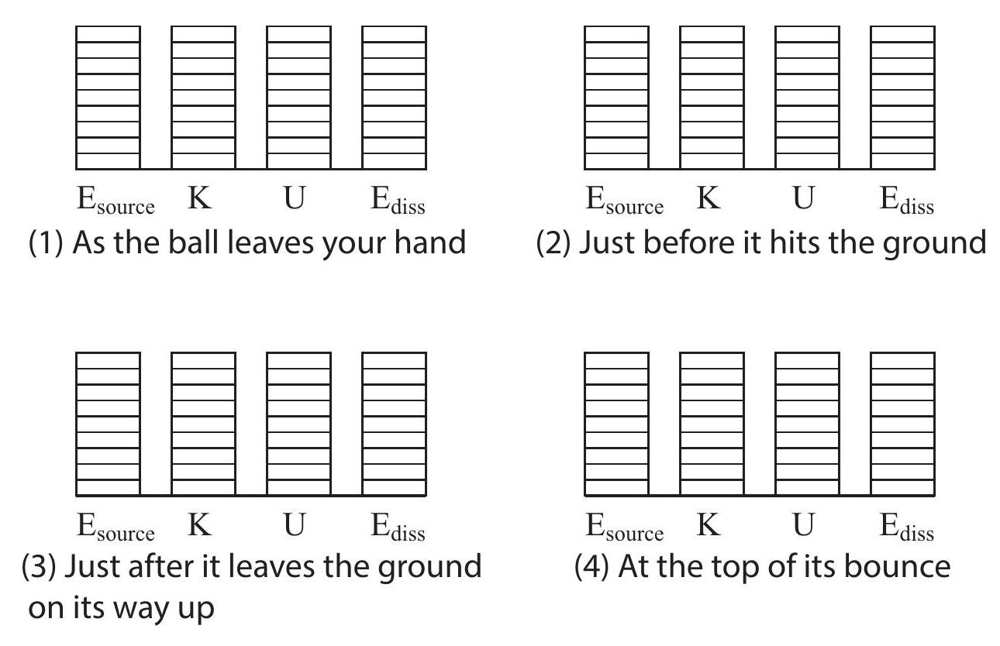

(sec-5.1)=
## 5.1 Conservative interactions

Let me summarize the physical concepts and principles we have encountered so far in our study of classical mechanics. We have \"discovered\" one important quantity, the inertia or inertial mass of an object, and introduced two different quantities based on that concept, the momentum $m \vec{v}$ and the kinetic energy $\frac{1}{2} m v^{2}$. We found that these quantities have different but equally intriguing properties. The total momentum of a system is insensitive to the interactions between the parts that make up the system, and therefore it stays constant in the absence of external influences (a more general statement of the law of inertia, the first important principle we encountered). The total kinetic energy, on the other hand, changes while any sort of interaction is taking place, but in some cases it may actually return to its original value afterwards.

In this chapter, we will continue to explore this intriguing behavior of the kinetic energy, and use it to gain some important insights into the kinds of interactions we encounter in classical physics. In the next chapter, on the other hand, we will return to the momentum perspective and use it to formally introduce the concept of force. Hence, we can say that this chapter deals with interactions from an energy point of view, whereas next chapter will deal with them from a force point of view.

In the previous chapter I suggested that what was going on in an elastic collision could be interpreted, or described (perhaps in a figurative way) more or less as follows: as the objects come together, the total kinetic energy goes down, but it is as if it was being temporarily stored away somewhere, and as the objects separate, that \"stored energy\" is fully recovered as kinetic energy. Whether this does happen or not in any particular collision (that is, whether the collision is elastic or not) depends, as we have seen, on the kind of interaction (\"bouncy\" or \"sticky,\" for instance) that takes place between the objects.

We are going to take the above description literally, and use the name conservative interaction for any interaction that can \"store and restore\" kinetic energy in this way. The \"stored energy\" itself-which is not actually kinetic energy while it remains stored, since it is not given by the value of $\frac{1}{2} m v^{2}$ at that time - we are going to call potential energy. Thus, conservative interactions will be those that have a \"potential energy\" associated with them, and vice-versa.

(sec-5.1.1)=
### 5.1.1 Potential energy

Perhaps the simplest and clearest example of the storage and recovery of kinetic energy is what happens when you throw an object straight upwards, as it rises and eventually falls back down. The object leaves your hand with some kinetic energy; as it rises it slows down, so its kinetic energy goes down, down\... all the way down to zero, eventually, as it momentarily stops at the top of its rise. Then it comes down, and its kinetic energy starts to increase again, until eventually, as it comes back to your hand, it has very nearly the same kinetic energy it started out with (exactly the same, actually, if you neglect air resistance).

The interaction responsible for this change in the object's kinetic energy is, of course, the gravitational interaction between it and the Earth, so we are going to say that the \"missing\" kinetic energy is temporarily stored as gravitational potential energy of the system formed by the Earth and the object.

We even have a way to describe what is going on mathematically. Recall the equation $v_{f}^{2}-v_{i}^{2}=$ $2 a \Delta x$ for motion under constant acceleration. Let us use $y$ instead of $x$, for the vertical motion; let $a=-g$, and let $v_{f}$ just be the generic velocity, $v$, at some arbitrary height $y$. We have

$$v^{2}-v_{i}^{2}=-2 g\left(y-y_{i}\right)$$

Now multiply both sides of this equation by $\frac{1}{2} m$ :

:::{math}
:label: eq-5.1
\frac{1}{2} m v^{2}-\frac{1}{2} m v_{i}^{2}=-m g\left(y-y_{i}\right)
:::

The left-hand side of {eq}`eq-5.1` is just the change in kinetic energy (from its initial value when the object was launched). We will interpret the right-hand side as the negative of the change in gravitational potential energy. To make this clearer, rearrange {numref}`Eq. %s <eq-5.1>` by moving all the \"initial\" quantities to one side:

:::{math}
:label: eq-5.2
\frac{1}{2} m v^{2}+m g y=\frac{1}{2} m v_{i}^{2}+m g y_{i}
:::

We see, then, that the quantity $\frac{1}{2} m v^{2}+m g y$ stays constant (always equal to its initial value) as the object goes up and down. Let us define the gravitational potential energy of a system formed by the Earth and an object a height $y$ above the Earth's surface as the following simple function of $y$ :

:::{math}
:label: eq-5.3
U^{G}(y)=m g y
:::

Then we see from {numref}`Eq. %s <eq-5.2>` that

:::{math}
:label: eq-5.4
K+U^{G}=\text { constant }
:::

This is a statement of conservation of energy under the gravitational interaction. For any interaction that has a potential energy associated with it, the quantity $K+U$ is called the (total) mechanical energy.

{numref}`Figure %s <fig-5.1>` shows how the kinetic and potential energies of an object thrown straight up change with time. To calculate $K$ I have used the equation $v=v_{i}-g t$ (taking $t_{i}=0$ ); to calculate $U^{G}=m g y$, I have used $y=y_{i}+v_{i} t-\frac{1}{2} g t^{2}$. I have arbitrarily assumed that the object has a mass of 1 kg and an initial velocity of $2 \mathrm{~m} / \mathrm{s}$, and it is thrown from an initial height of 0.5 m above the ground. Note how the change in potential energy exactly mirrors the change in kinetic energy (so $\Delta U^{G}=-\Delta K$, as indicated by {numref}`Eq. %s <eq-5.1>`), and the total mechanical energy remains equal to its initial value of 6.9 J throughout.

:::{figure} ../images/2024_09_14_9969b06773f10b6936e8g-109.jpg
:label: fig-5.1
:alt: Potential and kinetic energy as a function of time for a system consisting of the earth and a 1-kg object sent upwards with vi=2 ~m / s from a height of 0.5 m.
Potential and kinetic energy as a function of time for a system consisting of the earth and a 1-kg object sent upwards with $v_{i}=2 \mathrm{~m} / \mathrm{s}$ from a height of 0.5 m .
:::

There is something about potential energy that probably needs to be mentioned at this point. Because I have chosen to launch the object from 0.5 m above the ground, and I have chosen to measure $y$ from the ground, I started out with a potential energy of $m g y_{i}=4.9 \mathrm{~J}$. This makes sense, in a way: it tells you that if you simply dropped the object from this height, it would have picked up an amount of kinetic energy equal to 4.9 J by the time it reached the ground. But, actually, where I choose the vertical origin of coordinates is arbitrary. I could start measuring $y$\
from any height I wanted to-for instance, taking the initial height of my hand to correspond to $y=0$. This would shift the blue curve in {numref}`Fig. %s <fig-5.1>` down by 4.9 J , but it would not change any of the physics. The only important thing I really want the potential energy for is to calculate the kinetic energy the object will lose or gain as it moves from one height to another, and for that only changes in potential energy matter. I can always add or subtract any (constant) number ${ }^{1}$ to or from $U$, and it will still be true that $\Delta K=-\Delta U$.

What about potential energy in the context in which we first encountered it, that of elastic collisions in one dimension? Imagine that we have two carts collide on an air track, and one of them, let us say cart 2 , is fitted with a spring. As the carts come together, they compress the spring, and some of their kinetic energy is \"stored\" in it as elastic potential energy. In physics, we use the following expression for the potential energy stored in what we call an ideal spring ${ }^{2}$ :

:::{math}
:label: eq-5.5
U^{s p r}(x)=\frac{1}{2} k\left(x-x_{0}\right)^{2}
:::

where $k$ is something called the spring constant; $x_{0}$ is the \"equilibrium length\" of the spring (when it is neither compressed nor stretched); and $x$ its actual length, so $x>x_{0}$ means the spring is stretched, and $x<x_{0}$ means it is compressed. For the system of the two carts colliding, we can take the potential energy to be given by {numref}`Eq. %s <eq-5.5>` if the distance between the carts is less than $x_{0}$, and 0 (corresponding to a relaxed spring) otherwise. If we put cart 1 on the left and cart 2 on the right, then the distance between them is $x_{2}-x_{1}$, and so we can write, for the whole interaction

:::{math}
:label: eq-5.6
\begin{array}{rr}
U\left(x_{2}-x_{1}\right)=\frac{1}{2} k\left(x_{2}-x_{1}-x_{0}\right)^{2} & \text { if } x_{2}-x_{1}<x_{0} \\
0 & \text { otherwise }
\end{array}
:::

This is enough to solve for the motion of the two carts, given the initial conditions. To see how, look in the \"Examples\" section at the end of this chapter. Here, I will just give you the result.

For the calculation, shown in {numref}`Fig. %s <fig-5.2>` below, I have chosen cart 1 to have a mass of 1 kg , an initial position (at $t=0$ ) of $x_{1 i}=-5 \mathrm{~cm}$ and an initial velocity of $1 \mathrm{~m} / \mathrm{s}$, whereas cart 2 has a mass of 2 kg and starts at rest at $x_{2 i}=0$. I have assumed the spring has a length of $x_{0}=2 \mathrm{~cm}$ and a spring constant $k=1000 \mathrm{~J} / \mathrm{m}^{2}$ (which sounds like a lot but isn't really). The collision begins at $t_{c}=\left(x_{2 i}-x_{0}-x_{1 i}\right) / v_{1 i}=0.03 \mathrm{~s}$, which is the time it takes cart 1 to travel the 3 cm separating it from the end of the spring. Prior to that point, the total kinetic energy $K_{\text {sys }}=0.5 \mathrm{~J}$, and the total potential energy $U=0$.

As a result of the collision, the spring compresses and undergoes \"half a cycle\" of oscillation with an \"angular frequency\" $\omega=\sqrt{k / \mu}$ (where $\mu$ is, as in previous chapters, the \"reduced mass\" of the system, $\left.\mu=m_{1} m_{2} /\left(m_{1}+m_{2}\right)\right)$. That is, the spring is compressed and then pushes out until it gets back to its equilibrium length ${ }^{3}$. This lasts from $t=t_{c}$ until $t=t_{c}+\pi / \omega$, during which time the potential and kinetic energies of the system can be written as

:::{math}
:label: eq-5.7
\begin{align*}
& U(t)=\frac{1}{2} \mu v_{12, i}^{2} \sin ^{2}\left[\omega\left(t-t_{c}\right)\right] \\
& K(t)=K_{c m}+\frac{1}{2} \mu v_{12, i}^{2} \cos ^{2}\left[\omega\left(t-t_{c}\right)\right]
\end{align*}
:::

(don't worry, all this will make a lot more sense after we get to {ref}`Chapter 11 <ch-11>` on simple harmonic motion, I promise!). After $t=t_{c}+\pi / \omega$, the interaction is over, and $K$ and $U$ go back to their initial values.

:::{figure} ../images/2024_09_14_9969b06773f10b6936e8g-111.jpg
:label: fig-5.2
:alt: Potential and kinetic energy as a function of time for a system of two carts colliding and compressing a spring in the process.
Potential and kinetic energy as a function of time for a system of two carts colliding and compressing a spring in the process.
:::

If you compare {numref}`Figure %s <fig-5.2>` with {numref}`Figure %s <fig-4.5>` of {ref}`Chapter 4 <ch-4>` , you'll see that the kinetic energy curve looks very similar, except for the time scale, which here is hundredths of a second and over there was taken to be milliseconds. The quantity that determines the time scale here is the \"half period\" of oscillation, $\pi / \omega=\pi \sqrt{\mu / k}=0.081 \mathrm{~s}$ for the values of $k$ and $\mu$ assumed here. We could make this smaller by making the spring stiffer (increasing $k$ ), or the blocks lighter (reducing $\mu$ ), but there's not much point in trying, since the collisions in Chapters 3 and 4 were all just made up in any case.

The main point is that this kind of physical setup (a cart fitted with a spring) would indeed give us an elastic collision, and a kinetic energy curve very much like the ones I used, for illustration purposes, in {ref}`Chapter 4 <ch-4>`; only now we also have a potential energy curve to go with it, and to show where the energy is \"hiding\" while the collision lasts.\
(You might wonder, anyway, what kind of potential energy function would actually produce the made-up elastic collision curves in Chapters 3 and 4? The (perhaps surprising) answer is, I do not really know, and I have no way to find out! If you are curious about why, again look at the \"Examples\" section at the end of the chapter.)

(sec-5.1.2)=
### 5.1.2 Potential energy functions and \"energy landscapes\"

The potential energy function of a system, as illustrated in the above examples, serves to let us know how much energy can be stored in, or extracted from, the system by changing its configuration, that is to say, the positions of its parts relative to each other. We have seen this in the case of the gravitational force (the \"configuration\" in this case being the distance between the object and the earth), and just now in the case of a spring (how stretched or compressed it is). In all these cases we should think of the potential energy as being a property of the system as a whole, not any individual part; it is, very loosely speaking, something akin to a \"stress\" in the system that can be turned into motion under the right conditions.

It is a consequence of the principle of conservation of momentum that, if the interaction between two particles can be described by a potential energy function, this should be a function only of their relative position, that is, the quantity $x_{1}-x_{2}$ ( or $x_{2}-x_{1}$ ), and not of the individual coordinates, $x_{1}$ and $x_{2}$, separately ${ }^{4}$. The example of the spring in the previous section illustrates this, whereas the gravitational potential energy example shows how this can be simplified in an important case: in {numref}`Eq. %s <eq-5.3>`, the height $y$ of the object above the ground is really a measure of the distance between the object and the earth, something that we could write, in full generality, as $\left|\vec{r}_{o}-\vec{r}_{E}\right|$ (where $\vec{r}_{o}$ and $\vec{r}_{E}$ are the position vectors of the Earth and the object, respectively). However, since we do not expect the Earth to move very much as a result of the interaction, we can take its position to be constant, and only include the position of the object explicitly in our potential energy function, as we did above ${ }^{5}$.

Generally speaking, then, we can identify a large class of problems where a \"small\" object or \"particle\" interacts with a much more massive one, and it is a good approximation to write the potential energy of the whole system as a function of only the position of the particle. In one

dimension, then, we have a situation where, once the initial conditions (the particle's initial position and velocity) are known, the motion of the particle can be completely determined from the function $U(x)$, where $x$ is the particle's position at any given time. This can be done, using calculus, essentially by the method illustrated in Example 5.6.3 at the end of this chapter (namely, let $v= \pm \sqrt{2 m(E-U(x))}$ and solve the resulting differential equation); but it is also possible to get some pretty valuable insights into the particle's motion without using any calculus at all, through a mostly graphical approach that I would like to show you next.

:::{figure} ../images/2024_09_14_9969b06773f10b6936e8g-113.jpg
:label: fig-5.3
:alt: A hypothetical potential energy curve for a particle in one dimension. The horizontal red line shows the total mechanical energy under the assumption that the particle starts out at x=-2 ~m with Ki=8 ~J. The green line assumes the particle starts instead from rest at x=1 ~m.
A hypothetical potential energy curve for a particle in one dimension. The horizontal red line shows the total mechanical energy under the assumption that the particle starts out at $x=-2 \mathrm{~m}$ with $K_{i}=8 \mathrm{~J}$. The green line assumes the particle starts instead from rest at $x=1 \mathrm{~m}$.
:::

In {numref}`Figure %s <fig-5.3>` above I have assumed, as an example, that the potential energy of the system, as a function of the position of the particle, is given by the function $U(x)=-x^{4} / 4+9 x^{2} / 2+2 x+1$ (in joules, if $x$ is given in meters). Consider then what happens if the particle has a mass $m=4 \mathrm{~kg}$ and is found initially at $x_{i}=-2 \mathrm{~m}$, with a velocity $v_{i}=2 \mathrm{~m} / \mathrm{s}$. (This scenario goes with the red lines in {numref}`Fig. %s <fig-5.3>`, so please ignore the green lines for the time being.) Its kinetic energy will then be $K_{i}=8 \mathrm{~J}$, whereas the potential energy will be $U(-2)=11 \mathrm{~J}$. The total mechanical energy is then $E=19 \mathrm{~J}$, as indicated by the red horizontal line.

Now, as the particle moves, the total energy remains constant, so as it moves to the right, its potential energy goes down at first, and consequently its kinetic energy goes up-that is, it accelerates. At some point, however (around $x=-0.22 \mathrm{~m}$ ) the potential energy starts to go up, and so the particle starts to slow down, although it keeps going, because $K=E-U$ is still nonzero. However, when the particle eventually reaches the point $x=2 \mathrm{~m}$, the potential energy $U(2)=19 \mathrm{~J}$, and the kinetic energy becomes zero.

At that point, the particle stops and turns around, just like an object thrown vertically upwards. As it moves \"down the potential energy hill,\" it recovers the kinetic energy it used to have, so that when it again reaches the starting point $x=-2 \mathrm{~m}$, its speed is again $2 \mathrm{~m} / \mathrm{s}$, but now it is moving in the opposite direction, so it just passes through and over the next \"hill\" (since it has enough total energy to do so), and eventually moves outside the region shown in the figure.

As another example, consider what would have happened if the particle had been released at, say, $x=1 \mathrm{~m}$, but with zero velocity. (This is illustrated by the green lines in {numref}`Fig. %s <fig-5.3>`.) Then the total energy would be just the potential energy $U(1)=7.25 \mathrm{~J}$. The particle could not possibly move to the right, since that would require the total energy to go up. It can only move to the left, since in that direction $U(x)$ decreases (initially, at first), and that means $K$ can increase (recall $K$ is always positive as long as the particle is in motion). So the particle speeds up to the left until, past the point $x=-0.22 \mathrm{~m}, U(x)$ starts to increase again and $K$ has to go down. Eventually, as the figure shows, we reach a point (which we can calculate to be $x=-1.548 \mathrm{~m}$ ) where $U(x)$ is once again equal to 7.25 J . This leaves no room for any kinetic energy, so the particle has to stop and turn back. The resulting motion consists of the particle oscillating back and forth forever between $x=-1.548 \mathrm{~m}$ and $x=1 \mathrm{~m}$.

At this point, you may have noticed that the motion I have described as following from the $U(x)$ function in {numref}`Figure %s <fig-5.3>` resembles very much the motion of a car on a roller-coaster having the shape shown, or maybe a ball rolling up and down hills like the ones shown in the picture. In fact, the correspondence can be made exact-if we substitute sliding for rolling, since rolling motion has complications of its own. Given an arbitrary potential energy function $U(x)$ for a particle of mass $m$, imagine that you build a \"landscape\" of hills and valleys whose height $y$ above the horizontal, for a given value of the horizontal coordinate $x$, is given by the function $y(x)=U(x) / m g$. (Note that $m g$ is just a constant scaling factor that does not change the shape of the curve.) Then, for an object of mass $m$ sliding without friction over that landscape, under the influence of gravity, the gravitational potential energy at any point $x$ would be $U^{G}(x)=m g y=U(x)$, and therefore its speed at any point will be precisely the same as that of the original particle, if it starts at the same point with the same velocity.

This notion of an \"energy landscape\" can be extended to more than one dimension (although they are hard to visualize in three!), or generalized to deal with configuration parameters other than a single particle's position. It can be very useful in a number of disciplines (not just physics), to predict the ways in which the configuration of a system may be likely to change.

(sec-5.2)=
## 5.2 Dissipation of energy and thermal energy

From all the foregoing, it is clear that when an interaction can be completely described by a potential energy function we can define a quantity, which we have called the total mechanical\
energy of the system, $E_{\text {mech }}=K+U$, that is constant throughout the interaction. However, we already know from our study of inelastic collisions that this is rarely the case. Essential to the concept of potential energy is the idea of \"storage and retrieval\" of the kinetic energy of the system during the interaction process. When kinetic energy simply disappears from the system and does not come back, a full description of the process in terms of a potential energy is not possible.

Processes in which some amount of mechanical energy disappears (that is, it cannot be found anywhere anymore as either macroscopic kinetic or potential energy) are called dissipative. Mysterious as they may appear at first sight, there is actually a simple, intuitive explanation for them. All macroscopic systems consist of a great number of small parts that enjoy, at the microscopic level, some degree of independence from each other and from the body to which they belong. Macroscopic motion of an object requires all these parts to move together as a whole, at least on average; however, a collision with another object may very well \"rattle\" all these parts and leave them in a more or less disorganized state. If the total energy is conserved, then after the collision the object's atoms or molecules may be, on average, vibrating faster or banging against each other more often than before, but they will do so in random directions, so this increased \"agitation\" will not be perceived as macroscopic motion of the object as a whole.

This kind of random agitation at the microscopic level that I have just introduced is what we know today as thermal energy, and it is by far the most common \"sink\" or reservoir where macroscopic mechanical energy is \"dissipated.\" In our example of an inelastic collision, the energy the objects had is not gone from the universe, in fact it is still right there inside the objects themselves; it is just in a disorganized or incoherent state from which, as you can imagine, it would be pretty much impossible to retrieve it, since we would have to somehow get all the randomly-moving parts to get back to moving in the same direction again.

We will have a lot more to say about thermal energy in a later chapter, but for the moment you may want to think of it as essentially noise: it is what is left (the residual motional or configurational energy, at the microscopic level) after you remove the average, macroscopically-observable kinetic or potential energy. So, for example, for a solid object moving with a velocity $v_{c m}$, the kinetic part of its thermal energy would be the sum of the kinetic energies of all its microscopic parts, calculated in its center of mass (or zero-momentum) reference frame; that way you remove from every molecule's velocity the quantity $v_{c m}$, which they all must have in common - on average (since the body as a whole is moving with that velocity) ${ }^{6}$.

In order to establish conservation of energy as a fact (which was one of the greatest scientific triumphs of the 19th century) it was clearly necessary to show experimentally that a certain amount

of mechanical energy lost always resulted in the same predictable increase in the system's thermal energy. Thermal energy is largely \"invisible\" at the macroscopic level, but we detect it indirectly through an object's temperature. The crucial experiments to establish what at the time was called the \"mechanical equivalent of heat\" were carried out by James Prescott Joule in the 1850's, and required exceedingly precise measurements of temperature (in fact, getting the experiments done was only half the struggle; the other half was getting the scientific establishment to believe that he could measure changes in temperature so accurately!)

(sec-5.3)=
## 5.3 Fundamental interactions, and other forms of energy

At the most fundamental (microscopic) level, physicists today believe that there are only four (or three, depending on your perspective) basic interactions: gravity, electromagnetism, the strong nuclear interaction (responsible for holding atomic nuclei together), and the weak nuclear interaction (responsible for certain nuclear processes, such as the transmutation of a proton into a neutron ${ }^{7}$ and vice-versa). In a technical sense, at the quantum level, electromagnetism and the weak nuclear interactions can be regarded as separate manifestations of a single, consistent quantum field theory, so they are sometimes referred to as \"the electroweak interaction.\"

All of these interactions are conservative, in the sense that for all of them one can define the equivalent of a \"potential energy function\" (generalized, as necessary, to conform to the requirements of quantum mechanics and relativity), so that for a system of elementary particles interacting via any one of these interactions the total kinetic plus potential energy is a constant of the motion. For gravity (which we do not really know how to \"quantize\" anyway!), this function immediately carries over to the macroscopic domain without any changes, as we shall see in a later chapter, and the gravitational potential energy function I introduced earlier in this chapter is an approximation to it valid near the surface of the earth (gravity is such a weak force that the gravitational interaction between any two earth-bound objects is virtually negligible, so we only have to worry about gravitational energy when one of the objects involved is the earth itself).

As for the strong and weak nuclear interactions, they are only appreciable over the scale of an atomic nucleus, so there is no question of them directly affecting any macroscopic mechanical processes. They are responsible, however, for various nuclear reactions in the course of which nuclear energy is, most commonly, transformed into electromagnetic energy (X- or gamma rays) and thermal energy.

All the other forms of energy one encounters at the microscopic, and even the macroscopic, level have their origin in electromagnetism. Some of them, like the electrostatic energy in a capacitor or the magnetic interaction between two permanent magnets, are straightforward enough scale-ups of their microscopic counterparts, and may allow for a potential energy description at the macroscopic

level (and you will learn more about them next semester!). Many others, however, are more subtle and involve quantum mechanical effects (such as the exclusion principle) in a fundamental way.

Among the most important of these is chemical energy, which is an extremely important source of energy for all kinds of macroscopic processes: combustion (and explosions!), the production of electrical energy in batteries, and all the biochemical processes that power our own bodies. However, the conversion of chemical energy into macroscopic mechanical energy is almost always a dissipative process (that is, one in which some of the initial chemical energy ends up irreversibly converted into thermal energy), so it is generally impossible to describe them using a (macroscopic) potential energy function (except, possibly, for electrochemical processes, with which we will not be concerned here).

For instance, consider a chemical reaction in which some amount of chemical energy is converted into kinetic energy of the molecules forming the reaction products. Even when care is taken to \"channel\" the motion of the reaction products in a particular direction (for example, to push a cylinder in a combustion engine), a lot of the individual molecules will end up flying in the \"wrong\" direction, striking the sides of the container, etc. In other words, we end up with a lot of the chemical energy being converted into disorganized microscopic agitation-which is to say, thermal energy.

Electrostatic and quantum effects are also responsible for the elastic properties of materials, which can sometimes be described by macroscopic potential energy functions, at least to a first approximation (like the spring we studied earlier in the chapter). They are also responsible for the adhesive forces between surfaces that play an important role in friction, and various other kinds of what might be called \"structural energies,\" most of which play only a relatively small part in the energy balance where macroscopic objects are involved.

(sec-5.4)=
## 5.4 Conservation of energy

Today, physics is pretty much founded on the belief that the energy of a closed system (defined as one that does not exchange energy with its surroundings-more on this in a minute) is always conserved: that is, internal processes and interactions will only cause energy to be \"converted\" from one form into another, but the total, after all the forms of energy available to the system have been carefully accounted for, will not change. This belief is based on countless experiments, on the one hand, and, on the other, on the fact that all the fundamental interactions that we are aware of do conserve a system's total energy.

Of course, recognizing whether a system is \"closed\" or not depends on having first a complete catalogue of all the ways in which energy can be stored and exchanged - to make sure that there is, in fact, no exchange of energy going on with the surroundings. Note, incidentally, that a \"closed\"\
system is not necessarily the same thing as an \"isolated\" system: the former relates to the total energy, the latter to the total momentum. A parked car getting hotter in the sun is not a closed system (it is absorbing energy all the time) but, as far as its total momentum is concerned, it is certainly fair to call it \"isolated.\" (And as you keep this in mind, make sure you also do not mistake \"isolated\" for \"insulated\"!) Hopefully all these concepts will be further clarified when we introduce the additional auxiliary concepts of force, work, and heat (although the latter will not come until the end of the semester).

For a closed system, we can state the principle of conservation of energy (somewhat symbolically) in the form

:::{math}
:label: eq-5.8
K+U+E_{\text {source }}+E_{\text {diss }}=\mathrm{constant}
:::

where $K$ is the total, macroscopic, kinetic energy; $U$ the sum of all the applicable potential energies associated with the system's internal interactions; $E_{\text {source }}$ is any kind of internal energy (such as chemical energy) that is not described by a potential energy function, but can increase the system's mechanical energy; and $E_{\text {diss }}$ stands for the contents of the \"dissipated energy reservoir\" - typically thermal energy. As with the potential energy $U$, the absolute value of $E_{\text {source }}$ and $E_{\text {diss }}$ does not (usually) really matter: all we are interested in is how much they change in the course of the process under consideration.

:::{figure} ../images/2024_09_14_9969b06773f10b6936e8g-118.jpg
:label: fig-5.4
:alt: Energy bar diagrams for a system formed by the earth and a ball thrown downwards. (a) As the ball leaves the hand. (b) Just before it hits the ground. (c) During the collision, at the time of maximum compression. (d) At the top of the first bounce. The total number of energy "units" is the same in all the diagrams, as required by the principle of conservation of energy. From the diagrams you can tell that the coefficient of restitution e=square root of 7 / 9.
Energy bar diagrams for a system formed by the earth and a ball thrown downwards. (a) As the ball leaves the hand. (b) Just before it hits the ground. (c) During the collision, at the time of maximum compression. (d) At the top of the first bounce. The total number of energy \"units\" is the same in all the diagrams, as required by the principle of conservation of energy. From the diagrams you can tell that the coefficient of restitution $e=\sqrt{7 / 9}$.
:::

{numref}`Figure %s <fig-5.4>` above is an example of this kind of \"energy accounting\" for a ball bouncing on the ground. If the ball is thrown down, the system formed by the ball and the earth initially has both\
gravitational potential energy, and kinetic energy (diagram (a)). Note that we could write the total kinetic energy as $K_{c m}+K_{c o n v}$, as we did in the previous chapter, but because of the large mass of the earth, the center of mass of the system is essentially the center of the earth, which, in our earth-bound coordinate system, does not move at all, so $K_{c m}$ is, to an excellent approximation, zero. Then, the reduced mass of the system, $\mu=m_{b} M_{E} /\left(m_{b}+M_{E}\right)$ is, also to an excellent approximation, just equal to the mass of the ball, so $K_{\text {conv }}=\frac{1}{2} \mu v_{12}^{2}=\frac{1}{2} m_{b}\left(v_{b}-v_{e}\right)^{2}=\frac{1}{2} m_{b} v_{b}^{2}$ (again, because the earth does not move). So all the kinetic energy that we have is the kinetic energy of the ball, and it is all, in principle, convertible (as you can see if you replace the ball, for instance, with a bean bag).

As the ball falls, gravitational potential energy is being converted into kinetic energy, and the ball speeds up. As it is about to hit the ground (diagram (b)), the potential energy is zero and the kinetic energy is maximum. During the collision with the ground, all the kinetic energy is temporarily converted into other forms of energy, which are essentially elastic energy of deformation (like the energy in a spring) and some thermal energy (diagram (c)). When it bounces back, its kinetic energy will only be a fraction $e^{2}$ of what it had before the collision (where $e$ is the coefficient of restitution). This kinetic energy is all converted into gravitational potential energy as the ball reaches the top of its bounce (diagram (d)). Note there is more dissipated energy in diagram (d) than in (c); this is because I have assumed that dissipation of energy takes place both during the compression and the subsequent expansion of the ball.

(sec-5.5)=
## 5.5 In summary

1.  For conservative interactions one can define a potential energy $U$, such that that in the course of the interaction the total mechanical energy $E=U+K$ of the system remains constant, even as $K$ and $U$ separately change. The function $U$ is a measure of the energy stored in the configuration of the system, that is, the relative position of all its parts.

2.  The potential energy function for a system of two particles must be a function of their relative position only: $U\left(x_{1}-x_{2}\right)$. However, if one of the objects is very massive, so it does not move during the interaction, its position may be taken to be the origin of coordinates, and $U$ written as a function of the lighter object's coordinate alone.

3.  For a system formed by the earth and an object of mass $m$ at a height $y$ above the ground, the gravitational potential energy can be written as $U^{G}=m g y$ (approximately, as long as $y$ is much smaller than the radius of the earth).

4.  The elastic potential energy stored in an ideal spring of spring constant $k$ and relaxed length $x_{0}$, when stretched or compressed to an actual length $x$, is $U^{s p r}=\frac{1}{2} k\left(x-x_{0}\right)^{2}$.

5.  For an object in one dimension, with position coordinate $x$, which is part of a system with potential energy $U(x)$, the motion can be predicted from the \"energy landscape\" formed by\
    the graph of the function $U(x)$. The idea, elaborated in {ref}`Section 5.1.2 <sec-5.1.2>` above, is to imagine the equivalent motion of an object sliding without friction over the same landscape, under the influence of gravity.

6.  The fundamental interactions currently known in physics are gravity, the strong nuclear interaction and the electroweak interaction (which includes all electromagnetic phenomena). These are all conservative.

7.  At a macroscopic level, one finds a number of interactions and associated energies that are derived from electromagnetism and quantum mechanics. Two important examples are chemical energy, and elastic energy (which is energy associated with the elasticity or \"springiness\" of a body). Elastic energy can often be described approximately by a potential energy function, and as such be included in calculations of the total mechanical energy of a system.

8.  Interactions between macroscopic objects almost always involve the conversion of some type of energy into another. Typically, some of the total mechanical energy is always lost in the conversion process, because it is impossible to keep at least some of the energy from spreading itself randomly among the microscopic parts that make up the interacting objects. This is an intrinsically irreversible process known as dissipation of energy.

9.  Most of the time the dissipated energy ends up as thermal energy, which is energy associated with a random agitation at the atomic or molecular level.

10. A closed system is one that does not exchange energy with its surrounding. This is not necessarily the same thing as an isolated system (which is one that does not exchange momentum with its surroundings). For a closed system, the sum of its macroscopic mechanical energy (kinetic + potential) and all its other \"internal\" energies (chemical, thermal), must be a constant.

(sec-5.6)=
## 5.6 Examples

(sec-5.6.1)=
### 5.6.1 Inelastic collision in the middle of a swing

Tarzan swings on a vine to rescue a helpless explorer (as usual) from some attacking animal or another. He begins his swing from a branch a height of 15 m above the ground, grabs the explorer at the bottom of his swing, and continues the swing, upwards this time, until they both land safely on another branch. Suppose that Tarzan weighs 90 kg and the explorer weighs 70 , and that Tarzan doesn't just drop from the branch, but pushes himself off so that he starts the swing with a speed of $5 \mathrm{~m} / \mathrm{s}$. How high a branch can he and the explorer reach?

(ch-5-solution)=
### Solution

Let us break this down into parts. The first part of the swing involves the conversion of some amount of initial gravitational potential energy into kinetic energy. Then comes the collision with the explorer, which is completely inelastic and we can analyze using conservation of momentum (assuming Tarzan and the explorer form an isolated system for the brief time the collision lasts). After that, the second half of their swing involves the complete conversion of their kinetic energy into gravitational potential energy.

Let $m_{1}$ be Tarzan's mass, $m_{2}$ the explorer's mass, $h_{i}$ the initial height, and $h_{f}$ the final height. We also have three velocities to worry about (or, more properly in this case, speeds, since their direction is of no concern, as long as they all point the way they are supposed to): Tarzan's initial velocity at the beginning of the swing, which we may call $v_{\text {top }}$; his velocity at the bottom of the swing, just before he grabs the explorer, which we may call $v_{b o t 1}$, and his velocity just after he grabs the explorer, which we may call $v_{\text {bot2 }}$. (If you find those subscripts confusing, I am sorry, they are the best I could do; please feel free to make up your own.)

- First part: the downswing. We apply conservation of energy, in the form {eq}`eq-5.8`, to the first part of the swing. The system we consider consists of Tarzan and the earth, and it has kinetic energy as well as gravitational potential energy. We ignore the source energy and the dissipated energy terms, and consider the system closed despite the fact that Tarzan is holding onto a vine (as we shall see in a couple of chapters, the vine does no \"work\" on Tarzan - meaning, it does not change his energy, only his direction of motion-because the force it exerts on Tarzan is always perpendicular to his displacement):

:::{math}
:label: eq-5.9
K_{\text {top }}+U_{\text {top }}^{G}=K_{\text {bot } 1}+U_{\text {bot }}^{G}
:::

In terms of the quantities I introduced above, this equation becomes:

$$\frac{1}{2} m_{1} v_{\text {top }}^{2}+m_{1} g h_{i}=\frac{1}{2} m_{1} v_{b o t 1}^{2}+0$$

which can be solved to give

:::{math}
:label: eq-5.10
v_{\text {bot1 }}^{2}=v_{\text {top }}^{2}+2 g h_{i}
:::

(note that this is just the familiar result {eq}`eq-2.10` for free fall! This is because, as I pointed out above, the vine does no work on the system.). Substituting, we get

$$v_{\text {bot } 1}=\sqrt{\left(5 \frac{\mathrm{m}}{\mathrm{s}}\right)^{2}+2\left(9.8 \frac{\mathrm{m}}{\mathrm{s}^{2}}\right) \times(15 \mathrm{~m})}=17.9 \frac{\mathrm{m}}{\mathrm{s}}$$

- Second part: the completely inelastic collision. The explorer is initially at rest (we assume he has not seen the wild beast ready to pounce yet, or he has seen it and he is paralyzed by fear!). After Tarzan grabs him they are moving together with a speed $v_{\text {bot2 }}$. Conservation of momentum gives

:::{math}
:label: eq-5.11
m_{1} v_{\text {bot } 1}=\left(m_{1}+m_{2}\right) v_{\text {bot } 2}
:::

which we can solve to get

$$v_{\text {bot } 2}=\frac{m_{1} v_{\text {bot } 1}}{m_{1}+m_{2}}=\frac{(90 \mathrm{~kg}) \times(17.9 \mathrm{~m} / \mathrm{s})}{160 \mathrm{~kg}}=10 \frac{\mathrm{m}}{\mathrm{s}}$$

- Third part: the upswing. Here we use again conservation of energy in the form

:::{math}
:label: eq-5.12
K_{b o t 2}+U_{b o t}^{G}=K_{f}+U_{f}^{G}
:::

where the subscript $f$ refers to the very end of the swing, when they both safely reach their new branch, and all their kinetic energy has been converted to gravitational potential energy, so $K_{f}=0$ (which means that is as high as they can go, unless they start climbing the vine!). This equation can be rewritten as

$$\frac{1}{2}\left(m_{1}+m_{2}\right) v_{b o t 2}^{2}+0=0+\left(m_{1}+m_{2}\right) g h_{f}$$

and solving for $h_{f}$ we get

$$h_{f}=\frac{v_{b o t 2}^{2}}{2 g}=\frac{(10 \mathrm{~m} / \mathrm{s})^{2}}{2 \times 9.8 \mathrm{~m} / \mathrm{s}^{2}}=5.15 \mathrm{~m}$$

(sec-5.6.2)=
### 5.6.2 Kinetic energy to spring potential energy: block collides with spring

A block of mass $m$ is sliding on a frictionless, horizontal surface, with a velocity $v_{i}$. It hits an ideal spring, of spring constant $k$, which is attached to the wall. The spring compresses until the block momentarily stops, and then starts expanding again, so the block ultimately bounces off.\
(a) In the absence of dissipation, what is the block's final speed?\
(b) By how much is the spring compressed?

(ch-5-solution-1)=
### Solution

This is a simpler version of the problem considered in {ref}`Section 5.1.1 <sec-5.1.1>`, and in the next example. The\
problem involves the conversion of kinetic energy into elastic potential energy, and back. In the absence of dissipation, {numref}`Eq. %s <eq-5.8>`, specialized to this system (the spring and the block) reads:

:::{math}
:label: eq-5.13
K+U^{s p r}=\text { constant }
:::

For part (a), we consider the whole process where the spring starts relaxed and ends relaxed, so $U_{i}^{s p r}=U_{f}^{s p r}=0$. Therefore, we must also have $K_{f}=K_{i}$, which means the block's final speed is the same as its initial speed. As explained in the chapter, this is characteristic of a conservative interaction.

For part (b), we take the final state to be the instant where the spring is maximally compressed and the block is momentarily at rest, so all the energy in the system is spring (which is to say, elastic) potential energy. If the spring is compressed a distance $d$ (that is, $x-x_{0}=-d$ in {numref}`Eq. %s <eq-5.5>`), this potential energy is $\frac{1}{2} k d^{2}$, so setting that equal to the system's initial energy we get:

:::{math}
:label: eq-5.14
K_{i}+0=0+\frac{1}{2} k d^{2}
:::

or

$$\frac{1}{2} m v_{i}^{2}=\frac{1}{2} k d^{2}$$

which can be solved to get

$$d=\sqrt{\frac{m}{k}} v_{i}$$

(sec-5.7)=
## 5.7 Advanced Topics

(sec-5.7.1)=
### 5.7.1 Two carts colliding and compressing a spring

Unlike the example 5.6.2, which considered a stationary spring and asked only questions about initial and final states, this example is intended to show you how one can use \"energy methods\" to solve for the actual motion of a relatively complicated system as a function of time. The system is the two carts colliding, one of them fitted with a spring, considered in {ref}`Section 5.1.1 <sec-5.1.1>`. Although all the physics involved is straightforward, the math is at a higher level than you will be using this semester, so I'm presenting this here as a \"curiosity\" only.

First, recall the total kinetic energy for a collision problem can be written as $K=K_{c m}+K_{c o n v}$, where (if the system is isolated) $K_{c m}$ remains constant throughout. Then, the total mechanical energy $E=K+U=K_{c m}+K_{\text {conv }}+U$. This is also constant, and before the interaction happens, when $U=0$, we have $E=K_{c m}+K_{\text {conv, }, i}$, so setting these two things equal and canceling out $K_{c m}$ we get

:::{math}
:label: eq-5.15
K_{\text {conv }}=K_{\text {conv }, i}-U
:::

where the potential energy function is given by {numref}`Eq. %s <eq-5.6>`. Introducing the relative coordinate $x_{12}=x_{2}-x_{1}$, and the relative velocity $v_{12}$, {numref}`Eq. %s <eq-5.15>` becomes

:::{math}
:label: eq-5.16
\frac{1}{2} \mu v_{12}^{2}=\frac{1}{2} \mu v_{12, i}^{2}-\frac{1}{2} k\left(x_{12}-x_{0}\right)^{2}
:::

an equation that must hold while the interaction is going on. We can solve this for $v_{12}$, and then notice that both $x_{12}$ and $v_{12}$ are functions of time, and the latter is the derivative with respect to time of the former, so

:::{math}
:label: eq-5.17
\begin{aligned}
v_{12} & = \pm \sqrt{v_{12, i}^{2}-(k / \mu)\left(x_{12}-x_{0}\right)^{2}}
\end{aligned}
:::

:::{math}
:label: eq-5.18
\begin{aligned}
\frac{d x_{12}}{d t} & = \pm \sqrt{v_{12, i}^{2}-(k / \mu)\left(x_{12}(t)-x_{0}\right)^{2}}
\end{aligned}
:::

(The \" $\pm$ \" sign means that the quantity on the right-hand side has to be negative at first, when the carts are coming together, and positive later, when they are coming apart. This is because I have assumed cart 1 starts to the left of cart 2 , so going in cart 2 , as seen from cart 1, appears to be moving to the left.)

{numref}`Equation %s <eq-5.18>` is what is known, in calculus, as a differential equation. The problem is to find a function of $t, x_{12}(t)$, such that when you take its derivative you get the expression on the right-hand side. If you know how to calculate derivatives, you can check that the solution is in fact

:::{math}
:label: eq-5.19
x_{12}(t)=x_{0}-\frac{v_{12, i}}{\omega} \sin \left[\omega\left(t-t_{c}\right)\right] \quad \text { for } t_{c} \leq t \leq t_{c}+\pi / \omega
:::

where the quantity $\omega=\sqrt{k / \mu}$, and the time $t_{c}$ is the time cart 1 first makes contact with the spring: $t_{c}=\left(x_{2 i}-x_{0}-x_{1 i}\right) / v_{1 i}$. The solution {eq}`eq-5.19` is valid for as long as the spring is compressed, which is to say, for as long as $x_{12}(t)<x_{0}$, or $\sin \left[\omega\left(t-t_{c}\right)\right]>0$, which translates to the condition on $t$ shown above.

Having a solution for $x_{12}$, we could now obtain explicit results for $x_{1}(t)$ and $x_{2}(t)$ separately, using the fact that $x_{1}=x_{c m}-m_{2} x_{12} /\left(m_{1}+m_{2}\right)$, and $x_{2}=x_{c m}+m_{1} x_{12} /\left(m_{1}+m_{2}\right)$ (compare Eqs. {eq}`eq-4.10`, in {ref}`chapter 4 <ch-4>` ), and finding the position of the center of mass as a function of time is a trivial problem, since it just moves with constant velocity.

We do not, however, need to do any of this in order to generate the plots of the kinetic and potential energy shown in {numref}`Fig. %s <fig-5.2>`: the potential energy depends only on $x_{2}-x_{1}$, which is given explicitly by {numref}`Eq. %s <eq-5.19>`, and the kinetic energy is equal to $K_{c m}+K_{\text {conv }}$, where $K_{c m}$ is constant and $K_{\text {conv }}$ is given by {numref}`Eq. %s <eq-5.16>`, which can also be easily rewritten in terms of {numref}`Eq. %s <eq-5.19>`. The results are Eqs. {eq}`eq-5.7` in the text.

(sec-5.7.2)=
### 5.7.2 Getting the potential energy function from collision data

Consider the collision illustrated in {numref}`Figure %s <fig-3.4>` (back in {ref}`Chapter 3 <ch-3>`). Can we tell what the potential energy function is for the interaction between the two carts?

At first sight, it may seem that all the information necessary to \"reconstruct\" the function $U\left(x_{1}-x_{2}\right)$ is available already, at least in graphical form: From {numref}`Figure %s <fig-3.4>` you could get the value of $x_{2}-x_{1}$ at any time $t$; then from {numref}`Figure %s <fig-4.5>` you can get the value of $K$ (in the elastic-collision scenario) for the same value of $t$; and then you could plot $U=E-K$ (where $E$ is the total energy) as a function of $x_{2}-x_{1}$.

But there is a catch: {numref}`Figure %s <fig-3.4>` shows that the colliding objects never get any closer than $x_{2}-x_{1} \simeq$ 0.28 mm , so we have no way to tell what $U\left(x_{2}-x_{1}\right)$ is for smaller values of $x_{2}-x_{1}$. This is essentially the problem faced by particle physicists when they use collisions (which they do regularly) to try to determine the precise nature of the interactions between the particles they study!

You can check this for yourself. The functions I used for $x_{1}(t)$ and $x_{2}(t)$ in {numref}`Figure %s <fig-3.4>` are

:::{math}
:label: eq-5.20
\begin{align*}
& x_{1}(t)=\frac{1}{3}\left((2 t-10) \operatorname{erf}(10-2 t)+10 \operatorname{erf}(10)+t-\frac{e^{-4(t-5)^{2}}}{\sqrt{\pi}}\right)-5 \\
& x_{2}(t)=\frac{1}{3}\left((5-t) \operatorname{erf}(10-2 t)-5 \operatorname{erf}(10)+t+\frac{e^{-4(t-5)^{2}}}{2 \sqrt{\pi}}\right)
\end{align*}
:::

Here, \"erf\" is the so-called \"error function,\" which you can find in any decent library of mathemat-\
ical functions. This looks complicated, but it just gives you the shapes you want for the velocity curves. The derivative of the above is

:::{math}
:label: eq-5.21
\begin{align*}
& v_{1}(t)=\frac{1}{3}(1+2 \operatorname{erf}(10-2 t)) \\
& v_{2}(t)=\frac{1}{3}(1-\operatorname{erf}(10-2 t))
\end{align*}
:::

and you may want to try plotting these for yourself; the result should be {numref}`Figure %s <fig-3.1>`.\
Now, assume (as I did for {numref}`Figure %s <fig-4.5>`) that $m_{1}=1 \mathrm{~kg}$, and $m_{2}=2 \mathrm{~kg}$, and use these values and the results {eq}`eq-5.21` (assumed to be in $\mathrm{m} / \mathrm{s}$ ) to calculate $K_{\text {sys }}$ as a function of $t$. Then $U=E_{\text {sys }}-K_{\text {sys }}$, with $E_{\text {sys }}=1 / 2 \mathrm{~J}$ :

:::{math}
:label: eq-5.22
U=\frac{1}{2}-\frac{1}{2} m_{1} v_{1}^{2}(t)-\frac{1}{2} m_{2} v_{2}^{2}(t)=\frac{1}{3}\left(1-\operatorname{erf}^{2}(10-2 t)\right)
:::

and now do a parametric plot of $U$ versus $x_{2}-x_{1}$, using $t$ as a parameter. You will end up with a figure like the one below:

:::{figure} ../images/2024_09_14_9969b06773f10b6936e8g-126.jpg
:label: fig-5.5
:alt: The potential energy function reconstructed from the information available for the collision shown in Figs. 3.1, 3.4, 4.5. No information can be gathered from those figures (nor from the explicit expressions and above) on the values of U for x2-x1<0.28 ~mm, the distance of closest approach of the two carts.
The potential energy function reconstructed from the information available for the collision shown in Figs. 3.1, 3.4, 4.5. No information can be gathered from those figures (nor from the explicit expressions {eq}`eq-5.20` and {eq}`eq-5.21` above) on the values of $U$ for $x_{2}-x_{1}<0.28 \mathrm{~mm}$, the distance of closest approach of the two carts.
:::

(sec-5.8)=
## 5.8 Problems

(ch-5-problem-1)=
### Problem 1

A particle is in a region where the potential energy has the form $U=5 / x$ (in joules, if $x$ is in meters).\
(a) Sketch this potential energy function for $x>0$.\
(b) Assuming the particle starts at rest at $x=0.5 \mathrm{~m}$, which way will it go if released? Why?\
(c) Under the assumption in part (b), what will be the particle's kinetic energy after it has moved 0.1 m from its original position?\
(d) Now assume that initially the particle is at $x=1 \mathrm{~m}$, moving towards the left with an initial velocity $v_{i}=2 \mathrm{~m} / \mathrm{s}$. If the mass of the particle is 1 kg , how close to the origin can it get before it stops?

(ch-5-problem-2)=
### Problem 2

A \"ballistic pendulum\" is a device (now largely obsolete, but very useful in its day) to measure the speed of a bullet as it hits a target. Let the target be a block of wood suspended from a string, as in the figure below. When the bullet hits, it is embedded in the wood, and together they swing, like a pendulum, to some maximum height $h$. The question is, how do you find the initial speed of the bullet $\left(v_{i}\right)$ if you know the mass of the bullet $\left(m_{1}\right)$, the mass of the block $\left(m_{2}\right)$, and the height $h ?$

:::{figure} ../images/2024_09_14_9969b06773f10b6936e8g-127.jpg
:label: fig-5.6
:alt: Ballistic pendulum. (a) Before the bullet hits. (b) After the bullet hits and is embedded in the block, at the maximum height of the swing.
Ballistic pendulum. (a) Before the bullet hits. (b) After the bullet hits and is embedded in the block, at the maximum height of the swing.
:::

(ch-5-problem-3)=
### Problem 3

You drop a 0.5 kg ball from a height of 2 m , and it bounces back to a height of 1.5 m . Consider the system formed by the ball and the Earth, so we can speak properly of its gravitational potential\
energy.\
(a) What is the kinetic energy of the ball just before it hits the ground?\
(b) What is the kinetic energy of the ball just after it bounces up?\
(c) What is the coefficient of restitution for this collision?\
(d) What kind of collision is this (elastic, inelastic, etc.)? Why?\
(e) If the coefficient of restitution does not change, how high would the ball rise on a second bounce?\
(f) On the graphs below, draw the energy bar diagrams for the system: (1) as the ball leaves your hand; (2) just before it hits the ground (assume $h=0$ for practical purposes); (3) just after it leaves the ground on its way up ( $h=0$ still), and (4) at the top of its (first) bounce. Make sure to do this to scale, consistent with the values for the energies you have calculated above.

(ch-5-problem-4)=
### Problem 4

A $60-\mathrm{kg}$ skydiver jumps from an airplane 4000 m above the earth. After falling 450 m , he reaches a terminal speed of $55 \mathrm{~m} / \mathrm{s}$ (about 120 mph ). This means that after this time his speed does not increase any more.\
(a) At the moment of the jump, what is the initial (gravitational) potential energy of the system formed by the earth and the skydiver? (Take $U^{G}=0$ at ground level.)\
(b) After the skydiver has fallen 450 m , what is the (gravitational) potential energy of the system? (Call this the \"final\" potential energy.)\
(c) What is the final kinetic energy of the diver at that time?\
(d) Assume the initial kinetic energy of the skydiver is zero. Is $\Delta K=-\Delta U$ for this system? If not, explain what happened to the \"missing\" energy.\
(e) Can the skydiver and the earth below (excluding the atmosphere!) be considered a closed system\
here? Explain.\
(f) After the skydiver reaches terminal speed (and before he opens his parachute), he falls for a while at constant speed. What kind of energy conversion is taking place during this time? (Consider the system to be the earth, the skydiver, and the air around him).

(ch-5-problem-5)=
### Problem 5

You shoot a 1-kg projectile straight up from a spring toy gun, and find that it reaches a height of 5 m . (How do you figure out the height? From the time of flight, of course! See problem 2 from {ref}`Chapter 2 <ch-2>`.) You also measure that when you load the gun, the spring compresses a distance 10 cm . What is the value of the spring constant?
