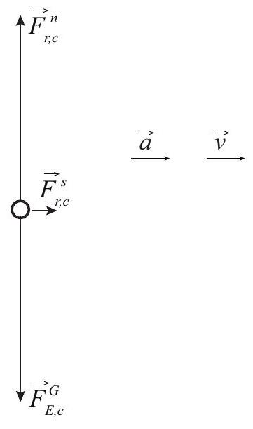
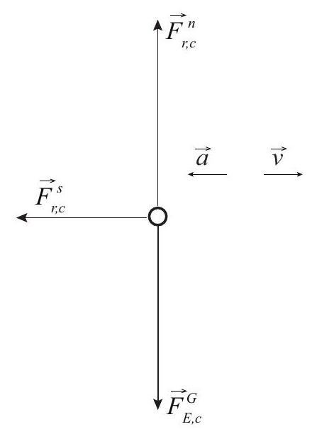

(sec-6.1)=
## 6.1 Force

As we saw in the previous chapter, when an interaction can be described by a potential energy function, it is possible to use this to get a full solution for the motion of the objects involved, at least in one dimension. In fact, energy-based methods (known as the Lagrangian and Hamiltonian methods) can be also generalized to deal with problems in three dimensions, and they also provide the most direct pathway to quantum mechanics and quantum field theory. It might be possible to write an advanced textbook on classical mechanics without mentioning the concept of force at all.

On the other hand, as you may have also gathered from the example I worked out at the end of the previous chapter (section 5.6.3), solving for the equation of motion using energy-based methods may involve somewhat advanced math, even in just one dimension, and it only gets more complicated in higher dimensions. There is also the question of how to deal with interactions that are not conservative (at the macroscopic level) and therefore cannot be described by a potential energy function of the macroscopic coordinates. And, finally, there are specialized problem areas (such as the entire field of statics) where you actually want to know the forces acting on the various objects involved. For all these reasons, the concept of force will be introduced here, and the next few chapters will illustrate how it may be used to solve a variety of elementary problems in classical mechanics. This does not mean, however, that we are going to forget about energy from now on: as we will see, energy methods will continue to provide useful shortcuts in a variety of situations as well.

We start, as usual, by considering two objects that form an isolated system, so they interact with each other and with nothing else. As we have seen, under these circumstances their individual momenta change, but the total momentum remains constant. We are going to take the rate of\
change of each object's momentum as a measure of the force exerted on it by the other object. Mathematically, this means we will write for the average force exerted by 1 on 2 over the time interval $\Delta t$ the expression

:::{math}
:label: eq-6.1
\left(F_{12}\right)_{a v}=\frac{\Delta p_{2}}{\Delta t}
:::

Please observe the notation we are going to use: the subscripts on the symbol $F$ are in the order \"by,on\", as in \"force exerted by\" (object identified by first subscript) \"on\" (object identified by second subscript). (The comma is more or less optional.)

You can also see from {numref}`Eq. %s <eq-6.1>` that the SI units of force are $\mathrm{kg} \cdot \mathrm{m} / \mathrm{s}^{2}$. This combination of units has the special name \"newton,\" and it's abbreviated by an uppercase N.

In the same way as above, we can write the average force exerted by object 2 on object 1 :

:::{math}
:label: eq-6.2
\left(F_{21}\right)_{a v}=\frac{\Delta p_{1}}{\Delta t}
:::

and we know, by conservation of momentum, that we must have $\Delta p_{1}=-\Delta p_{2}$, so we get our first important result,

:::{math}
:label: eq-6.3
\left(F_{12}\right)_{a v}=-\left(F_{21}\right)_{a v}
:::

That is, whenever two objects interact, they always exert equal (in magnitude) and opposite (in direction) forces on each other. This is most often called Newton's third law of motion, or informally \"the law of action and reaction.\"

We might as well now proceed along familiar lines and take the limit of Eqs. {eq}`eq-6.1` and {eq}`eq-6.2` above, as $\Delta t$ goes to zero, in order to introduce the more general concept of the instantaneous force (or just the \"force,\" without any further qualifiers). We then get

:::{math}
:label: eq-6.4
\begin{align*}
& F_{12}=\frac{d p_{2}}{d t} \\
& F_{21}=\frac{d p_{1}}{d t}
\end{align*}
:::

and, since {numref}`Eq. %s <eq-6.3>` should hold for a time interval of any size,

:::{math}
:label: eq-6.5
F_{12}=-F_{21}
:::

Now, under most circumstances the mass of, say, object 2 will not change during the interaction, so we can write

:::{math}
:label: eq-6.6
F_{12}=\frac{d}{d t}\left(m_{2} v_{2}\right)=m_{2} \frac{d v_{2}}{d t}=m_{2} a_{2}
:::

This is the result that we often refer to as \" $F=m a$ \", also known as Newton's second law of motion: the (net) force acting on an object is equal to the product of its inertial mass and its acceleration. The formulation in terms of the rate of change of momentum, as in Eqs. {eq}`eq-6.4`, is,\
however, somewhat more general, so it is technically preferred, even though this semester we will directly use $F=m a$ throughout.

If you want an example of a physical situation where $F=d p / d t$ is not equivalent to $F=m a$, consider a system where object 1 is a rocket, including its fuel, and \"object\" 2 are the gases ejected by the rocket. In this case, the mass of both \"objects\" is constantly changing, as the fuel is burned and more gases are ejected, and so the more general form $F=d p / d t$ needs to be used to calculate the force on the rocket (the thrust) at any given time.

At this point you may be wondering just what is Newton's first law? It is just the law of inertia: an object on which no force acts will stay at rest if it is initially at rest, or will move with constant velocity.

(sec-6.1.1)=
### 6.1.1 Forces and systems of particles

What if you had, say, three objects (let us make them \"particles,\" for simplicity), all interacting with one another? In physics we find that all our interactions are pairwise additive, that is, we can write the total potential energy of the system as the sum of the potential energies associated with each pair of particles separately. As we will see in a moment, this means that the corresponding forces are additive too, so that, for instance, the total force on particle 1 could be written as

:::{math}
:label: eq-6.7
F_{\text {all }, 1}=F_{21}+F_{31}=\frac{d p_{1}}{d t}
:::

Consider now the most general case of a system that has an arbitrary number of particles, and is not isolated; that is, there are other objects, outside the system, that exert forces on some or all of the particles that make up the system. We will call these external forces. The sum of all the forces (both internal and external) acting on all the particles will take a form like this:

:::{math}
:label: eq-6.8
F_{\text {total }}=F_{\text {ext }, 1}+F_{21}+F_{31}+\ldots+F_{e x t, 2}+F_{12}+F_{32}+\ldots+\ldots=\frac{d p_{1}}{d t}+\frac{d p_{2}}{d t}+\ldots
:::

where $F_{\text {ext }, 1}$ is the sum of all the external forces acting on particle 1, and so on. But now, observe that because of Newton's third law, {numref}`Eq. %s <eq-6.5>`, for every term of the form $F_{i j}$ appearing in the sum {eq}`eq-6.8`, there is a corresponding term $F_{j i}=-F_{i j}$ (you can see this explicitly already in {numref}`Eq. %s <eq-6.8>` with $F_{12}$ and $F_{21}$ ), so all those terms (which represent all the internal forces) are going to cancel out, and we will be left only with the sum of the external forces:

:::{math}
:label: eq-6.9
F_{e x t, 1}+F_{e x t, 2}+\ldots=\frac{d p_{1}}{d t}+\frac{d p_{2}}{d t}+\ldots
:::

The left-hand side of this equation is the sum of all the external forces; the right-hand side is the rate of change of the total momentum of the system. But the total momentum of the system is\
just equal to $M v_{c m}$ (compare {numref}`Eq. %s <eq-3.11>`, in the \"Momentum\" chapter). So we have

:::{math}
:label: eq-6.10
F_{\text {ext }, a l l}=\frac{d p_{\text {sys }}}{d t}=\frac{d}{d t}\left(M v_{c m}\right)
:::

This extends a previous result. We already knew that in the absence of external forces, the momentum of a system remained constant. Now we see that the system's momentum responds to the net external force as if the whole system was a single particle of mass equal to the total mass $M$ and moving at the center of mass velocity $v_{c m}$. In fact, assuming that $M$ does not change we can rewrite {numref}`Eq. %s <eq-6.10>` in the form

:::{math}
:label: eq-6.11
F_{\text {ext,all }}=M a_{c m}
:::

where $a_{c m}$ is the acceleration of the center of mass. This is the key result that allows us to treat extended objects as if they were particles: as far as the motion of the center of mass is concerned, all the internal forces cancel out (as we already saw in our study of collisions), and the point representing the center of mass responds to the sum of the external forces as if it were just a particle of mass $M$ subject to Newton's second law, $F=m a$. The result {eq}`eq-6.11` applies equally well to an extended solid object that we choose to mentally break up into a collection of particles, as to an actual collection of separate particles, or even to a collection of separate extended objects; in the latter case, we would just have each object's motion represented by the motion of its own center of mass.

Finally, note that all the results above generalize to more than one dimension. In fact, forces are vectors (just like velocity, acceleration and momentum), and all of the above equations, in 3 dimensions, apply separately to each vector component. In one dimension, we just need to be aware of the sign of the forces, whenever we add several of them together.

(sec-6.2)=
## 6.2 Forces and potential energy

In the last chapter I mentioned a special case that we encounter often, in which a lighter object is interacting with a much more massive one, so that the massive one essentially does not move at all as a result of the interaction. Note that this does not contradict Newton's 3rd law, {numref}`Eq. %s <eq-6.5>`: the forces the two objects exert on each other are the same in magnitude, but the acceleration of each object is inversely proportional to its mass, so $F_{12}=-F_{21}$ implies

:::{math}
:label: eq-6.12
m_{2} a_{2}=-m_{1} a_{1}
:::

and so if, for instance, $m_{2} \gg m_{1}$, we get $\left|a_{2}\right|=\left|a_{1}\right| m_{1} / m_{2} \ll\left|a_{1}\right|$. In words, the more massive object is less responsive than the less massive one to a force of the same magnitude. This is just how we came up with the concept of inertial mass in the first place!

Anyway, you'll recall that in this situation I could just write the potential energy function of the whole system as a function of only the lighter object's coordinate, $U(x)$. I am going to use this\
simplified setup to show you a very interesting relationship between potential energies and forces. Suppose this is a closed system in which no dissipation of energy is taking place. Then the total mechanical energy is a constant:

:::{math}
:label: eq-6.13
E_{\text {mech }}=\frac{1}{2} m v^{2}+U(x)=\text { constant }
:::

(Here, $m$ is the mass of the lighter object, and $v$ its velocity; the more massive object does not contribute to the total kinetic energy, since it does not move!)

As the lighter object moves, both $x$ and $v$ in {numref}`Eq. %s <eq-6.13>` change with time (recall, for instance, our study of \"energy landscapes\" in the previous chapter, {ref}`section 5.1.2 <sec-5.1.2>`). So I can take the derivative of {numref}`Eq. %s <eq-6.13>` with respect to time, using the chain rule, and noting that, since the whole thing is a constant, the total value of the derivative must be zero:

:::{math}
:label: eq-6.14
\begin{align*}
0 & =\frac{d}{d t}\left(\frac{1}{2} m(v(t))^{2}+U(x(t))\right) \\
& =m v(t) \frac{d v}{d t}+\frac{d U}{d x} \frac{d x}{d t}
\end{align*}
:::

But note that $d x / d t$ is just the same as $v(t)$. So I can cancel that on both terms, and then I am left with

:::{math}
:label: eq-6.15
m \frac{d v}{d t}=-\frac{d U}{d x}
:::

But $d v / d t$ is just the acceleration $a$, and $F=m a$. So this tells me that

:::{math}
:label: eq-6.16
F=-\frac{d U}{d x}
:::

and this is how you can always get the force from a potential energy function.\
Let us check it right away for the force of gravity: we know that $U^{G}=m g y$, so

:::{math}
:label: eq-6.17
F^{G}=-\frac{d U^{G}}{d y}=-\frac{d}{d y}(m g y)=-m g
:::

Is this right? It seems to be! Recall all objects fall with the same acceleration, $-g$ (assuming the upwards direction to be positive), so if $F=m a$, we must have $F^{G}=-m g$. So the gravitational force exerted by the earth on any object (which I would denote in full by $F_{E, o}^{G}$ ) is proportional to the inertial mass of the object - in fact, it is what we call the object's weight - but since to get the acceleration you have to divide the force by the inertial mass, that cancels out, and $a$ ends up being the same for all objects, regardless of how heavy they are.

Now that we have this result under our belt, we can move on to the slightly more challenging case of two objects of comparable masses interacting through a potential energy function that must be, as I pointed out in the previous chapter, a function of just the relative coordinate $x_{12}=x_{2}-x_{!}$.

I claim that in that case you can again get the force on object $1, F_{21}$, by taking the derivative of $U\left(x_{2}-x_{1}\right)$ with respect to $x_{1}$ (leaving $x_{2}$ alone), and reciprocally, you get $F_{12}$ by taking the derivative of $U\left(x_{2}-x_{1}\right)$ with respect to $x_{2}$. Here is how it works, again using the chain rule:

:::{math}
:label: eq-6.18
\begin{align*}
& F_{21}=-\frac{d}{d x_{1}} U\left(x_{12}\right)=-\frac{d U}{d x_{12}} \frac{d}{d x_{1}}\left(x_{2}-x_{1}\right)=\frac{d U}{d x_{12}} \\
& F_{12}=-\frac{d}{d x_{2}} U\left(x_{12}\right)=-\frac{d U}{d x_{12}} \frac{d}{d x_{2}}\left(x_{2}-x_{1}\right)=-\frac{d U}{d x_{12}}
\end{align*}
:::

and you can see that this automatically ensures that $F_{21}=-F_{12}$. In fact, it was in order to ensure this that I required that $U$ should depend only on the difference of $x_{1}$ and $x_{2}$, rather than on each one separately. Since we got the condition $F_{21}=-F_{12}$ originally from conservation of momentum, you can see now how the two things are related ${ }^{1}$.

The only example we have seen so far of this kind of potential energy function was in last chapter's {ref}`Section 5.1.1 <sec-5.1.1>`, for two carts interacting through an \"ideal\" spring. I told you there that the potential energy of the system could be written as $\frac{1}{2} k\left(x_{2}-x_{1}-x_{0}\right)^{2}$, where $k$ was the \"spring constant\" and $x_{0}$ the relaxed length of the spring. If you apply Eqs. {eq}`eq-6.18` to this function, you will find that the force exerted (through the spring) by cart 2 on cart 1 is

:::{math}
:label: eq-6.19
F_{21}=k\left(x_{2}-x_{1}-x_{0}\right)
:::

Note that this force will be negative under the assumptions we made last chapter, namely, that cart 2 is on the right, cart 1 on the left, and the spring is compressed, so that $x_{2}-x_{1}<x_{0}$. Similarly,

:::{math}
:label: eq-6.20
F_{12}=-k\left(x_{2}-x_{1}-x_{0}\right)
:::

and this one, as it should, is positive.\
The results {eq}`eq-6.19` and {eq}`eq-6.20` basically tell you what we mean by an \"ideal spring\" in physics: it is a spring that pulls (if stretched) or pushes (if compressed) with a force that is proportional to the change from its equilibrium length. Thus, if you fasten one end of the spring at $x=0$, and stretch it or compress it so that the other end is at $x$, the spring will respond by exerting a force

:::{math}
:label: eq-6.21
F^{s p r}=-k\left(x-x_{0}\right)
:::

As you can see, this is negative if $x>x_{0}>0$ (spring stretched, pulling force) and positive if $x<x_{0}$ (spring compressed, pushing force). In fact, the spring exerts an equal (in magnitude) and opposite (in direction) force at the other end (the one attached to the wall), so {numref}`Eq. %s <eq-6.21>` only gives the correct sign of the force at the end that is denoted by the coordinate value $x$. Equations {eq}`eq-6.19` and {eq}`eq-6.20` are a bit clearer in this respect: {numref}`Eq. %s <eq-6.19>` gives the correct sign of the force at point $x_{1}$, and {numref}`Eq. %s <eq-6.20>` the correct sign at point $x_{2}$.

{numref}`Figure %s <fig-6.1>` shows, in black, all the forces exerted by a spring with one fixed end, according as to whether it is relaxed, compressed, or stretched. I have assumed that it is pushed or pulled by a hand (not shown) at the \"free\" end, hence the subscript \" $h$ \", whereas the subscript \" $w$ \" stands for \"wall.\" Note that the wall and the hand, in turn, exert equal and opposite forces on the spring, shown in red in the figure.

:::{figure} ../images/2024_09_14_9969b06773f10b6936e8g-137.jpg
:label: fig-6.1
:alt: Forces (in black) exerted by a spring with one end attached to a wall and the other pushed or pulled by a hand (not shown). In every case the force is proportional to the change in the length of the spring from its equilibrium, or relaxed, value, shown here as x0. For this figure I have set the proportionality constant k=1. The forces exerted on the spring, by the wall and by the hand, are shown in red.
Forces (in black) exerted by a spring with one end attached to a wall and the other pushed or pulled by a hand (not shown). In every case the force is proportional to the change in the length of the spring from its equilibrium, or relaxed, value, shown here as $x_{0}$. For this figure I have set the proportionality constant $k=1$. The forces exerted on the spring, by the wall and by the hand, are shown in red.
:::

{numref}`Equation %s <eq-6.21>` is generally referred to as Hooke's law, after the British scientist Robert Hooke (a contemporary of Newton). Of course, it is not a \"law\" at all, merely a useful approximation to the way most springs behave as long as you do not stretch them or compress them too much ${ }^{2}$.

A note on the way the forces have been labeled in {numref}`Figure %s <fig-6.1>`. I have used the generic symbol \" $c$ \", which stands for \"contact,\" to indicate the type of force exerted by the wall and the hand on the spring. In fact, since each pair of forces (by the hand on the spring and by the spring on the hand, for instance), at the point of contact, arises from one and the same interaction, I should have used the same \"type\" notation for both, but it is widespread practice to use a superscript like \"spr\" to denote a force whose origin is, ultimately, a spring's elasticity. This does not change the fact that the spring force, at the point where it is applied, is indeed a contact force.

So, next, a word on \"contact\" forces. Basically, what we mean by that is forces that arise where objects \"touch,\" and we mean this by opposition to what are called instead \"field\" forces (such as gravity, or magnetic or electrostatic forces) which \"act at a distance.\" The distinction is actually

only meaningful at the macroscopic level, since at the microscopic level objects never really touch, and all forces are field forces, it is just that some are \"long range\" and some are \"short range.\" For our purposes, really, the word \"contact\" will just be a convenient, catch-all sort of moniker that we will use to label the force vectors when nothing more specific will do.

(sec-6.3)=
## 6.3 Forces not derived from a potential energy

As we have seen in the previous section, for interactions that are associated with a potential energy, we are always able to determine the forces from the potential energy by simple differentiation. This means that we do not have to rely exclusively on an equation of the type $F=m a$, like {eq}`eq-6.4` or {eq}`eq-6.6`, to infer the value of a force from the observed acceleration; rather, we can work in reverse, and predict the value of the acceleration (and from it all the subsequent motion) from our knowledge of the force.

I have said before that, on a microscopic level, all the interactions can be derived from potential energies, yet at the macroscopic level this is not generally true: we have many kinds of interactions for which the associated \"stored\" or converted energy cannot, in general, be written as a function of the macroscopic position variables for the objects making up the system (by which I mean, typically, the positions of their centers of mass). So what do we do in those cases?

The forces of this type with which we shall deal this semester actually fall into two different categories: the ones that do not dissipate energy, and that we could, in fact, associate with a potential energy if we wanted to ${ }^{3}$, and the ones that definitely dissipate energy and need special handling. The former category includes the normal force, tension, and the static friction force; the second category includes the force of kinetic (or sliding) friction, and air resistance. A brief description of all these forces, and the methods to deal with them, follows.

(sec-6.3.1)=
### 6.3.1 Tensions

Tension is the force exerted by a stretched spring, and, similarly, by objects such as cables, ropes, and strings in response to a stretching force (or load) applied to them. It is ultimately an elastic force, so, as I said above, we could in principle describe it by a potential energy, but in practice cables, strings and the like are so stiff that it is often all right to neglect their change in length altogether and assume that no potential energy is, in fact, stored in them. The price we pay for this simplification (and it is a simplification) is that we are left without an independent way to determine the value of the tension in any specific case; we just have to infer it from the acceleration

of the object on which it acts (since it is a reaction force, it can assume any value as required to adjust to any circumstance - up to the point where the rope snaps, anyway).

Thus, for instance, in the picture below, which shows two blocks connected by a rope over a pulley, the tension force exerted by the rope on block 1 must equal $m_{1} a_{1}$, where $a_{1}$ is the acceleration of that block, provided there are no other horizontal forces (such as friction) acting on it. For the hanging block, on the other hand, the net force is the sum of the tension on the other end of the rope (pulling up) and gravity, pulling down. If we choose the upward direction as positive, we can write Newton's second law for the second block as

:::{math}
:label: eq-6.22
F_{r, 2}^{t}-m_{2} g=m_{2} a_{2}
:::

Two things need to be realized now. First, if the rope is inextensible, both blocks travel the same distance in the same time, so their speeds are always the same, and hence the magnitude of their accelerations will always be the same as well; only the sign may be different depending on which direction we choose as positive. If we take to the right to be positive for the horizontal motion, we will have $a_{2}=-a_{1}$. I'm just going to call $a_{1}=a$, so then $a_{2}=-a$.

:::{figure} ../images/2024_09_14_9969b06773f10b6936e8g-139.jpg
:label: fig-6.2
:alt: Two blocks joined by a massless, inextensible strength threaded over a massless pulley. An optional friction force (in red, where f r could be either s or k ) is shown for use later, in the discussion in subsection 3.3. In this subsection, however, it is assumed to be zero.
Two blocks joined by a massless, inextensible strength threaded over a massless pulley. An optional friction force (in red, where $f r$ could be either $s$ or $k$ ) is shown for use later, in the discussion in subsection 3.3. In this subsection, however, it is assumed to be zero.
:::

The second thing to note is that, if the rope's mass is negligible, it will, like an ideal spring, pull with a force with the same magnitude on both ends. With our specific choices (up and to the right is positive), we then have $F_{r, 2}^{t}=F_{r, 1}^{t}$, and I'm just going to call this quantity $F^{t}$. All this yields,\
then, the following two equations:

:::{math}
:label: eq-6.23
\begin{align*}
F^{t} & =m_{1} a \\
F^{t}-m_{2} g & =-m_{2} a
\end{align*}
:::

The system {eq}`eq-6.23` can be easily solved to get

:::{math}
:label: eq-6.24
\begin{align*}
a & =\frac{m_{2} g}{m_{1}+m_{2}} \\
F^{t} & =\frac{m_{1} m_{2} g}{m_{1}+m_{2}}
\end{align*}
:::

(sec-6.3.2)=
### 6.3.2 Normal forces

Normal force is the reaction force with which a surface pushes back when it is being pushed on. Again, this works very much like an extremely stiff spring, this time under compression instead of tension. And, again, we will eschew the potential energy treatment by assuming that the surface's actual displacement is entirely negligible, and we will just calculate the value of $F^{n}$ as whatever is needed in order to make Newton's second law work. Note that this force will always be perpendicular to the surface, by definition (the word \"normal\" means \"perpendicular\" here); the task of dealing with a sideways push on the surface will be delegated to the static friction force, to be covered next.

If I am just standing on the floor and not falling through it, the net vertical force acting on me must be zero. The force of gravity on me is $m g$ downwards, and so the upwards normal force must match this value, so for this situation $F^{n}=m g$. But don't get too attached to the notion that the normal force must always be equal to $m g$, since this will often not be the case. Imagine, for instance, a person standing inside an elevator at the time it is accelerating upwards. With the upwards direction as positive, Newton's second law for the person reads

:::{math}
:label: eq-6.25
F^{n}-m g=m a
:::

and therefore for this situation

:::{math}
:label: eq-6.26
F^{n}=m g+m a
:::

If you were weighing yourself on a bathroom scale in the elevator, this is the upwards force that the bathroom scale would have to exert on you, and it would do that by compressing a spring inside, and it would record the \"extra\" compression (beyond that required by your actual weight, mg ) as extra weight. Conversely, if the elevator were accelerating downward, the scale would record you as being lighter. In the extreme case in which the cable of the elevator broke and you, the elevator and the scale ended up (briefly, before the emergency brake caught on) in free fall, you would all be falling with the same acceleration, you would not be pushing down on the scale at all, and its normal force as well as your recorded weight would be zero. This is ultimately the reason\
for the apparent weightlessness experienced by the astronauts in the space station, where the force of gravity is, in fact, not very much smaller than on the surface of the earth. (We will return to this effect after we have a good grip on two-dimensional, and in particular circular, motion.)

(sec-6.3.3)=
### 6.3.3 Static and kinetic friction forces

The static friction force is a force that prevents two surfaces in contact from slipping relative to each other. It is an extremely useful force, since we would not be able to drive a car, or ride a bicycle, or even walk, without it - as we know from experience, if we have ever tried to do any of those things on a low-friction surface (such as a sheet of ice).

The science behind friction (known technically as tribology) is actually not very simple at all, and it is of great current interest for many reasons-whether the ultimate goal is to develop ways to reduce friction or to increase it. On an elementary level, we are all aware of the fact that even a surface that looks smooth on a macroscopic scale will actually exhibit irregularities, such as ridges and valleys, under a microscope. It makes sense, then, that when two such surfaces are pressed together, the bumps on one of them will hit, and be held in place by, the bumps on the other one, and that will prevent sliding until and unless a sufficient force is applied to temporarily \"flatten\" the bumps enough to allow the thing to move ${ }^{4}$.

As long as this does not happen, that is, as long as the surfaces do not slide relative to each other, we say we are dealing with the static friction force, which is, at least approximately, an elastic force that does not dissipate energy: the small distortion of the \"bumps\" on the surfaces that takes place when you push on them typically happens slowly enough, and is small enough, to be reversible, so that when you stop pushing the two surfaces just go back to their initial state. This is no longer the case once the surfaces start sliding relative to each other. At that point the character of the friction force changes, and we have to deal with the sliding, or kinetic friction force, as I will explain below.

The static friction force is also, like tension and the normal force, a reaction force that will adjust itself, within limits, to take any value required to prevent slippage in a given circumstance. Hence, its actual value in a particular situation cannot really be ascertained until the other relevant forcesthe other forces pushing or pulling on the object-are known.

For instance, for the system in {numref}`Figure %s <fig-6.2>`, imagine there is a force of static friction between block 1 and the surface on which it rests, sufficiently large to keep it from sliding altogether. How large

does this have to be? If there is no acceleration $(a=0)$, the equivalent of system {eq}`eq-6.23` will be\
\$\$

:::{math}
:label: eq-6.27
\begin{align*}
F_{s, 1}^{s}+F^{t} & =0 \\
F^{t}-m_{2} g & =0
\end{align*}
:::

where $F_{s, 1}^{s}$ is the force of static friction exerted by the surface on block 1 , and we are going to let the math tell us what sign it is supposed to have. Solving the system {eq}`eq-6.27` we just get the condition

:::{math}
:label: eq-6.28
F_{s, 1}^{s}=-m_{2} g
:::

so this is how large $F_{s, 1}^{s}$ has to be in order to keep the whole system from moving in this case. There is an empirical formula that tells us approximately how large the force of static friction can get in a given situation. The idea behind it is that, microscopically, the surfaces are in contact only near the top of their respective ridges. If you press them together harder, some of the ridges get flattened and the effective contact area increases; this in turn makes the surfaces more resistant to slippage. A direct measure of how strongly the two surfaces press against each other is, actually, just the normal force they exert on each other. So, in general, we expect the maximum force that static friction will be able to exert to be proportional to the normal force between the surfaces:

:::{math}
:label: eq-6.29
\left|F_{s 1, s 2}^{s}\right|_{\max }=\mu_{s}\left|F_{s 1, s 2}^{n}\right|
:::

where $s 1$ and $s 2$ just mean \"surface 1 \" and \"surface 2,\" respectively, and the number $\mu_{s}$ is known as the coefficient of static friction: it is a tabulated quantity that is determined experimentally, by testing the slippage of different surfaces against each other under different loads.

In our example, the normal force exerted by the surface on block 1 has to be equal to $m_{1} g$, since there is no vertical acceleration for that block, and so the maximum value that $F^{s}$ may have in this case is $\mu_{s} m_{1} g$, whatever $\mu_{s}$ might happen to be. In fact, this setup would give us a way to determine $\mu_{s}$ for these two surfaces: start with a small value of $m_{2}$, and gradually increase it until the system starts moving. At that point we will know that $m_{2} g$ has just exceeded the maximum possible value of $\left|F_{12}^{s}\right|$, namely, $\mu_{s} m_{1} g$, and so $\mu_{s}=\left(m_{2}\right)_{\max } / m_{1}$, where $\left(m_{2}\right)_{\max }$ is the largest mass we can hang before the system starts moving.

By contrast with all of the above, the kinetic friction force, which always acts so as to oppose the relative motion of the two surfaces when they are actually slipping, is not elastic, it is definitely dissipative, and, most interestingly, it is also not much of a reactive force, meaning that its value can be approximately predicted for any given circumstance, and does not depend much on things such as how fast the surfaces are actually moving relative to each other. It does depend on how hard the surfaces are pressing against each other, as quantified by the normal force, and on another tabulated quantity known as the coefficient of kinetic friction:

:::{math}
:label: eq-6.30
\left|F_{s 1, s 2}^{k}\right|=\mu_{k}\left|F_{s 1, s 2}^{n}\right|
:::

Note that, unlike for static friction, this is not the maximum possible value of $\left|F^{k}\right|$, but its actual value; so if we know $F^{n}$ (and $\mu_{k}$ ) we know $F^{k}$ without having to solve any other equations (its sign does depend on the direction of motion, of course). The coefficient $\mu_{k}$ is typically a little smaller than $\mu_{s}$, reflecting the fact that once you get something you have been pushing on to move, keeping it in motion with constant velocity usually does not require the same amount of force.

To finish off with our example in Figure 2, suppose the system is moving, and there is a kinetic friction force $F_{s, 1}^{k}$ between block 1 and the surface. The equations {eq}`eq-6.23` then have to be changed to

:::{math}
:label: eq-6.31
\begin{align*}
F^{t}-\mu_{k} m_{1} g & =m_{1} a \\
F^{t}-m_{2} g & =-m_{2} a
\end{align*}
:::

and the solution now is

:::{math}
:label: eq-6.32
\begin{align*}
a & =\frac{m_{2}-\mu_{k} m_{1}}{m_{1}+m_{2}} g \\
F^{t} & =\frac{m_{1} m_{2}\left(1+\mu_{k}\right)}{m_{1}+m_{2}} g
\end{align*}
:::

You may ask, why does kinetic friction dissipate energy? A qualitative answer is that, as the surfaces slide past each other, their small (sometimes microscopic) ridges are constantly \"bumping\" into each other; so you have lots of microscopic collisions happening all the time, and they cannot all be perfectly elastic. So mechanical energy is being \"lost.\" In fact, it is primarily being converted to thermal energy, as you can verify experimentally: this is why you rub your hands together to get warm, for instance. More dramatically, this is how some people (those who really know what they are doing!) can actually start a fire by rubbing sticks together.

(sec-6.3.4)=
### 6.3.4 Air resistance

Air resistance is an instance of fluid resistance or drag, a force that opposes the motion of an object through a fluid. Microscopically, you can think of it as being due to the constant collisions of the object with the air molecules, as it cleaves its way through the air. As a result of these collisions, some of its momentum is transferred to the air, as well as some of its kinetic energy, which ends up as thermal energy (as in the case of kinetic friction discussed above). The very high temperatures that air resistance can generate can be seen, in a particularly dramatic way, on the re-entry of spacecraft into the atmosphere.

Unlike kinetic friction between solid surfaces, the fluid drag force does depend on the velocity of the object (relative to the fluid), as well as on a number of other factors having to do with the object's shape and the fluid's density and viscosity. Very roughly speaking, for low velocities the\
drag force is proportional to the object's speed, whereas for high velocities it is proportional to the square of the speed.

In principle, one can use the appropriate drag formula together with Newton's second law to calculate the effect of air resistance on a simple object thrown or dropped; in practice, this requires a somewhat more advanced math than we will be using this course, and the formulas themselves are complicated, so I will not introduce them here.

One aspect of air resistance that deserves to be mentioned is what is known as \"terminal velocity\" (which I already introduced briefly in {ref}`Section 2.3 <sec-2.3>`). Since air resistance increases with speed, if you drop an object from a sufficiently great height, the upwards drag force on it will increase as it accelerates, until at some point it will become as large as the downward force of gravity. At that point, the net force on the object is zero, so it stops accelerating, and from that point on it continues to fall with constant velocity. When the Greek philosopher Aristotle was trying to figure out the motion of falling bodies, he reasoned that, since air was just another fluid, he could slow down the fall (in order to study it better) without changing the physics by dropping objects in liquids instead of air. The problem with this approach, though, is that terminal velocity is reached much faster in a liquid than in air, so Aristotle missed entirely the early stage of approximately constant acceleration, and concluded (wrongly) that the natural way all objects fell was with constant velocity. It took almost two thousand years until Galileo disproved that notion by coming up with a better method to slow down the falling motion-namely, by using inclined planes.

(sec-6.4)=
## 6.4 Free-body diagrams

As {numref}`Figure %s <fig-6.1>` shows, trying to draw every single force acting on every single object can very quickly become pretty messy. And anyway, this is not usually what we need: what we need is to separate cleanly all the forces acting on any given object, one object at a time, so we can apply Newton's second law, $F_{n e t}=m a$, to each object individually.

In order to accomplish this, we use what are known as free-body diagrams. In a free-body diagram, a potentially very complicated object is replaced symbolically by a dot or a small circle, and all the forces acting on the object are drawn (approximately to scale and properly labeled) as acting on the dot. Regardless of whether a force is a pulling or pushing force, the convention is to always draw it as a vector that originates at the dot. If the system is accelerating, it is also a good idea to indicate the acceleration's direction also somewhere on the diagram.

The figure below (next page) shows, as an example, a free-body diagram for block 1 in {numref}`Figure %s <fig-6.2>`, in the presence of both a nonzero acceleration and a kinetic friction force. The diagram includes all the forces, even gravity and the normal force, which were left out of the picture in {numref}`Figure %s <fig-6.2>`.

:::{figure} ../images/2024_09_14_9969b06773f10b6936e8g-145.jpg
:label: fig-6.3
:alt: Free-body diagram for block 1 in, with the friction force adjusted so as to be compatible with a nonzero acceleration to the right.
Free-body diagram for block 1 in {numref}`Figure %s <fig-6.2>`, with the friction force adjusted so as to be compatible with a nonzero acceleration to the right.
:::

Note that I have drawn $F^{n}$ and the force of gravity $F_{E, 1}^{G}$ as having the same magnitude, since there is no vertical acceleration for that block. If I know the value of $\mu_{k}$, I should also try to draw $F^{k}=\mu_{k} F^{n}$ approximately to scale with the other two forces. Then, since I know that there is an acceleration to the right, I need to draw $F^{t}$ greater than $F^{k}$, since the net force on the block must be to the right as well. And, if I were drawing a free-body diagram for block 2, I would have to make sure that I drew its weight, $F_{E, 2}^{G}$, as being greater in magnitude than $F^{t}$, since the net force on that block needs to be downwards.

(sec-6.5)=
## 6.5 In summary

1.  Whenever two objects interact, they exert forces on each other that are equal in magnitude and opposite in direction (Newton's 3rd law).

2.  Forces are vectors, and they are additive. The total (or net) force on an object or system is equal to the rate of change of its total momentum (Newton's 2nd law). If the system's mass is constant, this can be written as $F_{\text {ext,all }}=M a_{c m}$, where $M$ is the system's total mass and $a_{c m}$ is the acceleration of its center of mass. Only the external forces contribute to this equation; the internal forces cancel out because of point 1 above.

3.  For any interaction that can be derived from a potential energy function $U\left(x_{1}-x_{2}\right)$, the force exerted by object 2 on object 1 is equal to $-d U / d x_{1}$ (where the derivative is calculated treating $x_{2}$ as a constant), and vice-versa.

4.  The force of gravity on an object near the surface of the earth is known as the object's weight, and it is equal (in magnitude) to $m g$, where $m$ is the object's inertial mass.

5.  An ideal spring whose relaxed length is $x_{0}$, when stretched or compressed to a length $x$, exerts a pulling or pushing force, respectively, at both ends, with magnitude $k\left|x-x_{0}\right|$, where $k$ is called the spring constant.

6.  When dealing with macroscopic objects we introduce several \"constraint\" forces whose values need to be determined from the accelerations through Newton's second law: the tension $F^{t}$ in ropes, strings or cables; the normal force $F^{n}$ exerted by a surface in response to applied pressure; and the static friction force $F^{s}$ that prevents surfaces from slipping past each other.

7.  The maximum possible value of the static friction force is $\mu_{s}\left|F^{n}\right|$, where $\mu_{s}$ is the coefficient of static friction.

8.  The force of sliding or kinetic friction, $F^{k}$, appears when two surfaces are sliding past each other. Its magnitude is $\mu_{k}\left|F^{n}\right|$ ( $\mu_{k}$ is the coefficient of static friction), and its sign is such as to oppose the sliding motion. Unlike the forces in 6 above, it is a dissipative force.

9.  A free-body diagram is a way to depict all (and only) the forces acting on an object. The object should be represented as a small circle or dot. The forces should all be drawn as vectors originating on the dot, with their directions correctly shown and their lengths approximately to scale. The acceleration of the object should also be indicated elsewhere in the picture. The forces should be labeled like this: $F_{b y, o n}^{t y p e}$.

(sec-6.6)=
## 6.6 Examples

(sec-6.6.1)=
### 6.6.1 Dropping an object on a weighing scale

(Short version) Suppose you drop a $5-\mathrm{kg}$ object on a spring scale from a height of 1 m . If the spring constant is $k=20,000 \mathrm{~N} / \mathrm{m}$, what will the scale read?\
(Long version) OK, let's break that up into parts. Suppose that a spring scale is just a platform (of negligible mass) sitting on top of a spring. If you put an object of mass $m$ on top of it, the spring compresses so that (in equilibrium) it exerts an upwards force that matches that of gravity.\
(a) If the spring constant is $k$ and the object's mass is $m$ and the whole system is at rest, what distance is the spring compressed?\
(b) If you drop the object from a height $h$, what is the (instantaneous) maximum compression of the spring as the object is brought to a momentary rest? (This part is an energy problem! Assume that $h$ is much greater than the actual compression of the spring, so you can neglect that when calculating the change in gravitational potential energy.)\
(c) What mass would give you that same compression, if you were to place it gently on the scale, and wait until all the oscillations died down?\
(d) OK, now answer the question at the top!

(ch-6-solution)=
### Solution

\(a\) The forces acting on the object sitting at rest on the platform are the force of gravity, $F_{E, o}^{G}=$ $-m g$, and the normal force due to the platform, $F_{p, o}^{n}$. This last force is equal, in magnitude, to the force exerted on the platform by the spring (it has to be, because the platform itself is being pushed down by a force $F_{o, p}^{n}=-F_{p, o}^{n}$, and this has to be balanced by the spring force). This means we can, for practical purposes, pretend the platform is not there and just set the upwards force on the object equal to the spring force, $F_{s, p}^{s p r}=-k\left(x-x_{0}\right)$. So, Newton's second law gives

:::{math}
:label: eq-6.33
F_{n e t}=F_{E, o}^{G}+F_{s, p}^{s p r}=m a=0
:::

For a compressed spring, $x-x_{0}$ is negative, and we can just let $d=x_{0}-x$ be the distance the spring is compressed. Then {numref}`Eq. %s <eq-6.33>` gives

$$-m g+k d=0$$

so

:::{math}
:label: eq-6.34
d=m g / k
:::

when you just set an object on the scale and let it come to rest.\
(b) This part, as the problem says, is a conservation of energy situation. The system formed by the spring, the object and the earth starts out with some gravitational potential energy, and ends\
up, with the object momentarily at rest, with only spring potential energy:

:::{math}
:label: eq-6.35
\begin{align*}
U_{i}^{G}+U_{i}^{s p r} & =U_{f}^{G}+U_{f}^{s p r} \\
m g y_{i}+0 & =m g y_{f}+\frac{1}{2} k d_{\max }^{2}
\end{align*}
:::

where I have used the subscript \"max\" on the compression distance to distinguish it from what I calculated in part (a) (this kind of makes sense also because the scale is going to swing up and down, and we want only the maximum compression, which will give us the largest reading). The problem said to ignore the compression when calculating the change in $U^{G}$, meaning that, if we measure height from the top of the scale, $y_{i}=h$ and $y_{f}=0$. Then, solving {numref}`Eq. %s <eq-6.35>` for $d_{\text {max }}$, we get

:::{math}
:label: eq-6.36
d_{\max }=\sqrt{\frac{2 m g h}{k}}
:::

\(c\) For this part, let us rewrite {numref}`Eq. %s <eq-6.34>` as $m_{e q}=k d_{\max } / g$, where $m_{e q}$ is the \"equivalent\" mass that you would have to place on the scale (gently) to get the same reading as in part (b). Using then {numref}`Eq. %s <eq-6.36>`,

:::{math}
:label: eq-6.37
m_{e q}=\frac{k}{g} \sqrt{\frac{2 m g h}{k}}=\sqrt{\frac{2 m k h}{g}}
:::

\(d\) Now we can substitute the values given: $m=5 \mathrm{~kg}, h=1 \mathrm{~m}, k=20,000 \mathrm{~N} / \mathrm{m}$. The result is $m_{\text {eq }}=143 \mathrm{~kg}$.\
(Note: if you found the purely algebraic treatment above confusing, try substituting numerical values in Eqs. {eq}`eq-6.34` and {eq}`eq-6.36`. The first equation tells you that if you just place the $5-\mathrm{kg}$ mass on the scale it will compress a distance $d=2.45 \mathrm{~mm}$. The second tells you that if you drop it it will compress the spring a distance $d_{\max }=70 \mathrm{~mm}$, about 28.6 times more, which corresponds to an \"equivalent mass\" 28.6 times greater than 5 kg , which is to say, 143 kg . Note also that 143 kg is an equivalent weight of 309 pounds, so if you want to try this on a bathroom scale I'd advise you to use smaller weights and drop them from a much smaller height!)

(sec-6.6.2)=
### 6.6.2 Speeding up and slowing down

\(a\) A $1400-\mathrm{kg}$ car, starting from rest, accelerates to a speed of 30 mph in 10 s . What is the force on the car (assumed constant) over this period of time?\
(b) Where does this force comes from? That is, what is the (external) object that exerts this force on the car, and what is the nature of this force?\
(c) Draw a free-body diagram for the car. Indicate the direction of motion, and the direction of the acceleration. (d) Now assume that the driver, traveling at 30 mph , sees a red light ahead and\
pushes on the brake pedal. Assume that the coefficient of static friction between the tires and the road is $\mu_{s}=0.7$, and that the wheels don't \"lock\": that is to say, they continue rolling without slipping on the road as they slow down. What is the car's minimum stopping distance?\
(e) Draw a free-body diagram of the car for the situation in (d). Again indicate the direction of motion, and the direction of the acceleration. (f) Now assume that the driver again wants to stop as in part (c), but he presses on the brakes too hard, so the wheels lock, and, moreover, the road is wet, and the coefficient of kinetic friction is only $\mu_{k}=0.2$. What is the distance the car travels now before coming to a stop?

(ch-6-solution-1)=
### Solution

\(a\) First, let us convert 30 mph to meters per second. There are 1,609 meters to a mile, and 3,600 seconds to an hour, so $30 \mathrm{mph}=10 \times 1609 / 3600 \mathrm{~m} / \mathrm{s}=13.4 \mathrm{~m} / \mathrm{s}$.

Next, for constant acceleration, we can use {numref}`Eq. %s <eq-2.4>`: $\Delta v=a \Delta t$. Solving for $a$,

$$a=\frac{\Delta v}{\Delta t}=\frac{13.4 \mathrm{~m} / \mathrm{s}}{10 \mathrm{~s}}=1.34 \frac{\mathrm{m}}{\mathrm{s}^{2}}$$

Finally, since $F=m a$, we have

$$F=m a=1400 \mathrm{~kg} \times 1.34 \frac{\mathrm{m}}{\mathrm{s}^{2}}=1880 \mathrm{~N}$$

\(b\) The force must be provided by the road, which is the only thing external to the car that is in contact with it. The force is, in fact, the force of static friction between the car and the tires. As explained in the chapter, this is a reaction force (the tires push on the road, and the road pushes back). It is static friction because the tires are not slipping relative to the road. In fact, we will see in {ref}`Chapter 9 <ch-9>` that the point of the tire in contact with the road has an instantaneous velocity of zero (see {numref}`Figure %s <fig-9.8>`).\
(c) This is the free-body diagram. Note the force of static friction pointing forward, in the direction of the acceleration. The forces have been drawn to scale.

(d) This is the opposite of part (a): the driver now relies on the force of static friction to slow down the car. The shortest stopping distance will correspond to the largest (in magnitude) acceleration, as per our old friend, {numref}`Eq. %s <eq-2.10>`:

:::{math}
:label: eq-6.38
v_{f}^{2}-v_{i}^{2}=2 a \Delta x
:::

In turn, the largest acceleration will correspond to the largest force. As explained in the chapter, the static friction force cannot exceed $\mu_{s} F^{n}$ ({numref}`Eq. %s <eq-6.29>`). So, we have

$$F_{\max }^{s}=\mu_{s} F^{n}=\mu_{s} m g$$

since, in this case, we expect the normal force to be equal to the force of gravity. Then

$$\left|a_{\max }\right|=\frac{F_{\max }^{s}}{m}=\frac{\mu_{s} m g}{m}=\mu_{s} g$$

We can substitute this into {numref}`Eq. %s <eq-6.38>` with a negative sign, since the acceleration acts in the opposite direction to the motion (and we are implicitly taking the direction of motion to be positive). Also note that the final velocity we want is zero, $v_{f}=0$. We get

$$-v_{i}^{2}=2 a \Delta x=-2 \mu_{s} g \Delta x$$

From here, we can solve for $\Delta x$ :

$$\Delta x=\frac{v_{i}^{2}}{2 \mu_{s} g}=\frac{(13.4 \mathrm{~m} / \mathrm{s})^{2}}{2 \times 0.7 \times 9.81 \mathrm{~m} / \mathrm{s}^{2}}=13.1 \mathrm{~m}$$

\(e\) Here is the free-body diagram. The interesting feature is that the force of static friction has reversed direction relative to parts (a)-(c). It is also much larger than before. (The forces are again to scale.)

(f) The math for this part is basically identical to that in part (d). The difference, physically, is that now you are dealing with the force of kinetic (or \"sliding\") friction, and that is always given by $F^{k}=\mu_{k} F^{n}$ (this is not an upper limit, it's just what $F^{k}$ is). So we have $a=-F^{k} / m=-\mu_{k} g$, and, just as before (but with $\mu_{k}$ replacing $\mu_{s}$ ),

$$\Delta x=\frac{v_{i}^{2}}{2 \mu_{k} g}=\frac{(13.4 \mathrm{~m} / \mathrm{s})^{2}}{2 \times 0.2 \times 9.81 \mathrm{~m} / \mathrm{s}^{2}}=45.8 \mathrm{~m}$$

This is a huge distance, close to half a football field! If these numbers are accurate, you can see that locking your brakes in the rain can have some pretty bad consequences.

(sec-6.7)=
## 6.7 Problems

(ch-6-problem-1)=
### Problem 1

\(a\) Draw a free-body diagram for the skydiver in Problem 4 of {ref}`Chapter 5 <ch-5>`.\
(b) What is the magnitude of the air drag force on the skydiver, after he reaches terminal speed?

(ch-6-problem-2)=
### Problem 2

A book is sent sliding along a table with an initial velocity of $2 \mathrm{~m} / \mathrm{s}$. It slides for 1.5 m before coming to a stop. What is the coefficient of kinetic friction between the book and the table?

(ch-6-problem-3)=
### Problem 3

You are pulling on a block of mass 4 kg that is attached, via a rope of negligible mass, to another block, of mass 6 kg . The coefficient of kinetic friction between the blocks and the surface on which they are sliding is $\mu_{k}$. You find that when you apply a force of 20 N , the whole thing moves at constant velocity.\
(a) Draw a free-body diagram for each of the two blocks\
(b) What is the coefficient of kinetic friction between the blocks and the surface?\
(c) What is the tension in the rope?

(ch-6-problem-4)=
### Problem 4

A box of mass 2 kg is sitting on top of a sled of mass 5 kg , which is resting on top of a frictionless surface (ice).\
(a) What is the normal force exerted by the box on the sled? (And by the sled back on the box.)\
(b) If you pull on the sled with a force of 35 N , how large does the coefficient of static friction, $\mu_{s}$, between the box and the sled have to be, in order for the box to move with the sled? Draw free-body diagrams for the box and for the sled under this assumption (that they move together).\
(c) Suppose that $\mu_{s}$ is less than the value you got in part (b), so the box starts to slide back (relative to the sled). If the coefficient of kinetic friction $\mu_{k}$ between the box and the sled is 0.15 , what is the acceleration of the sled, and what is the acceleration of the box, while they are sliding relative to each other (so, before the box falls off, and while you are still pulling with a $35-\mathrm{N}$ force)? Draw again the free-body diagrams appropriate to this situation.

(ch-6-problem-5)=
### Problem 5

You stick two objects together, one with a mass of 10 kg and one with a mass of 5 kg , using a glue that is supposed to be able to provide up to 19 N of force before it fails. Suppose you then pull on the 10 kg block with a force of 30 N .\
(a) What is the acceleration of the whole system?\
(b) What is the force exerted on the 5 kg block, and where does it come from? Does the glue hold?\
(c) Now suppose you pull on the 5 kg block instead with the same force. Does the glue hold this time?

(ch-6-problem-6)=
### Problem 6

Draw a free-body diagram for a $70-\mathrm{kg}$ person standing in an elevator carrying a $15-\mathrm{kg}$ backpack (do not consider the backpack a part of the person!). (a) if the elevator is not moving, and (b) if the elevator is accelerating downwards at $2 \mathrm{~m} / \mathrm{s}^{2}$. In each case, what is the magnitude of the normal force exerted on the person by the floor?
