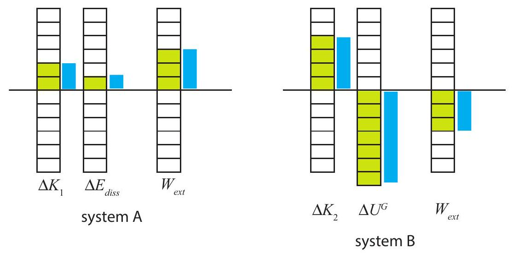

(sec-7.1)=
## 7.1 Introduction: work and impulse

In physics, \"work\" (or \"doing work\") is what we call the process through which a force changes the energy of an object it acts on (or the energy of a system to which the object belongs). It is, therefore, a very technical term with a very specific meaning that may seem counterintuitive at times.

For instance, as it turns out, in order to change the energy of an object on which it acts, the force needs to be at least partly in line with the displacement of the object during the time it is acting. A force that is perpendicular to the displacement does no work-it does not change the object's energy.

Imagine a satellite in a circular orbit around the earth. The earth is constantly pulling on it with a force (gravity) directed towards the center of the orbit at any given time. This force is always perpendicular to the displacement, which is along the orbit, and so it does no work: the satellite moves always at the same speed, so its kinetic energy does not change.

The force does change the satellite's momentum, however: it keeps bending the trajectory, and therefore changing the direction (albeit not the magnitude) of the satellite's momentum vector. Of course, it is obvious that a force must change an object's momentum, because that is pretty much how we defined force anyway. Recall {numref}`Eq. %s <eq-6.1>` for the average force on an object: $\vec{F}_{a v}=\Delta \vec{p} / \Delta t$. We can rearrange this to read

:::{math}
:label: eq-7.1
\Delta \vec{p}=\vec{F}_{a v} \Delta t
:::

For a constant force, the product of the force and the time over which it is acting is called the\
impulse, usually denoted as $\vec{J}$

:::{math}
:label: eq-7.2
\vec{J}=\vec{F} \Delta t
:::

Clearly, the impulse given by a force to an object is equal to the change in the object's momentum (by {numref}`Eq. %s <eq-7.1>`), as long as it is the only force (or, alternatively, the net force) acting on it. If the force is not constant, we break up the time interval $\Delta t$ into smaller subintervals and add all the pieces, pretty much as we did with {numref}`Figure %s <fig-1.5>` in {ref}`Chapter 1 <ch-1>` in order to calculate the displacement for a variable velocity. Formally this results in an integral:

:::{math}
:label: eq-7.3
\vec{J}=\int_{t_{i}}^{t_{f}} \vec{F}(t) d t
:::

Graphically, the $x$ component of the impulse is equal to the area under the curve of $F_{x}$ versus time, and similarly for the other components. You will get to see how it works in a lab experiment this semester.

There is not a whole lot more to be said about impulse. The main lesson to be learned from {numref}`Eq. %s <eq-7.1>` is that one can get a desired change in momentum - bring an object to a stop, for instance - either by using a large force over a short time, or a smaller force over a longer time. It is easy to see how different circumstances may call for different strategies: sometimes you may want to make the force as small as possible, if the object on which you are acting is particularly fragile; other times you may just need to make the time as short as possible instead.

Of course, to bring something to a stop you not only need to remove its momentum, but also its (kinetic) energy. If the former task takes time, the latter, it turns out, takes distance. Work is a much richer subject than impulse, not only because, as I have indicated above, the actual work done depends on the relative orientation of the force and displacement vectors, but also because there is only one kind of momentum, but many different kinds of energy, and one of the things that typically happens when work is done is the conversion of one type of energy into another.

So there is a lot of ground to cover, but we'll start small, in the next section, with the simplest kind of system, and the simplest kind of energy.

(sec-7.2)=
## 7.2 Work on a single particle

Consider a particle that undergoes a displacement $\Delta x$ while a constant force $F$ acts on it. In one dimension, the work done by the force on the particle is defined by

:::{math}
:label: eq-7.4
W=F \Delta x \quad(\text { constant force })
:::

and it is positive if the force and the displacement have the same sign (that is, if they point in the same direction), and negative otherwise.

In three dimensions, the force will be a vector $\vec{F}$ with components $\left(F_{x}, F_{y}, F_{z}\right)$, and the displacement, likewise, will be a vector $\Delta \vec{r}$ with components $(\Delta x, \Delta y, \Delta z)$. The work will be defined then as

:::{math}
:label: eq-7.5
W=F_{x} \Delta x+F_{y} \Delta y+F_{z} \Delta z
:::

This expression is an instance of what is known as the dot product (or inner product, or scalar product) of two vectors. Given two vectors $\vec{A}$ and $\vec{B}$, their dot product is defined, in terms of their components, as

:::{math}
:label: eq-7.6
\vec{A} \cdot \vec{B}=A_{x} B_{x}+A_{y} B_{y}+A_{z} B_{z}
:::

This can also be expressed in terms of the vectors' magnitudes, $|\vec{A}|$ and $|\vec{B}|$, and the angle they make, in the following form:

:::{math}
:label: eq-7.7
\vec{A} \cdot \vec{B}=|\vec{A}||\vec{B}| \cos \phi
:::

:::{figure} ../images/2024_09_14_9969b06773f10b6936e8g-157.jpg
:label: fig-7.1
:alt: Illustrating the angle phi to be used when calculating the dot product of two vectors by the formula. One way to think of this formula is that you take the projection of vector A vector onto vector B vector (indicated here by the blue lines), which is equal to |A vector| cos phi, then multiply that by the length of B vector (or vice-versa, of course).
Illustrating the angle $\phi$ to be used when calculating the dot product of two vectors by the formula {eq}`eq-7.7`. One way to think of this formula is that you take the projection of vector $\vec{A}$ onto vector $\vec{B}$ (indicated here by the blue lines), which is equal to $|\vec{A}| \cos \phi$, then multiply that by the length of $\vec{B}$ (or vice-versa, of course).
:::

{numref}`Figure %s <fig-7.1>` shows what I mean by the angle $\phi$ in this expression. The equality of the two definitions, Eqs. {eq}`eq-7.6` and {eq}`eq-7.7`, is proved in mathematics textbooks. The advantage of {numref}`Eq. %s <eq-7.7>` is that it is independent of the choice of a system of coordinates.

Using the dot product notation, the work done by a constant force can be written as

:::{math}
:label: eq-7.8
W=\vec{F} \cdot \Delta \vec{r}
:::

{numref}`Equation %s <eq-7.7>` then shows that, as I mentioned in the introduction, when the force is perpendicular to the displacement $\left(\phi=90^{\circ}\right)$ the work it does is zero. You can also see this directly from {numref}`Eq. %s <eq-7.5>`, by choosing the $x$ axis to point in the direction of the force (so $F_{y}=F_{z}=0$ ), and the displacement to point along any of the other two axes (so $\Delta x=0$ ): the result is $W=0$.

If the force is not constant, again we follow the standard procedure of breaking up the total displacement into pieces that are short enough that the force may be taken to be constant over\
each of them, calculating all those (possibly very small) \"pieces of work,\" and adding them all together. In one dimension, the final result can be expressed as the integral

:::{math}
:label: eq-7.9
W=\int_{x_{i}}^{x_{f}} F(x) d x \quad \text { (variable force) }
:::

So the work is given by the \"area\" under the $F$-vs- $x$ curve. In more dimensions, we have to write a kind of multivariable integral known as a line integral. That is advanced calculus, so we will not go there this semester.

(sec-7.2.1)=
### 7.2.1 Work done by the net force, and the Work-Energy Theorem

So much for the math and the definitions. Where does the energy come in? Let us suppose that $F$ is either the only force or the net force on the particle - the sum of all the forces acting on the particle. Again, for simplicity we will assume that it is constant (does not change) while the particle undergoes the displacement $\Delta x$. However, now $\Delta x$ and $F_{n e t}$ are related: a constant net force means a constant acceleration, $a=F_{\text {net }} / m$, and for constant acceleration we know the formula $v_{f}^{2}-v_{i}^{2}=2 a \Delta x$ applies. Therefore, we can write

:::{math}
:label: eq-7.10
W_{n e t}=F_{n e t} \Delta x=m a \Delta x=m \frac{1}{2}\left(v_{f}^{2}-v_{i}^{2}\right)
:::

which is to say

:::{math}
:label: eq-7.11
W_{n e t}=\Delta K
:::

In words, the work done by the net force acting on a particle as it moves equals the change in the particle's kinetic energy in the course of its displacement. This result is often referred to as the Work-Energy Theorem.

As you may have guessed from our calling it a \"theorem,\" the result {eq}`eq-7.11` is very general. It holds in three dimensions, and it holds also when the force isn't constant throughout the displacementyou just have to use the correct equation to calculate the work in those cases. It would apply to the work done by the net force on an extended object, also, provided it is OK to treat the extended object as a particle - so basically, a rigid object that is moving as a whole and not doing anything fancy such as spinning while doing so.

Another possible direction in which to generalize {eq}`eq-7.11` might be as follows. By definition, a \"particle\" has no other kind of energy, besides (translational) kinetic energy. Also, and for the same reason (namely, the absence of internal structure), it has no \"internal\" forces - all the forces acting on it are external. So-for this very simple system - we could rephrase the result {eq}`eq-7.11` by saying that the work done by the net external force acting on the system (the particle in this case) is equal to the change in its total energy. It is in fact in this form that we will ultimately generalize {eq}`eq-7.11` to deal with arbitrary systems.

Before we go there, however, I would like to take a little detour to explore another \"reasonable\" extension of the result {eq}`eq-7.11`, as well as its limitations.

(sec-7.3)=
## 7.3 The \"center of mass work\"

All the physics I used in order to derive the result {eq}`eq-7.11` was $F=m a$, and the expression $v_{f}^{2}-v_{i}^{2}=$ $2 a \Delta x$, which applies whenever we have motion with constant acceleration. Now, we know that for an arbitrary system, of total mass $M, F_{\text {ext,net }}=M a_{c m}$ \[see {numref}`Eq. %s <eq-6.11>`\]. That is enough, then, to ensure that, if $F_{\text {ext,net }}$ is a constant, we will have

:::{math}
:label: eq-7.12
F_{e x t, n e t} \Delta x_{c m}=\Delta K_{c m}
:::

where $K_{c m}$, the translational kinetic energy, is, as usual, $K_{c m}=\frac{1}{2} M v_{c m}^{2}$, and $\Delta x_{c m}$ is the displacement of the center of mass. The result {eq}`eq-7.12` holds for an arbitrary system, as long as $F_{\text {ext,net }}$ is constant, and can be generalized by means of an integral (as in {numref}`Eq. %s <eq-7.9>`) when it is variable.

So it seems that we could define the left-hand side of {numref}`Eq. %s <eq-7.12>` as \"the work done on the center of mass,\" and take that as the natural generalization to a system of the result {eq}`eq-7.11` for a particle. Most physicists would, in fact, be OK with that, but educators nowadays frown on that idea, for a couple of reasons.

First, it seems that it is essential to the notion of work that one should multiply the force by the displacement of the object on which it is acting. More precisely, in the definition {eq}`eq-7.4`, we want the displacement of the point of application of the force ${ }^{1}$. But there are many examples of systems where there is nothing at the precise location of the center of mass, and certainly no force acting precisely there.

This is not necessarily a problem in the case of a rigid object which is not doing anything funny, just moving as a whole so that every part has the same displacement, because then the displacement of the center of mass would simply stand for the displacement of any point at which an external force might actually be applied. But for many deformable systems, this would not be case. In fact, for such systems one can usually show that $F_{\text {ext,net }} \Delta x_{c m}$ is actually not the work done on the system by the net external force. A simple example of such a system is shown below, in {numref}`Figure %s <fig-7.2>`.

:::{figure} ../images/2024_09_14_9969b06773f10b6936e8g-160.jpg
:label: fig-7.2
:alt: A system of two blocks connected by a spring. A constant external force, F vectorh, 2c, is applied to the block on the right. Initially the spring is relaxed, but as soon as block 2 starts to move it stretches, pulling back on block 2 and pulling forward on block 1. Because of the stretching of the spring, the displacements delta x1, delta xc m and delta x2 are all different, and the work done by the external force, Fh, 2c delta x2, is different from the "center of mass work" Fh, 2c delta xc m.
A system of two blocks connected by a spring. A constant external force, $\vec{F}_{h, 2}^{c}$, is applied to the block on the right. Initially the spring is relaxed, but as soon as block 2 starts to move it stretches, pulling back on block 2 and pulling forward on block 1. Because of the stretching of the spring, the displacements $\Delta x_{1}, \Delta x_{c m}$ and $\Delta x_{2}$ are all different, and the work done by the external force, $F_{h, 2}^{c} \Delta x_{2}$, is different from the \"center of mass work\" $F_{h, 2}^{c} \Delta x_{c m}$.
:::

In this figure, the two blocks are connected by a spring, and the external force is applied to the block on the right (block 2). If the blocks have the same mass, the center of mass of the system is a point exactly halfway between them. If the spring starts in its relaxed state, it will stretch at first, so that the center of mass will lag behind block 2, and $F_{h, 2}^{c} \Delta x_{2}$, which is the quantity that we should properly call the \"work done by the net external force\" will not be equal to $F_{h, 2}^{c} \Delta x_{c m}$.

We find ourselves, therefore, with a very general and potentially rather useful result, {numref}`Eq. %s <eq-7.12>`, that looks a lot like it should be \"the work done on the system by the net external force\" but, in fact, is that only sometimes. On the other hand, the result is so useful that simply referring to it all the time by \"{numref}`Eq. %s <eq-7.12>`\" will not do. I propose, therefore, to call it the \"center of mass work,\" in between quotation marks, just so we all know what we are talking about, and remember the caveats that go with it.

We can now move to the real theorem relating the work of the external forces on a system to the change in its energy. What we have seen so far are really just straightforward applications of Newton's second law. The main result coming up is deeper than that, since it involves also, ultimately, the principle of conservation of energy.

(sec-7.4)=
## 7.4 Work done on a system by all the external forces

Consider the most general possible system, one that might contain any number of particles, with possibly many forces, both internal and external, acting on each of them. I will again, for simplicity,\
start by considering what happens over a time interval so short that all the forces are approximately constant (the final result will hold for arbitrarily long time intervals, just by adding, or integrating, over many such short intervals). I will also work explicitly only the one-dimensional case, although again that turns out to not be a real restriction.

Let then $W_{\text {all, } 1}$ be the work done on particle 1 by all the forces acting on it, $W_{\text {all, }}$ the work done on particle 2, and so on. The total work is the sum $W_{\text {all,sys }}=W_{\text {all }, 1}+W_{\text {all }, 2}+\ldots$ However, by the results of {ref}`section 7.2 <sec-7.2>` , we have $W_{\text {all, } 1}=\Delta K_{1}$ (the change in kinetic energy of particle 1 ), $W_{\text {all }, 2}=\Delta K_{2}$, and so on, so adding all these up we get

:::{math}
:label: eq-7.13
W_{\text {all,sys }}=\Delta K_{\text {sys }}
:::

where $\Delta K_{\text {sys }}$ is the change in kinetic energy of the whole system.

So far, of course, this is nothing new. To learn something else we need to look next at the work done by the internal forces. It is helpful here to start by considering the \"no-dissipation case\" in which all the internal forces can be derived from a potential energy ${ }^{2}$. We will consider the case where dissipative processes happen inside the system after we have gained a full understanding of the result we will obtain for this simpler case.

(sec-7.4.1)=
### 7.4.1 The no-dissipation case

The internal forces are, by definition, forces that arise from the interactions between pairs of particles that are both inside the system. Because of Newton's 3 rd law, the force $F_{12}$ (we will omit the \"type\" superscript for now) exerted by particle 1 on particle 2 must be the negative of $F_{21}$, the force exerted by particle 2 on particle 1. Hence, the work associated with this interaction for this pair of particles can be written

:::{math}
:label: eq-7.14
W(1,2)=F_{12} \Delta x_{2}+F_{21} \Delta x_{1}=F_{12}\left(\Delta x_{2}-\Delta x_{1}\right)
:::

Notice that $\Delta x_{2}-\Delta x_{1}$ can be rewritten as $x_{2, f}-x_{2, i}-x_{1, f}+x_{1, i}=x_{12, f}-x_{12, i}=\Delta x_{12}$, where $x_{12}=x_{2}-x_{1}$ is the relative position coordinate of the two particles. Therefore,

:::{math}
:label: eq-7.15
W(1,2)=F_{12} \Delta x_{12}
:::

Now, if the interaction in question is associated with a potential energy, as I showed in {ref}`section 6.2 <sec-6.2>`, $F_{12}=-d U / d x_{12}$. Assume the displacement $\Delta x_{12}$ is so small that we can replace the derivative by just the ratio $\Delta U / \Delta x_{12}$ (which is consistent with our assumption that the force is approximately constant over the time interval considered); the result will then be

:::{math}
:label: eq-7.16
W(1,2)=F_{12} \Delta x_{12} \simeq-\frac{\Delta U}{\Delta x_{12}} \Delta x_{12}=-\Delta U
:::

Adding up very many such \"infinitesimal\" displacements will lead to the same final result, where $\Delta U$ will be the change in the potential energy over the whole process. This can also be proved using calculus, without any approximations:

:::{math}
:label: eq-7.17
W(1,2)=\int_{x_{12, i}}^{x_{12, f}} F_{12} d x_{12}=-\int_{x_{12, i}}^{x_{12, f}} \frac{d U}{d x_{12}} d x_{12}=-\Delta U
:::

We can apply this to every pair of particles and every internal interaction, and then add up all the results. On one side, we will get the total work done on the system by all the internal forces; on the other side, we will get the negative of the change in the system's total internal energy:

:::{math}
:label: eq-7.18
W_{\text {int,sys }}=-\Delta U_{\text {sys }}
:::

In words, the work done by all the (conservative) internal forces is equal to the change in the system's potential energy.

Let us now put Eqs. {eq}`eq-7.13` and {eq}`eq-7.18` together: the difference between the work done by all the forces and the work done by the internal forces is, of course, the work done by the external forces, but according to Eqs. {eq}`eq-7.13` and {eq}`eq-7.18`, this is equal to

:::{math}
:label: eq-7.19
W_{\text {ext }, \text { sys }}=W_{\text {all,sys }}-W_{\text {int }, \text { sys }}=\Delta K_{\text {sys }}+\Delta U_{\text {sys }}
:::

which is the change in the total mechanical (kinetic plus potential) energy of the system. If we further assume that the system, in the absence of the external forces, is closed, then there are no other processes (such as the absorption of heat) by which the total energy of the system might change, and we get the simple result that the work done by the external forces equals the change in the system's total energy:

:::{math}
:label: eq-7.20
W_{\text {ext,sys }}=\Delta E_{\text {sys }}
:::

As a first application of the result {eq}`eq-7.20`, consider again the blocks connected by a spring shown in Fig. 2. You can see now why the work done by the external force $F_{h, 2}^{c}$ has to be different, and in fact larger, than the \"center of mass work\": the latter only gives us the change in the translational energy, but the former has to give us the change in the total energy-translational, convertible, and potential:

:::{math}
:label: eq-7.21
\begin{align*}
F_{h, 2}^{c} \Delta x_{c m} & =\Delta K_{c m} \\
F_{h, 2}^{c} \Delta x_{2} & =\Delta K_{c m}+\Delta K_{c o n v}+\Delta U^{s p r}
\end{align*}
:::

As another example, imagine you throw a ball of mass $m$ upwards (see {numref}`Figure %s <fig-7.3>`, next page), and it reaches a maximum height $h$ above the point where your hand started to move. Let us define the system to be the ball and the earth, so the force exerted by your hand is an external force. Then you do work on the system during the throw, which in the figure is the interval, from A to B, during which your hand is on contact with the ball. The bar diagram on the side shows that some of this work goes into increasing the system's (gravitational) potential energy (because the\
ball goes up a little while in contact with your hand), and the rest, which is typically most of it, goes into increasing the system's kinetic energy (in this case, just the ball's; the earth's kinetic energy does not change in any measurable way!).\
:::{figure} ../images/2024_09_14_9969b06773f10b6936e8g-163.jpg
:label: fig-7.3
:alt: Tossing a ball into the air. We consider the system formed by the ball and the earth. The force exerted by the hand (which is in contact with the ball from point A to point B ) is therefore an external force. The diagrams show the system's energy balance over three different intervals.
Tossing a ball into the air. We consider the system formed by the ball and the earth. The force exerted by the hand (which is in contact with the ball from point A to point B ) is therefore an external force. The diagrams show the system's energy balance over three different intervals.
:::

So how much work did you actually do? If we knew the distance from A to B, and the magnitude of the force you exerted, and if we could assume that your force was constant throughout, we could calculate $W$ from the definition {eq}`eq-7.4`. But in this case, and many others like it, it is actually easier to find out how much total energy the system gained and just use {numref}`Eq. %s <eq-7.20>`. To find $\Delta E$ in\
practice, all we have to do is see how high the ball rises. At the ball's maximum height (point C), as the second diagram shows, all the energy in the system is gravitational potential energy, and (as long as the system stays closed), all that energy is still equal to the work you did initially, so if the distance from A to C is $h$ you must have done an amount of work

:::{math}
:label: eq-7.22
W_{\text {you }}=\Delta U^{G}=m g h
:::

The third diagram in {numref}`Figure %s <fig-7.3>` shows the work-energy balance for another time interval, during which the ball falls from C to B. Over this time, no external forces act on the ball (recall we have taken the system to be the ball and the earth, so gravity is an internal force). Then, the work done by the external forces is zero, and the change in the total energy of the system is also zero. The diagram just shows an increase in kinetic energy at the expense of an equal decrease in potential energy.

What about the work done by the internal forces? {numref}`Eq. %s <eq-7.18>` tells us that this work is equal to the negative of the change in potential energy. In this case, the internal force is gravity, and the corresponding energy is gravitational potential energy. This change in potential energy is clearly visible in all the diagrams; however, when you add to it the change in kinetic energy, the result is always equal to the work done by the external force only. Put otherwise, the internal forces do not change the system's total energy, they just \"redistribute\" it among different kinds - as in, for instance, the last diagram in {numref}`Fig. %s <fig-7.3>`, where you can clearly see that gravity is causing the kinetic energy of the system to increase at the expense of the potential energy.

We will use diagrams like the ones in {numref}`Figure %s <fig-7.3>` to look at the work-energy balance for different systems. The idea is that the sum of all the columns on the left (the change in the system's total energy) has to equal the result on the far-right column (the work done by the net external force): that is the content of the theorem {eq}`eq-7.20`. Note that, unlike the energy diagrams we used in {ref}`Chapter 5 <ch-5>` , these columns represent changes in the energy, so they could be positive or negative.

Just as for the earlier energy diagrams, the picture we get will be different, even for the same physical situation, depending on the choice of system. This is illustrated in {numref}`Figure %s <fig-7.4>` below (next page), where I have taken the same throw shown in {numref}`Fig. %s <fig-7.3>`, but now the system I'm looking at is the ball only. This means gravity is now an external force, as is the force of the hand, and the ball only has kinetic energy. Normally one would show the sum of the work done by the two external forces on a single column, but here I have chosen to break it up into two columns for clarity.

As you can see, during the throw the hand does positive work, whereas gravity does a comparatively small amount of negative work, and the change in kinetic energy is the sum of the two. For the longer interval from A to C (second diagram), gravity continues to do negative work until all the kinetic energy of the ball is gone. For the interval from C to B , the only external force is gravity, which now does positive work, equal to the increase in the ball's kinetic energy.

:::{figure} ../images/2024_09_14_9969b06773f10b6936e8g-165.jpg
:label: fig-7.4
:alt: Work-energy balance diagrams for the same toss illustrated in, but now the system is taken to be the ball only.
Work-energy balance diagrams for the same toss illustrated in {numref}`Fig. %s <fig-7.3>`, but now the system is taken to be the ball only.
:::

Of course, the numerical value of the actual work done by any particular force does not depend on our choice of system: in each case, gravity does the same amount of work in the processes illustrated in {numref}`Fig. %s <fig-7.4>` as in those illustrated in {numref}`Fig. %s <fig-7.3>`. The difference, however, is that for the system in {numref}`Fig. %s <fig-7.4>`, gravity is an external force, and now the work it does actually changes the system's total energy, because the gravitational potential energy is now not included in that total.

Formally, it works like this: in the case shown in {numref}`Fig. %s <fig-7.3>`, where the system is the ball and the earth, we have $\Delta K+\Delta U^{G}=W_{\text {hand }}$. By the result {eq}`eq-7.18`, however, we have $\Delta U^{G}=-W_{\text {grav }}$, and so this equation can be rearranged to read $\Delta K=W_{\text {grav }}+W_{\text {hand }}$, which is just the result {eq}`eq-7.20` when the system is the ball alone.

Ultimately, the reason we emphasize the importance of the choice of system is to prevent double counting: if you want to count the work done by gravity as contributing to the change in the system's total energy, it means that you are, implicitly, treating gravity as an external force, and therefore your system must be something that does not have, by itself, gravitational potential energy (the case of the ball in {numref}`Figure %s <fig-7.4>`); conversely, if you insist on counting gravitational potential energy as contributing to the system's total energy, then you must treat gravity as an internal force, and leave it out of the calculation of the work done on the system by the external forces, which are the only ones that can change the system's total energy.

(sec-7.4.2)=
### 7.4.2 The general case: systems with dissipation

We are now ready to consider what happens when some of the internal interactions in a system are not conservative. There are two key observations to keep in mind: first, of course, that energy will always be conserved in a closed system, regardless of whether the internal forces are \"conservative\" or not: if they are not, it merely means that they will convert some of the \"organized,\" mechanical energy, into disorganized (primarily thermal) energy.

The second observation is that the work done by an external force on a system does not depend on where the force comes from - that is to say, what physical arrangement we use to produce the force. Only the value of the force at each step and the displacement of the point of application are involved in the definition {eq}`eq-7.9`. This means, in particular, that we can use a conservative interaction to do the work for us. It turns out, then, that the generalization of the result {eq}`eq-7.20` to apply to all sorts of interactions becomes straightforward.

To see the idea, consider, for example, the situation in {numref}`Figure %s <fig-7.5>` below. This is essentially the same as {numref}`Figure %s <fig-6.2>`, which we analyzed in detail from the perspective of forces and accelerations in the previous chapter. Here I have broken it up into two systems. System A, outlined in blue, consists of block 1 and the surface on which it slides, and includes a dissipative interaction-namely, kinetic friction-between the block and the surface. The force doing work on this system is the tension force from the rope, $\vec{F}_{r, 1}^{t}$.

:::{figure} ../images/2024_09_14_9969b06773f10b6936e8g-166.jpg
:label: fig-7.5
:alt: Block sliding on a surface, with friction, being pulled by a rope attached to a block falling under the action of gravity. The motion of this system was solved for in.
Block sliding on a surface, with friction, being pulled by a rope attached to a block falling under the action of gravity. The motion of this system was solved for in {ref}`Section 6.3 <sec-6.3>`.
:::

Because the rope is assumed to have negligible mass, this force is the same in magnitude as the\
force $\vec{F}_{r, 2}^{t}$ that is doing negative work on system B. System B, outlined in magenta, consists of block 2 and the earth and thus it includes only one internal interaction, namely gravity, which is conservative. This means that we can immediately apply the theorem {eq}`eq-7.20` to it, and conclude that the work done on B by $\vec{F}_{r, 2}^{t}$ is equal to the change in system B's total energy:

:::{math}
:label: eq-7.23
W_{r, B}=\Delta E_{B}
:::

However, since the rope is inextensible, the two blocks move the same distance in the same time, and the force exerted on each by the rope is the same in magnitude, so the work done by the rope on system A is equal in magnitude but opposite in sign to the work it does on system B :

:::{math}
:label: eq-7.24
W_{r, A}=-W_{r, B}=-\Delta E_{B}
:::

Now consider the total system formed by A+B. Assuming it is a closed system, its total energy must be constant, and so any change in the total energy of B must be equal and opposite the corresponding change in the total energy of A: $\Delta E_{B}=-\Delta E_{A}$. Therefore,

:::{math}
:label: eq-7.25
W_{r, A}=-\Delta E_{B}=\Delta E_{A}
:::

So we conclude that the work done by the external force on system A must be equal to the total change in system A's energy. In other words, {numref}`Eq. %s <eq-7.20>` applies to system A as well, as it does to system B, even though the interaction between the parts that make up system A is dissipative.

Although I have shown this to be true just for one specific example, the argument is quite general: if I use a conservative system B to do some work on another system A, two things happen: first, by virtue of {eq}`eq-7.20`, the work done by B comes at the expense of its total energy, so $W_{e x t, A}=-\Delta E_{B}$. Second, if A and B together form a closed system, the change in A's energy must be equal and opposite the change in B's energy, so $\Delta E_{A}=-\Delta E_{B}=W_{\text {ext, } A}$. So the result {eq}`eq-7.20` holds for A, regardless of whether its internal interactions are conservative or not.

What is essential in the above reasoning is that A and B together should form a closed system, that is, one that does not exchange energy with its environment. It is very important, therefore, if we want to apply the theorem {eq}`eq-7.20` to a general system - that is, one that includes dissipative interactions - that we draw the boundary of the system in such a way as to ensure that no dissipation is happening at the boundary. For example, in the situation illustrated in {numref}`Fig. %s <fig-7.5>`, if we want the result {eq}`eq-7.25` to apply we must take system A to include both block 1 and the surface on which it slides. The reason for this is that the energy \"dissipated\" by kinetic friction when two objects rub together goes into both objects. So, as the block slides, kinetic friction is converting some of its kinetic energy into thermal energy, but not all this thermal energy stays inside block 1. Put otherwise, in the presence of friction, block 1 by itself is not a closed system: it is \"leaking\" energy to the surface. On the other hand, when you include (enough of) the surface in the system, you can be sure to have \"caught\" all the dissipated energy, and the result {eq}`eq-7.20` applies.

(sec-7.4.3)=
### 7.4.3 Energy dissipated by kinetic friction

In the situation illustrated in {numref}`Fig. %s <fig-7.5>`, we might calculate the energy dissipated by kinetic friction by indirect means. For instance, we can use the fact that the energy of system A is of two kinds, kinetic and \"dissipated,\" and therefore, by theorem {eq}`eq-7.20`, we have

:::{math}
:label: eq-7.26
\Delta K+\Delta E_{\text {diss }}=F_{r, 1}^{t} \Delta x_{1}
:::

Back in {ref}`section 6.3 <sec-6.3>`, we used Newton's laws to solve for the acceleration of this system and the tension in the rope; using those results, we can calculate the displacement $\Delta x_{1}$ over any time interval, and the corresponding change in $K$, and then we can solve {numref}`Eq. %s <eq-7.26>` for $\Delta E_{\text {diss }}$.

If we do this, we will find out that, in fact, the following result holds,

:::{math}
:label: eq-7.27
\Delta E_{d i s s}=-F_{s, 1}^{k} \Delta x_{1}
:::

where $F_{s, 1}^{k}$ is the force of kinetic friction exerted by the surface on block 1, and must be understood to be negative in this equation (so that $\Delta E_{\text {diss }}$ will come out positive, as it must be).

It is tempting to think of the product $F_{s, 1}^{k} \Delta x$ as the work done by the force of kinetic friction on the block, and most of the time there is nothing wrong with that, but it is important to realize that the \"point of application\" of the friction force is not a single point: rather, the force is \"distributed,\" that is to say, spread over the whole contact area between the block and the surface. As a consequence of this, a more general expression for the energy dissipated by kinetic friction between an object $o$ and a surface $s$ should be

:::{math}
\Delta E_{\text {diss }}=\left|F_{s, o}^{k}\right|\left|\Delta x_{s o}\right|
:::

where I am using the {ref}`Chapter 1 <ch-1>` subscript notation $x_{A B}$ to refer to \"the position of $B$ in the frame of $A$ \" (or \"relative to $A$ \"); in other words, $\Delta x_{s o}$ is the change in the position of the object relative to the surface or, more simply, the distance that the object and the surface slip past each other (while rubbing against each other, and hence dissipating energy). If the surfaces is at rest (relative to the Earth), $\Delta x_{s o}$ reduces to $\Delta x_{E o}$, the displacement of the object in the Earth reference frame, and we can remove the subscript $E$, as we typically do, for simplicity; however, in the rare cases when both the surface and the objet are moving (as in part (c) of Problem 3 in {ref}`Chapter 6 <ch-6>`, the sled problem) what matters is how far they move relative to each other. In that case we have $\left|\Delta x_{s o}\right|=\left|\Delta x_{o}-\Delta x_{s}\right|$ (with both $\Delta x_{o}$ and $\Delta x_{s}$ measured in the Earth reference frame).

(sec-7.5)=
## 7.5 Power

By \"power\" we mean the rate at which work is done, which is to say, the rate at which energy is taken in, or given out, or converted from one form to another. The SI unit of power is the watt (W),\
which is equal to $1 \mathrm{~J} / \mathrm{s}$. The average power going into or coming out of a system by mechanical means, that is to say, through the action of a force applied at a point undergoing a displacement $\Delta x$, will be

:::{math}
:label: eq-7.29
P_{a v}=\frac{\Delta E}{\Delta t}=\frac{W}{\Delta t}=F \frac{\Delta x}{\Delta t}
:::

assuming the force is constant. Note that in the limit when $\Delta t$ goes to zero, this gives us the instantaneous power associated with the force $F$ as

:::{math}
:label: eq-7.30
P=F v
:::

where $v$ is the (instantaneous) velocity of the point of application of the force. This one-dimensional result generalizes to three dimensions as

:::{math}
:label: eq-7.31
P=\vec{F} \cdot \vec{v}
:::

using again the dot product notation.\
An important goal of this chapter has been to develop a set of tools that you may use to find out where power is spent, and how much: in any practical situation, which systems are giving energy and which are taking it in, what forms of energy conversion are taking place, and where and through which means are the exchanges and conversions happening. These are extremely important practical questions; the problems and exercises that you will see here will give you a feel for the variety of situations that can already be analyzed by this \"systems-based\" approach, but in a way they will still do little more than scratch the surface.

(sec-7.6)=
## 7.6 In summary

1.  The change in the momentum of a system produced by a force $\vec{F}$ acting over a time $\Delta t$ is given the name of \"impulse\" and denoted by $\vec{J}$. For a constant force, we have $\vec{J}=\Delta \vec{p}=\vec{F} \Delta t$.

2.  Work, or \"doing work\" is the name given in physics to the process by which an applied force brings about a change in the energy of an object, or of a system that contains the object on which the force is acting.

3.  The work done by a constant force $\vec{F}$ acting on an object or system is given by $W=\vec{F} \cdot \Delta \vec{r}$, where the dot represents the \"dot\" or \"scalar\" product of the two vectors, and $\Delta \vec{r}$ is the displacement undergone by the point of application of the force while the force is acting. If the force is perpendicular to the displacement, it does no work.

4.  For a system that is otherwise closed, the net sum of the amounts of work done by all the external forces is equal to the change in the system's total energy, when all the types of energy are included. Note that, for deformable systems, the displacement of the point of application may be different for different forces.

5.  The result in 4 above holds only provided the boundary of the system is not drawn at a physical surface on which dissipation occurs. Put otherwise, kinetic friction or other similar dissipative forces (drag, air resistance) must be included as internal, not external forces.

6.  The work done by the internal forces in a closed system results only in the conversion of one type of energy into another, always keeping the total energy constant.

7.  For a system with no internal energy, like a particle, the work done by all the external forces equals the change in kinetic energy. This result is sometimes called the Work-Energy theorem in a narrow sense.

8.  For any system, if $\vec{F}_{\text {ext,net }}$ (assumed constant) is the sum of all the external forces, the following result holds:

$$\vec{F}_{\text {ext,net }} \cdot \Delta \vec{r}_{c m}=\Delta K_{c m}$$

where $K_{c m}$ is the translational (or \"center of mass\") kinetic energy, and $\Delta \vec{r}_{c m}$ is the displacement of the center of mass. This is only sometimes equal to the net work done on the system by the external forces.\
9. For an object $o$ sliding on a surface $s$, the energy dissipated by kinetic friction can be directly calculated as

:::{math}
:label: eq-7.28
\Delta E_{\text {diss }}=\left|F_{s, o}^{k}\right|\left|\Delta x_{s o}\right|
:::

where $\left|\Delta x_{s o}\right|=\left|\Delta x_{o}-\Delta x_{s}\right|$ is the distance that the two surfaces in contact slip past each other. This expression, with a negative sign, can be used to take the place of the \"work done by friction\" in applications of the results 7 and 8 above to systems involving kinetic friction forces.\
10. The power of a system is the rate at which it does work, that is to say, takes in or gives up energy: $P_{a v}=\Delta E / \Delta t$. When this is done by means of an applied force $F$, the instantaneous power can be written as $P=F v$, or, in three dimensions, $\vec{F} \cdot \vec{v}$.

(sec-7.7)=
## 7.7 Examples

(sec-7.7.1)=
### 7.7.1 Braking

Suppose you are riding your bicycle and hit the brakes to come to a stop. Assuming no slippage between the tire and the road:\
(a) Which force is responsible for removing your momentum? (By \"you\" I mean throughout \"you and the bicycle.\")\
(b) Which force is responsible for removing your kinetic energy?

(ch-7-solution)=
### Solution

\(a\) According to what we saw in previous chapters, for example, {numref}`Eq. %s <eq-6.10>`

:::{math}
:label: eq-7.32
\frac{\Delta p_{\text {sys }}}{\Delta t}=F_{\text {ext,net }}
:::

the total momentum of the system can only be changed by the action of an external force, and the only available external force is the force of static friction between the tire and the road (static, because we assume no slippage). So it is this force that removes the forward momentum from the system. The stopping distance, $\Delta x_{c m}$, and the force, can be related using {numref}`Eq. %s <eq-7.12>`:

:::{math}
:label: eq-7.33
F_{r, t}^{s} \Delta x_{c m}=\Delta K_{c m}
:::

\(b\) Now, here is an interesting fact: the force of static friction, although fully responsible for stopping your center of mass motion does no work in this case. That is because the point where it is applied-the point of the tire that is momentarily in contact with the road-is also momentarily at rest relative to the road: it is, precisely, not slipping, so $\Delta x$ in the equation $W=F \Delta x$ is zero. By the time that bit of the tire has moved on, so you actually have a nonzero $\Delta x$, you no longer have an $F$ : the force of static friction is no longer acting on that bit of the tire, it is acting on a different bit - on which it will, again, do no work, for the same reason.

So, as you bring your bicycle to a halt the work $W_{\text {ext,sys }}=0$, and it follows from {numref}`Eq. %s <eq-7.20>` that the total energy of your system is, in fact, conserved: all your initial kinetic energy is converted to thermal energy by the brake pad rubbing on the wheel, and the internal force responsible for that conversion is the force of kinetic friction between the pad and the wheel.

(sec-7.7.2)=
### 7.7.2 Work, energy and the choice of system: dissipative case

Consider again the situation shown in {numref}`Figure %s <fig-7.5>`. Let $m_{1}=1 \mathrm{~kg}, m_{2}=2 \mathrm{~kg}$, and $\mu_{k}=0.3$. Use the solutions provided in {ref}`Section 6.3 <sec-6.3>` to calculate the work done by all the forces, and the changes in all energies, when the system undergoes a displacement of 0.5 m , and represent the changes graphically using bar diagrams like the ones in {numref}`Figure %s <fig-7.3>` (for system A and B separately)

(ch-7-solution-1)=
### Solution

From {numref}`Eq. %s <eq-6.32>`, we have

:::{math}
:label: eq-7.34
\begin{align*}
a & =\frac{m_{2}-\mu_{k} m_{1}}{m_{1}+m_{2}} g=5.55 \frac{\mathrm{m}}{\mathrm{s}^{2}} \\
F^{t} & =\frac{m_{1} m_{2}\left(1+\mu_{k}\right)}{m_{1}+m_{2}} g=8.49 \mathrm{~N}
\end{align*}
:::

We can use the acceleration to calculate the change in kinetic energy, since we have {numref}`Eq. %s <eq-2.10>` for motion with constant acceleration:

:::{math}
:label: eq-7.35
v_{f}^{2}-v_{i}^{2}=2 a \Delta x=2 \times\left(5.55 \frac{\mathrm{m}}{\mathrm{s}^{2}}\right) \times 0.5 \mathrm{~m}=5.55 \frac{\mathrm{m}^{2}}{\mathrm{~s}^{2}}
:::

so the change in kinetic energy of the two blocks is

:::{math}
:label: eq-7.36
\begin{align*}
\Delta K_{1} & =\frac{1}{2} m_{1}\left(v_{f}^{2}-v_{i}^{2}\right)=2.78 \mathrm{~J} \\
\Delta K_{2} & =\frac{1}{2} m_{2}\left(v_{f}^{2}-v_{i}^{2}\right)=5.55 \mathrm{~J}
\end{align*}
:::

We can also use the tension to calculate the work done by the external force on each system:

:::{math}
:label: eq-7.37
\begin{align*}
& W_{e x t, A}=F_{r, 1}^{t} \Delta x=(8.49 \mathrm{~N}) \times(0.5 \mathrm{~m})=4.25 \mathrm{~J} \\
& W_{e x t, B}=F_{r, 2}^{t} \Delta y=(8.49 \mathrm{~N}) \times(-0.5 \mathrm{~m})=-4.25 \mathrm{~J}
\end{align*}
:::

Lastly, we need the change in the gravitational potential energy of system B:

:::{math}
:label: eq-7.38
\Delta U_{B}^{G}=m_{2} g \Delta y=(2 \mathrm{~kg}) \times\left(9.8 \frac{\mathrm{m}}{\mathrm{s}^{2}}\right) \times(-0.5 \mathrm{~m})=-9.8 \mathrm{~J}
:::

and the increase in dissipated energy in system A, which we can get from {numref}`Eq. %s <eq-7.28>`:

:::{math}
:label: eq-7.39
\Delta E_{d i s s}=-F_{s, 1}^{k} \Delta x=\mu_{k} F_{s, 1}^{n} \Delta x=\mu_{k} m_{1} g \Delta x=0.3 \times(1 \mathrm{~kg}) \times\left(9.8 \frac{\mathrm{m}}{\mathrm{s}^{2}}\right) \times(0.5 \mathrm{~m})=1.47 \mathrm{~J}
:::

We can now put all this together to show that {numref}`Eq. %s <eq-7.20>` indeed holds:

:::{math}
:label: eq-7.40
\begin{align*}
& W_{\text {ext }, A}=\Delta E_{A}=\Delta K_{1}+\Delta E_{\text {diss }}=2.78 \mathrm{~J}+1.47 \mathrm{~J}=4.25 \mathrm{~J} \\
& W_{\text {ext }, B}=\Delta E_{B}=\Delta K_{2}+\Delta U_{B}^{G}=5.55 \mathrm{~J}-9.8 \mathrm{~J}=-4.25 \mathrm{~J}
\end{align*}
:::

To plot all this as energy bars, if you do not have access to a very precise drawing program, you typically have to make some approximations. In this case, we see that $\Delta K_{2}=2 \Delta K_{1}$ (exactly), whereas $\Delta K_{1} \simeq 2 \Delta E_{\text {diss }}$, so we can use one box to represent $E_{\text {diss }}$, two boxes for $\Delta K_{1}$, three for $W_{\text {ext, } A}$, four for $\Delta K_{2}$, and so on. The result is shown in green in the picture below; the blue bars have been drawn more exactly to scale, and are shown for your information only.

(sec-7.7.3)=
### 7.7.3 Work, energy and the choice of system: non-dissipative case

Suppose you hang a spring from the ceiling, then attach a block to the end of the spring and let go. The block starts swinging up and down on the spring. Consider the initial time just before you let go, and the final time when the block momentarily stops at the bottom of the swing. For each of the choices of a system listed below, find the net energy change of the system in this process, and relate it explicitly to the work done on the system by an external force (or forces)\
(a) System is the block and the spring.\
(b) System is the block alone.\
(c) System is the block and the earth.

(ch-7-solution-2)=
### Solution

\(a\) The block alone has kinetic energy, and the spring alone has (elastic) potential energy, so the total energy of this system is the sum of these two. For the interval considered, the change in kinetic energy is zero, because the block starts and ends (momentarily) at rest, so only the spring energy changes. This has to be equal to the work done by gravity, which is the only external force.

So, if the spring stretches a distance $d$, its potential energy goes from zero to $\frac{1}{2} k d^{2}$, and the block falls the same distance, so gravity does an amount of work equal to $m g d$, and we have

:::{math}
:label: eq-7.41
W_{\text {grav }}=m g d=\Delta E_{\text {sys }}=\Delta K+\Delta U^{s p r}=0+\frac{1}{2} k d^{2}
:::

\(b\) If the system is the block alone, the only energy it has is kinetic energy, which, as stated above, does not see a net change in this process. This means the net work done on the block by the external forces must be zero. The external forces in this case are the spring force and gravity, so we have

:::{math}
:label: eq-7.42
W_{\text {spr }}+W_{\text {grav }}=\Delta K=0
:::

We have calculated $W_{\text {grav }}$ above, so from this we get that the work done by the spring on the block, as it stretches, is $-m g d$, or (by {numref}`Eq. %s <eq-7.41>`) $-\frac{1}{2} k d^{2}$. Note that the force exerted by the spring is not constant as it stretches (or compresses) so we cannot just use {numref}`Eq. %s <eq-7.4>` to calculate it; rather, we need to calculate it as an integral, as in {numref}`Eq. %s <eq-7.9>`, or derive it in some indirect way as we have just done here.\
(c) If the system is the block and the earth, it has kinetic energy and gravitational potential energy. The force exerted by the spring is an external force now, so we have:

:::{math}
:label: eq-7.43
W_{s p r}=\Delta E_{s y s}=\Delta K+\Delta U^{G}=0-m g d
:::

so we end up again with the result that $W_{\text {spr }}=-m g d=-\frac{1}{2} k d^{2}$. Note that both the work done by the spring and the work done by gravity are equal to the negative of the changes in their respective potential energies, as they should be.

(sec-7.7.4)=
### 7.7.4 Jumping

For a standing jump, you start standing straight (A) so your body's center of mass is at a height $h_{1}$ above the ground. You then bend your knees so your center of mass is now at a (lower) height $h_{2}$ (B). Finally, you straighten your legs, pushing hard on the ground, and take off, so your center of mass ends up achieving a maximum height, $h_{3}$, above the ground (C). Answer the following questions in as much detail as you can.\
(a) Consider the system to be your body only. In going from (A) to (B), which external forces are acting on it? How do their magnitudes compare, as a function of time?\
(b) In going from (A) to (B), does any of the forces you identified in part (a) do work on your body? If so, which one, and by how much? Does your body's energy increase or decrease as a result of this? Into what kind of energy do you think this work is primarily converted?\
(c) In going from (B) to (C), which external forces are acting on you? (Not all of them need to be acting all the time.) How do their magnitudes compare, as a function of time?\
(d) In going from (B) to (C), does any of the forces you identified do work on your body? If so, which one, and by how much? Does your body's kinetic energy see a net change from (B) to (C)? What other energy change needs to take place in order for {numref}`Eq. %s <eq-7.20>` (always with your body as the system) to be valid for this process?

(ch-7-solution-3)=
### Solution

\(a\) The external forces on your body are gravity, pointing down, and the normal force from the floor, pointing up. Initially, as you start lowering your center of mass, the normal force has to be slightly smaller than gravity, since your center of mass acquires a small downward acceleration. However, eventually $F^{n}$ would have to exceed $F^{G}$ in order to stop the downward motion.\
(b) The normal force does no work, because its point of application (the soles of your feet) does not move, so $\Delta x$ in the expression $W=F \Delta x$ ({numref}`Eq. %s <eq-7.4>`) is zero.

Gravity, on the other hand, does positive work, since you may always treat the center of mass as the point of application of gravity (see {ref}`Section 7.3 <sec-7.3>` , footnote). We have $F_{y}^{G}=-m g$, and $\Delta y=h_{2}-h_{1}$, so

$$W_{\text {grav }}=F_{y}^{G} \Delta y=-m g\left(h_{2}-h_{1}\right)=m g\left(h_{1}-h_{2}\right)$$

Since this is the net work done by all the external forces on my body, and it is positive, the total energy in my body must have increased (by the theorem {eq}`eq-7.20`: $W_{\text {ext,sys }}=\Delta E_{\text {sys }}$ ). In this case, it is clear that the main change has to be an increase in my body's elastic potential energy, as my muscles tense for the jump. (An increase in thermal energy is always possible too.)\
(c) During the jump, the external forces acting on me are again gravity and the normal force, which together determine the acceleration of my center of mass. At the beginning of the jump, the normal force has to be much stronger than gravity, to give me a large upwards acceleration. Since the normal force is a reaction force, I accomplish this by pushing very hard with my feet on the ground, as I extend my leg's muscles: by Newton's third law, the ground responds with an equal and opposite force upwards.

As my legs continue to stretch, and move upwards, the force they exert on the ground decreases, and so does $F^{n}$, which eventually becomes less than $F^{G}$. At that point (probably even before my feet leave the ground) the acceleration of my center of mass becomes negative (that is, pointing down). This ultimately causes my upwards motion to stop, and my body to come down.\
(d) The only force that does work on my body during the process described in (c) is gravity, since, again, the point of application of $F^{n}$ is the point of contact between my feet and the ground, and that point does not move up or down - it is always level with the ground. So $W_{\text {ext,sys }}=W_{\text {grav }}$, which in this case is actually negative: $W_{\text {grav }}=-m g\left(h_{3}-h_{2}\right)$.

In going from (B) to (C), there is no change in your kinetic energy, since you start at rest and end (momentarily) with zero velocity at the top of the jump. So the fact that there is a net negative work done on you means that the energy inside your body must have gone down. Clearly, some of this is just a decrease in elastic potential energy. However, since $h_{3}$ (the final height of your center of mass) is greater than $h_{1}$ (its initial height at (A), before crouching), there is a net loss of energy in your body as a result of the whole process. The most obvious place to look for this loss is in chemical energy: you \"burned\" some calories in the process, primarily when pushing hard against the ground.

(sec-7.8)=
## 7.8 Problems

Problem 1 In a mattress test, you drop a 7.0 kg bowling ball from a height of 1.5 m above a mattress, which as a result compresses 15 cm as the ball comes to a stop.\
(a) What is the kinetic energy of the ball just before it hits the mattress?\
(b) How much work does the gravitational force of the earth do on the ball as it falls, for the first part of the fall (from the moment you drop it to just before it hits the mattress)?\
(c) How much work does the gravitational force do on the ball while it is compressing the mattress?\
(d) How much work does the mattress do on the ball?\
(e) Now model the mattress as a single spring with an unknown spring constant $k$, and consider the whole system formed by the ball, the earth and the mattress. By how much does the potential energy of the mattress increase as it compresses?\
(f) What is the value of the spring constant $k$ ?

Problem 2 A block of mass 1 kg is sitting on top of a compressed spring of spring constant $k=300 \mathrm{~N} / \mathrm{m}$ and equilibrium length 20 cm . Initially the spring is compressed 10 cm , and the block is held in place by someone pushing down on it with his hand. At $t=0$, the hand is removed (this involves no work), the spring expands and the block flies upwards.\
(a) Draw a free-body diagram for the block while the hand is still pressing down. Try to get the forces approximately to scale. The following question should help.\
(b) What must be the force (magnitude and direction) exerted by the hand on the block?\
(c) How much elastic potential energy was stored in the spring initially?\
(d) Taking the system formed by the block and the earth, how much total work is done on it by the spring, as it expands to its equilibrium length? (You do not need to do a new calculation here, just think of conservation of energy.)\
(e) How high does the block rise above its initial position?\
(f) Treating the block alone as the system, how much net work is done on it by the two external forces (the spring and gravity) from the time just before it starts moving to the time it reaches its maximum height? (Again, no calculation is necessary if you can justify your answer.)

Problem 3 A crane is lifting a $500-\mathrm{kg}$ object at a constant speed of $0.5 \mathrm{~m} / \mathrm{s}$. What is the power output of the crane?

Problem 4 In a crash test, a car, initially moving at $30 \mathrm{~m} / \mathrm{s}$, hits a wall and crumples to a halt. In the process of crumpling, the center of mass of the car moves forward a distance of 1 m .\
(a) If the car has a mass of $1,800 \mathrm{~kg}$, what is the magnitude of the average force acting on it while it stops? What, physically, is this force?\
(b) Does the force you found in (a) actually do any work on the car? (Think carefully!)\
(c) What is the net change in the car's kinetic energy? Where does all that kinetic energy go?

Problem 5 A block of mass 3 kg slides on a horizontal, rough surface towards a spring with $k=500 \mathrm{~N} / \mathrm{m}$. The kinetic friction coefficient between the block and the surface is $\mu_{k}=0.6$. If the block's speed is $5 \mathrm{~m} / \mathrm{s}$ at the instant it first makes contact with the spring,\
(a) Find the maximum compression of the spring.\
(b) Draw work-energy bar diagrams for the process of the block coming to a halt, taking the system to be the block and the surface only.
