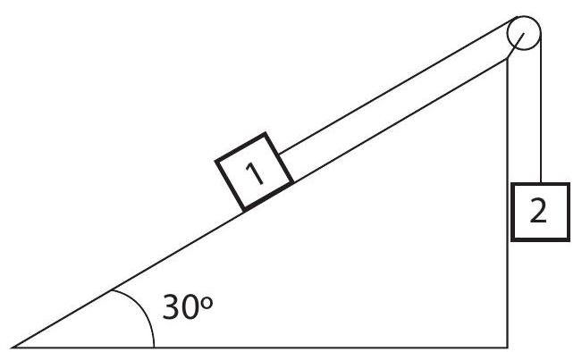
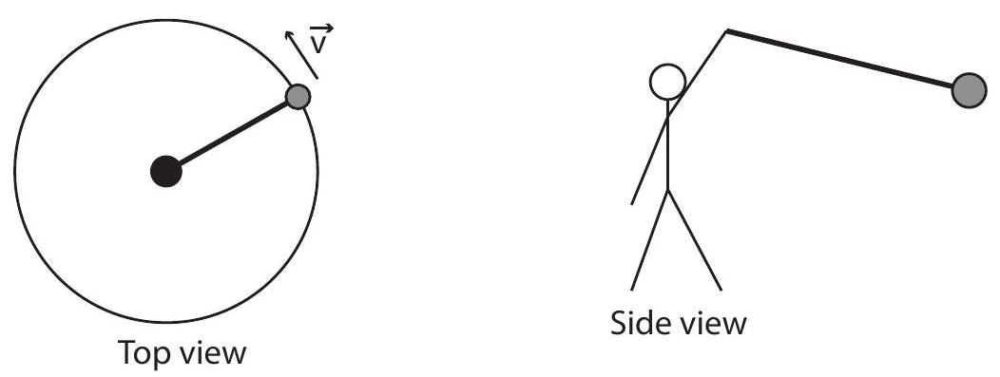

(sec-8.1)=
## 8.1 Dealing with forces in two dimensions

We have been able to get a lot of physics from our study of (mostly) one-dimensional motion only, but it goes without saying that the real world is a lot richer than that, and there are a number of new and interesting phenomena that appear when one considers motion in two or three dimensions. The purpose of this chapter is to introduce you to some of the simplest two-dimensional situations of physical interest.

A common feature to all these problems is that the forces acting on the objects under consideration will typically not line up with the displacements. This means, in practice, that we need to pay more attention to the vector nature of these quantities than we have done so far. This section will present a brief reminder of some basic properties of vectors, and introduce a couple of simple principles for the analysis of the systems that will follow.

To begin with, recall that a vector is a quantity that has both a magnitude and a direction. The magnitude of the vector just tells us how big it is: the magnitude of the velocity vector, for instance, is the speed, that is, just how fast something is moving. When working with vectors in one dimension, we have typically assumed that the entire vector (whether it was a velocity, an acceleration or a force) lay along the line of motion of the system, and all we had to do to indicate the direction was to give the vector's magnitude an appropriate sign. For the problems that follow, however, it will become essential to break up the vectors into their components along an appropriate set of axes. This involves very simple geometry, and follows the example of the position vector $\vec{r}$, whose components are just the Cartesian coordinates of the point it locates in space (as shown in {numref}`Figure %s <fig-1.1>`). For a generic vector, for instance, a force, like the one shown in {numref}`Figure %s <fig-8.1>` below, the components $F_{x}$ and $F_{y}$ may be obtained from a right triangle, as indicated there:

:::{figure} ../images/2024_09_14_9969b06773f10b6936e8g-180.jpg
:label: fig-8.1
:alt: The components of a vector that makes an angle theta with the positive x axis. Two examples are shown, for theta<90circ (in which case Fx>0 ) and for 90circ<theta<180circ (in which case Fx<0 ). In both cases, Fy>0.
The components of a vector that makes an angle $\theta$ with the positive $x$ axis. Two examples are shown, for $\theta<90^{\circ}$ (in which case $F_{x}>0$ ) and for $90^{\circ}<\theta<180^{\circ}$ (in which case $F_{x}<0$ ). In both cases, $F_{y}>0$.
:::

The triangle will always have the vector's magnitude $(|\vec{F}|$ in this case $)$ as the hypothenuse. The two other sides should be parallel to the coordinate axes. Their lengths are the corresponding components, except for a sign that depends on the orientation of the vector. If we happen to know the angle $\theta$ that the vector makes with the positive $x$ axis, the following relations will always hold:

:::{math}
:label: eq-8.1
\begin{align*}
F_{x} & =|\vec{F}| \cos \theta \\
F_{y} & =|\vec{F}| \sin \theta \\
|\vec{F}| & =\sqrt{F_{x}^{2}+F_{y}^{2}} \\
\theta & =\tan ^{-1} \frac{F_{y}}{F_{x}}
\end{align*}
:::

Note, however, that in general this angle $\theta$ may not be one of the interior angles of the triangle (as shown on the right diagram in {numref}`Fig. %s <fig-8.1>`), and that in that case it may just be simpler to calculate the magnitude of the components using trigonometry and an interior angle (such as $180^{\circ}-\theta$ in the example), and give them the appropriate signs \"by hand.\" In the example on the right, the length of the horizontal side of the triangle is equal to $|\vec{F}| \cos \left(180^{\circ}-\theta\right)$, which is a positive quantity; the correct value for $F_{x}$, however, is the negative number $|\vec{F}| \cos \theta=-|\vec{F}| \cos \left(180^{\circ}-\theta\right)$.

In any case, it is important not to get fixated on the notion that \"the $x$ component will always be proportional to the cosine of $\theta$.\" The symbol $\theta$ is just a convenient one to use for a generic angle. There are four sections in this chapter, and in every one there is a $\theta$ used with a different meaning. When in doubt, just draw the appropriate right triangle and remember from your trigonometry classes which side goes with the sine, and which with the cosine.

For the problems that we are going to study in this chapter, the idea is to break up all the forces involved into components along properly-chosen coordinate axes, then add all the components along any given direction, and apply $F_{n e t}=m a$ along that direction: that is to say, we will write (and\
eventually solve) the equations

:::{math}
:label: eq-8.2
\begin{align*}
F_{n e t, x} & =m a_{x} \\
F_{n e t, y} & =m a_{y}
\end{align*}
:::

We can show that Eqs. {eq}`eq-8.2` must hold for any choice of orthogonal $x$ and $y$ axes, based on the fact that we know $\vec{F}_{\text {net }}=m \vec{a}$ holds along one particular direction, namely, the direction common to $\vec{F}_{n e t}$ and $\vec{a}$, and the fact that we have defined the projection procedure to be the same for any kind of vector. {numref}`Figure %s <fig-8.2>` shows how this works. Along the dashed line you just have the situation that is by now familiar to us from one-dimensional problems, where $\vec{a}$ lies along $\vec{F}$ (assumed here to be the net force), and $|\vec{F}|=m|\vec{a}|$. However, in the figure I have chosen the axes to make an angle $\theta$ with this direction. Then, if you look at the projections of $\vec{F}$ and $\vec{a}$ along the $x$ axis, you will find

:::{math}
:label: eq-8.3
\begin{align*}
& a_{x}=|\vec{a}| \cos \theta \\
& F_{x}=|\vec{F}| \cos \theta=m|\vec{a}| \cos \theta=m a_{x}
\end{align*}
:::

and similarly, $F_{y}=m a_{y}$. In words, each component of the force vector is responsible for only the corresponding component of the acceleration. A force in the $x$ direction does not cause any acceleration in the $y$ direction, and vice-versa.

:::{figure} ../images/2024_09_14_9969b06773f10b6936e8g-181.jpg
:label: fig-8.2
:alt: If you take the familiar, one-dimensional (see the black dashed line) form of F vector=m a vector, and project it onto orthogonal, rotated axes, you get the general two-dimensional case, showing that each orthogonal component of the acceleration is proportional, via the mass m, to only the corresponding component of the force (Eqs. ).
If you take the familiar, one-dimensional (see the black dashed line) form of $\vec{F}=m \vec{a}$, and project it onto orthogonal, rotated axes, you get the general two-dimensional case, showing that each orthogonal component of the acceleration is proportional, via the mass $m$, to only the corresponding component of the force (Eqs. {eq}`eq-8.2`).
:::

In the rest of the chapter we shall see how to use Eqs. {eq}`eq-8.2` in a number of examples. One thing I can anticipate is that, in general, we will try to choose our axes (unlike in {numref}`Fig. %s <fig-8.2>` above) so that one of them does coincide with the direction of the acceleration, so the motion along the other direction is either nonexistent $(v=0)$ or trivial (constant velocity).

(sec-8.2)=
## 8.2 Projectile motion

Projectile motion is basically just free fall, only with the understanding that the object we are tracking was \"projected,\" or \"shot,\" with some initial velocity (as opposed to just dropped from rest). Unlike in the previous cases of free fall that we have studied so far, we will now assume that the initial velocity has a horizontal component, as a result of which, instead of just going straight up and/or down, the object will describe (ignoring air resistance, as usual) a parabola in a vertical plane.

The plane in question is determined by the initial velocity (more precisely, the horizontal component of the initial velocity) and gravity. A generic trajectory is shown in {numref}`Figure %s <fig-8.3>`, showing the force and acceleration vectors (constant throughout) and the velocity vector at various points along the path.

:::{figure} ../images/2024_09_14_9969b06773f10b6936e8g-182.jpg
:label: fig-8.3
:alt: A typical projectile trajectory. The velocity vector (in green) is shown at the initial time, the point of maximum height, and the point where the projectile is back to its initial height.
A typical projectile trajectory. The velocity vector (in green) is shown at the initial time, the point of maximum height, and the point where the projectile is back to its initial height.
:::

Conceptually, the problem turns out to be extremely simple if we apply the basic principle introduced in {ref}`Section 8.1 <sec-8.1>`. The force is vertical throughout; so, after the throw, there is no horizontal acceleration, and the vertical acceleration is just $-g$, just as it always was in our earlier, onedimensional free-fall problems:

:::{math}
:label: eq-8.4
\begin{align*}
& a_{x}=\frac{F_{x}}{m}=0 \\
& a_{y}=\frac{F_{y}}{m}=-g
\end{align*}
:::

The overall motion, then, is a combination of motion with constant velocity horizontally, and motion with constant acceleration vertically, and we can write down the corresponding equations of motion immediately:

:::{math}
:label: eq-8.5
\begin{align*}
v_{x} & =v_{x, i} \\
v_{y} & =v_{y, i}-g t \\
x & =x_{i}+v_{x, i} t \\
y & =y_{i}+v_{y, i} t-\frac{1}{2} g t^{2}
\end{align*}
:::

where $\left(x_{i}, y_{i}\right)$ are the coordinates of the launching point (there is usually no reason to make $x_{i}$ anything other than zero, so we will do that below), and $\left(v_{x, i}, v_{y, i}\right)$ the initial components of the velocity vector.

By eliminating $t$ in between the last two Eqs. {eq}`eq-8.5`, we get the equation of the trajectory in the $x-y$ plane:

:::{math}
:label: eq-8.6
y=y_{i}+\frac{v_{y, i}}{v_{x, i}} x-\frac{g}{2 v_{x, i}^{2}} x^{2}
:::

which, as indicated earlier, and as shown in {numref}`Fig. %s <fig-8.3>`, is indeed the equation of a parabola.\
The apex of the parabola (highest point in the trajectory) is at $x_{\text {max height }}=v_{x, i} v_{y, i} / g$. We can get this result from calculus, or from a comparison of {numref}`Eq. %s <eq-8.6>` with the canonical form of a parabola, or we can use some physics: the maximum height is reached, as usual, when the vertical velocity becomes momentarily zero, so solving the $v_{y}$ {numref}`Equation %s <eq-8.5>` for $t_{\text {max }}$ height and substituting in the $x$ equation, we get

:::{math}
:label: eq-8.7
\begin{align*}
t_{\text {max height }} & =\frac{v_{y, i}}{g} \\
x_{\text {max height }} & =\frac{v_{x, i} v_{y, i}}{g} \\
y_{\text {max height }} & =y_{i}+\frac{v_{y, i}^{2}}{2 g}
\end{align*}
:::

The last of these equations should look familiar. It is, indeed a variation on our old friend $v_{f}^{2}-v_{i}^{2}=$ $-2 g \Delta y$, only now instead of the full velocity $\vec{v}$ we have to use only the vertical velocity component $v_{y}$. Just like for one-dimensional motion, this result follows again from conservation of energy: throughout the flight, we must have $K+U^{G}=$ constant, only now there is a component to the kinetic energy - the part associated with the horizontal motion - which remains constant on its own. In general, the kinetic energy of a particle will be $\frac{1}{2} m|\vec{v}|^{2}$, where $|\vec{v}|$ is the magnitude of the velocity vector - that is to say, the speed. In two dimensions, this gives

:::{math}
:label: eq-8.8
K=\frac{1}{2} m v_{x}^{2}+\frac{1}{2} m v_{y}^{2}
:::

For projectile motion, however, $v_{x}$ does not change, so any change in $K$ will affect only the second term in {numref}`Eq. %s <eq-8.8>`. Conservation of energy between any two instants $i$ and $f$ gives

:::{math}
:label: eq-8.9
K+U^{G}=\frac{1}{2} m v_{x, i}^{2}+\frac{1}{2} m v_{y, i}^{2}+m g y_{i}=\frac{1}{2} m v_{x, i}^{2}+\frac{1}{2} m v_{y, f}^{2}+m g y_{f}
:::

The $\frac{1}{2} m v_{x, i}^{2}$ term cancels, and therefore

:::{math}
:label: eq-8.10
v_{y, f}^{2}-v_{y, i}^{2}=-2 g\left(y_{f}-y_{i}\right)
:::

Another quantity of interest is the projectile's range, or maximum horizontal distance traveled. We can calculate it from Eqs. {eq}`eq-8.5`, by setting $y$ equal to the final height, then solving for $t$ (which generally requires solving a quadratic equation), and then substituting the result in the equation for $x$. In the simple case when the final height is the same as the initial height, we can avoid the need for calculating altogether, and just reason, from the fact that the trajectory is symmetric, that the total horizontal distance traveled will be twice the distance to the point where the maximum height is reached, that is, $x_{\text {range }}=2 x_{\text {max height }}$ :

:::{math}
:label: eq-8.11
x_{\text {range }}=\frac{2 v_{x, i} v_{y, i}}{g} \quad\left(\text { only if } y_{f}=y_{i}\right)
:::

As you can see, all these equations depend on the initial values of the components of the velocity vector $\vec{v}_{i}$. If $\vec{v}_{i}$ makes an angle $\theta$ with the horizontal, and we simplify the notation by calling its magnitude $v_{i}$, then we can write

:::{math}
:label: eq-8.12
\begin{align*}
& v_{x, i}=v_{i} \cos \theta \\
& v_{y, i}=v_{i} \sin \theta
\end{align*}
:::

In terms of $v_{i}$ and $\theta$, the range {numref}`Equation %s <eq-8.11>` becomes

:::{math}
:label: eq-8.13
x_{\text {range }}=\frac{v_{i}^{2} \sin (2 \theta)}{g} \quad\left(\text { only if } y_{f}=y_{i}\right)
:::

since $2 \sin \theta \cos \theta=\sin (2 \theta)$. This tells us that for any given launch speed, the maximum range is achieved when the launch angle $\theta=45^{\circ}$ (always assuming the final height is the same as the initial height).

In real life, of course, there will always be air resistance, and all these results will be modified somewhat. Mathematically, things become a lot more complicated: the drag force depends on the speed, which involves both components of the velocity, so the horizontal and vertical motions are no longer decoupled: not only is there now an $F_{x}$, but its value at any given time depends both on $v_{x}$ and $v_{y}$. Physically, you may think of the drag force as doing negative work on the projectile, and hence removing kinetic energy from it. Less kinetic energy means, basically, that it will not travel quite as far either vertically or horizontally. Surprisingly, the optimum launch angle remains pretty close to $45^{\circ}$, at least if the simulations at this link are accurate:\
<https://phet.colorado.edu/en/simulation/projectile-motion>

(sec-8.3)=
## 8.3 Inclined planes

Back in {ref}`Chapter 2 <ch-2>`, I stated without proof that the acceleration of an object sliding, without friction, down an inclined plane making an angle $\theta$ with the horizontal was $g \sin \theta$. I can show you now why this is so, and introduce friction as well.\
:::{figure} ../images/2024_09_14_9969b06773f10b6936e8g-185.jpg
:label: fig-8.4
:alt: A block sliding down an inclined plane. The corresponding free-body diagram is shown on the right.
A block sliding down an inclined plane. The corresponding free-body diagram is shown on the right.
:::

{numref}`Figure %s <fig-8.4>` above shows, on the left, a block sliding down an inclined plane and all the forces acting on it. These are more clearly seen on the free-body diagram on the right. I have labeled all the forces using the $\vec{F}_{b y, o n}^{\text {type }}$ convention introduced back in {ref}`Chapter 6 <ch-6>` (so, for instance, $\vec{F}_{s b}^{k}$ is the force of kinetic friction exerted by the surface on the block); however, later on, for algebraic manipulations, and especially where $x$ and $y$ components need to be taken, I will drop the \"by, on\" subscripts, and just let the \"type\" superscript identify the force in question.

The diagrams also show the coordinate axes I have chosen: the $x$ axis is along the plane, and the $y$ is perpendicular to it. The advantage of this choice is obvious: the motion is entirely along one of the axes, and two of the forces (the normal force and the friction) already lie along the axes. The only force that does not is the block's weight (that is, the force of gravity), so we need to decompose it into its $x$ and $y$ components. For this, we can make use of the fact, which follows from basic geometry, that the angle of the incline, $\theta$, is also the angle between the vector $\vec{F}^{g}$ and the negative $y$ axis. This means we have

:::{math}
:label: eq-8.14
\begin{align*}
& F_{x}^{g}=F^{g} \sin \theta \\
& F_{y}^{g}=-F^{g} \cos \theta
\end{align*}
:::

Equations {eq}`eq-8.14` also show another convention I will adopt from now, namely, that whenever the symbol for a vector is shown without an arrow on top or an $x$ or $y$ subscript, it will be understood to refer to the magnitude of the vector, which is always a positive number by definition.

Newton's second law, as given by equations {eq}`eq-8.4` applied to this system, then reads:

:::{math}
:label: eq-8.15
F_{x}^{g}+F_{x}^{k}=m a_{x}=F^{g} \sin \theta-F^{k}
:::

for the motion along the plane, and

:::{math}
:label: eq-8.16
F_{y}^{g}+F_{y}^{n}=m a_{y}=-F^{g} \cos \theta+F^{n}
:::

for the direction perpendicular to the plane. Of course, since there is no motion in this direction, $a_{y}$ is zero. This gives us immediately the value of the normal force:

:::{math}
:label: eq-8.17
F^{n}=F^{g} \cos \theta=m g \cos \theta
:::

since $F^{g}=m g$. We can also use the result {eq}`eq-8.17`, together with {numref}`Eq. %s <eq-6.30>`, to get the magnitude of the friction force, assuming we know the coefficient of kinetic (or sliding) friction, $\mu_{k}$ :

:::{math}
:label: eq-8.18
F^{k}=\mu_{k} F^{n}=\mu_{k} m g \cos \theta
:::

Substituting this and $F^{g}=m g$ in {numref}`Eq. %s <eq-8.15>`, we get

:::{math}
:label: eq-8.19
m a_{x}=m g \sin \theta-\mu_{k} m g \cos \theta
:::

We can eliminate the mass to obtain finally

:::{math}
:label: eq-8.20
a_{x}=g\left(\sin \theta-\mu_{k} \cos \theta\right)
:::

which is the desired result. In the absence of friction $\left(\mu_{k}=0\right)$ this gives $a=g \sin \theta$, as we had in {ref}`Chapter 2 <ch-2>`. Note that, if you reduce the tilt of the surface (that is, make $\theta$ smaller), the $\cos \theta$ term in {numref}`Eq. %s <eq-8.20>` grows and the $\sin \theta$ term gets smaller, so we must make sure that we do not use this equation when $\theta$ is too small or we would get the absurd result that $a_{x}<0$, that is, that the force of kinetic friction has overcome gravity and is accelerating the object upwards!

Of course, we know from experience that what happens when $\theta$ is very small is that the block does not slide: it is held in place by the force of static friction. The diagram for such a situation looks the same as {numref}`Fig. %s <fig-8.4>`, except that $\vec{a}=0$, the force of friction is $F^{s}$ instead of $F^{k}$, and of course its magnitude must match that of the $x$ component of gravity. {numref}`Equation %s <eq-8.15>` then becomes

:::{math}
:label: eq-8.21
m a_{x}=0=F^{g} \sin \theta-F^{s}
:::

Recall from {ref}`Chapter 6 <ch-6>` that the force of static friction does not have a fixed value: rather, it will match the applied force up to a maximum value given by {numref}`Eq. %s <eq-6.29>`:

:::{math}
:label: eq-8.22
F_{\max }^{s}=\mu_{s} F^{n}=\mu_{s} m g \cos \theta
:::

where I have used {numref}`Eq. %s <eq-8.17>`, since clearly the {numref}`Equation %s <eq-8.16>` still applies along the vertical direction. So, on the one hand we have the requirement that $F^{s}=m g \sin \theta$ to keep the block from\
sliding, and on the other hand the constraint $F^{s} \leq \mu_{s} m g \cos \theta$. Putting these together we conclude that the block will not slide as long as

:::{math}
:label: eq-8.23
m g \sin \theta \leq \mu_{s} m g \cos \theta
:::

or

:::{math}
:label: eq-8.24
\tan \theta \leq \mu_{s}
:::

In short, as long as $\theta$ is small enough to satisfy {numref}`Eq. %s <eq-8.24>`, the block will not move. Once $\theta$ exceeds the value $\tan ^{-1} \mu_{s}$, we can apply the result {eq}`eq-8.20` for the acceleration. Note that, since we always have $\mu_{s} \geq \mu_{k}$, the result {eq}`eq-8.20` will always be positive if $\theta>\tan ^{-1} \mu_{s}$, that is, if $\sin \theta>\mu_{s} \cos \theta$.

What if we send the block sliding $u p$ the plane instead? The acceleration would still be pointing down (since the object would be slowing down all the while), but now the force of kinetic friction would point in the direction opposite that indicated in {numref}`Figure %s <fig-8.4>`, since it always must oppose the motion. If you go through the same analysis I carried out above, you will get that $a_{x}=$ $g\left(\sin \theta+\mu_{k} \cos \theta\right)$ in that case, since now friction and gravity are working together to slow the motion down.

(sec-8.4)=
## 8.4 Motion on a circle (or part of a circle)

The last example of motion in two dimensions that I will consider in this chapter is motion on a circle. There are many examples of circular (or near-circular) motion in nature, particularly in astronomy (as we shall see in a later chapter, the orbits of most planets and many satellites are very nearly circular). There are also many devices that we use all the time that involve rotating or spinning objects (wheels, gears, turntables, turbines\...). All of these can be mathematically described as collections of particles moving in circles.

In this section, I will first introduce the concept of centripetal force, which is the force needed to bend an object's trajectory into a circle (or an arc of a circle), and then I will also introduce a number of quantities that are useful for the description of circular motion in general, such as angular velocity and angular acceleration. The dynamics of rotational motion (questions having to do with rotational energy, and a new important quantity, angular momentum) will be the subject of the next chapter.

(sec-8.4.1)=
### 8.4.1 Centripetal acceleration and centripetal force

As you know by now, the law of inertia states that, in the absence of external forces, an object will move with constant speed on a straight line. A circle is not a straight line, so an object will not naturally follow a circular path unless there is a force acting on it.

Another way to see this is to go back to the definition of acceleration. If an object has a velocity vector $\vec{v}(t)$ at the time $t$, and a different velocity vector $\vec{v}(t+\Delta t)$ at the later time $t+\Delta t$, then its average acceleration over the time interval $\Delta t$ is the quantity $\vec{v}_{a v}=(\vec{v}(t+\Delta t)-\vec{v}(t)) / \Delta t$. This is nonzero even if the speed does not change (that is, even if the two velocity vectors have the same magnitude), as long as they have different directions, as you can see from {numref}`Figure %s <fig-8.5>` below. Thus, motion on a circle (or an arc of a circle), even at constant speed, is accelerated motion, and, by Newton's second law, accelerated motion requires a force to make it happen.\
:::{figure} ../images/2024_09_14_9969b06773f10b6936e8g-188.jpg
:label: fig-8.5
:alt: A particle moving along an arc of a circle of radius R. The positions and velocities at the times t and t+delta t are shown. The diagram on the right shows the velocity difference, delta v vector=v vector(t+delta t)-v vector(t).
A particle moving along an arc of a circle of radius $R$. The positions and velocities at the times $t$ and $t+\Delta t$ are shown. The diagram on the right shows the velocity difference, $\Delta \vec{v}=\vec{v}(t+\Delta t)-\vec{v}(t)$.
:::

We can find out how large this acceleration, and the associated force, have to be, by applying a little geometry and trigonometry to the situation depicted in {numref}`Figure %s <fig-8.5>`. Here a particle is moving along an arc of a circle of radius $r$, so that at the time $t$ it is at point P and at the later time $t+\Delta t$ it is at point Q . The length of the arc between P and Q (the distance it has traveled) is $s=R \theta$, where the angle $\theta$ is understood to be in radians. I have assumed the speed to be constant, so the magnitude of the velocity vector, $v$, is just equal to the ratio of the distance traveled (along the circle), to the time elapsed: $v=s / \Delta t$.

Despite the speed being constant, the motion is accelerated, as I just said above, because the direction of the velocity vector changes. The diagram on the right shows the velocity difference vector $\Delta \vec{v}=\vec{v}(t+\Delta t)-\vec{v}(t)$. We can get its length from trigonometry: if we split the angle $\theta$ in half, we get two right triangles, and for each of them $|\Delta \vec{v}| / 2=v \sin (\theta / 2)$. Thus, we have

:::{math}
:label: eq-8.25
\left|\vec{a}_{a v}\right|=\frac{|\Delta \vec{v}|}{\Delta t}=\frac{2 v \sin (\theta / 2)}{\Delta t}
:::

for the magnitude of the average acceleration vector. The instantaneous acceleration is obtained by taking the limit of this expression as $\Delta t \rightarrow 0$. In this limit, the angle $\theta=s / R=v \Delta t / R$ becomes\
very small, and we can use the so-called \"small angle approximation,\" which states that $\sin x \simeq x$ when $x$ is small and expressed in radians. Therefore, by {numref}`Eq. %s <eq-8.25>`,

:::{math}
:label: eq-8.26
\left|\vec{a}_{a v}\right|=\frac{2 v \sin (\theta / 2)}{\Delta t} \simeq \frac{v \theta}{\Delta t}=\frac{v^{2} \Delta t / R}{\Delta t}
:::

This expression becomes exact as $\Delta t \rightarrow 0$, and then $\Delta t$ cancels out, showing the instantaneous acceleration has magnitude

:::{math}
:label: eq-8.27
|\vec{a}|=a_{c}=\frac{v^{2}}{R}
:::

This acceleration is called the centripetal acceleration, which is why I have denoted it by the symbol $a_{c}$. The reason for that name is that it is always pointing towards the center of the circle. You can kind of see this from {numref}`Figure %s <fig-8.5>`: if you take the vector $\Delta \vec{v}$ shown there, and move it (without changing its direction, so it stays 'parallel to itself\") to the midpoint of the arc, halfway between points P and Q, you will see that it does point almost straight to the center of the circle. (A more mathematically rigorous proof of this fact, using calculus, will be presented in the next chapter, {ref}`section 9.3 <sec-9.3>`.)

The force $\vec{F}_{c}$ needed to provide this acceleration is called the centripetal force, and by Newton's second law it has to satisfy $\vec{F}_{c}=m \vec{a}_{c}$. Thus, the centripetal force has magnitude

:::{math}
:label: eq-8.28
F_{c}=m a_{c}=\frac{m v^{2}}{R}
:::

and, like the acceleration $\vec{a}_{c}$, is always directed towards the center of the circle.\
Physically, the centripetal force $F_{c}$, as given by {numref}`Eq. %s <eq-8.28>`, is what it takes to bend the trajectory so as to keep it precisely on an arc of a circle of radius $R$ and with constant speed $v$. Note that, since $\vec{F}_{c}$ is always perpendicular to the displacement (which, over any short time interval, is essentially tangent to the circle), it does no work on the object, and therefore (by {numref}`Eq. %s <eq-7.11>`) its kinetic energy does not change, so $v$ does indeed stay constant when the centripetal force equals the net force. Note also that \"centripetal\" is just a job description: it is not a new type of force. In any given situation, the role of the centripetal force will be played by one of the forces we are already familiar with, such as the tension on a rope (or an appropriate component thereof) when you are swinging an object in a horizontal circle, or gravity in the case of the moon or any other satellite.

At this point, if you have never heard about the centripetal force before, you may be feeling a little confused, since you almost certainly have heard, instead, about a so-called centrifugal force that tends to push spinning things away from the center of rotation. In fact, however, this \"centrifugal force\" does not really exist: the \"force\" that you may feel pushing you towards the outside of a curve when you ride in a vehicle that makes a sharp turn is really nothing but your own inertia-your body \"wants\" to keep moving on a straight line, but the car, by bending its trajectory, is preventing it from doing so. The impression that you get that you would fly radially out, as opposed to along a tangent, is also entirely due to the fact that the reference frame you are in (the car) is continuously\
changing its direction of motion. You will find this effect illustrated in some detail in an example in the \"Advanced Topics\" section, if you want to look at it in more depth.

On the other hand, getting a car to safely negotiate a turn is actually an important example of a situation that requires a definite centripetal force. On a flat surface (see the \"Advanced Topics\" section for a treatment of a banked curve!), you rely entirely on the force of static friction to keep you on the track, which can typically be modeled as an arc of a circle with some radius $R$. So, if you are traveling at a speed $v$, you need $F^{s}=m v^{2} / R$. Recalling that the force of static friction cannot exceed $\mu_{s} F^{n}$, and that on a flat surface you would just have $F^{n}=F^{g}=m g$, you see you need to keep $m v^{2} / R$ smaller than $\mu_{s} m g$; or, canceling the mass,

:::{math}
:label: eq-8.29
\frac{v^{2}}{R}<\mu_{s} g
:::

This is the condition that has to hold in order to be able to make the turn safely. The maximum speed is then $v_{\max }=\sqrt{\mu_{s} g R}$, which, as you can see, will depend on the state of the road (for instance, if the road is wet the coefficient $\mu_{s}$ will be smaller). The posted, recommended speed will typically take this into consideration and will be as low as it has to be to keep you safe. Notice that the left-hand side of {numref}`Eq. %s <eq-8.29>` increases as the square of the speed, so doubling your speed makes that term four times larger! Do not even think of taking a turn at 60 mph if the recommended speed is 30 , and do not exceed the recommended speed at all if the road is wet or your tires are worn.

(sec-8.4.2)=
### 8.4.2 Kinematic angular variables

Consider a particle moving on a circle, as in {numref}`Figure %s <fig-8.6>` below (next page). Of course, we can just use the regular, cartesian coordinates, $x$ and $y$, to describe its motion. But, in a way, this is carrying around more information than we typically need, and it is also not very transparent: a value of $x$ and $y$ does not immediately tell us how far the object has traveled along the circle itself.

Instead, the most convenient way to describe the motion of the particle, if we know the radius of the circle, is to give the angle $\theta$ that the position vector makes with some reference axis at any given time, as shown in {numref}`Fig. %s <fig-8.6>`. If we choose the $x$ axis as the reference, then the conversion from a description based on the radius $R$ and the angle $\theta$ to a description in terms of $x$ and $y$ is simply

:::{math}
:label: eq-8.30
\begin{align*}
& x=R \cos \theta \\
& y=R \sin \theta
\end{align*}
:::

so knowing the function $\theta(t)$ we can immediately get $x(t)$ and $y(t)$, if we need them. (Note: in this section I am using an uppercase $R$ for the magnitude of the position vector, to emphasize that it is a constant, equal to the radius of the circle.)

:::{figure} ../images/2024_09_14_9969b06773f10b6936e8g-191.jpg
:label: fig-8.6
:alt: A particle moving on a circle. The position vector has length R, so the x and y coordinates are R cos theta and R sin theta, respectively. The conventional positive direction of motion is indicated. The velocity vector is always, as usual, tangent to the trajectory.
A particle moving on a circle. The position vector has length $R$, so the $x$ and $y$ coordinates are $R \cos \theta$ and $R \sin \theta$, respectively. The conventional positive direction of motion is indicated. The velocity vector is always, as usual, tangent to the trajectory.
:::

Although the angle $\theta$ itself is not a vector quantity, nor a component of a vector, it is convenient to allow for the possibility that it might be negative. The standard convention is that $\theta$ grows in the counterclockwise direction from the reference axis, and decreases in the clockwise direction. Of course, you can always get to any angle by coming from either direction, so the angle by itself does not tell you how the particle got there. Information on the direction of motion at any given time is best captured by the concept of the angular velocity, which we represent by the symbol $\omega$ and define in a manner analogous to the way we defined the ordinary velocity: if $\Delta \theta=\theta(t+\Delta t)-\theta(t)$ is the angular displacement over a time $\Delta t$, then

:::{math}
:label: eq-8.31
\omega=\lim _{\Delta t \rightarrow 0} \frac{\Delta \theta}{\Delta t}=\frac{d \theta}{d t}
:::

The standard convention is also to use radians as an angle measure in this context, so that the units of $\omega$ will be radians per second, or $\mathrm{rad} / \mathrm{s}$. Note that the radian is a dimensionless unit, so it \"disappears\" from a calculation when the final result does not call for it (as in {numref}`Eq. %s <eq-8.35>` below).

For motion with constant angular velocity, we clearly will have

:::{math}
:label: eq-8.32
\theta(t)=\theta_{i}+\omega\left(t-t_{i}\right) \quad \text { or } \quad \Delta \theta=\omega \Delta t \quad(\text { constant } \omega)
:::

where $\omega$ is positive for counterclockwise motion, and negative for clockwise. (There is a sense in which it is useful to think of $\omega$ as a vector, but, since it is not immediately obvious how or why, I will postpone discussion of this next chapter, after I have introduced angular momentum.)

When $\omega$ changes with time, we can introduce an angular acceleration $\alpha$, defined, again, in the obvious way:

:::{math}
:label: eq-8.33
\alpha=\lim _{\Delta t \rightarrow 0} \frac{\Delta \omega}{\Delta t}=\frac{d \omega}{d t}
:::

Then for motion with constant angular acceleration we have the formulas

:::{math}
:label: eq-8.34
\begin{align*}
& \omega(t)=\omega_{i}+\alpha\left(t-t_{i}\right) \quad \text { or } \quad \Delta \omega=\alpha \Delta t \quad(\text { constant } \alpha) \\
& \theta(t)=\theta_{i}+\omega_{i}\left(t-t_{i}\right)+\frac{1}{2} \alpha\left(t-t_{i}\right)^{2} \quad \text { or } \quad \Delta \theta=\omega_{i} \Delta t+\frac{1}{2} \alpha(\Delta t)^{2} \quad(\text { constant } \alpha)
\end{align*}
:::

Equations {eq}`eq-8.32` and {eq}`eq-8.34` completely parallel the corresponding equations for motion in one dimension that we saw in {ref}`Chapter 1 <ch-1>`. In fact, of course, a circle is just a line that has been bent in a uniform way, so the distance traveled along the circle itself is simply proportional to the angle swept by the position vector $\vec{r}$. As already pointed out in connection with {numref}`Fig. %s <fig-8.5>`, if we expressed $\theta$ in radians then the length of the arc corresponding to an angular displacement $\Delta \theta$ would be

:::{math}
:label: eq-8.35
s=R|\Delta \theta|
:::

so multiplying Eqs. {eq}`eq-8.32` or {eq}`eq-8.34` by $R$ directly gives the distance traveled along the circle in each case.

:::{figure} ../images/2024_09_14_9969b06773f10b6936e8g-192.jpg
:label: fig-8.7
:alt: A small angular displacement. The distance traveled along the circle, s=R delta theta, is almost identical to the straight-line distance |delta r vector| between the initial and final positions; the two quantities become the same in the limit delta t arrow 0.
A small angular displacement. The distance traveled along the circle, $s=R \Delta \theta$, is almost identical to the straight-line distance $|\Delta \vec{r}|$ between the initial and final positions; the two quantities become the same in the limit $\Delta t \rightarrow 0$.
:::

{numref}`Figure %s <fig-8.7>` shows that, for very small angular displacements, it does not matter whether the distance traveled is measured along the circle itself or on a straight line; that is, $s \simeq|\Delta \vec{r}|$. Dividing by $\Delta t$, using {numref}`Eq. %s <eq-8.35>` and taking the $\Delta t \rightarrow 0$ limit we get the following useful relationship between the angular velocity and the instantaneous speed $v$ (defined in the ordinary way as the distance traveled per unit time, or the magnitude of the velocity vector):

:::{math}
:label: eq-8.36
|\vec{v}|=R|\omega|
:::

As we shall see later, the product $R \alpha$ is also a useful quantity. It is not, however, equal to the magnitude of the acceleration vector, but only one of its two components, the tangential acceleration:

:::{math}
:label: eq-8.37
a_{t}=R \alpha
:::

The sign convention here is that a positive $a_{t}$ represents a vector that is tangent to the circle and points in the direction of increasing $\theta$ (that is, counterclockwise); the full acceleration vector is equal to the sum of this vector and the centripetal acceleration vector, introduced in the previous subsection, which always points towards the center of the circle and has magnitude

:::{math}
:label: eq-8.38
a_{c}=\frac{v^{2}}{R}=R \omega^{2}
:::

(making use of Eqs. {eq}`eq-8.29` and {eq}`eq-8.36`). These results will be formally established in the next chapter, after we introduce the vector product, although you could also verify them right now-if you are familiar enough with derivatives at this point - by using the chain rule to take the derivatives with respect to time of the components of the position vector, as given in {numref}`Eq. %s <eq-8.30>` (with $\theta=\theta(t)$, an arbitrary function of time).

The main thing to remember about the radial and tangential components of the acceleration is that the radial component (the centripetal acceleration) is always there for circular motion, whether the angular velocity is constant or not, whereas the tangential acceleration is only nonzero if the angular velocity is changing, that is to say, if the particle is slowing down or speeding up as it turns.

(sec-8.5)=
## 8.5 In summary

1.  To solve problems involving motion in two dimensions, you should break up all the forces into their components along a suitable pair of orthogonal axes, then apply Newton's second law to each direction separately: $F_{n e t, x}=m a_{x}, F_{n e t, y}=m a_{y}$. It is convenient to choose your axes so that at least one of either $a_{x}$ or $a_{y}$ will be zero.

2.  An object thrown with some horizontal velocity component and moving under the influence of gravity alone (near the surface of the Earth) will follow a parabola in a vertical plane. This results from horizontal motion with constant velocity, and vertical motion with constant acceleration equal to $-g$, as described by equations {eq}`eq-8.7`.

3.  To analyze motion up or down an inclined plane, it is convenient to choose your axes so that the $x$ axis lies along the surface, and the $y$ axis is perpendicular to the surface. Then, if $\theta$ is the angle the incline makes with the horizontal, the force of gravity on the object will also make an angle $\theta$ with the negative $y$ axis.

4.  Recall that the force of kinetic friction will always point in a direction opposite the motion, and will have magnitude $F^{k}=\mu_{k} F^{n}$, whereas the force of static friction will always take\
    on whatever value is necessary to keep the object from moving, up to a maximum value of $F_{\text {max }}^{s}=\mu_{s} F^{n}$.

5.  An object moving in an arc of a circle of radius $R$ with a speed $v$ experiences a centripetal acceleration of magnitude $a_{c}=v^{2} / R$. \"Centripetal\" means the corresponding vector points towards the center of the circle. Accordingly, to get an object of mass $m$ to move on such a path requires a centripetal force $F_{c}=m v^{2} / R$.

6.  To describe the motion of a particle on a circle of radius $R$, we use an angular position variable $\theta(t)$, in terms of which we define angular displacement $\Delta \theta$, angular velocity $\omega=d \theta / d t$, and angular acceleration $\alpha=d \omega / d t$. The equations for motion in one dimension with constant acceleration apply to circular motion with constant $\alpha$ with the changes $x \rightarrow \theta, v \rightarrow \omega$ and $a \rightarrow \alpha$.

7.  The displacement along the circle, $s$, corresponding to an angular displacement $\Delta \theta$, is (in magnitude) $s=R|\Delta \theta|$. Similarly, the (linear) speed of the particle (magnitude of its velocity vector) is equal to $v=R|\omega|$, and the tangential component of its acceleration vector has magnitude $a_{t}=R|\alpha|$. In addition to this, the particle always has a radial acceleration component $a_{r}$ equal to the centripetal acceleration of point 5 above.

(sec-8.6)=
## 8.6 Examples

You will work out a rather thorough example of projectile motion in the lab, and {ref}`Section 8.3 <sec-8.3>` above already has the problem of a block sliding down an inclined plane worked out for you. The following example will show you how to use the kinematic angular variables of {ref}`section 8.4.2 <sec-8.4.2>` to deal with motion in a circle, and to calculate the centripetal acceleration in a simple situation. The section on Advanced Topics deals with a few more challenging (but interesting) examples.

(sec-8.6.1)=
### 8.6.1 The penny on the turntable

Suppose that you have a penny sitting on a turntable, a distance $d=10 \mathrm{~cm}$ from the axis of rotation. Assume the turntable starts moving, steadily spinning up from rest, in such a way that after 1.3 seconds it has reached its final rotation rate of 33.3 rpm (revolutions per minute). Answer the following questions:\
(a) What was the turntable's angular acceleration over the time interval from $t=0$ to $t=1.3 \mathrm{~s}$ ?\
(b) How many turns (complete and fractional) did the turntable make before reaching its final velocity?\
(c) Assuming the penny has not slipped, what is its centripetal acceleration once the turntable reaches its final velocity?\
(d) How large does the static friction coefficient between the penny and the turntable have to be for the penny not to slip throughout this process?

(ch-8-solution)=
### Solution

\(a\) We are told that the turntable spins up \"steadily\" from $t=0$ to $t=1.3 \mathrm{~s}$. The word \"steadily\" here is a keyword that means the (angular) acceleration is constant (that is, the angular velocity increases at a constant rate).

What is this rate? For constant $\alpha$, we have, from {numref}`Eq. %s <eq-8.34>`, $\alpha=\Delta \omega / \Delta t$. Here, the time interval $\Delta t=1.3$, so we just need to find $\Delta \omega$. By definition, $\Delta \omega=\omega_{f}-\omega_{i}$, and since we start from rest, $\omega_{i}=0$. So we just need $\omega_{f}$. We are told that \"the final rotation rate\" is 33.3 rpm (revolutions per minute). What does this tell us about the angular velocity?

The angular velocity is the number of radians an object moving in a circle (such as the penny in this example) travels per second. A complete turn around the circle, or revolution, corresponds to $180^{\circ}$, or equivalently $2 \pi$ radians. So, 33.3 revolutions, or turns, per minute means $33.3 \times 2 \pi$ radians per 60 s, that is,

:::{math}
:label: eq-8.39
\omega_{f}=\frac{33.3 \times 2 \pi \mathrm{rad}}{60 \mathrm{~s}}=3.49 \frac{\mathrm{rad}}{\mathrm{s}}
:::

The angular acceleration, therefore, is

:::{math}
:label: eq-8.40
\alpha=\frac{\Delta \omega}{\Delta t}=\frac{\omega_{f}-\omega_{i}}{\Delta t}=\frac{3.49 \mathrm{rad} / \mathrm{s}}{1.3 \mathrm{~s}}=2.68 \frac{\mathrm{rad}}{\mathrm{s}^{2}}
:::

\(b\) The way to answer this question is to find out the total angular displacement, $\Delta \theta$, of the penny over the time interval considered (from $t=0$ to $t=1.3 \mathrm{~s}$ ), and then convert this to a number of turns, using the relationship $2 \pi \mathrm{rad}=1$ turn. To get $\Delta \theta$, we should use the {numref}`Equation %s <eq-8.34>` for motion with constant angular acceleration:

:::{math}
:label: eq-8.41
\Delta \theta=\omega_{i} \Delta t+\frac{1}{2} \alpha(\Delta t)^{2}
:::

We start from rest, so $\omega_{i}=0$, We know $\Delta t=1.3 \mathrm{~s}$, and we just calculated $\alpha=2.68 \mathrm{rad} / \mathrm{s}^{2}$, so we have

:::{math}
:label: eq-8.42
\Delta \theta=\frac{1}{2} \times 2.68 \frac{\mathrm{rad}}{\mathrm{s}^{2}} \times(1.3 \mathrm{~s})^{2}=2.26 \mathrm{rad}
:::

This is less than $2 \pi$ radians, so it takes the turntable less than one complete revolution to reach its final angular velocity. To be precise, since $2 \pi$ radians is one turn, 2.26 rad will be $2.26 /(2 \pi)$ turns, which is to say, 0.36 turns-a little more than $1 / 3$ of a turn.\
(c) For the questions above, the penny just served as a marker to keep track of the revolutions of the turntable. Now, we turn to the dynamics of the motion of the penny itself. First, to get its angular acceleration, we can just use {numref}`Eq. %s <eq-8.38>`, in the form

:::{math}
:label: eq-8.43
a_{c}=R \omega^{2}=0.1 \mathrm{~m} \times\left(3.49 \frac{\mathrm{rad}}{\mathrm{s}}\right)^{2}=1.22 \frac{\mathrm{m}}{\mathrm{s}^{2}}
:::

noticing that $R$, the radius of the circle on which the penny moves, is just the distance $d$ to the axis of rotation that we were given at the beginning of the problem, and $\omega$, its angular velocity, is just the final angular velocity of the turntable (assuming, as we are told, that the penny has not slipped relative to the turntable).\
(d) Finally, how about the force needed to keep the penny from slipping - that is to say, to keep it moving with the turntable? This is just the centripetal force needed \"bend\" the trajectory of the penny into a circle of radius $R$, so $F_{c}=m a_{c}$, where $m$ is the mass of the penny and $a_{c}$ is the centripetal acceleration we just calculated. Physically, we know that this force has to be provided by the static (as long as the penny does not slip!) friction force between the penny and the turntable. We know that $F^{s} \leq \mu_{s} F^{n}$, and we have for the normal force, in this simple situation, just $F^{n}=m g$. Therefore, setting $F^{s}=m a_{c}$ we have:

:::{math}
:label: eq-8.44
m a_{c}=F^{s} \leq \mu_{s} F^{n}=\mu_{s} m g
:::

This is equivalent to the single inequality $m a_{c} \leq \mu_{s} m g$, where we can cancel out the mass of the penny to conclude that we must have $a_{c} \leq \mu_{s} g$, and therefore

:::{math}
:label: eq-8.45
\mu_{s} \geq \frac{a_{c}}{g}=\frac{1.22 \mathrm{~m} / \mathrm{s}^{2}}{9.8 \mathrm{~m} / \mathrm{s}^{2}}=0.124
:::

(sec-8.7)=
## 8.7 Advanced Topics

(sec-8.7.1)=
### 8.7.1 Staying on track

(This example studies a situation that you could easily setup experimentally at home (you can use a whole sphere instead of a half-sphere!), although to get the numbers to work out you really need to make sure that the friction between the surface and the object you choose is truly negligible. Essentially the same mathematical approach could be used to study the problem of a skier going over a mogul, or a car losing contact with the road if it is going too fast over a hill.)

A small object is placed at the top of a smooth (frictionless) dome shaped like a half-sphere of radius $R$, and given a small push so it starts sliding down the dome, initially moving very slowly $\left(v_{i} \simeq 0\right)$, but picking up speed as it goes, until at some point it flies off the surface.\
(a) At that point, when the object loses contact with the surface, what is the angle that its position vector (with origin at the center of the sphere) makes with the vertical?\
(b) How far away from the sphere does the object land?

.jpg)
(a)

:::{figure} ../images/2024_09_14_9969b06773f10b6936e8g-197.jpg
:label: fig-8.8
:alt: An object (small block) sliding on a hemispherical dome. The drawing (a) shows the angle thetamax at which the object flies off (red dashed line), and a smaller, generic angle theta. The drawing (b) shows the free-body diagram corresponding to the angle theta.
An object (small block) sliding on a hemispherical dome. The drawing (a) shows the angle $\theta_{\max }$ at which the object flies off (red dashed line), and a smaller, generic angle $\theta$. The drawing (b) shows the free-body diagram corresponding to the angle $\theta$.
:::

(b)

(ch-8-solution-1)=
### Solution

\(a\) As we saw in {ref}`Section 8.4 <sec-8.4>`, in order to get an object to move along an arc of a circle, a centripetal force of magnitude $m v^{2} / r$ is required. As long as our object is in contact with the surface, the forces acting on it are the normal force (which points along the radial direction, so it makes a negative contribution to the centrifugal force) and gravity, which has a component $m g \cos \theta$ along the radius, towards the center of the circle (see {numref}`Figure %s <fig-8.8>`(b), the dashed light blue line). So, the centripetal force equation reads

:::{math}
:label: eq-8.46
\frac{m v^{2}}{R}=m g \cos \theta-F^{n}
:::

The next thing we need to do is find the value of the speed $v$ for a given angle $\theta$. If we treat the object as a particle, its only energy is kinetic energy, and $\Delta K=W_{\text {net }}$ ({numref}`Eq. %s <eq-7.11>`), where $W_{\text {net }}$ is the work done on the particle by the net force acting on it. The normal force is always perpendicular to the displacement, so it does no work, whereas gravity is always vertical and does work $W_{\text {grav }}=-m g \Delta y$ (taking upwards as positive, so $\Delta y$ is negative). In fact, from {numref}`Figure %s <fig-8.8>`(a) (follow the dashed blue line) you can see that for a given angle $\theta$, the height of the object above the ground is $R \cos \theta$, so the vertical displacement from its initial position is

:::{math}
:label: eq-8.47
\Delta y=-(R-R \cos \theta)
:::

Hence we have, for the change in kinetic energy,

:::{math}
:label: eq-8.48
\frac{1}{2} m v^{2}-\frac{1}{2} m v_{i}^{2}=m g R-m g R \cos \theta
:::

Assuming, as we are told in the text of the problem, that $v_{i} \simeq 0$, we get $v^{2} \simeq 2 g R-2 g R \cos \theta$, and using this in {numref}`Eq. %s <eq-8.46>`

:::{math}
:label: eq-8.49
2 m g-2 m g \cos \theta=m g \cos \theta-F^{n}
:::

or $F^{n}=3 m g \cos \theta-2 m g$. This shows that $F^{n}$ starts out (when $\theta=0$ ) having its usual value of $m g$, and then it becomes progressively smaller as the object slides down. The point where the object loses contact with the surface is when $F^{n}=0$, and that happens for

:::{math}
:label: eq-8.50
3 \cos \theta_{\max }=2
:::

or $\theta_{\max }=\cos ^{-1}(2 / 3)=48.2^{\circ}$.\
Recalling that $\Delta y=-(R-R \cos \theta)$, we see that when $\cos \theta=2 / 3$, the object has fallen a distance $R / 3$; put otherwise, its height above the ground at the time it flies off is $2 R / 3$, or $2 / 3$ of the initial height.\
(b) This is just a projectile problem now. We just have to find the values of the initial conditions $\left(x_{i}, y_{i}, v_{x, i}\right.$ and $\left.v_{y, i}\right)$ and substitute in the equations {eq}`eq-8.5`. By inspecting the figure, you can see that, at the time the object flies off,

:::{math}
:label: eq-8.51
\begin{align*}
x_{i} & =R \sin \theta_{\max }=0.745 R \\
y_{i} & =R \cos \theta_{\max }=0.667 R
\end{align*}
:::

Also, we found above that $v^{2} \simeq 2 g R-2 g R \cos \theta$, and when $\theta=\theta_{\text {max }}$ this gives $v^{2}=0.667 g R$, or $v=0.816 \sqrt{g R}$. The projection angle in this case is $-\theta_{\text {max }}$; that is, the initial velocity of the projectile (dashed red arrow in {numref}`Figure %s <fig-8.8>`(a)) is at an angle $48.2^{\circ}$ below the positive $x$ axis, so we have:

:::{math}
:label: eq-8.52
\begin{align*}
& v_{x, i}=v_{i} \cos \theta_{\max }=0.544 \sqrt{g R} \\
& v_{y, i}=-v_{i} \sin \theta_{\max }=-0.609 \sqrt{g R}
\end{align*}
:::

Now we just use these results in Eqs. {eq}`eq-8.5`. Specifically, we want to know how long it takes for the object to reach the ground, so we use the last {numref}`Equation %s <eq-8.5>` with $y=0$ and solve for $t$ :

:::{math}
:label: eq-8.53
0=y_{i}+v_{y, i} t-\frac{1}{2} g t^{2}
:::

The result is $t=0.697 \sqrt{R / g}$. (You do not need to carry the \" $g$ \" throughout; it would be OK to substitute $9.8 \mathrm{~m} / \mathrm{s}^{2}$ for it. I have just kept it in symbolic form so far to make it clear that the quantities we derive will have the right units.) Substituting this in the equation for $x$, we get

:::{math}
:label: eq-8.54
x=x_{i}+v_{x, i} t=0.745 R+0.544 \sqrt{g R} \times 0.697 \sqrt{R / g}=1.125 R
:::

(Note how the $g$ cancels, so we would get the same result on any planet!) Since the sphere has a radius $R$, the object falls a distance $0.125 R$ away from the sphere.

(sec-8.7.2)=
### 8.7.2 Going around a banked curve

Roadway engineers often bank a curve, especially if it is a very tight turn, so the cars will not have to rely on friction alone to provide the required centripetal force. The picture shows a car going around such a curve, which we can model as an arc of a circle of radius $r$. In terms of $r$, the bank angle $\theta$, and the coefficient of static friction, find the maximum safe speed around the curve.

:::{figure} ../images/2024_09_14_9969b06773f10b6936e8g-199.jpg
:label: fig-8.9
:alt: A car going around a banked curve (sketch and free-body diagram). The center of the circle is towards the right.
A car going around a banked curve (sketch and free-body diagram). The center of the circle is towards the right.
:::

The figure shows the appropriate choice of axes for this problem. The criterion is, again, to choose the axes so that one of them will coincide with the direction of the acceleration. In this case, the acceleration is all centripetal, that is to say, pointing, horizontally, towards the center of the circle on which the car is traveling.

It may seem strange to see the force of static friction pointing down the slope, but recall that for a car turning on a flat surface it would have been pointing inwards (towards the center of the circle),\
so this is the natural extension of that. In general, you should always try to imagine which way the object would slide if friction disappeared altogether: $\vec{F}^{s}$ must point in the direction opposite that. Thus, for a car traveling at a reasonable speed, the direction in which it would skid is up the slope, and that means $\vec{F}^{s}$ must point down the slope. But, for a car just sitting still on the tilted road, $\vec{F}^{s}$ must point upwards, and we shall see in a moment that in general there is a minimum velocity required for the force of static friction to point in the direction we have chosen.

Apart from this, the main difference with the flat surface case is that now the normal force has a component along the direction of the acceleration, so it helps to keep the car moving in a circle. On the other hand, note that we now lose (for centripetal purposes) a little bit of the friction force, since it is pointing slightly downwards. This, however, is more than compensated for by the fact that the normal force is greater now than it would be for a flat surface, since the car is now, so to speak, \"driving into\" the road somewhat.

The dashed blue lines in the free-body diagram are meant to indicate that the angle $\theta$ of the bank is also the angle between the normal force and the positive $y$ axis, as well as the angle that $\vec{F}^{\text {s }}$ makes below the positive $x$ axis. It follows that the components of these two forces along the axes shown are:

:::{math}
:label: eq-8.55
\begin{align*}
& F_{x}^{n}=F^{n} \sin \theta \\
& F_{y}^{n}=F^{n} \cos \theta
\end{align*}
:::

and

:::{math}
:label: eq-8.56
\begin{align*}
& F_{x}^{s}=F^{s} \cos \theta \\
& F_{y}^{n}=-F^{s} \sin \theta
\end{align*}
:::

The vertical force equation is then:

:::{math}
:label: eq-8.57
0=m a_{y}=F_{y}^{n}+F_{y}^{s}-F^{G}=F^{n} \cos \theta-F^{s} \sin \theta-m g
:::

This shows that $F^{n}=\left(m g+F^{s} \sin \theta\right) / \cos \theta$ is indeed greater than just $m g$ for this problem, and must increase as the angle $\theta$ increases (since $\cos \theta$ decreases with increasing $\theta$ ). The horizontal equation is:

:::{math}
:label: eq-8.58
m a_{x}=F_{x}^{n}+F_{x}^{s}=F^{n} \sin \theta+F^{s} \cos \theta=\frac{m v^{2}}{r}
:::

where I have already substituted the value of the centripetal acceleration for $a_{x}$. Equations {eq}`eq-8.57` and {eq}`eq-8.58` form a system that needs to be solved for the two unknowns $F^{n}$ and $F^{s}$. The result is:

:::{math}
:label: eq-8.59
\begin{align*}
F^{n} & =m g \cos \theta+\frac{m v^{2}}{r} \sin \theta \\
F^{s} & =-m g \sin \theta+\frac{m v^{2}}{r} \cos \theta
\end{align*}
:::

Note that the second equation would have $F^{s}$ becoming negative if $v^{2}<g r \tan \theta$. This means that below that speed, the force of static friction must actually point $u p$ the slope, as discussed above. We can call this particular speed, for which $F^{s}$ becomes zero, $v_{\text {no friction }}$ :

:::{math}
:label: eq-8.60
v_{\text {no friction }}=\sqrt{g r \tan \theta}
:::

What this means is that it is possible to arrange the banking angle so that a car going at a specific speed would not have to rely on friction at all in order to make the curve: the normal force would be just right to provide the required centripetal acceleration. A car going at that speed would not feel either pulled down or pushed up the slope. However, a car going faster than that would tend to \"fly off\", and the static friction force would be required to pull it in and keep it on the curve, whereas a car moving more slowly would tend to slide down and would have to be pushed up by the friction force. Friction, therefore, provides a range of safe speeds to drive in this case, just as it did in the flat surface case.

We can calculate the maximum safe speed as we did before, recalling that we must always have $F^{s} \leq \mu_{s} F^{n}$. Substituting Eqs. {eq}`eq-8.59` in this expression, and solving for $v$, we get the condition

:::{math}
:label: eq-8.61
v_{\max }=\sqrt{g r} \sqrt{\frac{\mu_{s}+\tan \theta}{1-\mu_{s} \tan \theta}}
:::

This reproduces our result {eq}`eq-8.29` for $\theta=0$ (a flat road), as it should.\
To put some numbers into this, suppose the curve has a radius of 20 m , and the coefficient of static friction between the tires and the road is $\mu_{s}=0.7$. Then, for a flat surface, we get $v_{\max }=11.7 \mathrm{~m} / \mathrm{s}$, or about 26 mph , whereas for a bank angle of $\theta=10^{\circ}$ (the angle chosen for the figure above) we get $v_{\max }=14 \mathrm{~m} / \mathrm{s}$, or about 31 mph .

{numref}`Equation %s <eq-8.61>` actually indicates that the maximum velocity would \"become infinite\" for a finite bank angle, namely, if $1-\mu_{s} \tan \theta=0$, or $\tan \theta=1 / \mu_{s}$ (if $\mu_{s}=0.7$, this corresponds to $\theta=55^{\circ}$ ). This is mathematically correct, but of course we cannot take it literally: it assumes that there is no limit to how large a normal force the roadway may exert without sustaining damage, and also that $F^{s}$ can become arbitrarily large as long as it stays below the bound $F^{s} \leq \mu_{s} F^{n}$. Neither of these assumptions would hold in real life for very large speeds. Also, the angle $\theta=\tan ^{-1}\left(1 / \mu_{s}\right)$ is much too steep: recall that, according to {numref}`Eq. %s <eq-8.24>`, the force of friction will only be able to keep an object (initially at rest) from sliding down the slope if $\tan \theta \leq \mu_{s}$, which for $\mu_{s}=0.7$ means $\theta \leq 35^{\circ}$. So, with a bank angle of $55^{\circ}$ you might drive on the curve, provided you were going fast enough, but you could not park on it - the car would slide down! Bottom line, use {numref}`Eq. %s <eq-8.61>` only for moderate values of $\theta \ldots$ and do not exceed $\theta=\tan ^{-1} \mu_{s}$ if you want a car to be able to drive around the curve slowly without sliding down into the ditch.

(sec-8.7.3)=
### 8.7.3 Rotating frames of reference: Centrifugal force and Coriolis force

Imagine you are inside a rotating cylindrical room of radius $R$. There is a metal puck on the floor, a distance $r$ from the axis of rotation, held in place with an electromagnet. At some time you switch off the electromagnet and the puck is free to slide without friction. Find where the puck strikes the wall, and show that, if it was not too far away from the wall to begin with, it appears as if it had moved straight for the wall as soon as it was released.

(ch-8-solution-2)=
### Solution

The picture looks as shown below, to an observer in an inertial frame, looking down. The puck starts at point A, with instantaneous velocity $\omega r$ pointing straight to the left at the moment it is released, so it just moves straight (in the inertial frame) until it hits the wall at point B. From the cyan-colored triangle shown, we can see that it travels a distance $\sqrt{R^{2}-r^{2}}$, which takes a time

:::{math}
:label: eq-8.62
\Delta t=\frac{\sqrt{R^{2}-r^{2}}}{\omega r}
:::

In this time, the room rotates counterclockwise through an angle $\Delta \theta_{\text {room }}=\omega \Delta t$ :

:::{math}
:label: eq-8.63
\Delta \theta_{\text {room }}=\frac{\sqrt{R^{2}-r^{2}}}{r}
:::

:::{figure} ../images/2024_09_14_9969b06773f10b6936e8g-202.jpg
:label: fig-8.10
:alt: The motion of the puck (cyan) and the wall (magenta) as seen by an inertial observer.
The motion of the puck (cyan) and the wall (magenta) as seen by an inertial observer.
:::

This is the angle shown in magenta in the figure. As a result of this rotation, the point A' that was initially on the wall straight across from the puck has moved (following the magenta dashed line) to the position $\mathrm{B}^{\prime}$, so to an observer in the rotating room, looking at things from the point O , the puck appears to head for the wall and drift a little to the right while doing so.

The cyan angle in the picture, which we could call $\Delta \theta_{\text {part }}$, has tangent equal to $\sqrt{R^{2}-r^{2}} / r$, so we have

:::{math}
:label: eq-8.64
\Delta \theta_{\text {room }}=\tan \left(\Delta \theta_{\text {part }}\right)
:::

This tells us the two angles are going to be pretty close if they are small enough, which is what happens if the puck starts close enough to the wall in the first place. The picture shows, for clarity, the case when $r=0.7 R$, which gives $\Delta \theta_{\text {room }}=1.02 \mathrm{rad}$, and $\Delta \theta_{\text {part }}=\tan ^{-1}(1.02)=0.8 \mathrm{rad}$. For $r=0.9 R$, on the other hand, one finds $\Delta \theta_{\text {room }}=0.48 \mathrm{rad}$, and $\Delta \theta_{\text {part }}=\tan ^{-1}(0.48)=0.45 \mathrm{rad}$.

In terms of pseudoforces (forces that do not, physically, exist, but may be introduced to describe mathematically the motion of objects in non-inertial frames of reference), the non-inertial observer would say that the puck heads towards the wall because of a centrifugal force (that is, a force pointing away from the center of rotation), and while doing so it drifts to the right because of the so-called Coriolis force.

(sec-8.8)=
## 8.8 Problems

Problem 1 A pitcher throws a fastball horizontally at a speed of $42 \mathrm{~m} / \mathrm{s}$. Neglecting air resistance,\
(a) How long does it take for the ball to reach the batter, a distance of 18.4 m away?\
(b) How much does the ball drop vertically in this time?\
(c) What is the vertical component of the ball's velocity as it reaches the batter?\
(Just to set the record straight, a real fastball would probably not drop that much, because of a lift force, called the Magnus effect, due to the interaction of the air with the backspin of the ball!)

Problem 2 Two blocks are connected by a massless string threaded over a massless, frictionless pulley, as shown in the picture. The mass of block 1 is 2 kg and the mass of block 2 is 1.5 kg . The angle of the incline is 30 degrees. There is friction between the block and the inclined surface.

(a) Start by assuming that the coefficient of static friction is strong enough to keep the system from moving, and draw free-body diagrams for the two blocks. Try to get all the forces approximately to scale. (The following questions may be helpful.)\
(b) If the system is not moving, what is the magnitude of the tension?\
(c) What is the magnitude of the normal force?\
(d) How large does the coefficient of static friction have to be to keep the system from moving?\
(e) Now suppose the system is moving, and the coefficient of sliding (kinetic) friction is 0.2 . What is the acceleration of the system?\
(f) What is the tension now?\
(g) What is the rate at which energy is dissipated (instantaneous dissipated power) when the system's velocity is $3 \mathrm{~m} / \mathrm{s}$ ?

Problem 3 A 60-kg skier starts sliding from rest from the top of a slope that makes an angle of $30^{\circ}$ with the horizontal. Assume the bottom of the slope is 100 m below the top (measured vertically).\
(a) What is the change in the gravitational potential energy of the system formed by the skier and the Earth, as the skier slides from the top to the bottom of the slope?\
(b) What is the work done by gravity on the skier for the process described above? (Thinking now of the skier only as the system.)\
(c) If you could neglect the friction between the skis and the snow, what would be the speed of the skier at the bottom of the slope? Why?\
(d) If the speed of the skier is only $30 \mathrm{~m} / \mathrm{s}$ as she reaches the bottom of the slope, how much energy was dissipated by friction?\
(e) Draw a free-body diagram of the skier as she is sliding down the slope. Make sure you include friction, and indicate the direction of the acceleration. Use your diagram to answer the next couple of questions.\
(f) What is the magnitude of the normal force exerted by the ground on the skier?\
(g) Under the same assumptions as in part (d) above, what is the coefficient of friction between the skis and the snow?\
(h) Again under the assumption that her final speed is $30 \mathrm{~m} / \mathrm{s}$, what is the acceleration of the skier along the slope?

Problem 4 A child is dragging a 2 kg sled through a flat patch of snow (coefficient of kinetic friction: 0.1 ) with a constant force, by pulling on a rope at an angle of $25^{\circ}$ to the horizontal. The sled is moving at a constant speed.\
(a) Draw a free body diagram for the sled as it is being pulled.\
(b) Find the magnitude of all the forces acting on the sled.\
(c) If the child were to suddenly release the rope, what would be the new value of the friction force? What would be the sled's acceleration? (Take the initial direction of motion to be positive.)

Problem 5 A man is swinging an object, attached to a string, in a circle over his head (see the sketches).\

(a) Draw a free-body diagram for the object. Notice the string is not drawn horizontal in the \"side view\" diagram above. Why is that?\
(b) If the mass of the object is 1 kg , what is the vertical component of the tension?\
(c) If the object makes 3 turns per second, and the radius of the circle (as seen in the top view) is 0.8 m , what is the centripetal acceleration of the object?\
(d) Which force component in your diagram provides this centripetal acceleration?\
(e) Based on your results above, what is the angle the string must make with the horizontal?

Problem 6 A golf ball is hit in such a way that it travels 300 m horizontally and stays in the air a total of 6 s . What was its initial velocity? (give horizontal and vertical components, and also magnitude and direction).

Problem 7 A 2 kg block is initially at rest at the top of a $35^{\circ}$ incline, and is then allowed to slide down the incline. The coefficient of kinetic friction is $\mu_{k}=0.25$.\
(a) Draw a free-body diagram for the block.\
(b) Find the components of the gravitational force in the given coordinate system.\
(c) Find the normal force and the force of kinetic friction.\
(d) Find the magnitude of the acceleration of the block.\
(e) What is the final speed of the block after sliding 0.75 m ?\
(f) If the coefficient of static friction is $\mu_{s}=0.4$, what would the maximum value of the angle $\theta$ be for the block to not slide when it is released?

Problem 8 You throw a ball for your dog to fetch. The ball leaves your hand with a speed of $2 \mathrm{~m} / \mathrm{s}$, at an angle of $30^{\circ}$ to the horizontal, and from a height of 1.5 m above the ground. The mass of the ball is 0.5 kg . Neglect air resistance in what follows.\
(a) What is the acceleration of the ball while it is in flight? Report it as a vector, that is, specify magnitude and direction (or vertical and horizontal components; if the latter, specify which direction(s) you take as positive).\
(b) What is the kinetic energy of the ball as it leaves your hand?\
(c) Consider the Earth as being in the system. What is the potential energy of the Earth-ball system (1) as the ball leaves your hand, (2) at its maximum height, and (3) as it finally hits the ground?\
(d) How high does the ball rise above the ground?\
(e) What is the kinetic energy of the ball as it hits the ground?\
(f) Now let the system be the ball alone. How much work does the Earth do on the ball while it is in flight? (from start to finish)\
(g) What is the velocity of the ball as it hits the ground? Report it as a vector.\
(h) How far away from you (horizontally) does the ball land?

Problem 9 A man is standing on the platform of a merry-go-round, not holding on to anything. The merry-go-round is turning at a constant rate, and makes a complete turn every 10 s .\
(a) What is the merry-go-round's angular velocity?\
(b) If the man is standing at a distance of 2 m from the center of the merry-go-round, what is his centripetal acceleration?\
(c) Which actual force acting on the man is responsible for this acceleration?\
(d) What is the minimum value of $\mu_{s}$, the static friction coefficient, between the soles of the man's shoes and the platform?\
(e) The power is turned off and the platform slows down to a stop with a constant angular acceleration of $-0.02 \mathrm{rad} / \mathrm{s}^{2}$. How long does it take for it to stop completely?\
(f) What is the man's tangential acceleration during that time? Does his centripetal acceleration change? Why?\
(g) How many turns does the platform make before coming to a complete stop?
