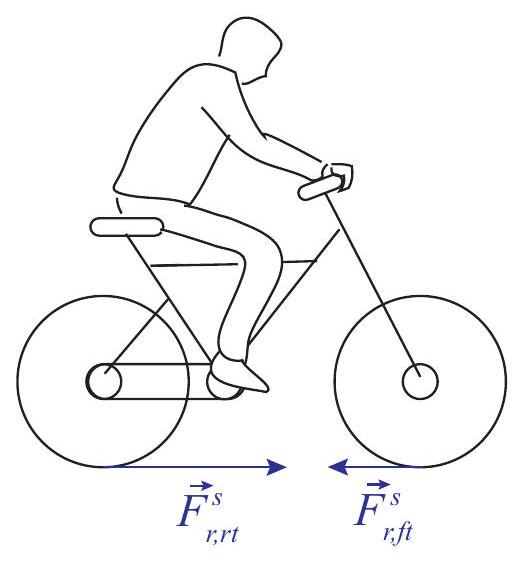
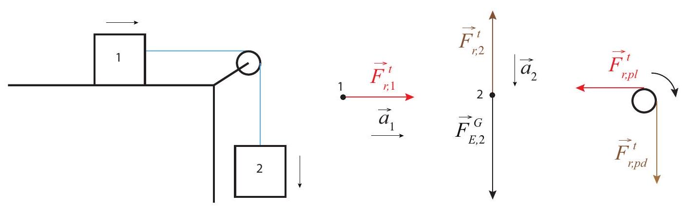
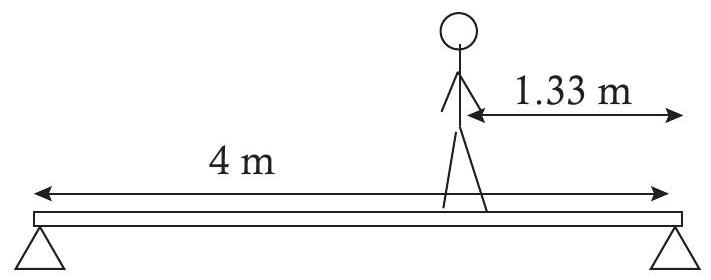

Rotational motion, which involves an object spinning around an axis, or revolving around a point in space, is actually rather common in nature, so much so that Galileo thought (mistakenly) that circular motion, rather than motion on a straight line, was the \"natural,\" or \"unforced\" state of motion for any body. Galileo was wrong, but there is at least one sense in which it is true that rotational motion, once started, can go on forever in the absence of external forces. The underlying principle is the conservation of angular momentum, which I will introduce later in this chapter.

As pointed out in the previous chapter, rotational motion is also extremely important in mechanical devices. In every case, the rotation of an extended, rigid body can be mathematically described as a collection of circular motions by the particles making up the body. Two very important quantities for dealing with such collections of particles in rotation are the rotational kinetic energy, and the angular momentum. These will both be introduced, and their properties explored, in this chapter.

(sec-9.1)=
## 9.1 Rotational kinetic energy, and moment of inertia

If a particle of mass $m$ is moving on a circle of radius $R$, with instantaneous speed $v$, then its kinetic energy is

:::{math}
:label: eq-9.1
K_{\text {rot }}=\frac{1}{2} m v^{2}=\frac{1}{2} m R^{2} \omega^{2}
:::

using $|\vec{v}|=R|\omega|$, {numref}`Eq. %s <eq-8.36>`. Note that, at this stage, there is no real reason for the subscript \"rot\": {numref}`Equation %s <eq-9.1>` is all of the particle's kinetic energy. The distinction will only become important later in the chapter, when we consider extended objects whose motion is a combination of translation (of the center of mass) and rotation (around the center of mass).

Now, consider the kinetic energy of an extended object that is rotating around some axis. We may treat the object as being made up of many \"particles\" (small parts) of masses $m_{1}, m_{2} \ldots$. If the object is rigid, all the particles move together, in the sense that they all rotate through the same angle in the same time, which means they all have the same angular velocity. However, the particles that are farther away from the axis of rotation are actually moving faster-they have a larger $v$, according to {numref}`Eq. %s <eq-8.36>`. So the expression for the total kinetic energy in terms of all the particles' speeds is complicated, but in terms of the (common) angular velocity is simple:

:::{math}
:label: eq-9.2
\begin{align*}
K_{r o t} & =\frac{1}{2} m_{1} v_{1}^{2}+\frac{1}{2} m_{2} v_{2}^{2}+\frac{1}{2} m_{3} v_{3}^{2}+\ldots \\
& =\frac{1}{2}\left(m_{1} r_{1}^{2}+m_{2} r_{2}^{2}+m_{3} r_{3}^{2}+\ldots\right) \omega^{2} \\
& =\frac{1}{2} I \omega^{2}
\end{align*}
:::

where $r_{1}, r_{2}, \ldots$ represent the distance of the 1 st, 2 nd\... particle to the axis of rotation, and on the last line I have introduced the quantity

:::{math}
:label: eq-9.3
I=\sum_{\text {all particles }} m r^{2}
:::

which is usually called the moment of inertia of the object about the axis considered. In general, the expression {eq}`eq-9.3` is evaluated as an integral, which can be written symbolically as $I=\int r^{2} d m$; the \"mass element\" $d m$ can be expressed in terms of the local density as $\rho d V$, where $V$ is a volume element. The integral is a multidimensional integral that may require somewhat sophisticated calculus skills, so we will not be calculating any of these this semester; rather, we will rely on the tabulated values for $I$ for objects of different, simple, shapes. For instance, for a homogeneous cylinder of total mass $M$ and radius $R$, rotating around its central axis, $I=\frac{1}{2} M R^{2}$; for a hollow sphere rotating through an axis through its center, $I=\frac{2}{3} M R^{2}$, and so on.

As you can see, the expression {eq}`eq-9.2` for the kinetic energy of a rotating body, $\frac{1}{2} I \omega^{2}$, parallels the expression $\frac{1}{2} m v^{2}$ for a moving particle, with the replacement of $v$ by $\omega$, and $m$ by $I$. This suggests that $I$ is some sort of measure of a solid object's rotational inertia, by which we mean the resistance it offers to being set into rotation about the axis being considered. We will see later on, when we introduce the torque, that this interpretation for $I$ is indeed correct.

It should be stressed that the moment of inertia depends, in general, not just on the shape and mass distribution of the object, but also on the axis of rotation. In general, the formula {eq}`eq-9.3` shows that, the more mass you put farther away from the axis of rotation, the larger $I$ will be. Thus, for instance, a thin rod of length $l$ has a moment of inertia $I=\frac{1}{12} M l^{2}$ when rotating around a perpendicular axis through its midpoint, whereas it has the larger $I=\frac{1}{3} M l^{2}$ when rotating around a perpendicular axis through one of its endpoints.

(sec-9.2)=
## 9.2 Angular momentum

Back in {ref}`Chapter 3 <ch-3>` we introduced the momentum of an object moving in one dimension as $p=m v$, and found that it had the interesting property of being conserved in collisions between objects that made up an isolated system. It seems natural to ask whether the corresponding rotational quantity, formed by multiplying the \"rotational inertia\" $I$ and the angular velocity $\omega$, has any interesting properties as well. We are tentatively ${ }^{1}$ going to call the quantity I $\omega$ angular momentum (to distinguish it from the \"ordinary,\" or linear momentum, $m v$ ), and build towards a better understanding, and a formal definition of it, in the remainder of this section.

Two things are soon apparent: one is that, unlike the rotational kinetic energy, which was just plain kinetic energy, the quantity $I \omega$ really is different from the ordinary momentum, since it has different dimensions (see the \"extra\" factor of $R$ in {numref}`Eq. %s <eq-9.4>` below). The other is that there are, in fact, systems in nature where this quantity appears to remain constant to a good approximation. For instance, the Earth spinning around its axis, at a constant rate of $2 \pi$ radians every 24 hours, has, by virtue of that, a constant angular momentum (a constant $I$ and $\omega$ ).

It is best, however, to start by thinking about how we would define \"angular momentum\" for a system consisting of a single particle, and then building up from there, as we have been doing all semester with every new concept. For a particle moving in a circle, according to the previous section, the moment of inertia is just $I=m R^{2}$, and therefore $I \omega$ is just $m R^{2} \omega$. Using {numref}`Eq. %s <eq-8.36>`, we can write (the letter $L$ is the conventional symbol for angular momentum; do not mistake it for a length!)

:::{math}
:label: eq-9.4
L=I \omega= \pm m R|v| \quad \text { (particle moving in a circle) }
:::

where, for consistency with our sign convention for $\omega$, we should use the positive sign if the rotation is counterclockwise, and the negative sign if it is clockwise.

We can again readily think of examples in nature where the quantity {eq}`eq-9.4` is conserved: for instance, the moon, if we treat it as a particle orbiting the Earth in an approximately circular orbit ${ }^{2}$, has then an approximately constant angular momentum, as given by {numref}`Eq. %s <eq-9.4>`. This example is also interesting because it offers an inkling of an important difference between ordinary momentum, and angular momentum: it appears that the latter can be conserved even in the presence of some kinds of external forces (in this case, the force of gravity due to the Earth that keeps the moon on its orbit).

On the other hand, it is not immediately obvious how to generalize the definition {eq}`eq-9.4` to other kinds of motion. If we simply try something like $L=m v r$, where $r$ is the distance to a fixed axis, or to a fixed point, then we find that this yields a quantity that is constantly changing, even for the simplest possible physical system, namely, a particle moving on a straight line with constant

velocity. Yet, we would like to define $L$ in such a way that it will remain constant when, in fact, nothing in the particle's actual state of motion is changing.

The way to do this, for a particle moving on a straight line, is to define $L$ as the product of $m v$ times, not the distance of the particle to a point, but the distance of the particle's line of motion to the point considered. The \"line of motion\" is just a straight line that contains the velocity vector at any given time. The distance between a line and a point $O$ is, by definition, the shortest distance from O to any point on the line; it is given by the length of a segment drawn perpendicular to the line through the point $O$.

For a particle moving in a circle, the line of motion at any time is tangent to the circle, and so the distance between the line of motion and the center of the circle is just the radius $R$, so we recover the definition {numref}`Eq. %s <eq-9.4>`. For the general case, on the other hand, we have the situation shown in {numref}`Fig. %s <fig-9.1>`: if the instantaneous velocity of the particle is $\vec{v}$, and we draw the position vector of the particle, $\vec{r}$, with the point O as the origin, then the distance between O and the line of motion (sometimes also called the perpendicular distance between O and the particle) is given by $r \sin \theta$, where $\theta$ is the angle between the vectors $\vec{r}$ and $\vec{v}$.

:::{figure} ../images/2024_09_14_9969b06773f10b6936e8g-212.jpg
:label: fig-9.1
:alt: For a particle moving on a straight line, the distance from the point O to the particle's line of motion (dashed line) is equal to r sin theta at every point in the trajectory (two possible points are shown in the figure). The distance is the length of the blue segment. The figure shows there is some freedom in choosing how the angle theta between r vector and v vector is to be measured, since the sine of theta is the same as the sine of pi-theta.
For a particle moving on a straight line, the distance from the point $O$ to the particle's line of motion (dashed line) is equal to $r \sin \theta$ at every point in the trajectory (two possible points are shown in the figure). The distance is the length of the blue segment. The figure shows there is some freedom in choosing how the angle $\theta$ between $\vec{r}$ and $\vec{v}$ is to be measured, since the sine of $\theta$ is the same as the sine of $\pi-\theta$.
:::

We therefore try and define angular momentum relative to a point O as the product

:::{math}
:label: eq-9.5
L= \pm m r|v| \sin \theta
:::

with the positive sign if the point O is to the left of the line of motion as the particle passes by (which corresponds to counterclockwise motion on the circle), and negative otherwise.

There are two very good things about the definition {eq}`eq-9.5`: the first one is that there is already in existence a mathematical operation between vectors, called the vector, or cross, product, according to which $|L|$, as defined by {eq}`eq-9.5`, would just be given by $|\vec{r} \times \vec{p}|$, where $\vec{r} \times \vec{p}$ is the cross product of $\vec{r}$ and $\vec{p}$; I will have a lot more to say about this in the next subsection. The second good\
thing is that, with this definition, the angular momentum will be conserved in an important kind of process, namely, a collision that converts linear to rotational motion, as illustrated in {numref}`Fig. %s <fig-9.2>` below.

:::{figure} ../images/2024_09_14_9969b06773f10b6936e8g-213.jpg
:label: fig-9.2
:alt: Collision between two particles, 1 and 2, of equal masses. Particle 2 is tied by a massless string to the point O. After the collision, particle 1 is at rest and particle 2 moves in the circle shown.
Collision between two particles, 1 and 2, of equal masses. Particle 2 is tied by a massless string to the point O. After the collision, particle 1 is at rest and particle 2 moves in the circle shown.
:::

In the picture, particle 1 is initially moving with constant velocity $\vec{v}$ and particle 2 is initially at rest, tied by a massless string to the point O. If the particles have the same mass, conservation of (ordinary) momentum and kinetic energy means that when they collide they exchange velocities: particle 1 comes to a stop and particle 2 starts to move to the right with the same speed $v$, but immediately the string starts pulling on it and bending its path into a circle. Assuming negligible friction between the string and the pivoting point (and all the surfaces involved), the speed of particle 2 will remain constant as it rotates, by conservation of kinetic energy, because the tension in the string is always perpendicular to the particle's displacement vector, so it does no work on it.

All of the above means that angular momentum is conserved: before the collision it was equal to $-m v r \sin \theta=-m v R$ for particle 1 , and 0 for particle 2 ; after the collision it is zero for particle 1 and $I \omega=m R^{2} \omega=-m R v$ for particle 2 (note $\omega$ is negative, because the rotation is clockwise). Kinetic energy is also conserved, for the reasons argued above. On the other hand, ordinary momentum is only conserved until just after the collision, when the string starts pulling on particle 2 , since this represents an external force on the system.

So we have found a situation in which linear motion is converted to circular motion while angular momentum, as defined by {numref}`Eq. %s <eq-9.5>`, is conserved, and this despite the presence of an external force. It is true that, in fact, we were able to solve for the final motion without making explicit use of conservation of angular momentum: we only had to invoke conservation of ordinary momentum for the short duration of the collision, and conservation of kinetic energy. But it is easy to generalize the problem depicted in {numref}`Figure %s <fig-9.2>` to one that cannot be solved by these methods, but can be solved if angular momentum is constant. Suppose that we replace particle 2 and the string by a\
thin rod of mass $m$ and length $l$ pivoted at one end. What happens now when particle 1 strikes the rod?

:::{figure} ../images/2024_09_14_9969b06773f10b6936e8g-214.jpg
:label: fig-9.3
:alt: Collision between a particle initially moving with velocity v vector1 and a rod of length l pivoted at an endpoint. The particle strikes the rod perpendicularly, at the other end. After the collision, the particle is moving along the same line with velocity v vectorf, and the rod is rotating around the point O with an angular velocity omega.
Collision between a particle initially moving with velocity $\vec{v}_{1}$ and a rod of length $l$ pivoted at an endpoint. The particle strikes the rod perpendicularly, at the other end. After the collision, the particle is moving along the same line with velocity $\vec{v}_{f}$, and the rod is rotating around the point O with an angular velocity $\omega$.
:::

If the particle strikes the rod perpendicularly, and the collision happens very fast (that is, it is over before the rod has time to move a significant distance), we may assume the force exerted by the rod on the particle (a normal force) is along the original line of motion, so the particle will continue to move on that line. On the other hand, this time we cannot neglect the force exerted by the pivot on the bar during the collision time, since the bar is one single rigid object. This means the system is not isolated during the collision, and we cannot rely on ordinary momentum conservation.

Suppose, however, that the angular momentum $L$ is conserved, as well as the total energy (the pivot does no work on the system, since there is no displacement of that point). The initial angular momentum is $L_{i}=-m v_{i} l$. The final angular momentum is $-m v_{f} l$ for the particle (note that, if the particle bounces back, $v_{f}$ will be negative) and $I \omega$ for the rod. The initial kinetic energy is $K_{i}=\frac{1}{2} m v_{i}^{2}$, and the final kinetic energy is $\frac{1}{2} m v_{f}^{2}$ for the particle and $\frac{1}{2} I \omega^{2}$ for the rod (recall {numref}`Eq. %s <eq-9.2>`, so we have to solve the system

:::{math}
:label: eq-9.6
\begin{align*}
-m v_{i} l & =-m v_{f} l+I \omega \\
\frac{1}{2} m v_{i}^{2} & =\frac{1}{2} m v_{f}^{2}+\frac{1}{2} I \omega^{2}
\end{align*}
:::

The general solution, for arbitrary values of all the constants, is

:::{math}
:label: eq-9.7
\begin{align*}
v_{f} & =\frac{m l^{2}-I}{m l^{2}+I} v_{i} \\
\omega & =-\frac{2 m l}{m l^{2}+I} v_{i}
\end{align*}
:::

Note that this does reduce to our previous results for the collision of two particles if we make $I=m l^{2}$ (which one could always do, by choosing the mass of the rod, $M$, appropriately). On the other hand, as indicated at the end of the previous subsection, for general $M$ we have $I=\frac{1}{3} M l^{2}$ for the rod, so we can cancel $l^{2}$ almost everywhere and end up with

:::{math}
:label: eq-9.8
\begin{align*}
v_{f} & =\frac{3 m-M}{3 m+M} v_{i} \\
\omega & =-\frac{6 m}{3 m+M} \frac{v_{i}}{l}
\end{align*}
:::

In particular, we see that if $m=M$ the particle continues to move forward with $1 / 2$ of its initial velocity, and the rod spins with $\omega=-(3 / 2) v_{i} / l$, which is actually a larger angular velocity than what we found for the system in {numref}`Fig. %s <fig-9.2>`.

This example shows how useful conservation of angular momentum can be, but, of course, we do not really know yet whether angular momentum is actually conserved in this problem! I will address this very important question-when is angular momentum conserved-in the section after next, which is to say, after I have properly developed angular momentum as a vector quantity.

(sec-9.3)=
## 9.3 The cross product and rotational quantities

The cross, or vector, product of two vectors $\vec{A}$ and $\vec{B}$ is denoted by $\vec{A} \times \vec{B}$. It is defined as a vector perpendicular to both $\vec{A}$ and $\vec{B}$ (that is to say, to the plane that contains them both), with a magnitude given by

:::{math}
:label: eq-9.9
|\vec{A} \times \vec{B}|=A B \sin \theta
:::

where $A$ and $B$ are the magnitudes of $\vec{A}$ and $\vec{B}$, respectively, and $\theta$ is the angle between $\vec{A}$ and $\vec{B}$, when they are drawn either with the same origin or tip-to-tail.

The specific direction of $\vec{A} \times \vec{B}$ depends on the relative orientation of the two vectors. Basically, if $\vec{B}$ is counterclockwise from $\vec{A}$, when looking down on the plane in which they lie, assuming they are drawn with a common origin, then $\vec{A} \times \vec{B}$ points upwards from that plane; otherwise, it points downward (into the plane). One can also use the so-called right-hand rule, illustrated in {numref}`Figure %s <fig-9.4>` (next page) to figure out the direction of $\vec{A} \times \vec{B}$. Note that, by this definition, the direction of $\vec{A} \times \vec{B}$ is the opposite of the direction of $\vec{B} \times \vec{A}$ (as also illustrated in {numref}`Fig. %s <fig-9.4>`). Hence, the cross-product is non-commutative: the order of the factors makes a difference.

:::{math}
:label: eq-9.10
\vec{A} \times \vec{B}=-\vec{B} \times \vec{A}
:::

:::{figure} ../images/2024_09_14_9969b06773f10b6936e8g-216.jpg
:label: fig-9.4
:alt: The "right-hand rule" to determine the direction of the cross product. Line up the first vector with the fingers, and the second vector with the flat of the hand, and the thumb will point in the correct direction. In the first drawing, we are looking at the plane formed by A vector and B vector from above; in the second drawing, we are looking at the plane from below, and calculating B vector times A vector.
The \"right-hand rule\" to determine the direction of the cross product. Line up the first vector with the fingers, and the second vector with the flat of the hand, and the thumb will point in the correct direction. In the first drawing, we are looking at the plane formed by $\vec{A}$ and $\vec{B}$ from above; in the second drawing, we are looking at the plane from below, and calculating $\vec{B} \times \vec{A}$.
:::

It follows from {numref}`Eq. %s <eq-9.10>` that the cross-product of any vector with itself must be zero. In fact, according to {numref}`Eq. %s <eq-9.9>`, the cross product of any two vectors that are parallel to each other is zero, since in that case $\theta=0$, and $\sin 0=0$. In this respect, the cross product is the opposite of the dot product that we introduced in {ref}`Chapter 7 <ch-7>`: it is maximum when the vectors being multiplied are orthogonal, and zero when they are parallel. (And, of course, the result of $\vec{A} \times \vec{B}$ is a vector, whereas $\vec{A} \cdot \vec{B}$ is a scalar.)

Besides not being commutative, the cross product also does not have the associative property of ordinary multiplication: $\vec{A} \times(\vec{B} \times \vec{C})$ is different from $(\vec{A} \times \vec{B}) \times \vec{C}$. You can see this easily from the fact that, if $\vec{A}=\vec{B}$, the second expression will be zero, but the first one generally will be nonzero (since $\vec{A} \times \vec{C}$ is not parallel, but rather perpendicular to $\vec{A}$ ).

In spite of these oddities, the cross product is extremely useful in physics. We will use it to define the angular momentum vector $\vec{L}$ of a particle, relative to a point O , as follows:

:::{math}
:label: eq-9.11
\vec{L}=\vec{r} \times \vec{p}=m \vec{r} \times \vec{v}
:::

where $\vec{r}$ is the position vector of the particle, relative to the point $O$. This definition gives us a constant vector for a particle moving on a straight line, as discussed in the previous section: the magnitude of $\vec{L}$, according to {numref}`Eq. %s <eq-9.9>` will be $m r v \sin \theta$, which, as shown in {numref}`Fig. %s <fig-9.1>`, does not change as the particle moves. As for the direction, it is always perpendicular to the plane containing $\vec{r}$ and $\vec{v}$ (the plane of the paper, in {numref}`Fig. %s <fig-9.1>`), and if you imagine moving $\vec{v}$ to point O , keeping it parallel to itself, and apply the right-hand rule, you will see that $\vec{L}$ in {numref}`Fig. %s <fig-9.1>` should point into the plane of the paper at all times.

To see how the definition {eq}`eq-9.11` works for a particle moving in a circle, consider again the situation shown in {numref}`Figure %s <fig-8.6>` in the previous chapter, but now extend it to three dimensions, as in {numref}`Fig. %s <fig-9.5>`, on the next page. It is straightforward to verify that, for the direction of motion shown, the cross\
product $\vec{r} \times \vec{v}$ will always point upwards, along the positive $z$ axis. Furthermore, since $\vec{r}$ and $\vec{v}$ always stay perpendicular, the magnitude of $\vec{L}$, by {numref}`Eq. %s <eq-9.9>`, will always be $|\vec{L}|=m R|\vec{v}|$. Taking note of $I=m R^{2}$ and of {numref}`Eq. %s <eq-8.36>`, we see we have then

:::{math}
:label: eq-9.12
|\vec{L}|=\left(m R^{2}\right) \frac{|\vec{v}|}{R}=I|\omega|
:::

:::{figure} ../images/2024_09_14_9969b06773f10b6936e8g-217.jpg
:label: fig-9.5
:alt: A particle moving on a circle in the x-y plane. For the direction of rotation shown, the vectors L vector=m r vector times v vector and omega vector lie along the z axis, in the positive direction.
A particle moving on a circle in the $x-y$ plane. For the direction of rotation shown, the vectors $\vec{L}=m \vec{r} \times \vec{v}$ and $\vec{\omega}$ lie along the $z$ axis, in the positive direction.
:::

This suggests that we should define the angular velocity vector, $\vec{\omega}$, as a vector of magnitude $|\omega|$, pointing along the positive $z$ axis if the motion in the $x-y$ plane is counterclockwise as seen from above (and in the opposite direction otherwise). Then this will hold as a vector equation:

:::{math}
:label: eq-9.13
\vec{L}=I \vec{\omega}
:::

It may seem a very strange choice to have the angular velocity point along the $z$ axis, when the particle is moving in the $x-y$ plane, but in a certain way it makes sense. Suppose the particle is moving with constant angular velocity: the directions of $\vec{r}$ and $\vec{v}$ are constantly changing, but $\vec{\omega}$ is pointing along the positive $z$ direction, which does remain fixed throughout.

There are some other neat things we can do with $\vec{\omega}$ as defined above. Consider the cross product $\vec{\omega} \times \vec{r}$. Inspection of {numref}`Figure %s <fig-9.5>` and of {numref}`Eq. %s <eq-8.36>` shows that this is nothing other than the ordinary velocity vector, $\vec{v}$ :

:::{math}
:label: eq-9.14
\vec{v}=\vec{\omega} \times \vec{r}
:::

We can also take the derivative of $\vec{\omega}$ to obtain the angular acceleration vector $\vec{\alpha}$, so that {numref}`Eq. %s <eq-8.33>` will hold as a vector equation:

:::{math}
:label: eq-9.15
\vec{\alpha}=\lim _{\Delta t \rightarrow 0} \frac{\vec{\omega}(t+\Delta t)-\vec{\omega}(t)}{d t}=\frac{d \vec{\omega}}{d t}
:::

For the motion depicted in {numref}`Fig. %s <fig-9.5>`, the vector $\vec{\alpha}$ will point along the positive $z$ axis if the vector $\vec{\omega}$ is growing (which means the particle is speeding up), and along the negative $z$ axis if $\vec{\omega}$ is decreasing.

One important property the cross product does have is the distributive property with respect to the sum:

:::{math}
:label: eq-9.16
(\vec{A}+\vec{B}) \times \vec{C}=\vec{A} \times \vec{C}+\vec{B} \times \vec{C}
:::

This, it turns out, is all that's necessary in order to be able to apply the product rule of differentiation to calculate the derivative of a cross product; you just have to be careful not to change the order of the factors in doing so. We can then take the derivative of both sides of {numref}`Eq. %s <eq-9.14>` to get an expression for the acceleration vector:

:::{math}
:label: eq-9.17
\begin{align*}
\vec{a}=\frac{d \vec{v}}{d t} & =\frac{d \vec{\omega}}{d t} \times \vec{r}+\vec{\omega} \times \frac{d \vec{r}}{d t} \\
& =\vec{\alpha} \times \vec{r}+\vec{\omega} \times \vec{v}
\end{align*}
:::

The first term on the right-hand side, $\vec{\alpha} \times \vec{r}$, lies in the $x-y$ plane, and is perpendicular to $\vec{r}$; it is, therefore, tangential to the circle. In fact, looking at its magnitude, it is clear that this is just the tangential acceleration vector, which I introduced (as a scalar) in {numref}`Eq. %s <eq-8.37>`.

As for the second term in {eq}`eq-9.17`, $\vec{\omega} \times \vec{v}$, noting that $\vec{\omega}$ and $\vec{v}$ are always perpendicular, it is clear its magnitude is $|\omega||\vec{v}|=R \omega^{2}=v^{2} / R$ (making use of {numref}`Eq. %s <eq-8.36>` again). This is just the magnitude of the centripetal acceleration we studied in the previous chapter ({ref}`section 8.4 <sec-8.4>`). Also, using the right-hand rule in {numref}`Fig. %s <fig-9.5>`, you can see that $\vec{\omega} \times \vec{v}$ always points inwards, towards the center of the circle; that is, along the direction of $-\vec{r}$. Putting all of this together, we can write this vector as just $-\omega^{2} \vec{r}$, and the whole acceleration vector as the sum of a tangential and a centripetal (radial) component, as follows:

:::{math}
:label: eq-9.18
\begin{align*}
\vec{a} & =\vec{a}_{t}+\vec{a}_{c} \\
\vec{a}_{t} & =\vec{\alpha} \times \vec{r} \\
\vec{a}_{c} & =-\omega^{2} \vec{r}
\end{align*}
:::

To conclude this section, let me return to the angular momentum vector, and ask the question of whether, in general, the angular momentum of a rotating system, defined as the sum of {numref}`Eq. %s <eq-9.11>` over all the particles that make up the system, will or not satisfy the vector equation $\vec{L}=I \vec{\omega}$. We have seen that this indeed works for a particle moving in a circle. It will, therefore, also work for any object that is essentially flat, and rotating about an axis perpendicular to it, since in that case all its parts are just moving in circles around a common center. This was the case for the thin rod we considered in connection with {numref}`Figure %s <fig-9.3>` in the previous subsection.

However, if the system is a three-dimensional object rotating about an arbitrary axis, the result $\vec{L}=I \vec{\omega}$ does not generally hold. The reason is, mathematically, that the moment of inertia $I$ is defined ({numref}`Eq. %s <eq-9.3>`) in terms of the distances of the particles to an axis, whereas the angular\
momentum involves the particle's distance to a point. For particles at different \"heights\" along the axis of rotation, these quantities are different. It can be shown that, in the general case, all we can say is that $L_{z}=I \omega_{z}$, if we call $z$ the axis of rotation and calculate $\vec{L}$ relative to a point on that axis.

On the other hand, if the axis of rotation is an axis of symmetry of the object, then $\vec{L}$ has only a $z$ component, and the result $\vec{L}=I \vec{\omega}$ holds as a vector equation. Most of the systems we will consider this semester will be covered under this clause, or under the \"essentially flat\" clause mentioned above.

In what follows we will generally assume that $I$ has only a $z$ component, and we will drop the subscript $z$ in the equation $L_{z}=I \omega_{z}$, so that $L$ and $\omega$ will not necessarily be the magnitudes of their respective vectors, but numbers that could be positive or negative, depending on the direction of rotation (clockwise or counterclockwise). This is essentially the same convention we used for vectors in one dimension, such as $\vec{a}$ or $\vec{p}$, in the early chapters; it is fine for all the cases in which the (direction of the) axis of rotation does not change with time, which are the only situations we will consider this semester.

(sec-9.4)=
## 9.4 Torque

We are finally in a position to answer the question, when is angular momentum conserved? To do this, we will simply take the derivative of $\vec{L}$ with respect to time, and use Newton's laws to find out under what circumstances it is equal to zero.

Let us start with a particle and calculate

:::{math}
:label: eq-9.19
\frac{d \vec{L}}{d t}=\frac{d}{d t}(m \vec{r} \times \vec{v})=m \frac{d \vec{r}}{d t} \times \vec{v}+m \vec{r} \times \frac{d \vec{v}}{d t}
:::

The first term on the right-hand side goes as $\vec{v} \times \vec{v}$, which is zero. The second term can be rewritten as $m \vec{r} \times \vec{a}$. But, according to Newton's second law, $m \vec{a}=\vec{F}_{n e t}$. So, we conclude that

:::{math}
:label: eq-9.20
\frac{d \vec{L}}{d t}=\vec{r} \times \vec{F}_{n e t}
:::

So the angular momentum, like the ordinary momentum, will be conserved if the net force on the particle is zero, but also, and this is an important difference, when the net force is parallel (or antiparallel) to the position vector. For motion on a circle with constant speed, this is precisely what happens: the force acting on the particle is the centripetal force, which can be written as $\vec{F}_{c}=m \vec{a}_{c}=-m \omega^{2} \vec{r}$ (using {numref}`Eq. %s <eq-9.18>`), so $\vec{r} \times \vec{F}_{c}=0$, and the angular momentum is constant.

The quantity $\vec{r} \times \vec{F}$ is called the torque of a force around a point (the origin from which $\vec{r}$ is calculated, typically a pivot point or center of rotation). It is denoted with the Greek letter $\tau$, \"tau\":

:::{math}
:label: eq-9.21
\vec{\tau}=\vec{r} \times \vec{F}
:::

For an extended object or system, the rate of change of the angular momentum vector would be given by the sum of the torques of all the forces acting on all the particles. For each torque one needs to use the position vector of the particle on which the force is acting. As was the case when calculating the rate of change of the ordinary momentum of an extended system ({ref}`Section 6.1.1 <sec-6.1.1>`), Newton's third law, with a small additional assumption, leads to the cancellation of the torques due to the internal forces ${ }^{3}$, and so we are left with only

:::{math}
:label: eq-9.22
\vec{\tau}_{\text {ext,all }}=\frac{d \vec{L}_{\text {sys }}}{d t}
:::

It goes without saying that all the torques and angular momenta need to be calculated relative to the same point.

The torque of a force around a point is basically a measure of how effective the force would be at causing a rotation around that point. Since $|\vec{r} \times \vec{F}|=r F \sin \theta$, you can see that it depends on three things: the magnitude of the force, the distance from the center of rotation to the point where the force is applied, and the angle at which the force is applied. All of this can be understood pretty well from {numref}`Figure %s <fig-9.6>` below, especially if you have ever had to use a wrench to tighten or loosen a bolt:

:::{figure} ../images/2024_09_14_9969b06773f10b6936e8g-220.jpg
:label: fig-9.6
:alt: The torque around the point O of each of the forces shown is a measure of how effective it is at causing the rod to turn around that point.
The torque around the point O of each of the forces shown is a measure of how effective it is at causing the rod to turn around that point.
:::

Clearly, the force $\vec{F}_{1}$ will not cause a rotation at all, and accordingly its torque is zero (since it is parallel to $\vec{r}_{A}$ ). On the other hand, of all the forces shown, the most effective one is $\vec{F}_{3}$ : it is applied the farthest away from O , for the greatest leverage (again, think of your experiences with

wrenches). It is also perpendicular to the rod, for maximum effect $(\sin \theta=1)$. The force $\vec{F}_{2}$, by contrast, although also applied at the point A is at a disadvantage because of the relatively small angle it makes with $\vec{r}_{A}$. If you imagine breaking it up into components, parallel and perpendicular to the rod, only the perpendicular component (whose magnitude is $F_{2} \sin \theta$ ) would be effective at causing a rotation; the other component, the one parallel to the rod, would be wasted, like $\vec{F}_{1}$.

In order to calculate torques, then, we basically need to find, for every force, the component that is perpendicular to the position vector of its point of application. Clearly, for this purpose we can no longer represent an extended body as a mere dot, as we did for the free-body diagrams in {ref}`Chapter 6 <ch-6>`. What we need is a more careful sketch of the object, just detailed enough that we can tell how far from the center of rotation and at what angle each force is applied. That kind of diagram is called an extended free-body diagram.

{numref}`Figure %s <fig-9.6>` could be an example of an extended free-body diagram, for an object being acted on by four forces. Typically, though, instead of drawing the vectors $\vec{r}_{A}$ and $\vec{r}_{B}$ we would just indicate their lengths on the diagram (or maybe even leave them out altogether, if we do not want to overload the diagram with detail). I will show a couple of examples of extended free-body diagrams in the next couple of sections.

As indicated above, to calculate the torque of each force acting on an extended object you should use the position vector $\vec{r}$ of the point where the force is applied. This is typically unambiguous for contact forces ${ }^{4}$, but what about gravity? In principle, the force of gravity would act on all of the particles making up the body, and we would have to add up all the corresponding torques:

:::{math}
:label: eq-9.23
\vec{\tau}^{G}=\vec{r}_{1} \times \vec{F}_{E, 1}^{G}+\vec{r}_{2} \times \vec{F}_{E, 2}^{G}+\ldots
:::

We can, however, simplify this substantially by noting that (near the surface of the Earth, at any rate), all the forces $F_{E, 1}^{G}, F_{E, 2}^{G}, \ldots$ point in the same direction (which is to say, down), and they are all proportional to each particle's mass. If I let the total mass of the object be $M$, and the total force due to gravity on the object be $\vec{F}_{E, o b j}^{G}$, then I have $\vec{F}_{E, 1}^{G}=m_{1} \vec{F}_{E, o b j}^{G} / M, \vec{F}_{E, 2}^{G}=m_{2} \vec{F}_{E, o b j}^{G} / M, \ldots$, and I can rewrite {numref}`Eq. %s <eq-9.23>` as

:::{math}
:label: eq-9.24
\vec{\tau}^{G}=\frac{m_{1} \vec{r}_{1}+m_{2} \vec{r}_{2}+\ldots}{M} \times \vec{F}_{E, o b j}^{G}=\vec{r}_{c m} \times \vec{F}_{E, o b j}^{G}
:::

where $\vec{r}_{c m}$ is the position vector of the object's center of mass. So to find the torque due to gravity on an extended object, just take the total force of gravity on the object (that is to say, the weight of the object) to be applied at its center of mass. (Obviously, then, the torque of gravity around the center of mass itself will be zero, but in some important cases an object may be pivoted at a point other than its center of mass.)

Coming back to {numref}`Eq. %s <eq-9.22>`, the main message of this section (other, of course, than the definition of torque itself), is that the rate of change of an object or system's angular momentum is equal to the net torque due to the external forces. Two special results follow from this one. First, if the net external torque is zero, angular momentum will be conserved, as was the case, in particular, for the collision illustrated earlier, in {numref}`Fig. %s <fig-9.3>`, between a particle and a rod pivoted at one end. The only external force in that case was the force exerted on the rod, at the pivot point, by the pivot itself, but the torque of that force around that point is obviously zero, since $\vec{r}=0$, so our assumption that the total angular momentum around that point was conserved was legitimate.

Secondly, if $\vec{L}=I \vec{\omega}$ holds, and the moment of inertia $I$ does not change with time, we can rewrite {numref}`Eq. %s <eq-9.22>` as

:::{math}
:label: eq-9.25
\vec{\tau}_{\text {ext }, a l l}=I \vec{\alpha}
:::

which is basically the rotational equivalent of Newton's, second law, $\vec{F}=m \vec{a}$. We will use this extensively in the remainder of this chapter.

Finally, note that situations where the moment of inertia of a system, $I$, changes with time are relatively easy to arrange for any deformable system. Especially interesting is the case when the external torque is zero, so $L$ is constant, and a change in $I$ therefore brings about a change in $\omega=L / I$ : this is how, for instance, an ice-skater can make herself spin faster by bringing her arms closer to the axis of rotation (reducing her $I$ ), and, conversely, slow down her spin by stretching out her arms. This can be done even in the absence of a contact point with the ground: high-board divers, for instance, also spin up in this way when they curl their bodies into a ball. Note that, throughout the dive, the diver's angular momentum around its center of mass is constant, since the only force acting on him (gravity, neglecting air resistance) has zero torque about that point.

In all the cases just mentioned, the angular momentum is constant, but the rotational kinetic energy changes. This is due to the work done by the internal forces (of the ice-skater's or the diver's body), converting some internal energy (such as elastic muscular energy) into rotational kinetic energy, or vice-versa. A convenient expression for a system's rotational kinetic energy when $\vec{L}=I \vec{\omega}$ holds is

:::{math}
:label: eq-9.26
K_{\text {rot }}=\frac{1}{2} I \omega^{2}=\frac{L^{2}}{I}
:::

which shows explicitly how $K$ would change if $I$ changed and $L$ remained constant.

(sec-9.5)=
## 9.5 Statics

Statics is the branch of mechanics concerned with the forces and stresses ${ }^{5}$ needed to keep a system at rest, in a stable equilibrium - so that it will not move, bend or collapse. It is, obviously, extremely

important in engineering (particularly in mechanical engineering). In an introductory physics course, we can only deal with it at a very elementary level, by ignoring altogether the deformation of extended objects such as planks and beams (and the associated stresses), and just imposing two simple conditions for static equilibrium: first, the net (external) force on the system must be zero, to make sure its center of mass stays at rest; and second, the net (external) torque on the system must also be zero, so that it does not rotate. These conditions can be symbolically expressed as\
\$\$

:::{math}
:label: eq-9.27
\begin{align*}
& \sum \vec{F}_{e x t}=0 \\
& \sum \vec{\tau}_{e x t}=0
\end{align*}
:::

\$\$

You may ask about which point one should calculate the torques. The answer is that, as long as the first condition is satisfied (sum of the forces is zero), it does not matter! The proof is simple, but you are welcome to skip it if you are not interested.

Suppose you have two points, A and B, around which to calculate the torques. Let $\vec{r}_{A 1}, \vec{r}_{A 2}, \ldots$ be the position vectors of the points of application of the forces $\vec{F}_{1}, \vec{F}_{2} \ldots$, relative to point A, and $\vec{r}_{B 1}, \vec{r}_{B 2}, \ldots$, the same, but relative to point B. If you go all the way back to {numref}`Figure %s <fig-1.6>` (in {ref}`Chapter 1 <ch-1>` ), you can see that these vectors only differ from the first set by the single constant vector $\vec{r}_{A B}$ that gives the position of point B relative to point $\mathrm{A}: \vec{r}_{A 1}=\vec{r}_{A B}+\vec{r}_{B 1}$, etc. Then, for the sum of torques around A we have

:::{math}
:label: eq-9.28
\begin{align*}
\vec{r}_{A 1} \times \vec{F}_{1}+\vec{r}_{A 2} \times \vec{F}_{2}+\ldots & =\left(\vec{r}_{A B}+\vec{r}_{B 1}\right) \times \vec{F}_{1}+\left(\vec{r}_{A B}+\vec{r}_{A 2}\right) \times \vec{F}_{2}+\ldots \\
& =\vec{r}_{A B} \times\left(\vec{F}_{1}+\vec{F}_{2} \ldots\right)+\vec{r}_{B 1} \times \vec{F}_{1}+\vec{r}_{B 2} \times \vec{F}_{2}+\ldots
\end{align*}
:::

The first term on the last line is zero if the sum of all the forces is zero, and what is left is the sum of all the torques around B. This, indeed, for statics problems, as long as we are enforcing $\sum \vec{F}_{\text {ext }}=0$, it does not matter about which point we choose to calculate the torque. A natural choice is the system's center of mass, since that is typically a point of high symmetry, but we may also choose a point where there are many applied forces, and so get rid of them quickly (since their torques about that point will be zero).

The way all this works is probably best illustrated with an example. {numref}`Figure %s <fig-9.9>` (next page) shows a classic one, a ladder leaning against a wall. The sketch on the left shows the angles and dimensions involved, whereas the proper extended free-body diagram, showing all the forces and their points of application, is on the right.

The minimum number of forces needed to balance the system is four: the weight of the ladder (acting at the center of mass), a normal force from the ground, another normal force from the wall, and a force of static friction from the ground that prevents the ladder from slipping. In real life there should also be a force of static friction from the wall, pointing upwards (also to prevent slippage); and, of course, if there is a person on the ladder she will exert an additional force down on it (equal to her weight), applied at whatever point she is standing. I am not going to consider\
any of these complications, just to keep the example simple, but they could be dealt with in exactly the same way.\
:::{figure} ../images/2024_09_14_9969b06773f10b6936e8g-224.jpg
:label: fig-9.7
:alt: A ladder leaning against a frictionless wall: sketch and extended free-body diagram.
A ladder leaning against a frictionless wall: sketch and extended free-body diagram.
:::

With the convention that a vector quantity without an arrow on top represents that vector's magnitude, the equation for the balance of the vertical forces reads

:::{math}
:label: eq-9.29
F_{g l}^{N}-m g=0
:::

For the horizontal forces, we have

:::{math}
:label: eq-9.30
F_{w l}^{N}-F_{g l}^{s}=0
:::

Then, taking torques around the point where the ladder is in contact with the ground, neither of the two forces applied at that point will contribute, and the condition that the sum of the torques equal zero becomes

:::{math}
:label: eq-9.31
F_{w l}^{N} l \sin \theta-m g \frac{l}{2} \cos \theta=0
:::

This is because the angle made by the force of gravity with the position vector of its point of application is $\frac{\pi}{2}-\theta$, and $\sin \left(\frac{\pi}{2}-\theta\right)=\cos \theta$. From the first equation we get that $F_{g l}^{N}=m g$; from the second we get that the other normal force, $F_{w l}^{N}=F_{g l}^{s}$. If we substitute this in {eq}`eq-9.31`, and cancel out $l$, the length of the ladder, we get the condition

:::{math}
:label: eq-9.32
F_{g l}^{s}=\frac{1}{2} m g \cot \theta
:::

But the force of static friction cannot exceed $\mu_{s} F_{g l}^{N}=\mu_{s} m g$, so, setting the right-hand side of {eq}`eq-9.32` to be lower than or equal to $\mu_{s} m g$, and canceling the common factor $m g$, we get the condition

:::{math}
:label: eq-9.33
\cot \theta \leq 2 \mu_{s}, \quad \text { or } \quad \tan \theta \geq \frac{1}{2 \mu_{s}}
:::

for the minimum angle $\theta$ at which we can lean the ladder before it slips and falls.

(sec-9.6)=
## 9.6 Rolling motion

As a step up from a statics problem, we may consider a situation in which the sum of the external forces is zero, as well as the sum of the external torques, yet the system is moving. We call this \"unforced motion.\" The first condition, $\sum \vec{F}_{\text {ext }}=0$, means that the center of mass of the system must be moving with constant velocity; the second condition means that the total angular momentum must be constant. For a rigid body, this means that the most general kind of unforced motion can be described as a translation of the center of mass with constant velocity, accompanied by a rotation with constant angular velocity around the center of mass. For an extended, deformable system, on the other hand, the presence of internal forces can make the general motion a lot more complicated. Just think, for instance, of the solar system: although everything is, loosely speaking, revolving around the sun, the motions of individual planets and (especially) moons can be fairly complicated.

A simple example of (for practical purposes) unforced motion is provided by a symmetric, rigid object (such as a ball, or a wheel) rolling on a flat surface. The normal and gravity forces cancel each other, and since they lie along the same line their torques cancel too, so both $\vec{v}_{c m}$ and $\vec{L}$ remain constant. In principle, you could imagine removing the ground and gravity and nothing would change: the same motion (in the absence of air resistance) would just continue forever.

In practice, there is energy dissipation associated with rolling motion, primarily because, if the rolling object is not perfectly rigid ${ }^{6}$, then, as it rolls, different parts of it get compressed under the combined pressure of gravity and the normal force, expand again, get compressed again\... This kind of constant \"squishing\" ends up converting macroscopic kinetic energy into thermal energy: you may have noticed that the tires on a car get warm as you drive around, and you may also be familiar with the fact that you get a better gas mileage (less energy dissipation) when your tires are inflated to the right pressure than when they are low (because they are more \"rigid,\" less deformable, in the first case).

This conversion of mechanical energy into thermal energy can be formally described by introducing another \"friction\" force that we call the force of rolling friction. Eventually, rolling friction alone would bring any rolling object to a stop, even in the absence of air resistance. It is, however, usually much weaker than sliding friction, so we will continue to ignore it from now on. You may have noticed already that typically an object can roll on a surface much farther than it can slide without rolling on the same surface. In fact, what happens often is that, if you try to send the object (for instance, a billiard ball) sliding, it will lose kinetic energy rapidly to the force of kinetic friction, but it will also start spinning under the influence of the same force, until a critical point is reached

when the condition for rolling without slipping is satisfied:\
\$\$

:::{math}
:label: eq-9.34
\left|v_{c m}\right|=R|\omega|
:::

\$\$

At this point, the object will start rolling without slipping, and losing speed at a much slower rate.\
The origin of the condition {eq}`eq-9.34` is fairly straightforward. You can imagine an object that is rolling without slipping as \"measuring the surface\" as it rolls (or vice-versa, the surface measuring the circumference of the object as its different points are pressed against it in succession). So, after it has completed a revolution ( $2 \pi$ radians), it should have literally \"covered\" a distance on the surface equal to $2 \pi R$, that is, advanced a distance $2 \pi R$. But the same has to be true, proportionately, for any rotation angle $\Delta \theta$ other that $2 \pi$ : since the length of the corresponding arc is $s=R|\Delta \theta|$, in a rotation over an angle $|\Delta \theta|$ the center of mass of the object must have advanced a distance $\left|\Delta x_{c m}\right|=s=R|\Delta \theta|$. Dividing by $\Delta t$ as $\Delta t \rightarrow 0$ then yields {numref}`Eq. %s <eq-9.34>`.

:::{figure} ../images/2024_09_14_9969b06773f10b6936e8g-226.jpg
:label: fig-9.8
:alt: Left: illustrating the rolling without slipping condition. The cyan line on the surface has the same length as the cyan-colored arc, and will be the distance traveled by the disk when it has turned through an angle theta. Right: velocities for four points on the edge of the disk. The pink arrows are the velocities in the center of mass frame. In the Earth reference frame, the velocity of the center of mass, v vectorc m, in green, has to be added to each of them. The resultant is shown in blue for two of them.
Left: illustrating the rolling without slipping condition. The cyan line on the surface has the same length as the cyan-colored arc, and will be the distance traveled by the disk when it has turned through an angle $\theta$. Right: velocities for four points on the edge of the disk. The pink arrows are the velocities in the center of mass frame. In the Earth reference frame, the velocity of the center of mass, $\vec{v}_{c m}$, in green, has to be added to each of them. The resultant is shown in blue for two of them.
:::

Note that, unlike {numref}`Eq. %s <eq-8.36>`, which it very much resembles, {numref}`Eq. %s <eq-9.34>` is not a \"vector identity in disguise\": there is nothing like {numref}`Eq. %s <eq-9.14>` that we could substitute for it in order to make the signs automatically come out right. You should just treat it as a relationship between the magnitudes of $\vec{v}_{c m}$ and $\vec{\omega}$ and just pick the signs appropriately for each circumstance, based on your convention for positive directions of translation and rotation.

In fact, we could use {numref}`Eq. %s <eq-9.14>` to find the velocity of any point on the circle, if we go to a reference frame where the center is at rest-which is to say, the center of mass (CM) reference frame; then, to go back to the Earth frame, we just have to add $\vec{v}_{c m}$ (as a vector) to the vector we obtained in the CM frame. {numref}`Fig. %s <fig-9.8>` shows the result. Note, particularly, that the point at the very bottom of the circle has a velocity $-R|\omega|$ in the CM frame, but when we go back to the Earth frame, its velocity is $-R|\omega|+v_{c m}=-R|\omega|+R|\omega|=0$ (by the condition {eq}`eq-9.34`). Thus, as long as the condition for rolling without slipping holds, the point (or points) on the rolling object that are momentarily in\
contact with the surface have zero instantaneous velocity. This means that, even if there was a force acting on the object at that point (such as the force of static friction), it would do no work, since the instantaneous power $F v$ for a force applied there would always be equal to zero.

We do not actually need the force of static friction to keep an object rolling on a flat surface (as I mentioned above, the motion could in principle go on \"unforced\" forever), but things are different on an inclined plane. {numref}`Fig. %s <fig-9.9>` shows an object rolling down an inclined plane, and the corresponding extended free-body diagram.\
:::{figure} ../images/2024_09_14_9969b06773f10b6936e8g-227.jpg
:label: fig-9.9
:alt: An object rolling down an inclined plane, and the extended free-body diagram. Note that neither gravity (applied at the CM) nor the normal force (whose line of action passes through the CM) exert a torque around the center of mass; only the force of static friction, F vectors, does.
An object rolling down an inclined plane, and the extended free-body diagram. Note that neither gravity (applied at the CM) nor the normal force (whose line of action passes through the CM) exert a torque around the center of mass; only the force of static friction, $\vec{F}^{s}$, does.
:::

The basic equations we use to solve for the object's motion are the sum of forces equation:

:::{math}
:label: eq-9.35
\sum \vec{F}_{e x t}=M \vec{a}_{c m}
:::

the net torque equation, with torques taken around the center of mass $^{7}$

:::{math}
:label: eq-9.36
\sum \vec{\tau}_{e x t}=I \vec{\alpha}
:::

and the extension of the condition of rolling without slipping, {eq}`eq-9.34`, to the accelerations:

:::{math}
:label: eq-9.37
\left|a_{c m}\right|=R|\alpha|
:::

For the situation shown in {numref}`Fig. %s <fig-9.9>`, if we take down the plane as the positive direction for linear motion, and clockwise torques as negative, we have to write $a_{c m}=-R \alpha$. In the direction perpendicular to the plane, we conclude from {eq}`eq-9.35` that $F^{n}=M g \cos \theta$, an equation we will not actually need $^{8}$; in the direction along the plane, we have

:::{math}
:label: eq-9.38
M a_{c m}=M g \sin \theta-F^{s}
:::

and the torque equation just gives $-F^{s} R=I \alpha$, which with $a_{c m}=-R \alpha$ becomes

:::{math}
:label: eq-9.39
F^{s} R=I \frac{a_{c m}}{R}
:::

We can eliminate $F^{s}$ in between these two equations and solve for $a_{c m}$ :

:::{math}
:label: eq-9.40
a_{c m}=\frac{g \sin \theta}{1+I /\left(M R^{2}\right)}
:::

Now you can see why, earlier in the semester, we were always careful to assume that all the objects we sent down inclined planes were sliding, not rolling! The acceleration for a rolling object is never equal to simply $g \sin \theta$. Most remarkably, the correction factor depends only on the shape of the rolling object, and not on its mass or size, since the ratio of $I$ to $M R^{2}$ is independent of $m$ and $R$ for any given geometry. Thus, for instance, for a disk, $I=\frac{1}{2} M R^{2}$, so $a_{c m}=\frac{2}{3} g \sin \theta$, whereas for a hoop, $I=M R^{2}$, so $a_{c m}=\frac{1}{2} g \sin \theta$. So any disk or solid cylinder will always roll down the incline faster than any hoop or hollow cylinder, regardless of mass or size.

This rather surprising result may be better understood in terms of energy. First, let me show (a result that is somewhat overdue) that for a rigid object that is rotating around an axis passing through its center of mass with angular velocity $\omega$ we can write the total kinetic energy as

:::{math}
:label: eq-9.41
K=K_{c m}+K_{r o t}=\frac{1}{2} M v_{c m}^{2}+\frac{1}{2} I \omega^{2}
:::

This is because for every particle the velocity can be written as $\vec{v}=\vec{v}_{c m}+\overrightarrow{v^{\prime}}$, where $\overrightarrow{v^{\prime}}$ is the velocity relative to the center of mass (that is, in the CM frame). Since in this frame the motion is a simple rotation, we have $\left|v^{\prime}\right|=\omega r$, where $r$ is the particle's distance to the axis. Therefore, the kinetic energy of that particle will be

:::{math}
:label: eq-9.42
\begin{align*}
\frac{1}{2} m v^{2}=\frac{1}{2} \vec{v} \cdot \vec{v} & =\frac{1}{2} m\left(\vec{v}_{c m}+\overrightarrow{v^{\prime}}\right) \cdot\left(\vec{v}_{c m}+\overrightarrow{v^{\prime}}\right) \\
& =\frac{1}{2} m v_{c m}^{2}+\frac{1}{2} m v^{\prime 2}+m \vec{v}_{c m} \cdot \overrightarrow{v^{\prime}} \\
& =\frac{1}{2} m v_{c m}^{2}+\frac{1}{2} m r^{2} \omega^{2}+\vec{v}_{c m} \cdot \overrightarrow{p^{\prime}}
\end{align*}
:::

(Note how I have made use of the dot product to calculate the magnitude squared of a vector.) On the last line, the quantity $\overrightarrow{p^{\prime}}$ is the momentum of that particle in the CM frame. Adding those momenta for all the particles should give zero, since, as we saw in an earlier chapter, the center of mass frame is the zero momentum frame. Then, adding the contributions of all particles to the first and second terms in 9.42 gives {numref}`Eq. %s <eq-9.41>`.

Coming back to our rolling body, using {numref}`Eq. %s <eq-9.41>` and the condition of rolling without slipping {eq}`eq-9.34`, we see that the ratio of the translational to the rotational kinetic energy is

:::{math}
:label: eq-9.43
\frac{K_{c m}}{K_{r o t}}=\frac{m v_{c m}^{2}}{I \omega^{2}}=\frac{m R^{2}}{I}
:::

The amount of energy available to accelerate the object initially is just the gravitational potential energy of the object-earth system, and that has to be split between translational and rotational in the proportion {eq}`eq-9.43`. An object with a proportionately larger $I$ is one that, for a given angular velocity, needs more rotational kinetic energy, because more of its mass is away from the rotation axis. This leaves less energy available for its translational motion.

(ch-9-resources)=
### Resources

Unfortunately, we will not really have enough time this semester to explore further the many interesting effects that follow from the vector nature of {numref}`Eq. %s <eq-9.20>`, but you are at least subconsciously familiar with some of them if you have ever learned to ride a bicycle! A few interesting Internet references (some of which could perhaps inspire a good Honors project!) are the following:

- Walter Lewin's lecture on gyroscopic motion (and rolling motion):\
  <https://www.youtube.com/watch?v=N92FYHHT1qM>

- A \"Veritasium\" video on \"antigravity\":\
  <https://www.youtube.com/watch?v=GeyDf> 400 Pdo\
  <https://www.youtube.com/watch?v=tLMpdBjA2SU>

- And the old trick of putting a gyroscope (flywheel) in a suitcase:\
  <https://www.youtube.com/watch?v=zdN6zhZSJKw>\
  If any of the above links are dead, try googling them. (You may want to let me know, too!)

(sec-9.7)=
## 9.7 In summary

(Note: this summary makes extensive use of cross products, but does not include a summary of cross product properties. Please refer to {ref}`Section 9.3 <sec-9.3>` for that!)

1.  The angular velocity and acceleration of a particle moving in a circle can be treated as vectors perpendicular to the plane of the circle, $\vec{\omega}$ and $\vec{\alpha}$, respectively. The direction of $\vec{\omega}$ is such\
    that the relation $\vec{v}=\vec{\omega} \times \vec{r}$ always holds, where $\vec{r}$ is the (instantaneous) position vector of the particle on the circle.

2.  The particle's kinetic energy can be written as $K_{\text {rot }}=\frac{1}{2} I \omega^{2}$, where $I=m R^{2}$ is the rotational inertia or moment of inertia. For an extended object rotating about an axis, $K_{\text {rot }}=\frac{1}{2} I \omega^{2}$ also applies if $I$ is defined as the sum of the quantities $m r^{2}$ for all the particles making up the object, where $r$ is the particle's distance to the rotation axis.

3.  For a rigid object that is rotating around an axis passing through its center of mass with angular velocity $\omega$ the total kinetic energy can be written as $K=K_{c m}+K_{\text {rot }}=\frac{1}{2} M v_{c m}^{2}+\frac{1}{2} I \omega^{2}$. This would apply also to a non-rigid system, provided all the particles have the same angular velocity.

4.  The angular momentum, $\vec{L}$, of a particle about a point $O$ is defined as $\vec{L}=\vec{r} \times \vec{p}=m \vec{r} \times \vec{v}$, where $\vec{r}$ is the position vector of the particle relative to the origin $O$, and $\vec{v}$ and $\vec{p}$ its velocity and momentum vectors. For an extended object or system, $\vec{L}$ is defined as the sum of the quantities $m \vec{r} \times \vec{v}$ for all the particles making up the system.

5.  For a solid object rotating around a symmetry axis, $\vec{L}=I \vec{\omega}$. This applies also to an essentially flat object rotating about a perpendicular axis, even if it is not an axis of symmetry.

6.  The torque, $\vec{\tau}$, of a force about a point O is defined as $\tau=\vec{r} \times \vec{F}$, where $\vec{r}$ is the position vector of the point of application of the force relative to the origin $O$. It is a measure of the effectiveness of the force at causing a rotation around that point.

7.  The rate of change of a system's angular momentum about a point $O$ is equal to the sum of the torques, about that same point, of all the external forces acting on the system: $\sum \vec{\tau}_{\text {ext }}=$ $d \vec{L}_{\text {sys }} / d t$. Hence, angular momentum is constant whenever all the external torques vanish (conservation of angular momentum).

8.  For the cases considered in point 7. above, if the moment of inertia $I$ is constant, the equation $\sum \vec{\tau}_{\text {ext }}=d \vec{L}_{\text {sys }} / d t$ can be written in the form $\sum \vec{\tau}_{\text {ext }}=I \vec{\alpha}$, which strongly resembles the familiar $\sum \vec{F}_{\text {ext }}=m \vec{a}$. Note, however, that deformable systems where $I$ may change with time as a result of internal forces are relatively common, and for those systems this simpler equation would not apply.

9.  For an object to be in static equilibrium, we require that both the sum of the external forces and of the external torques be equal to zero: $\sum \vec{F}_{\text {ext }}=0$ and $\sum \vec{\tau}_{\text {ext }}=0$. Note that if the first condition applies, it does not matter about which point we calculate the torque, so we are free to choose whichever is most convenient.

10. For a rigid object of radius $R$ rolling without slipping on some surface, the relations $\left|v_{c m}\right|=$ $R|\omega|$ and $\left|a_{c m}\right|=R|\alpha|$ hold. The relative signs of, for instance, $v_{c m}$ and $\omega$ (understood here as the relevant components of their respective vectors) need to be chosen so as to be consistent with whatever convention one has adopted for the positive direction of motion and the positive direction of rotation (typically, a counterclockwise rotation is considered positive).

(sec-9.8)=
## 9.8 Examples

This was a long chapter, in part because it contains a number of useful worked-out examples; so please make sure not to overlook them! Section 9.2.2 showed a couple of examples of problems that can be solved using conservation of angular momentum. {ref}`Section 9.3 <sec-9.3>` shows you how to set up and solve the equilibrium equations for a leaning ladder, which is the archetype of all statics problems; and {ref}`Section 9.4 <sec-9.4>` also solves for you the problem of a generic object rolling down an inclined plane.

The first couple of additional examples in this section show you have to set up and solve the equations of motion for somewhat more complicated systems, and you should study them carefully. The third one is slightly more sophisticated and you may treat it as optional reading.

(sec-9.8.1)=
### 9.8.1 Torques and forces on the wheels of an accelerating bicycle

Consider an accelerating bicycle. The rider exerts a torque on the pedals, which is transmitted to the rear wheel by the chain (possibly amplified by the gears, etc). How does this \"drive\" torque on the rear wheel (call it $\tau_{d}$ ) relate to the final acceleration of the center of mass of the bicycle?

(ch-9-solution)=
### Solution

We need first to figure out how many external forces, at a minimum, we have to deal with. As the bicycle accelerates, two things happen: the wheels (both wheels) turn faster, so there must be a net torque (clockwise in the picture, if the bicycle is accelerating to the right) on each wheel; and the center of mass of the system accelerates, so there must be a net external force on the whole system. The system is only in contact with the road, and so, as long as no slippage happens, the only external source of torques or forces on the wheels has to be the force of static friction between the tires snd the road.

For the front wheel, this is in fact the only external force, and the only force of any sort that exerts a torque on that wheel (there are forces acting at the axle, but they exert no torque around the axle). Since the torque has to be clockwise, then, the force of static friction on the front wheel, applied as it is at the point of contact with the road, must point backwards, that is, opposite the direction of motion. We get then one equation of motion (of the type {eq}`eq-9.25`) for that wheel:

:::{math}
:label: eq-9.44
-F_{r, f t}^{s} R=I \alpha
:::

where the subscript \" ft \" stands for \"front tire\", and the wheel is supposed to have a radius $R$ and moment of inertia $I$.

For the rear wheel, we have the \"drive torque\" $\tau_{d}$, exerted by the chain, and another torque exerted by the force of static friction, $\vec{F}_{r, r t}^{s}$, between that tire and the road. However, now the force $\vec{F}_{r, r t}^{s}$ needs to point forward. This is because the net external force on the whole bicycle-rider system is $\vec{F}_{r, r t}^{s}+\vec{F}_{r, f t}^{s}$, and that has to point forward, or the center of mass could never accelerate in that direction. Since we have established that $\vec{F}_{r, f t}^{s}$ has to point backwards, it follows that $\vec{F}_{r, r t}^{s}$ needs to be larger, and in the forward direction. This means we get, for the center of mass acceleration, the equation $\left(F_{n e t}=M a_{c m}\right)$

:::{math}
:label: eq-9.45
F_{r, r t}^{s}-F_{r, f t}^{s}=M a_{c m}
:::

and for the rear wheel, the torque equation

:::{math}
:label: eq-9.46
F_{r, r t}^{s} R-\tau_{d}=I \alpha
:::

I am following the convention that clockwise torques are negative, and also that a force symbol without an arrow on top represents the magnitude of the force. If a clockwise angular acceleration is likewise negative, the condition of rolling without slipping \[{numref}`Eq. %s <eq-9.37>`\] needs to be written as

:::{math}
:label: eq-9.47
a_{c m}=-R \alpha
:::

These are all the equations we need to relate the acceleration to $\tau_{d}$. We can start by solving {eq}`eq-9.44` for $F_{r, f t}^{s}$ and substituting in {eq}`eq-9.45`, then likewise solving {eq}`eq-9.46` for $F_{r, r t}^{s}$ and substituting in {eq}`eq-9.45`. The result is

:::{math}
:label: eq-9.48
\frac{I \alpha+\tau_{d}}{R}+\frac{I \alpha}{R}=M a_{c m}
:::

then use $\operatorname{Eq}(9.47)$ to write $\alpha=-a_{c m} / R$, and solve for $a_{c m}$ :

:::{math}
:label: eq-9.49
a_{c m}=\frac{\tau_{d}}{M R+2 I / R}
:::

(sec-9.8.2)=
### 9.8.2 Blocks connected by rope over a pulley with non-zero mass

Consider again the setup illustrated in {numref}`Figure %s <fig-6.2>`, but now assume that the pulley has a mass $M$ and radius $R$. For simplicity, leave the friction force out. What is now the acceleration of the system?

(ch-9-solution-1)=
### Solution

The figure below shows the setup, plus free-body diagrams for the two blocks (the vertical forces on block 1 have been left out to avoid cluttering the figure, since they are not relevant here), and an extended free-body diagram for the pulley. (You can see from the pulley diagram that there has to be another force acting on it, to balance the two forces shown. This would be a contact force at the axle, directed upwards and to the left. If this was a statics problem, I would have to include it, but since it does not exert a torque around the axis of rotation, it does not contribute to the dynamics of the system, so I have left it out as well.)

The key new feature of this problem is that the tension on the string has to have different values on either side of the pulley, because there has to be a net torque on the pulley. Hence, the leftward force on the pulley $\left(F_{r, p l}^{t}\right)$ has to be smaller than the downward force $\left(F_{r, p d}^{t}\right)$.

On the other hand, as long as the mass of the rope is negligible, it will still be the case that the horizontal part of the rope will pull with equal strength on block 1 and on the pulley, and similarly the vertical part of the rope will pull with equal strength on the pulley and on block 2. (To make this point clearer, I have \"color-coded\" these matching forces in the figure.) This means that we can write $F_{r, p l}^{t}=F_{r, 1}^{t}$ and $F_{r, p d}^{t}=F_{r, 2}^{t}$, and write the torque {numref}`Equation %s <eq-9.25>` for the pulley as

:::{math}
:label: eq-9.50
F_{r, 1}^{t} R-F_{r, 2}^{t} R=I \alpha
:::

We also have $F=m a$ for each block:

:::{math}
:label: eq-9.51
F_{r, 1}^{t}=m_{1} a
:::

:::{math}
:label: eq-9.52
F_{r, 2}^{t}-m_{2} g=-m_{2} a
:::

where I have taken $a$ to be $a=\left|\vec{a}_{1}\right|=\left|\vec{a}_{2}\right|$. The condition of rolling without slipping, {numref}`Eq. %s <eq-9.37>`, applied to the pulley, gives then

:::{math}
:label: eq-9.53
-R \alpha=a
:::

since, in the situation shown, $\alpha$ will be negative, and $a$ has been defined as positive. Substituting Eqs. {eq}`eq-9.51`, {eq}`eq-9.52`, and {eq}`eq-9.53` into {eq}`eq-9.50`, we get

:::{math}
:label: eq-9.54
m_{1} a R-\left(m_{2} g-m_{2} a\right) R=-\frac{I a}{R}
:::

which is easily solved for $a$ :

:::{math}
:label: eq-9.55
a=\frac{m_{2} g}{m_{1}+m_{2}+I / R^{2}}
:::

If you look at the structure of this equation, it all makes sense. The numerator is the force of gravity on block 2, which is, ultimately, the force responsible for setting the whole thing in motion. The denominator is, essentially, the inertia of the system: ordinary inertia for the blocks, and rotational inertia for the pulley. Note further that, if we treat the pulley as a flat, homogeneous disk of mass $M$, then $I=\frac{1}{2} M R^{2}$, and the denominator of {eq}`eq-9.55` becomes just $m_{1}+m_{2}+M / 2$.

(sec-9.9)=
## 9.9 Problems

(ch-9-problem-1)=
### Problem 1

An ice skater has a moment of inertia equal to $1.9 \mathrm{~kg} \cdot \mathrm{m}^{2}$ when she is rotating with her arms stretched out, at a rate of 2 revolutions per second. She then brings her arms in, lined up with her axis of rotation, so her moment of inertia becomes $1.1 \mathrm{~kg} \cdot \mathrm{m}^{2}$.\
(a) What is her new angular velocity? (You may use radians per second, or revolutions per second if you prefer.)\
(b) What is the change in her kinetic energy?\
(c) Where did this energy come from?

(ch-9-problem-2)=
### Problem 2

Two identical pucks, each of inertia $m$, are connected to a rod of length $2 r$ and negligible inertia that is pivoted about its center (that is, there is some sort of pin though its center, around which it can rotate without friction). A third puck of inertia $m / 2$ strikes one of the connected pucks perpendicular to the rod with a speed $v_{i}$. Assume the collision is elastic.\
(a) Draw a diagram of the situation, clearly labeling the direction of $v_{i}$ and what direction the connected pucks will rotate.\
(b) Is the total momentum of the system (the three pucks and the rod) conserved throughout the interaction? Why? Is the system isolated, or can you identify an external force acting on it?\
(c) Is the total kinetic energy of the system conserved? Why? If you found an external force in part (b), explain why it does or does not do work on the system.\
(d) Is the total angular momentum of the system conserved? Why? If you found an external force in part (b), explain why it does or does not exert a torque on the system.\
(e) Write down an expression for the moment of inertia (rotational inertia) of the system formed by the connected pucks.\
(f) Based on all of the above, write down equations expressing the conservation of the two quantities that are in fact conserved. These equations should involve only the given data (masses, length of rod); the initial and final velocities, $v_{i}$ and $v_{f}$, of the free puck; and $\omega$, the angular speed of the connected pucks after the collision. (Assume the final velocity of the free puck lies along the same line as its initial velocity, that is, it does not bounce off at some random angle.)

(ch-9-problem-3)=
### Problem 3

A plank of length $l=2 \mathrm{~m}$ is hinged at one end to a wall. The other end is being (temporarily) supported by a worker who is holding it up with his hand, keeping the plank horizontal. The plank has a mass of 20 kg , and there is also a toolbox of mass 5 kg sitting on it, 50 cm away from the worker ( 1.5 m away from the wall).\
(a) Draw a free body diagram and an extended free-body diagram for the plank.\
(b) What are the magnitudes of (1) the upwards force exerted by the worker on the plank and (2) the force at the hinge?\
(c) If the worker were to let go of the plank, what would its angular acceleration be as it starts swinging down? The moment of inertia is $I=\frac{1}{3} M l^{2}$. (Note: assume the toolbox stops pressing down on the plank immediately. This is a good approximation, as you shall see below.)\
(d) Consider a point on the plank located immediately below the toolbox. As the plank swings, this point moves in a circle of radius 1.5 m . What is its linear (tangential) acceleration as it starts going down, and how does it compare to the acceleration of gravity?

(ch-9-problem-4)=
### Problem 4

A solid sphere of radius 5 cm and mass 0.2 kg is rolling without slipping, on level ground, at a constant speed of $0.5 \mathrm{~m} / \mathrm{s}$. It is heading toward a ramp that makes an angle of $30^{\circ}$ with the horizontal.\
(a) What is the angular velocity of the sphere, in radians per second?\
(b) If the moment of inertia of a solid, homogeneous sphere is $I=\frac{2}{5} m R^{2}$, what is the initial angular momentum of this sphere?\
(c) What is the translational kinetic energy of the sphere?\
(d) What is its rotational kinetic energy?\
(e) How high (vertically) will the sphere rise as it goes up the ramp, still rolling without slipping, before it stops and turns around?\
(f) Draw an extended free-body diagram for the sphere as it rolls up the ramp. On the diagram, indicate the direction of rotation, and the direction of the acceleration of the center of mass.\
(g) Referring to the extended free-body diagram in the previous question, which force is responsible for the change in the angular momentum of the sphere as it rolls up the ramp? Explain briefly: Why that force and not another one? Does the direction you have assumed for this force agree with the torque it has to provide? (If not, you'd better go back and fix that right now!)\
(h) Calculate the acceleration of the sphere as it rolls up the ramp.

(ch-9-problem-5)=
### Problem 5

A very light, inextensible string is wrapped around a cylindrical spool. The end of the string is held fixed, and the spool is released so it starts falling, as the string unwinds. Because the spool is basically hollow, you can take its moment of inertia to be $I=m R^{2}$.\
(a) Draw an extended free-body diagram for the spool as it unrolls.\
(b) Find the linear acceleration of the spool as it accelerates toward the ground.\
(c) Let the mass of the spool be 0.1 kg . What is its translational kinetic energy after it has fallen for 0.5 s ?\
(d) What is its rotational kinetic energy at that time?\
(e) What is the tension in the string? Does this change as the spool falls? (Remember the mass of the string is negligible.)\
(f) If the radius of the spool is 3 cm , what is the magnitude of the torque (around the center of mass) exerted by the tension?

(ch-9-problem-6)=
### Problem 6

A $20-\mathrm{kg}$ plank of length $l=4 \mathrm{~m}$ is supported at both ends as shown in the figure. A $60-\mathrm{kg}$ man is standing a distance $l / 3$ from the right end of the plank.

(a) Draw an extended free-body diagram for the plank. Try to get the scale of the forces at least qualitatively right.\
(b) Find the upwards force on the plank exerted by each of the two supports.
