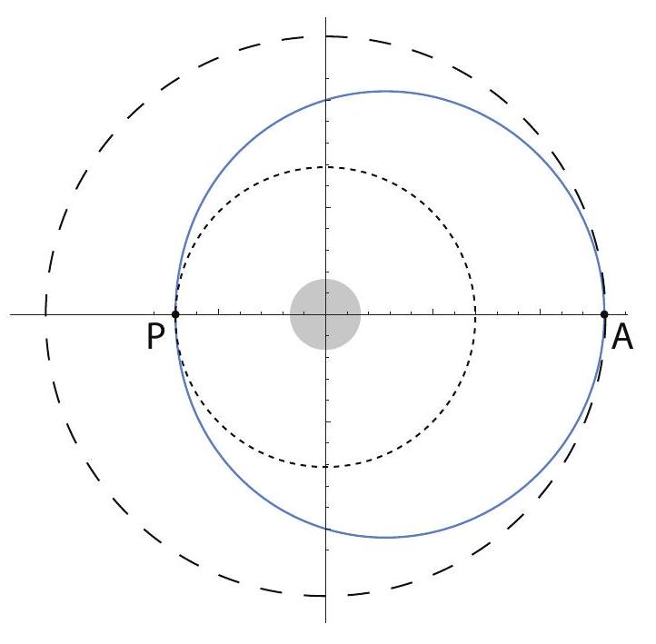

(sec-10.1)=
## 10.1 The inverse-square law

Up to this point, all I have told you about gravity is that, near the surface of the Earth, the gravitational force exerted by the Earth on an object of mass $m$ is $F^{G}=m g$. This is, indeed, a pretty good approximation, but it does not really tell you anything about what the gravitational force is where other objects or distances are involved.

The first comprehensive theory of gravity, formulated by Isaac Newton in the late 17th century, postulates that any two \"particles\" with masses $m_{1}$ and $m_{2}$ will exert an attractive force (a \"pull\") on each other, whose magnitude is proportional to the product of the masses, and inversely proportional to the square of the distance between them. Mathematically, we write

:::{math}
:label: eq-10.1
F_{12}^{G}=\frac{G m_{1} m_{2}}{r_{12}^{2}}
:::

Here, $r_{12}$ is just the magnitude of the position vector of particle 2 relative to particle 1 (so $r_{12}$ is, indeed, the distance between the two particles), and $G$ is a constant, known as \"Newton's constant\" or the gravitational constant, which at the time of Newton still had not been determined experimentally. You can see from {numref}`Eq. %s <eq-10.1>` that $G$ is simply the magnitude, in newtons, of the attractive force between two $1-\mathrm{kg}$ masses a distance of 1 m apart. This turns out to have the ridiculously small value $G=6.674 \times 10^{-11} \mathrm{~N} \mathrm{~m}^{2} / \mathrm{kg}^{2}$ (or, as is more commonly written, $\mathrm{m}^{3} \mathrm{~kg}^{-1} \mathrm{~s}^{-2}$ ). It was first measured by Henry Cavendish in 1798, in what was, without a doubt, an experimental tour de force for that time (more on that later, but you may peek at the \"Advanced Topics\" section of next chapter if you are curious already). As you can see, gravity as a force between any two ordinary objects is absolutely insignificant, and it takes the mass of a planet to make it into something you can feel.

{numref}`Equation %s <eq-10.1>`, as stated, applies to particles, that is to say, in practice, to any objects that are very small compared to the distance between them. The net force between extended masses can be obtained using calculus, by breaking up the two objects into very small pieces and adding (vectorially!) the force exerted by every small part of one object on every small part of the other object. This requires the use of integral calculus at a fairly advanced level, and for irregularlyshaped objects can only be computed numerically. For spherically-symmetric objects, however, it turns out that the result {eq}`eq-10.1` still holds exactly, provided the quantity $r_{12}$ is taken to be the distance between the center of the spheres. The same result also holds for the force between a finite-size sphere and a \"particle,\" again with the distance to the particle measured from the center of the sphere.

For the rest of this chapter, we will simply assume that {numref}`Eq. %s <eq-10.1>` is a good approximation to be used in any of the problems we will encounter involving extended objects. You can estimate visually how good it may be, for instance, when applied to the Earth-moon system (as we will do in a moment), from a look at {numref}`Figure %s <fig-10.1>` below:

:::{figure} ../images/2024_09_14_9969b06773f10b6936e8g-240.jpg
:label: fig-10.1
:alt: The moon, the earth, and the distance between them, all approximately to scale.
The moon, the earth, and the distance between them, all approximately to scale.
:::

Based on this picture it seems that it might be OK to treat the moon as a \"particle,\" but that it would not do, in general, to neglect the radius of the Earth; that is to say, we should use for $r_{12}$ the distance from the moon to the center of the Earth, not just to its surface.

Before we get there, however, let us start closer to home and see what happens if we try to use {numref}`Eq. %s <eq-10.1>` to calculate the force exerted by the Earth on an object if mass $m$ near its surface - say, at a height $h$ above the ground. Clearly, if the radius of the Earth is $R_{E}$, the distance of the object to the center of the Earth is $R_{E}+h$, and this is what we should use for $r_{12}$ in {numref}`Eq. %s <eq-10.1>`. However, noting that the radius of the Earth is about $6,000 \mathrm{~km}$ (more precisely, $R_{E}=6.37 \times 10^{6} \mathrm{~m}$ ), and the tallest mountain peak is only about 9 km above sea level, you can see that it will almost always be a very good approximation to set $r_{12}$ equal to just $R_{E}$, which results in a force

:::{math}
:label: eq-10.2
F_{E, o}^{G} \simeq \frac{G M_{E} m}{R_{E}^{2}}=m \frac{6.674 \times 10^{-11} \mathrm{~m}^{3} \mathrm{~kg}^{-1} \mathrm{~s}^{-2} \times 5.97 \times 10^{24} \mathrm{~kg}}{\left(6.37 \times 10^{6} \mathrm{~m}\right)^{2}}=m \times 9.82 \frac{\mathrm{m}}{\mathrm{s}^{2}}
:::

where I have used the currently known value $M_{E}=5.97 \times 10^{24} \mathrm{~kg}$ for the mass of the Earth. As you can see, we recover the familiar result $F^{G}=m g$, with $g \simeq 9.8 \mathrm{~m} / \mathrm{s}^{2}$, which we have been using all semester. We can rewrite this result (canceling the mass $m$ ) in the form

:::{math}
:label: eq-10.3
g_{E}=\frac{G M_{E}}{R_{E}^{2}}
:::

Here I have put a subscript $E$ on $g$ to emphasize that this is the acceleration of gravity near the surface of the Earth, and that the same formula could be used to find the acceleration of gravity\
near the surface of any other planet or moon, just replacing $M_{E}$ and $R_{E}$ by the mass and radius of the planet or moon in question. Thus, we could speak of $g_{\text {moon }}, g_{\text {Mars }}$, etc., and in some homework problems you will be asked to calculate these quantities. Clearly, besides telling you how fast things fall on a given planet, the quantity $g_{\text {planet }}$ allows you to figure out how much something would weigh on that planet's surface (just multiply $g_{\text {planet }}$ by the mass of the object); alternatively, the ratio of $g_{\text {planet }}$ to $g_{E}$ will be the ratio of the object's weight on that planet to its weight here on Earth.

Of course, historically, this is not what Newton and his contemporaries would have done: they had measurements of objects in free fall (or sliding on inclined planes) that would have given them the value of $g$, and they even had a pretty good idea of the radius of the Earth ${ }^{1}$, but they did not know either $G$ or the mass of the Earth, so all they could get from {numref}`Eq. %s <eq-10.3>` was the value of the product $G M_{E}$. It was only a century later, when Cavendish measured $G$, that they could get from that the mass of the earth (as a result of which, he became known as \"the man who weighed the earth\"!)

What Newton could do, however, with just this knowledge of the value of $G M_{E}$, was something that, for its time, was even more dramatic and far-reaching: namely, he could \"prove\" his intuition that the same fundamental interaction - gravity - that causes an apple to fall near the surface of the Earth, reaching out hundreds of thousands of miles away into space, also provides the force needed to keep the moon on its orbit. This brought together Earth-bound science (physics) and \"celestial\" science (astronomy) in a way that no one had ever dreamed of before.

To see how this works, let us start by assuming that the moon does move in a circle, with the Earth motionless at the center (these are all approximations, as we shall see later, but they give the right order of magnitude at the end, which is all that Newton could have hoped for anyway). The force $F_{E, m}^{G}$ then has to provide the centripetal force $F_{c}=M_{\text {moon }} \omega^{2} r_{e, m}$, where $\omega$ is the moon's angular velocity. We can cancel the moon's mass from both terms and write this condition as

:::{math}
:label: eq-10.4
\frac{G M_{E}}{r_{e, m}^{2}}=\omega^{2} r_{e, m}
:::

The moon revolves around the earth once about every 29 days, which is about $29 \times 24 \times 3600=$ $2.5 \times 10^{6} \mathrm{~s}$. So $\omega$ is $2 \pi$ radians per 2.5 million seconds, or $\omega=2.5 \times 10^{-6} \mathrm{rad} / \mathrm{s}$. Substituting this into {numref}`Eq. %s <eq-10.4>`, as well as the result $G M_{E}=g R_{E}^{2}$ (note that, as stated above, we do not need to know $G$ and $M_{E}$ separately), we get $r_{e, m}=3.99 \times 10^{8} \mathrm{~m}$, pretty close to today's accepted value of the average Earth-moon distance, which is $3.84 \times 10^{8} \mathrm{~km}$. Newton would not have known $r_{e, m}$ to such an accuracy, but he would still have had a pretty good idea that this was, indeed, the correct order of magnitude ${ }^{2}$.

(sec-10.1.1)=
### 10.1.1 Gravitational potential energy

Ever since I introduced the concept of potential energy in {ref}`Chapter 5 <ch-5>`, I have been using $U^{G}=m g y$ for the gravitational potential energy of the system formed by the Earth and an object of mass $m$ a height $y$ above the Earth's surface. This works well as long as the force of gravity is approximately constant, which is to say, as long as $y$ is much smaller than the radius of the earth, but obviously it must break down at some point.

Recall that, if the interaction between two objects can be described by a potential energy function of the objects' coordinates, $U\left(x_{1}, x_{2}\right)$, then (in one dimension) the force exerted by object 1 on object 2 could be written as $F_{12}=-d U / d x_{2}$. Since the force of gravity does lie along the line joining the two particles, we can cheat a bit and treat this as a one-dimensional problem, with $\left(F_{12}^{G}\right)_{x}=-G m_{1} m_{2} /\left(x_{1}-x_{2}\right)^{2}$ (I've put a minus sign there under the assumption that particle 1 is to the left of particle 2, that is, $x_{1}<x_{2}$, and the force on 2 is to the left), and find a potential energy function whose derivative gives that. The answer is clearly

:::{math}
:label: eq-10.5
U^{G}\left(x_{1}, x_{2}\right)=-\frac{G m_{1} m_{2}}{x_{2}-x_{1}}+C
:::

where $C$ is an arbitrary constant. (Please take a moment to verify for yourself that, indeed, $-d U^{G} / d x_{2}=-\left(F_{12}^{G}\right)_{x}$, and also $\left.-d U^{G} / d x_{1}=-\left(F_{21}^{G}\right)_{x}.\right)$

Since I have assumed $x_{2}>x_{1}$, the denominator in {numref}`Eq. %s <eq-10.5>` is just the distance between the two particles, and the potential energy function could be written, in three dimensions, as

:::{math}
:label: eq-10.6
U^{G}\left(r_{12}\right)=-\frac{G m_{1} m_{2}}{r_{12}}
:::

where $r_{12}=\left|\vec{r}_{2}-\vec{r}_{1}\right|$, and I have set the constant $C$ equal to zero. This means that the potential energy of the system is always negative, which is, on the face of it, a strange result. However, there is no way to choose the constant $C$ in {eq}`eq-10.5` that will prevent that: no matter how big and positive $C$ might be, the first term in {eq}`eq-10.5` can always become larger (in magnitude) and negative, if the particles are very close together. So we might as well choose $C=0$, which, at least, gives us the somewhat comforting result that the potential energy of the system is zero when the particles are \"infinitely\" distant from each other-that is to say, so far apart that they do not feel a force from each other any more.

But Eq. (e10.5) also makes sense in a different way: namely, it shows that the system's potential energy increases as the particles are moved farther apart. Indeed, we expect, physically, that if you separate the particles by a great distance and then release them, they will pick up a lot of speed as they approach each other; or, put differently, that the force doing work over a large distance will give them a large amount of kinetic energy - which must come from the system's potential energy. But, in fact, mathematically, {numref}`Eq. %s <eq-10.6>` agrees with this expectation: for any finite distance, $U^{G}$ is negative, and it gets smaller in magnitude as the distance increases, which means algebraically\
it increases (since a number like, say, -0.1 is, in fact, greater than a number like -10 ). So as the particles are moved farther and farther apart, the potential energy of the system does increase - all the way up to a maximum value of zero!

Still, even if it makes sense mathematically, the notion of a \"negative energy\" is hard to wrap your mind around. I can only offer you two possible ways to look at it. One is to simply not think of potential energy as being anything like a \"substance,\" but just an accounting device that we use to keep track of the potential that a system has to do work for us - or (more or less equivalently) to give us kinetic energy, which is always positive and hence may be thought of as the \"real\" energy. From this point of view, whether $U$ is positive or negative does not matter: all that matters is the change $\Delta U$, and whether this change has a sign that makes sense. This, at least, is the case here, as I have argued in the paragraph above.

The other perspective is almost opposite, and based on Einstein's theory of relativity: in this theory, the total energy of a system is indeed \"something like a substance,\" in that it is directly related to the system's total inertia, $m$, through the famous equation $E=m c^{2}$. From this point of view, the total energy of a system of two particles, interacting gravitationally, at rest, and separated by a distance $r_{12}$, would be the sum of the gravitational potential energy (negative), and the two particles' \"rest energies,\" $m_{1} c^{2}$ and $m_{2} c^{2}$ :

:::{math}
:label: eq-10.7
E_{\text {total }}=m_{1} c^{2}+m_{2} c^{2}-\frac{G m_{1} m_{2}}{r_{12}}
:::

and this quantity will always be positive, unless one of the \"particles\" is a black hole and the other one is inside $\mathrm{it}^{3}$ !

Please note that we will not use {numref}`Equation %s <eq-10.7>` this semester at all, since we are concerned only with nonrelativistic mechanics here. In other words, we will not include the \"rest energy\" in our calculations of a system's total energy at all. However, if we did, we would find that a system whose rest energy is given by {numref}`Eq. %s <eq-10.7>` does, in fact, have an inertia that is less than the sum $m_{1}+m_{2}$. This strongly suggests that the negativity of the potential energy is not just a mathematical convenience, but rather it reflects a fundamental physical fact.

For a system of more than two particles, the total gravitational potential energy would be obtained by adding expressions like {eq}`eq-10.6` over all the pairs of particles. Thus, for instance, for three particles one would have

:::{math}
:label: eq-10.8
U^{G}\left(\vec{r}_{1}, \vec{r}_{2}, \vec{r}_{3}\right)=-\frac{G m_{1} m_{2}}{r_{12}}-\frac{G m_{1} m_{3}}{r_{13}}-\frac{G m_{2} m_{3}}{r_{23}}
:::

A large mass such as the earth, or a star, has an intrinsic amount of gravitational potential energy that can be calculated by breaking it up into small parts and performing a sum like {eq}`eq-10.8` over all the possible pairs of \"parts.\" (As usual, this sum is usually evaluated as an integral, by taking the limit of an infinite number of infinitesimally small parts.) This \"self-energy\" does not change with

time, and hence does not need to be included in most energy calculations involving gravitational forces between extended objects.

One thing that you may be wondering about, regarding {numref}`Eq. %s <eq-10.6>` for the potential energy of a pair of particles (or, for that matter, {numref}`Eq. %s <eq-10.1>` for the force), is what happens when the distance $r_{12}$ goes to zero, since the mathematical expression appears to become infinite. This is technically true, but, in practice, it would only be a problem for a pair of true point particles-objects that would literally be mathematical points, with no dimensions at all. Such things may exist in some sense electrons may well be an example - but they need to be described by quantum mechanics, which is an altogether different mathematical theory.

For finite-sized objects, you cannot continue to use an equation like {eq}`eq-10.6` (or {eq}`eq-10.1`, for the force) when you are under the surface of the object. If you could dig a tunnel all the way down to the center of a hypothetical \"earth\" that had a constant density, the potential energy of the system formed by this \"earth\" and a particle of mass $m$, a distance $r$ from the center, would look as shown in {numref}`Fig. %s <fig-10.2>`. Notice how $U^{G}$ becomes \"flat,\" indicating an equilibrium position (zero force), as $r \rightarrow 0$. It stands to reason that the net gravitational force at the center of this model \"earth\" should be zero, since one would be pulled equally strongly in all directions by all the mass around.

:::{figure} ../images/2024_09_14_9969b06773f10b6936e8g-244.jpg
:label: fig-10.2
:alt: Gravitational potential energy of a system formed by a particle of mass m and a hypothetical earth with uniform density, a mass M, and a radius RE, as a function of the distance r between the particle and the center of the "earth" (solid line). The dashed line shows the result for a system of two (point-like) particles. The energy UG is expressed in units of m g RE, where g=G M / RE2.
Gravitational potential energy of a system formed by a particle of mass $m$ and a hypothetical earth with uniform density, a mass $M$, and a radius $R_{E}$, as a function of the distance $r$ between the particle and the center of the \"earth\" (solid line). The dashed line shows the result for a system of two (point-like) particles. The energy $U^{G}$ is expressed in units of $m g R_{E}$, where $g=G M / R_{E}^{2}$.
:::

Finally, let me show you that the result {eq}`eq-10.6` is fully consistent with the approximation $U^{G}=m g y$ that we have been using up till now near the surface of the earth. (If you are not interested in mathematical derivations, feel free to skip this next bit.) Consider a particle of mass $m$ that is\
initially on the surface of the earth, and then we move it to a height $h$ above the earth. The change in potential energy, according to {eq}`eq-10.6`, is

:::{math}
:label: eq-10.9
U_{f}^{G}-U_{i}^{G}=-\frac{G M_{E} m}{R_{E}+h}+\frac{G M_{E} m}{R_{E}}
:::

If we write both terms with a common denominator, we get

:::{math}
:label: eq-10.10
U_{f}^{G}-U_{i}^{G}=\frac{G M_{E} m}{\left(R_{E}+h\right) R_{E}} h \simeq \frac{G M_{E} m}{R_{E}^{2}} h=m g h
:::

The only approximation here has been to set $R_{E}+h \simeq R_{E}$ in the denominator of this expression. Since $R_{E}$ is of the order of thousands of kilometers, this is an excellent approximation, as long as $h$ is less than, say, a few hundred meters.

(sec-10.1.2)=
### 10.1.2 Types of orbits under an inverse-square force

Consider a system formed by two particles (or two perfect, rigid spheres) interacting only with each other, through their gravitational attraction. Conservation of the total momentum tells us that the center of mass of the system is either at rest or moving with constant velocity. Let us assume that one of the objects has a much greater mass, $M$, than the other, so that, for practical purposes, its center coincides with the center of mass of the whole system. This is not a bad approximation if what we are interested in is, for instance, the orbit of a planet around the sun. The most massive planet, Jupiter, has only about 0.001 times the mass of the sun.

Accordingly, we will assume that the more massive object does not move at all (by working in its center of mass reference frame, if necessary - note that, by our assumptions, this will be an inertial reference frame to a good approximation), and we will be concerned only with the motion of the less massive object under the force $F=G M m / r^{2}$, where $r$ is the distance between the centers of the two objects. Since this force is always pulling towards the center of the more massive object (it is what is often called a central force), its torque around that point is zero, and therefore the angular momentum, $\vec{L}$, of the less massive body around the center of mass of the system is constant. This is an interesting result: it tells us, for instance, that the motion is confined to a plane, the same plane that the vectors $\vec{r}$ and $\vec{v}$ defined initially, since their cross-product cannot change.

In spite of this simplification, the calculation of the object's trajectory, or orbit, requires some fairly advanced mathematical techniques, except for the simplest case, which is that of a circular orbit of radius $R$. Note that this case requires a very precise relationship to hold between the object's velocity and the orbit's radius, which we can get by setting the force of gravity equal to the centripetal force:

:::{math}
:label: eq-10.11
\frac{G M m}{R^{2}}=\frac{m v^{2}}{R}
:::

So, if we want to, say, put a satellite in a circular orbit around a central body of mass $M$ and at a distance $R$ from the center of that body, we can do it, but only provided we give the satellite an initial velocity $v=\sqrt{G M / R}$ in a direction perpendicular to the radius. But what if we were to release the satellite at the same distance $R$, but with a different velocity, either in magnitude or direction? Too much speed would pull it away from the circle, so the distance to the center, $r$, would temporarily increase; this would increase the system's potential energy and accordingly reduce the satellite's velocity, so eventually it would get pulled back; then it would speed up again, and so on.

You may experiment with this kind of thing yourself using the PhET demo at this link:\
<https://phet.colorado.edu/en/simulation/gravity-and-orbits>\
You will find that, as long as you do not give the satellite - or planet, in the simulation - too much speed (more on this later!) the orbit you get is, in fact, a closed curve, the kind of curve we call an ellipse. I have drawn one such ellipse for you in {numref}`Fig. %s <fig-10.3>`.

:::{figure} ../images/2024_09_14_9969b06773f10b6936e8g-246.jpg
:label: fig-10.3
:alt: An elliptical orbit. The semimajor axis is a, the semiminor axis is b, and the eccentricity e=square root of 1-b2 / a2=0.745 in this case.. The "center of attraction" (the sun, for instance, in the case of a planet's or comet's orbit) is at the point O.
An elliptical orbit. The semimajor axis is $a$, the semiminor axis is $b$, and the eccentricity $e=\sqrt{1-b^{2} / a^{2}}=0.745$ in this case.. The \"center of attraction\" (the sun, for instance, in the case of a planet's or comet's orbit) is at the point $O$.
:::

As a geometrical curve, any ellipse can be characterized by a couple of numbers, $a$ and $b$, which are the lengths of the semimajor and semiminor axes, respectively. These lengths are shown in the figure. Alternatively, one could specify $a$ and a parameter known as the eccentricity, denoted by $e$ (do not mistake this \" $e$ \" for the coefficient of restitution of {ref}`Chapter 4 <ch-4>`!), which is equal to $e=\sqrt{1-b^{2} / a^{2}}$. If $a=b$, or $e=0$, the ellipse becomes a circle.

The most striking feature of the elliptical orbits under the influence of the $1 / r^{2}$ gravitational force is that the \"central object\" (the sun, for instance, if we are interested in the orbit of a planet, asteroid or comet) is not at the geometric center of the ellipse. Rather, it is at a special point called the focus of the ellipse (labeled \"O\" in the figure, since that is the origin for the position vector of the orbiting body). There are actually two foci, symmetrically placed on the horizontal (major) axis,\
and the distance of each focus to the center of the ellipse is given by the product ea, that is, the product of the eccentricity and the semimajor axis. (This explains why the \"eccentricity\" is called that: it is a measure of how \"off-center\" the focus is.)

For an object moving in an elliptical orbit around the sun, the distance to the sun is minimal at a point called the perihelion, and maximal at a point called the aphelion. Those points are shown in the figure and labeled \"P\" and \"A\", respectively. For an object in orbit around the earth, the corresponding terms are perigee and apogee; for an orbit around some unspecified central body, the terms periapsis and apoapsis are used. There is some confusion as to whether the distances are to be measured from the surface or from the center of the central body; here I will assume they are all measured from the center, in which case the following relationships follow directly from {numref}`Figure %s <fig-10.3>`:

:::{math}
:label: eq-10.12
\begin{align*}
r_{\max } & =(1+e) a \\
r_{\min } & =(1-e) a \\
r_{\min }+r_{\max } & =2 a \\
e & =\frac{r_{\max }-r_{\min }}{2 a}
\end{align*}
:::

The ellipse I have drawn in {numref}`Fig. %s <fig-10.3>` is actually way too eccentric to represent the orbit of any planet in the solar system (although it could well be the orbit of a comet). The planet with the most eccentric orbit is Mercury, and that is only $e=0.21$. This means that $b=0.978 a$, an almost imperceptible deviation from a circle. I have drawn the orbit to scale in {numref}`Fig. %s <fig-10.4>`, and as you can see the only way you can tell it is an ellipse is, precisely, because the sun is not at the center.

:::{figure} ../images/2024_09_14_9969b06773f10b6936e8g-247.jpg
:label: fig-10.4
:alt: Orbit of Mercury, with the sun approximately to scale.
Orbit of Mercury, with the sun approximately to scale.
:::

Since an ellipse has only two parameters, and we have two constants of the motion (the total energy, $E$, and the angular momentum, $L$ ), we should be able to determine what the orbit will look like based on just those two quantities. Under the assumption we are making here, that the very massive object does not move at all, the total energy of the system is just

:::{math}
:label: eq-10.13
E=\frac{1}{2} m v^{2}-\frac{G M m}{r}
:::

For a circular orbit, the radius $R$ determines the speed (as per {numref}`Eq. %s <eq-10.11>`), and hence the total energy, which is easily seen to be $E=-\frac{G M m}{2 R}$. It turns out that this formula holds also for elliptical orbits, if one substitutes the semimajor axis $a$ for $R$ :

:::{math}
E=-\frac{G M m}{2 a}
:::

Note that the total energy {eq}`eq-10.14` is negative. This means that we have a bound orbit, by which I mean, a situation where the orbiting object does not have enough kinetic energy to fly arbitrarily far away from the center of attraction. Indeed, since $U^{G} \rightarrow 0$ as $r \rightarrow \infty$, you can see from {numref}`Eq. %s <eq-10.13>` that if the two objects could be infinitely far apart, the total energy would eventually have to be positive, for any nonzero speed of the lighter object. So, if $E<0$, we have bound orbits, which are ellipses (of which a circle is a special case), and conversely, if $E>0$ we have \"unbound\" trajectories, which turn out to be hyperbolas ${ }^{4}$. These trajectories just pass near the center of attraction once, and never return.

The special borderline case when $E=0$ corresponds to a parabolic trajectory. In this case, the particle also never comes back: it has just enough kinetic energy to make it \"to infinity,\" slowing down all the while, so $v \rightarrow 0$ as $r \rightarrow \infty$. The initial speed necessary to accomplish this, starting from an initial distance $r_{i}$, is usually called the \"escape velocity\" (although it really should be called the escape speed), and it is found by simply setting {numref}`Eq. %s <eq-10.13>` equal to zero, with $r=r_{i}$, and solving for $v$ :

:::{math}
:label: eq-10.15
v_{e s c}=\sqrt{\frac{2 G M}{r_{i}}}
:::

In general, you can calculate the escape speed from any initial distance $r_{i}$ to the central object, but most often it is calculated from its surface. Note that $v_{e s c}$ does not depend on the mass of the lighter object (always assuming that the heavier object does not move at all). The escape velocity from the surface of the earth is about $11 \mathrm{~km} / \mathrm{s}$, or $1.1 \times 10^{4} \mathrm{~m} / \mathrm{s}$; but this alone would not be enough to let you leave the attraction of the sun behind. The escape speed from the sun starting from a point on the earth's orbit is $42 \mathrm{~km} / \mathrm{s}$.

To summarize all of the above, suppose you are trying to put something in orbit around a much more massive body, and you start out a distance $r$ away from the center of that body. If you give the object a speed smaller than the escape speed at that point, the result will be $E<0$ and an

elliptical orbit (of which a circle is a special case, if you give it the precise speed $v=\sqrt{G M / r}$ in the right direction). If you give it precisely the escape speed {eq}`eq-10.15`, the total energy of the system will be zero and the trajectory of the object will be a parabola; and if you give it more speed than $v_{\text {esc }}$, the total energy will be positive and the trajectory will be a hyperbola. This is illustrated in {numref}`Fig. %s <fig-10.5>` below.

:::{figure} ../images/2024_09_14_9969b06773f10b6936e8g-249.jpg
:label: fig-10.5
:alt: Possible trajectories for an object that is "released" with a sideways velocity at the lowest point in the figure, under the gravitational attraction of a large mass represented by the black circle. Each trajectory corresponds to a different value of the object's initial kinetic energy: if Kc i r c is the kinetic energy needed to have a circular orbit through the point of release, the figure shows the cases Ki=0.5 Ktext circ (small ellipse), Ki=Kc i r c (circle), Ki=1.5 Kc i r c (large ellipse), Ki=2 Kc i r c (escape velocity, parabola), and Ki=2.5 Ktext circ (hyperbola)
Possible trajectories for an object that is \"released\" with a sideways velocity at the lowest point in the figure, under the gravitational attraction of a large mass represented by the black circle. Each trajectory corresponds to a different value of the object's initial kinetic energy: if $K_{c i r c}$ is the kinetic energy needed to have a circular orbit through the point of release, the figure shows the cases $K_{i}=0.5 K_{\text {circ }}$ (small ellipse), $K_{i}=K_{c i r c}$ (circle), $K_{i}=1.5 K_{c i r c}$ (large ellipse), $K_{i}=2 K_{c i r c}$ (escape velocity, parabola), and $K_{i}=2.5 K_{\text {circ }}$ (hyperbola)
:::

Note that all the trajectories shown in {numref}`Figure %s <fig-10.5>` have the same potential energy at the \"point of release\" (since the distance from that point to the center of attraction is the same for all), so increasing the kinetic energy at that point also means increasing the total energy {eq}`eq-10.13` (which is constant throughout). So the picture shows different orbits in order of increasing total energy.

For a given total energy, the total angular momentum does not change the fundamental nature of the orbit (bound or unbound), but it can make a big difference on the orbit's shape. Generally speaking, for a given energy the orbits with less angular momentum will be \"narrower,\" or \"more squished\" than the ones with more angular momentum, since a smaller initial angular momentum at the point of insertion means a smaller sideways velocity component. In the extreme case of zero initial angular momentum (no sideways velocity at all), the trajectory, regardless of the total energy, reduces to a straight line, either straight towards or straight away from the center of attraction.

For elliptical orbits, one can prove the result

:::{math}
:label: eq-10.16
e=\sqrt{1-\frac{L^{2}}{a G M m^{2}}}
:::

which shows how the eccentricity increases as $L$ decreases, for a given value of $a$ (which is to say, for a given total energy). I should at least sketch how to obtain this result, since it is a variant of a procedure that you may have to use for some homework problems this semester. You start by writing the angular momentum as $L=m r_{P} v_{P}$ (or $m r_{A} v_{A}$ ), where $A$ and $P$ are the special points shown in {numref}`Figure %s <fig-10.2>`, where $\vec{v}$ and $\vec{r}$ are perpendicular. Then, you note that $r_{P}=r_{\text {min }}=(1-e) a$ (or, alternatively, $r_{A}=r_{\max }=(1+e) a$ ), so $v_{P}=L /[m(1-e) a]$. Then substitute these expressions for $r_{P}$ and $v_{P}$ in {numref}`Eq. %s <eq-10.13>`, set the result equal to the total energy {eq}`eq-10.14`, and solve for $e$.

:::{figure} ../images/2024_09_14_9969b06773f10b6936e8g-250.jpg
:label: fig-10.6
:alt: Effect of the "angle of insertion" on the orbit.
Effect of the \"angle of insertion\" on the orbit.
:::

{numref}`Figure %s <fig-10.6>` illustrates the effect of varying the angular momentum, for a given energy. All the initial velocity vectors in the figure have the same magnitude, and the release point (with position vector $\vec{r}_{i}$ ) is the same for all the orbits, so they all have the same energy; indeed, you can check that the semimajor axis of the two ellipses is the same as the radius of the circle, as required by {numref}`Eq. %s <eq-10.14>`. The difference between the orbits is their total angular momentum. The green orbit has the maximum angular momentum possible at the given energy, since the green velocity vector is perpendicular to $\vec{r}_{i}$. Note that this (maximizing $L$ for a given $E<0$ ) always results in a circle, in agreement with Eq. (e10.15): the eccentricity is zero when $L=L_{\text {circ }} \equiv \sqrt{a G M m^{2}}$, which is the largest value of $L$ allowed in Eq. (e10.15).

For the other two orbits, $\vec{v}_{i}$ and $\vec{r}_{i}$ make angles of $45^{\circ}$ and $135^{\circ}$, and so the angular momentum $L$ has magnitude $L=L_{\text {circ }} \sin 45^{\circ}=L_{\text {circ }} / \sqrt{2}$. The result are the red and blue ellipses, with eccentricities $e=\sqrt{1-\sin ^{2}\left(45^{\circ}\right)}=0.707$.

(sec-10.1.3)=
### 10.1.3 Kepler's laws

The first great success of Newton's theory was to account for the results that Johannes Kepler had extracted from astronomical data on the motion of the planets around the sun. Kepler had managed to find a number of regularities in a mountain of data (most of which were observations by his mentor, the Danish astronomer Tycho Brahe), and expressed them in a succinct way in mathematical form. These results have come to be known as Kepler's laws, and they are as follows:

1.  The planets move around the sun in elliptical orbits, with the sun at one focus of the ellipse.

2.  (Law of areas) A line that connects the planet to the sun (the planet's position vector) sweeps equal areas in equal times.

3.  The square of the orbital period of any planet is proportional to the cube of the semimajor axis of its orbit (the same proportionality constant holds for all the planets).

I have discussed the first \"law\" at length in the previous section, and also pointed out that the math necessary to prove it is far from trivial. The second law, on the other hand, while it sounds complicated, turns out to be a straightforward consequence of the conservation of angular momentum. To see what it means, consider {numref}`Figure %s <fig-10.7>`.

:::{figure} ../images/2024_09_14_9969b06773f10b6936e8g-251.jpg
:label: fig-10.7
:alt: Illustrating Kepler's law of areas. The two gray "curved triangles" have the same area, so the particle must take the same time to go from A to Aprime as it does to go from B to Bprime.
Illustrating Kepler's law of areas. The two gray \"curved triangles\" have the same area, so the particle must take the same time to go from $A$ to $A^{\prime}$ as it does to go from $B$ to $B^{\prime}$.
:::

Suppose that, at some time $t_{A}$, the particle is at point A , and a time $\Delta t$ later it has moved to $\mathrm{A}^{\prime}$. The area \"swept\" by its position vector is shown in grey in the figure, and Kepler's second law states that it must be the same, for the same time interval, at any point in the trajectory; so, for\
instance, if the particle starts out at B instead, then in the same time interval $\Delta t$ it will move to a point $\mathrm{B}^{\prime}$ such that the area of the \"curved triangle\" $\mathrm{OBB}^{\prime}$ equals the area of $\mathrm{OAA}^{\prime}$.

Qualitatively, this means that the particle needs to move more slowly when it is farther from the center of attraction, and faster when it is closer. Quantitatively, this actually just means that its angular momentum is constant! To see this, note that the straight distance from A to $A^{\prime}$ is the displacement vector $\Delta \vec{r}_{A}$, which, for a sufficiently short interval $\Delta t$, will be approximately equal to $\vec{v}_{A} \Delta t$. Again, for small $\Delta t$, the area of the curved triangle will be approximately the same as that of the straight triangle $\mathrm{OAA}^{\prime}$. It is a well-known result in trigonometry that the area of a triangle is equal to $1 / 2$ the product of the lengths of any two of its sides times the sine of the angle they make. So, if the two triangles in the figures have the same areas, we must have

:::{math}
:label: eq-10.17
\left|\vec{r}_{A}\right|\left|\vec{v}_{A}\right| \Delta t \sin \theta_{A}=\left|\vec{r}_{B}\right|\left|\vec{v}_{B}\right| \Delta t \sin \theta_{B}
:::

and we recognize here the condition $\left|\vec{L}_{A}\right|=\left|\vec{L}_{B}\right|$, which is to say, conservation of angular momentum. (Once the result is established for infinitesimally small $\Delta t$, we can establish it for finite-size areas by using integral calculus, which is to say, in essence, by breaking up large triangles into sums of many small ones.)

As for Kepler's third result, it is easy to establish for a circular orbit, and definitely not easy for an elliptical one. Let us call $T$ the orbital period, that is, the time it takes for the less massive object to go around the orbit once. For a circular orbit, the angular velocity $\omega$ can be written in terms of $T$ as $\omega=2 \pi / T$, and hence the regular speed $v=R \omega=2 \pi R / T$. Substituting this in {numref}`Eq. %s <eq-10.11>`, we get $G M / R^{2}=4 \pi^{2} R / T^{2}$, which can be simplified further to read

:::{math}
:label: eq-10.18
T^{2}=\frac{4 \pi^{2}}{G M} R^{3}
:::

Again, this turns out to work for an elliptical orbit if we replace $R$ by $a$.\
Note that the proportionality constant in {numref}`Eq. %s <eq-10.18>` depends only on the mass of the central body. For the solar system, that would be the sun, of course, and then the formula would apply to any planet, asteroid, or comet, with the same proportionality constant. This gives you a quick way to calculate the orbital period of anything orbiting the sun, if you know its distance (or vice-versa), based on the fact that you know what these quantities are for the Earth.

More generally, suppose you have two planets, 1 and 2, both orbiting the same star, at distances $R_{1}$ and $R_{2}$, respectively. Then their orbital periods $T_{1}$ and $T_{2}$ must satisfy $T_{1}^{2}=\left(4 \pi^{2} / G M\right) R_{1}^{3}$ and $T_{2}^{2}=\left(4 \pi^{2} / G M\right) R_{2}^{3}$. Divide one equation by the other, and the proportionality constant cancels, so you get

:::{math}
:label: eq-10.19
\left(\frac{T_{2}}{T_{1}}\right)^{2}=\left(\frac{R_{2}}{R_{1}}\right)^{3}
:::

From this some simple manipulation gives you

:::{math}
:label: eq-10.20
T_{2}=T_{1}\left(\frac{R_{2}}{R_{1}}\right)^{3 / 2}
:::

Note you can express $R_{1}$ and $R_{2}$ in any units you like, as long as you use the same units for both, and similarly $T_{1}$ and $T_{2}$. For instance, if you use the Earth as your reference \"planet 1 ,\" then you know that $T_{1}=1$ (in years), and $R_{1}=1$, in AU (an AU , or \"astronomical unit,\" is the distance from the Earth to the sun). A hypothetical planet at a distance of 4 AU from the sun should then have an orbital period of 8 Earth-years, since $4^{3 / 2}=\sqrt{4^{3}}=\sqrt{64}=8$.

A formula just like {eq}`eq-10.18`, but with a different proportionality constant, would apply to the satellites of any given planet; for instance, the myriad of artificial satellites that orbit the Earth. Again, you could introduce a \"reference satellite\" labeled 1, with known period and distance to the Earth (the moon, for instance?), and derive again the result {eq}`eq-10.20`, which would allow you to get the period of any other satellite, if you knew how its distance to the earth compares to the moon's (or, conversely, the distance at which you would need to place it in order to get a desired orbital period).

For instance, suppose I want to place a satellite on a \"geosynchronous\" orbit, meaning that it takes 1 day for it to orbit the Earth. I know the moon takes 29 days, so I can write {numref}`Eq. %s <eq-10.20>` as $1=29\left(R_{2} / R_{1}\right)^{3 / 2}$, or, solving it, $R_{2} / R_{1}=(1 / 29)^{2 / 3}=0.106$, meaning the satellite would have to be approximately $1 / 10$ of the Earth-moon distance from (the center of) the Earth.

In hindsight, it is somewhat remarkable that Kepler's laws are as accurate, for the solar system, as they turned out to be, since they can only be mathematically derived from Newton's theory by making a number of simplifying approximations: that the sun does not move, that the gravitational force of the other planets has no effect on each planet's orbit, and that the planets (and the sun) are perfect spheres, for instance. The first two of these approximations work as well as they do because the sun is so massive; the third one works because the sizes of all the objects involved (including the sun) are much smaller than the corresponding orbits. Nevertheless, Newton's work made it clear that Kepler's laws could only be approximately valid, and scientists soon set to work on developing ways to calculate the corrections necessary to deal with, for instance, the trajectories of comets or the orbit of the moon.

Of the main approximations I have listed above, the easiest one to get rid of (mathematically) is the first one, namely, that the sun does not move. Instead, what one finds is that, as long as the sun and the planet are still treated as an isolated system, they will both revolve around the system's center of mass. Of course, the sun's motion (a slight \"wobble\") is very small, but not completely negligible. You can even see it in the simulation I mentioned earlier, at\
<https://phet.colorado.edu/en/simulation/gravity-and-orbits>.\
What is much harder to deal with, mathematically, is the fact that none of the planets in the\
solar system actually forms an isolated system with the sun, since all the planets are really pulling gravitationally on each other all the time. Particularly, Jupiter and Saturn have a non-negligible influence on each other's orbits, and on the orbits of every other planet, which can only be perceived over centuries. Basically, the orbits still look like ellipses to a very good degree, but the ellipses rotate very, very slowly (so they fail to exactly close in on themselves). This effect, known as orbital precession, is most dramatic for Mercury, where the ellipse's axes rotate by more than one degree per century.

Nevertheless, the Newtonian theory is so accurate, and the calculation techniques developed over the centuries so sophisticated, that by the early 20th century the precession of the orbits of all planets except Mercury had been calculated to near exact agreement with the best observational data. The unexplained discrepancy for Mercury amounted only to 43 seconds of arc per century, out of 5600 (an error of only $0.8 \%$ ). It was eventually resolved by Einstein's general theory of relativity.

(sec-10.2)=
## 10.2 Weight, acceleration, and the equivalence principle

Whether we write it as $m g$ or as $G M m / r^{2}$, the force of gravity on an object of mass $m$ has the remarkable property - not shared by any other known force - of being proportional to the inertial mass of the object. This means that, if gravity is the only force acting on a system made up of many particles, when you divide the force on each particle by the particle's mass in order to find the particle's acceleration, you get the same value of $a$ for every particle (at least, assuming that they are all at about the same distance from the object exerting the force in the first place). Thus, all the parts making up the object will accelerate together, as a whole.

Suppose that you are holding an object, while in free fall (remember that \"free fall\" means that gravity is the only force acting on you), and you let go of it, as in {numref}`Fig. %s <fig-10.8>` below. Since gravity will give you and the object the same acceleration, you'll find that it does not \"fall\" relative to you - that is, it will not fall any faster nor more slowly than yourself. From your own reference frame, you will just see it hovering motionless in front of you, in the same position (relative to you) that it occupied before you let go of it. This is exactly what you see in videos shot aboard the International Space Station. The result is an impression of weightlessness, or \"zero gravity\" even though gravity is very much nonzero; the space station, and everything inside it, is constantly \"falling\" to the earth, it just does not hit it because it has some sideways velocity (or angular momentum) to begin with, and the earth's pull just bends its trajectory around enough to keep it moving in a circle. But gravity is the only force acting on it, and on everything in it (at least until somebody pushes himself against a wall, or something like that).

So, the kind of acceleration you get from gravity is, paradoxically, such that, if you give in to it completely, you feel like there is no gravity.

:::{figure} ../images/2024_09_14_9969b06773f10b6936e8g-255.jpg
:label: fig-10.8
:alt: If you are holding something while in free fall (a) and let go, since you are all accelerating at the same rate, it stays in the same position relative to you (b), so it appears to be weightless.
If you are holding something while in free fall (a) and let go, since you are all accelerating at the same rate, it stays in the same position relative to you (b), so it appears to be weightless.
:::

The familiar sensation of weight, on the other hand, comes precisely from not giving in, and rather, enlisting other forces to fight against gravity. When you do this - when you simply stand on the surface of the earth, for instance - your feet are supported by the ground below you, but every other part of your body is supported by some other part of your body, immediately above or below it, that you can think of as a sort of spring that is either somewhat stretched or somewhat compressed. It is primarily your skeleton, and mostly your spine, that bears most of the compressive load. (See {numref}`Fig. %s <fig-10.9>`, next page.) The sensation of weight is your response to this load. Interestingly, even though this constant squishing may actually result in your losing a little height in the course of a day (which you recover at night, when you lie horizontally), it is not a bad thing, rather the contrary: your bones have evolved so that they need this constant pressure to grow and replace the mass that they would otherwise lose in a \"weightless\" environment.

On the other hand, as shown in {numref}`Fig. %s <fig-10.9>` (c), the same compression (or extension-for instance, for the muscles in your arms, as they hang by your side) would result from a situation in which you were, say, standing motionless inside a rocket that is accelerating upwards with $a=g$, but very far away from any gravity source. In {numref}`Fig. %s <fig-10.9>` (b), the \"spring\" that represents your skeleton needs to be compressed so it can exert an upward force $F^{s p r}=m_{u} g$ to support the weight of your upper body (simplified here as just a single mass $m_{u}$ ). In {numref}`Fig. %s <fig-10.9>` (c), it needs to be compressed by the same amount, so it can exert the upward force $F^{s p r}=m_{u} a$ needed to give your upper body an acceleration $a=g$. The equality of the two expressions is a direct consequence of the fact that the force of gravity is proportional to an object's inertial mass (since the second expression is just

Newton's second law).

:::{figure} ../images/2024_09_14_9969b06773f10b6936e8g-256.jpg
:label: fig-10.9
:alt: (a) In free fall, your skeleton (represented here by a relaxed spring) does not need to support your upper body, so there is no sensation of weight. When standing on the ground motionless under the influence of gravity, however (b), every part of your body needs to compress a little in order to support the weight of the parts above it (as shown here by the compressed spring). The same compression, and hence the same subjective sensation of weight, results if you are moving upwards with an acceleration a=g, but in the absence of gravity (c). (The subscripts u and l on the forces stand for "upper" and "lower" body, respectively.)
(a) In free fall, your skeleton (represented here by a relaxed spring) does not need to support your upper body, so there is no sensation of weight. When standing on the ground motionless under the influence of gravity, however (b), every part of your body needs to compress a little in order to support the weight of the parts above it (as shown here by the compressed spring). The same compression, and hence the same subjective sensation of weight, results if you are moving upwards with an acceleration $a=g$, but in the absence of gravity (c). (The subscripts $u$ and $l$ on the forces stand for \"upper\" and \"lower\" body, respectively.)
:::

(a) gravity $g, a=-g$

.jpg)
(b) gravity $g, a=0$

.jpg)
(c) no gravity, $a=g$

In general, then, when your whole body is subjected to an upward acceleration $a$, it feels like your weight is increased by an amount $m a$. The same thing holds regardless of direction - a forward acceleration $a$ on a jet pilot's body feels like a \"weight\" ma pushing her against her seat. This is why these \"effective forces\" (or, more precisely, the accelerations that cause them) are measured in $g$ 's: a \"force\" of, say, $5 g$, means that the pilot feels pushed against her seat with a \"force\" equal to 5 times her weight. What's really happening, of course, is the opposite - her seat is pushing her forward, but her internal organs are being compressed (in order to provide that same forward acceleration) the way they would under a gravity force five times stronger than at the earth's surface.

The parallels between being in a constantly accelerating frame of reference and being at rest under the influence of a constant gravity force go beyond the subjective sensation of weight. {numref}`Figure %s <fig-10.10>`\
illustrates what happens when you drop something while traveling in the upwardly accelerating rocket, in the absence of gravity. From an inertial observer's point of view, the object you drop merely keeps the upward velocity it had the moment it left your hand; but, since you are in contact with the rocket, your own velocity is constantly increasing, and as a result of that you see the object fall---relative to you.

:::{figure} ../images/2024_09_14_9969b06773f10b6936e8g-257.jpg
:label: fig-10.10
:alt: "Dropping" an object inside a constantly accelerating rocket, away from any gravity.
\"Dropping\" an object inside a constantly accelerating rocket, away from any gravity.
:::

From a practical point of view, this suggests a couple of ways to provide an \"artificial gravity\" for astronauts who might one day have to spend a long time in space, either under extremely weak gravity (for instance, during a trip to Mars), or, what amounts to essentially the same thing, in free fall (as in a space station orbiting a planet). The one most often seen in movies consists in having the space station (or spaceship) constantly spin around an axis with some angular velocity $\omega$. Then any object that is moving with the station, a distance $R$ away from the axis, will experience a centripetal acceleration of magnitude $\omega^{2} R$, which will feel like a gravity force $m \omega^{2} R$ directed in the opposite direction, that is to say, away from the center. People would then basically \"walk on the walls\" (that is to say, sideways as seen from above, with their feet away from the rotation axis and their heads towards the rotation axis). If somebody let go of something they were holding,\
the object would \"fall towards the wall,\" just like the object considered in Example 9.6.3 (previous chapter). Unfortunately, while the idea might work for a space station, it would probably be impractical for a spaceship, since one would need a fairly large $R$ and/or a fairly large rotation rate to get $\omega^{2} R \simeq g$. (On the other hand, probably even something like $\frac{1}{5} g$ is better than nothing, so who knows\...)

On a fundamental level, the equivalence between a constantly accelerated reference frame, and an inertial frame with a uniform gravitational field (such as, approximately, the surface of the earth), was elevated by Einstein to a basic principle of physics, which became the foundation of his general theory of relativity. This equivalence principle asserts that it is absolutely impossible to distinguish, by any kind of physics experiment, between the two situations just mentioned: a constantly accelerated reference frame is postulated to be completely equivalent in every way to an inertial frame with a uniform gravitational field.

A remarkable consequence of the equivalence principle is that light, despite having technically \"zero rest mass,\" must bend its trajectory under the influence of gravity. This can be seen as follows. Imagine shooting a projectile horizontally inside the rocket in {numref}`Figure %s <fig-10.10>`. Although an inertial observer, looking from the outside, would see the projectile travel in a straight line, the observer inside the rocket would see its path bend down, just as for the projectiles we studied back in {ref}`Chapter 8 <ch-8>`. This is for the same reason he would see the object fall, relative to him, in {numref}`Figure %s <fig-10.10>`: the projectile has a constant velocity, so it travels the same distance in every equal time interval, but the rocket is accelerating, so the distance it travels in equal time intervals is constantly increasing. In basically the same way, then, a beam of light sent horizontally inside the rocket, and traveling with constant velocity (and, therefore, in a straight line) in an inertial frame, would be seen as bending down in the rocket's reference frame.

However, if the equivalence principle is true, and physical phenomena look the same in a constantly accelerating frame as in an inertial frame with a constant gravitational field, it follows that light must also bend its path in the latter system, in much the same way as a projectile would. (I say \"much the same way\" because the effect is not just as simple as giving light an \"effective mass\"; there are other relativistic effects, such as space contraction and time dilation, that must also be reckoned with.) This gravitational bending was one of the most important early predictions of Einstein's General Relativity theory, and certainly the most spectacular. Since one needs the light rays to pass vary close to a large mass to get an observable effect, the way the prediction was verified was by looking at the apparent position of the stars that can be seen close to the edge of the sun's disk during a solar eclipse. The slight (apparent) shift in position predicted by Einstein was observed by Sir Arthur Eddington during the solar eclipse of 1919 (two expeditions were sent to remote corners of the earth for this purpose), and it was primarily responsible for Einstein's sudden fame among the general public of his day.

Today, with modern telescopes, this so-called \"gravitational lensing\" effect has become an important tool in astronomy, allowing us to interpret the pictures taken of distant galaxies, which are often\
shifted and/or distorted by the gravity of the galaxies that lie in between them and us.\
It has even become possible to imagine an object so dense that it would \"capture\" light, attracting it so strongly that it could not leave the object's neighborhood. Such an object has come to be called a black hole. If you set the escape velocity of {numref}`Eq. %s <eq-10.15>` equal to the speed of light in vacuum, $c$, and solve for $r_{i}$, you obtain what is called the Schwarzschild radius, $r_{s}$, for a black hole of mass $M$; the idea being that, in order to be a black hole, the object has to be so dense that all its mass $M$ is inside a sphere of radius smaller than $r_{s}$. Physicists today believe in the existence (and even what one might call the ubiquity) of black holes, of which the Schwarzschild solution was only the first calculated example. Note that $r_{s}$ does not define the actual, physical surface of the object; it does, however, locate what is known as the black hole's event horizon. Nothing can be known, through observation, about anything that might happen closer to the black hole's center than the distance $r_{s}$, since no information can be transmitted faster than light, and no light can escape from a distance $r_{i}<r_{s}$.

(sec-10.3)=
## 10.3 In summary

1.  In Newton's theory of gravity, two particles of inertial masses $m_{1}$ and $m_{2}$, separated by a distance $r_{12}$, exert a gravitational force on each other which is attractive, along the line joining the two particles, and has magnitude $F_{12}^{G}=F_{21}^{G}=G m_{1} m_{2} / r_{12}^{2}$, with $G=6.674 \times$ $10^{-11} \mathrm{~m}^{3} \mathrm{~kg}^{-1} \mathrm{~s}^{-2}$.

2.  The gravitational force between two extended objects is found by adding (vectorially) the forces between all the pairs of particles that make up the objects. For objects with spherical symmetry, the result has the same form as above, with $r_{12}$ being now the distance between the centers of the spheres.

3.  The gravitational potential energy of a system of two particles of masses $m_{1}$ and $m_{2}$ is $U^{G}=-G m_{1} m_{2} / r_{12}$. For systems of more particles, one should just add the corresponding energies for all the possible pairs. For a pair of spheres, one may use the same result as for two particles, as long as one is not interested in the spheres' gravitational self-energy.

4.  The expressions given above for $F^{G}$ and $U^{G}$ reduce, respectively, to $m g$ and $m g y+C$ (where $C$ is an unimportant constant) near the surface of the earth, to a good approximation, provided the distance $y$ to the surface is much smaller than the radius of the earth, $R_{E}$. If $M_{E}$ is the mass of the earth, one has $g=G M_{E} / R_{E}^{2}$.

5.  A good first approximation to many astronomical problems is obtained by considering the motion of a particle (or sphere) of mass $m$ under the gravitational pull of an object (also treated as a particle or sphere) of much larger mass $M$, which is assumed to not move at all. This is sometimes called the Kepler problem.

6.  The solutions to the Kepler problem are of two types, depending on the system's total energy E: bound, elliptical orbits (including circles as a special case), if $E<0$; and unbound hyperbolic trajectories, if $E>0$. The special trajectory obtained when $E=0$ is a parabola.

7.  For the elliptical orbits, one has $E=-G M m / 2 a$, where $a$ is the ellipse's semimajor axes. The large mass object is not at the center, but at one of the foci of the ellipse. The distance from the focus to the center is equal to ea, where $e$ is called the eccentricity of the ellipse.

8.  The escape speed of an object bound gravitationally to a mass $M$, a distance $r_{i}$ away from that mass's center, is obtained by setting the total energy of the system equal to zero. It is the speed the object needs in order to be able to just escape to \"infinity\" and \"stop there\" (mathematically, $v \rightarrow 0$ as $r \rightarrow \infty$, which makes $E=K+U^{G}=0$ ).

9.  The angular momentum of a particle in a Kepler trajectory (circle, ellipse, parabola or hyperbola), relative to the point where the large mass $M$ is located, is constant. For a given energy, orbits with less angular momentum are more eccentric.

10. A consequence of conservation of angular momentum is Kepler's second law, or \"law of areas\": The orbiting object's position vector (with the origin at the location of the large mass), sweeps equal areas in equal times.

11. The square of the orbital period of any object in a Kepler elliptical orbit is proportional to the cube of the semimajor axis of the ellipse. This is Kepler's third law. Specifically, one finds, from Newton's theory, $T^{2}=\left(4 \pi^{2} / G M\right) a^{3}$.

12. According to Einstein's principle of equivalence, a constant acceleration $a$ of a reference frame is experienced by every object in that reference frame as an \"extra weight,\" or gravitational force, equal to - $m a$ (that is, of magnitude $m a$ and in the direction opposite the acceleration).

(sec-10.4)=
## 10.4 Examples

(sec-10.4.1)=
### 10.4.1 Orbital dynamics

In the early days of space flight, astronauts sometimes mentioned the counterintuitive aspects of orbital flight. For example, if, from a circular orbit around the Earth, they wanted to move to a lower orbit, the way to do it was to slow down their capsule (by firing a thruster in the direction opposite their motion). This would take them to a lower orbit, but then the capsule would start speeding up, on its own.\
Use the concepts introduced in this chapter to explain what is going on in this scenario. Let $R$ be the radius of the initial orbit. For simplicity, assume the thruster is on only for a very short time, so you can neglect the motion of the capsule during this time. In other words, treat it as an instantaneous reduction in velocity, and discuss:\
(a) What happens to the system's potential and kinetic energy, and angular momentum?\
(b) Is the new orbit circular or elliptic? How do you know? What is the new orbit's $r_{\text {max }}$ (maximum distance to the center of the Earth)?\
(c) Why does the capsule speed up in its new orbit?\
(d) If the new orbit is not circular, what would the astronauts need to do to make it so? (Without getting any closer to the Earth, that is, keeping $r_{\text {min }}$ the same.)\
Make sure to draw a diagram of the situation. Make it as accurate as you can.

(ch-10-solution)=
### Solution

\(a\) Under the assumption that the capsule barely changes position during the thruster firing, the potential energy of the system, which is equal to $U^{G}=-G M m / R$, will not change: $U_{f}^{G}=U_{i}^{G}$.

The kinetic energy, on the other hand, will go down, since the capsule's speed is reduced: $K_{f}<K_{i}$. Hence, the total mechanical energy of the system, $E=K+U^{G}$, will decrease: $E_{f}<E_{i}$.

The angular momentum will go down, since $v$ goes down.\
(b) The new orbit has to be elliptical, since to have a circular orbit at a distance $R$ requires a precise velocity (given just below {numref}`Eq. %s <eq-10.11>` by $v=\sqrt{G M / R}$ ), and now we have changed that.

However, since the orbit must still be a closed curve, it will contain the starting point, which is, by our assumption, a distance $R$ away from the Earth. Also, if the direction of the velocity vector does not change as a result of the thruster firing (only the magnitude of $v$ is supposed to change), it follows that at this point the velocity and the position vectors are perpendicular. For a circular orbit, this is the case everywhere. For an elliptical orbit, this is only true at the two extreme points labeled P and A in {numref}`Figure %s <fig-10.3>` (the perigee and apogee, respectively). So, the initial position of the capsule becomes either the perigee or the apogee of the new orbit. Which is it?

To get the answer, recall that we found in (a) that the total mechanical energy $E$ has gone down. But, since $E$ is a negative number, this means the magnitude of $E$ has gone up. Then, in the formula {eq}`eq-10.14`,

:::{math}
:label: eq-10.14
E=-\frac{G M m}{2 a}
:::

the semimajor axis $a$ must have gone down. For the original circular orbit, we had $a=R$; now, we must have $a<R$. This means that the starting point, a distance $R$ away from the (center of the) Earth, cannot be the perigee (the point of closest approach), since at that point $r=r_{\text {min }}$, and $r_{\min }$ is always less than $a$ (check again {numref}`Fig. %s <fig-10.3>`, or Eqs. {eq}`eq-10.12`). Instead, the starting point has to be the apogee of the new orbit, and therefore the distance at that point is also the maximum distance: $r_{\max }=R$.\
(c) The capsule speeds up in its new orbit because, as we just saw, it starts as far away from the Earth as it's going to get; therefore, as it moves it will start getting closer to the Earth, and we know from Kepler's second law that as it gets closer it has to speed up. (You can also say that, as it gets closer, the gravitational potential energy of the system will go down, and therefore its kinetic energy must increase.)\
(d) The easiest way to change the new orbit to a circular orbit with radius $r_{\text {min }}$ would be to perform another speed-reduction maneuver, but this time at perigee. At perigee, the distance to the Earth is already $r_{\text {min }}$, which is what you want it to be, but the capsule is moving too fast to stay on a circular orbit (put differently, the gravitational force of the Earth at that point is too weak to bend the orbit into a circle): that is why it eventually ends up \"overshooting\" the Earth on the other side. Reducing $v$ will further reduce $E$ and, by the same argument as above, it will result in an orbit with a smaller $a$, which is what you want (since, at the moment, $a>r_{\text {min }}$, and you want the new $a$ to be equal to $r_{\text {min }}$ ).

The diagram of the situation is above (previous page). The long-dash circle is the original orbit; the solid line is the elliptical orbit resulting from the speed reduction at point A; the short-dash circle is the circular orbit that would result from another speed reduction at the point P. Note: the size of the orbits is greatly exaggerated compared to those in the early space flights, which were much closer to the Earth!

The way to draw this kind of figure is to first draw an accurate ellipse, making sure you know where the focus is; then draw the circles centered at the focus and touching the ellipse at the right points. An ellipse's equation in polar form, with the origin at one focus, is $r=a+a e \cos \phi$.

(sec-10.4.2)=
### 10.4.2 Orbital data from observations: Halley's comet

Halley's comet follows an elliptical orbit around the sun. At its closest approach, it is a distance of 0.59 AU from the sun (an astronomical unit, AU , is defined as the average distance from the earth to the sun: $1 \mathrm{AU}=1.496 \times 10^{11} \mathrm{~m}$ ), and it is moving at $5.4 \times 10^{4} \mathrm{~m} / \mathrm{s}$. We know its period is approximately 76 years. Ignoring the forces exerted on the comet by the other solar system objects (a rather rough approximation):\
(a) Use the appropriate Kepler law to infer the value of $a$ (the semimajor axis) for the comet's orbit.\
(b) What is the eccentricity of the comet's orbit?\
(c) Using the result in (a) and conservation of angular momentum, find the speed of the comet at aphelion (the point in its orbit when it is farthest away from the sun).

(ch-10-solution-1)=
### Solution

\(a\) The \"appropriate Kepler law\" here is the third one. For any two objects orbiting, for instance, the sun, the square of their orbital periods is proportional to the cube of their orbits' semimajor axes, with the same proportionality constant $\left(4 \pi / G M_{\text {sun }}\right.$; see {numref}`Eq. %s <eq-10.18>`). We do not even need to calculate the proportionality constant; we can divide the equation for Halley's comet by the equation for the earth, and get

:::{math}
:label: eq-10.21
\frac{T_{\text {Halley }}^{2}}{T_{\text {earth }}^{2}}=\frac{a_{\text {Halley }}^{3}}{a_{\text {earth }}^{3}}
:::

where $T_{\text {earth }}^{2}=1 \mathrm{yr}^{2}$, and $a_{\text {earth }}^{3}=1 \mathrm{AU}^{3}$, so we get immediately

:::{math}
:label: eq-10.22
a_{\text {Halley }}=\left(76^{2}\right)^{1 / 3} \mathrm{AU}=17.9 \mathrm{AU}
:::

\(b\) We can get this one from a look at {numref}`Figure %s <fig-10.3>`: the product ea, plus the minimum distance between the comet and the sun $(0.59 \mathrm{AU})$ is equal to $a$. (This is just what the second of the\
equations {eq}`eq-10.12` says as well.). So we have

:::{math}
:label: eq-10.23
e=\frac{a-r_{\min }}{a}=1-\frac{r_{\min }}{a}=1-\frac{0.59}{17.9}=0.967
:::

Note that we did not even have to convert AU to kilometers. In these types of problems, particularly, where you have to manipulate very large numbers, it really pays off to do all the calculations symbolically and not substitute the numbers in until the very end, to see if something cancels out, and to prevent mistakes when copying large numbers form one line to the next; and sometimes, like here, you do not even have to convert to other units!\
(c) At the point of closest approach (perihelion), the velocity and the position vector of the comet are perpendicular, and so the magnitude of the comet's angular momentum is just equal to $L=m r v$. The same happens at the farthest point in the orbit (aphelion), and since angular momentum is conserved for the Kepler problem, we can write

:::{math}
:label: eq-10.24
m r_{\min } v_{\max }=m r_{\max } v_{\min }
:::

(the reason for this choice of subscripts is that we know that when $r$ is maximum, $v$ is minimum, and vice-versa). Solving for $v_{\text {min }}$, the speed at aphelion, we get

:::{math}
:label: eq-10.25
v_{\min }=\frac{r_{\min }}{r_{\max }} v_{\max }=\frac{r_{\min }}{2 a-r_{\min }} v_{\max }=\frac{0.59}{2 \cdot 17.9-0.59} 5.4 \times 10^{4} \frac{\mathrm{m}}{\mathrm{s}}=905 \frac{\mathrm{m}}{\mathrm{s}}
:::

Here again the equation I used to find $r_{\max }$ can be derived directly from {numref}`Fig. %s <fig-10.3>` (and it is also one of the equations {eq}`eq-10.12`: $r_{\min }+r_{\max }=2 a$ ). Once again, I was able to use AU throughout, since the units of distance cancel out in the fraction $r_{\min } / r_{\max }$.

(sec-10.5)=
## 10.5 Advanced Topics

(sec-10.5.1)=
### 10.5.1 Tidal Forces

Throughout this chapter we have treated the objects interacting gravitationally as if they were particles, that is to say, as if they were non-deformable and their shape and relative orientation did not matter. However, these conditions are never quite realized in real life. Some planets, like our own Earth, are particularly susceptible to deformation, because of the large amount of fluid matter on their surface, and even rocky planets and moons are sensitive to tidal forces, which are the differences on the gravitational pull by the central attractor on different parts of the object considered.

If you look back on {numref}`Figure %s <fig-10.1>`, for instance, it is easy to see that the moon must be pulling more strongly on the side of the Earth that is closer to it (the left side, on that picture) than on the farther side. This is, of course, because the force of gravity depends on the distance between the interacting objects, and is stronger when the objects are closer. You can easily calculate that the force by the moon on a given volume of Earth (say, a cubic meter) is about $7 \%$ stronger on the near side than on the far side. A deformable object subject to such a pair of forces will naturally be stretched along the direction of the pull: in the case of the Earth, this \"stretching\" affects primarily the water in the oceans that cover most of the surface, resulting in two \"tidal bulges\" that account for the well-known phenomenon of tides: as the earth rotates around its axis, each point on the surface passes through one of the bulges once a day, resulting in two high tides each day (and, in between, a comparatively lower water level, or low tide, twice a day as well). ${ }^{5}$

For many objects in the solar system, this tidal stretching has, over millions of years, resulted in a permanent deformation. The tidal forces by the Earth on the moon are weaker than those by the moon on the Earth (since the moon is much smaller, the difference between the Earth's pull on the moon's near and far side is less than $1.5 \%$ ), but at a time when the moon was more malleable than at present, it was enough to produce an elongation along the Earth-moon axis that is now pretty much frozen in place.

Once a satellite (I will use the term generically to refer either to a planet orbiting the sun, or a moon orbiting a planet) becomes permanently deformed, a new phenomenon, known as tidal locking, can happen. Suppose the satellite is rotating around its own axis, in addition to orbiting around the primary body. As you can see from the figure below, if the rotation is too fast, the gravitational

forces from the primary will result in a net torque on the satellite that will tend to slow down its rotation; conversely, if it is rotating too slowly, the torque will tend to speed up the rotation. A torque-free situation will only happen when the satellite's period of rotation exactly matches its orbital period, so that it always shows the same side to the primary body. This is the situation with the Earth's moon, and indeed for most of the major moons of the giant planets.

:::{figure} ../images/2024_09_14_9969b06773f10b6936e8g-266.jpg
:label: fig-10.11
:alt: An elongated moon revolving around a planet in a clockwise orbit, and at the same time rotating clockwise around an axis through its center. In (a), the rotation is too fast, resulting in a counterclockwise "tidal torque." In (b), the rotation is too slow, and the "tidal torque" is clockwise. In both cases, the torque is due to the moon's misalignment, and to the gravitational force on its near side being stronger than on its far side, as shown by the blue force vectors.
An elongated moon revolving around a planet in a clockwise orbit, and at the same time rotating clockwise around an axis through its center. In (a), the rotation is too fast, resulting in a counterclockwise \"tidal torque.\" In (b), the rotation is too slow, and the \"tidal torque\" is clockwise. In both cases, the torque is due to the moon's misalignment, and to the gravitational force on its near side being stronger than on its far side, as shown by the blue force vectors.
:::

(a)

.jpg)
(b)

Note that, by the same argument, we would expect the tidal forces on the Earth due to the moon to try and bring the Earth into tidal locking with the moon - that is, to try to bring the duration of an Earth day closer to that of a lunar month. Indeed, the moon's tidal forces have been slowing down the Earth's rotation for billions of years now, and continue to do so by about 15 microseconds every year. This process requires dissipation of energy, (which is in fact associated with the ocean tides: think of the frictional forces caused by the waves, as the tide comes in and out); however, to the extent that the Earth-moon system may be treated as isolated, its total angular momentum cannot change, and so the slowing-down of the Earth is accompanied by a very gradual increase in the radius of the moon's orbit-about 3.8 cm per year, currently-to keep the total angular momentum constant.

(sec-10.6)=
## 10.6 Problems

(ch-10-problem-1)=
### Problem 1

Suppose you fire a projectile straight up from the Earth's North Pole with a speed of $10.5 \mathrm{~km} / \mathrm{s}$. Ignore air resistance.\
(a) How far from the center of the Earth does the projectile rise? How high above the surface of the Earth is that? (The radius of the Earth is $R_{E}=6.37 \times 10^{6} \mathrm{~m}$, and the mass of the Earth is $M=5.97 \times 10^{24} \mathrm{~kg}$.)\
(b) How different is the result you got in part (a) above from what you would have obtained if you had treated the Earth's gravitational force as a constant (independent of height), as we did in previous chapters?\
(c) Using the correct expression for the gravitational potential energy, what is the total energy of the projectile-Earth system, if the projectile's mass is $1,000 \mathrm{~kg}$ ?\
Now assume the projectile is fired horizontally instead, with the same speed. This time, it actually goes into orbit! (Well, it would, if you could neglect things like air resistance, and mountains and stuff like that. Assume it does, anyway, and answer the following questions:)\
(d) What is the projectile's angular momentum around the center of the Earth?\
(e) How far from the center of the Earth does it make it this time? (You will need to use conservation of energy and angular momentum to answer this one, unless you can think of a shortcut\...)\
(f) Draw a sketch of the Earth and the projectile's trajectory.

(ch-10-problem-2)=
### Problem 2

You want to put a satellite in a geosynchronous orbit around the earth. (This means the asteroid takes 1 day to complete a turn around the earth.)\
(a) At what height above the surface do you need to put it?\
(b) How fast is it moving?\
(c) How does the answer to (b) compare to the escape speed from the earth, for an object at this height?

(ch-10-problem-3)=
### Problem 3

Suppose that one day astronomers discover a new asteroid that moves on a very elliptical orbit around the sun. At the point of closest approach (perihelion), the asteroid is $1.61 \times 10^{8} \mathrm{~km}$ away from the (center of the) sun, and its speed is $38.9 \mathrm{~km} / \mathrm{s}$.\
(a) What is the escape velocity from the sun at this distance? The mass of the sun is $2 \times 10^{30} \mathrm{~kg}$.\
(b) The astronomers estimate the mass of the asteroid as $10^{12} \mathrm{~kg}$. What is its kinetic energy at perihelion?\
(c) What is the gravitational potential energy of the sun-asteroid system at perihelion?\
(d) What is the total energy of the sun-asteroid system? Is it positive or negative? Is this consistent with the assumption that the orbit is an ellipse? What would a positive total energy mean?\
(e) At perihelion, the asteroid's velocity vector is perpendicular to its position vector (as drawn\
from the sun). What is then its angular momentum?\
(f) Draw a sketch of an elliptical orbit. On your sketch, indicate (1) the semimajor axis, and (2) qualitatively, where the sun might be.\
(g) The point in its orbit where the asteroid is farthest away from the sun is called aphelion. Use conservation of energy and angular momentum to figure out the asteroid's distance to the sun at aphelion. (Hint: if solving simultaneous equations does not appeal to you, there is a formula in this chapter which you can use to answer this question fairly quickly, based on something you have calculated already.)\
(h) How fast is the asteroid moving at aphelion?

(ch-10-problem-4)=
### Problem 4

The mass of the moon is $7.34 \times 10^{22} \mathrm{~kg}$, and its radius is about $1.74 \times 10^{6} \mathrm{~m}$\
(a) What is the value of \" $g_{\text {moon }}$ \", that is, the acceleration of gravity for a falling object near the surface of the moon?\
(b) What is the escape speed (from the moon) for an object on the surface of the moon?\
(c) What is the escape speed from the earth for an object that is as far from the earth as the orbit of the moon?\
(d) At some point between the earth and the moon, an object would be pulled with equal strength towards both bodies. How far from the earth is that point?

(ch-10-problem-5)=
### Problem 5

On August 17, 2017, the LIGO observatory reported the detection of gravitational waves from the merger of two neutron stars. Neutron stars are extremely dense (\"a teaspoon of neutron star material has a mass of about a billion tons\") and very small - only about 10 or 20 km in diameter. The stars were estimated to have been separated by about 300 km when the merger signal became detectable.\
Let us start a little before that. Suppose the stars have the same mass, $M=2.6 \times 10^{30} \mathrm{~kg}$ (approximately 1.3 times the mass of the sun), and are separated (center-to-center distance) by 1000 km . They pull on each other gravitationally, and as a result each one moves in a circular orbit around their common center of mass. What is then (a) their period of revolution, and (b) their speed? (Hint: what is the centripetal force in this case?)

(ch-10-problem-6)=
### Problem 6

\(a\) Consider two possible circular orbits for a satellite around a planet, with radii $R_{1}$ and $R_{2}$. If $R_{1}<R_{2}$, which of the two orbits has (i) the largest total energy, and (ii) the largest total angular momentum? Explain.\
(b) For an object in a circular orbit around a planet, how does the orbital velocity compare to the escape velocity from the same orbit?

(ch-10-problem-7)=
### Problem 7

Jupiter's distance to the sun is 5.2 astronomical units. How long does it take for Jupiter to complete\
an orbit around the sun, in earth years? (Do not look it up! You need to show how you can calculate it using what you have learned in this chapter.)
