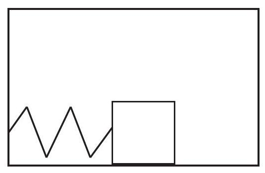

(sec-11.1)=
## 11.1 Introduction: the physics of oscillations

It is probably not an exaggeration to suggest that we are all introduced to oscillatory motion from our first moments of life. Babies, it seems, are constantly rocked to sleep, in many cases using devices, such as cradles and rocking chairs, that exemplify the kind of mechanical oscillator with which this chapter is concerned. And then, of course, there are swings, which function essentially like the pendulum depicted below.

:::{figure} ../images/2024_09_14_9969b06773f10b6936e8g-271.jpg
:label: fig-11.1
:alt: A simple pendulum. In (a), the equilibrium position, the tension and gravity forces balance out. In (b), they combine to produce a restoring force (in blue) pointing back towards equilibrium. In (c), the bob is passing through equilibrium and the net force on it at that instant is again zero, but its momentum keeps it going. At (d) we have the mirror image of (b).
A simple pendulum. In (a), the equilibrium position, the tension and gravity forces balance out. In (b), they combine to produce a restoring force (in blue) pointing back towards equilibrium. In (c), the bob is passing through equilibrium and the net force on it at that instant is again zero, but its momentum keeps it going. At (d) we have the mirror image of (b).
:::

In fact, oscillatory motion is extremely common, both in natural systems and in human-made structures. It essentially requires only two things: a stable equilibrium configuration, where the stability is ensured by what we call a restoring force; and inertia, which, of course, every physical system has.

The pendulum in {numref}`Figure %s <fig-11.1>` illustrates how these things combine to produce an oscillation. As the pendulum bob is displaced from its equilibrium position, a net force on it appears (a combination of gravity and the tension in the string), pointing back towards the vertical. When the bob is released, it accelerates under the influence of this force, with the result that when it reaches back the equilibrium position, its inertia (or, if you prefer, its momentum) causes it to overshoot it. Once this happens, the restoring force changes direction, always trying to bring the mass back to equilibrium; as a result, the bob slows down, and eventually reverses course, accelerates again towards the vertical, overshoots it again\... the process will repeat itself, until all the energy we initially put in the system (gravitational potential energy, in this case) is dissipated away (or damped), mostly through friction at the pivot point, though air resistance plays a small part as well.

That the motion, in the absence of dissipation, must be symmetric around the equilibrium position follows from conservation of energy: the speed of the bob at any given height must be the same on either side, in order for the sum of its potential and kinetic energies to be the same. In particular, if released from rest from some height, it will stop when it reaches the same height on the other side. In the presence of dissipation, the motion is neither exactly symmetric, nor exactly periodic (that is to say, it does not repeat itself exactly - the maximum height gets lower every time, the speed as it passes through the equilibrium position gets also smaller and smaller), but when the dissipation is not very large one can always define an approximate period (which we will denote with the letter $T$ ) as the time it takes to complete one full swing.

The inverse of the period is the frequency, $f$, which tells us how many full swings the pendulum completes per second. These two quantities, $T$ and $f$, can be defined for any type of periodic (or approximately periodic) motion, and will always satisfy the relationship

:::{math}
:label: eq-11.1
f=\frac{1}{T}
:::

The units of frequency are, of course, inverse seconds $\left(\mathrm{s}^{-1}\right)$. In this context, however, this unit is called a \"hertz,\" and abbreviated Hz.

(sec-11.2)=
## 11.2 Simple harmonic motion

A particularly important kind of oscillatory motion is called simple harmonic motion. This is what happens when the restoring force is linear in the displacement from the equilibrium position: that\
is to say, in one dimension, if $x_{0}$ is the equilibrium position, the restoring force has the form

:::{math}
:label: eq-11.2
F=-k\left(x-x_{0}\right)
:::

We are familiar with this from Hooke's \"law\" for an ideal spring (see {ref}`Chapter 6 <ch-6>`). So, an object attached to an ideal, massless spring, as in the figure below, should perform simple harmonic motion. This kind of oscillation is distinguished by the following characteristics:

- The position as a function of time, $x(t)$, is a sinusoidal function.

- The period of the oscillations does not depend on their amplitude (by \"amplitude\" we mean the maximum displacement from the equilibrium position).

What this second property means is that, for instance, with reference to {numref}`Fig. %s <fig-11.2>`, you can displace the mass a distance $A$, or $A / 2$, or $A / 3$, or whatever you choose, and the period (and frequency) of the resulting oscillations will be the same regardless. (This means, actually, that if you displace it farther it has to end up moving faster, to cover the larger distance in the same time.)

:::{figure} ../images/2024_09_14_9969b06773f10b6936e8g-273.jpg
:label: fig-11.2
:alt: A mass attached to a spring and sliding on a frictionless surface. Figure (a) shows the spring in its relaxed state (the "equilibrium" position for the mass, at coordinate x0 ). If displaced from equilibrium a distance A and released (b), the mass will perform simple harmonic oscillations with amplitude A.
A mass attached to a spring and sliding on a frictionless surface. Figure (a) shows the spring in its relaxed state (the \"equilibrium\" position for the mass, at coordinate $x_{0}$ ). If displaced from equilibrium a distance $A$ and released (b), the mass will perform simple harmonic oscillations with amplitude $A$.
:::

Since we know that \"Hooke's law\" is actually just an approximation, valid only provided that the spring is not compressed or stretched too much, we expect that in real life the \"ideal\" simple harmonic motion properties I have listed above will only hold approximately, as well; so, in fact, if you stretch a spring too much you will get a different period, eventually, than if you stay in the \"linear,\" Hooke's law regime. This is a general characteristic of most physical systems: simple\
harmonic motion only happens for relatively small oscillations, but \"relatively small\" can still be fairly large sometimes, and even as an approximation it is often an extremely valuable one.

The other distinctive characteristic of simple harmonic motion is that the position function is sinusoidal, by which I mean a sine or a cosine. Thus, for example, if the mass in {numref}`Fig. %s <fig-11.2>` is released from rest at $t=0$, and the position $x$ is measured from the equilibrium position $x_{0}$ (that is, the point $x=x_{0}$ is taken as the origin of coordinates), the function $x(t)$ will be

:::{math}
:label: eq-11.3
x(t)=A \cos (\omega t)
:::

where the quantity $\omega$, known as the oscillator's angular frequency, is given by

:::{math}
\omega=\sqrt{\frac{k}{m}}
:::

Here, $k$ is the spring constant, and $m$ the mass of the object (remember the spring is assumed to be massless). I will prove that {numref}`Eq. %s <eq-11.3>`, together with {eq}`eq-11.4`, satisfy Newton's second law of motion for this system in a moment; first, however, I need to say a couple of things about $\omega$. You'll recall that we have used this symbol before, in {ref}`Chapter 9 <ch-9>`, to represent the angular velocity of a particle moving in a circle (or, more generally, of any rotating object). Why bring it up again now for an apparently completely different purpose?

:::{figure} ../images/2024_09_14_9969b06773f10b6936e8g-274.jpg
:label: fig-11.3
:alt: A particle moving on a circle with constant angular velocity omega. Assuming theta=0 at t=0, we have theta=omega t, and therefore the particle's x coordinate is given by the function x(t)=R cos (omega t). This means the corresponding point on the x axis (the red dot) performs simple harmonic motion with angular frequency omega as the particle rotates.
A particle moving on a circle with constant angular velocity $\omega$. Assuming $\theta=0$ at $t=0$, we have $\theta=\omega t$, and therefore the particle's $x$ coordinate is given by the function $x(t)=R \cos (\omega t)$. This means the corresponding point on the $x$ axis (the red dot) performs simple harmonic motion with angular frequency $\omega$ as the particle rotates.
:::

The answer is that there is a very close relationship between simple harmonic motion and circular motion with constant speed, as {numref}`Figure %s <fig-11.3>` illustrates: as the point P rotates with constant angular velocity $\omega$, its projection onto the $x$ axis (the red dot in the figure) performs simple harmonic motion with angular frequency $\omega$ (and amplitude $R$ ). (Of course, there is nothing special about the $x$ axis; the projection on any other axis will also perform simple harmonic motion with the same angular frequency; for example, the blue dot on the figure.)

If the angular velocity of the particle in {numref}`Fig. %s <fig-11.3>` is constant, then its \"orbital period\" (the time needed to complete one revolution) will be $T=2 \pi / \omega$, and this will also be the period of the associated harmonic motion (the time it takes for the motion to repeat itself). You can see this directly from {numref}`Eq. %s <eq-11.3>`: if you increase the time $t$ by $2 \pi / \omega$, you get the same value of $x$ :

:::{math}
:label: eq-11.5
x\left(t+\frac{2 \pi}{\omega}\right)=A \cos \left[\omega\left(t+\frac{2 \pi}{\omega}\right)\right]=A \cos (\omega t+2 \pi)=A \cos (\omega t)=x(t)
:::

Since the frequency $f$ of an oscillator is equal to $1 / T$, this gives us the following relationship between $f$ and $\omega$ :

:::{math}
:label: eq-11.6
f=\frac{1}{T}=\frac{\omega}{2 \pi}
:::

One way to tell whether one is talking about an oscillator's frequency $(f)$ or its angular frequency $(\omega)$-apart from the different symbols, of course - is to pay attention to the units. The frequency $f$ is usually given in hertz, whereas the angular frequency $\omega$ is always given in radians per second. Apart from the factor of $2 \pi$, they are, of course, completely equivalent; sometimes one is just more convenient than the other. On the other hand, the only way to tell whether $\omega$ is a harmonic oscillator's angular frequency or the angular velocity of something moving in a circle is from the context. (In this chapter, of course, it will always be the former).

Let us go back now to {numref}`Eq. %s <eq-11.3>` for our block-on-a-spring system. The derivative with respect to time will give us the block's velocity. This is a simple application of the chain rule of calculus:

:::{math}
:label: eq-11.7
v(t)=\frac{d x}{d t}=-\omega A \sin (\omega t)
:::

Another derivative will then give us the acceleration:

:::{math}
:label: eq-11.8
a(t)=\frac{d v}{d t}=-\omega^{2} A \cos (\omega t)
:::

Note that the acceleration is always proportional to the position, only with the opposite sign. The proportionality constant is $\omega^{2}$. Since the force exerted by the spring on the block is $F=-k x$ (because we are measuring the position from the equilibrium position $x_{0}$ ), Newton's second law, $F=m a$, gives us

:::{math}
:label: eq-11.9
m a=-k x
:::

and you can check for yourself that this will be satisfied if $x$ is given by {numref}`Eq. %s <eq-11.3>`, $a$ is given by {numref}`Eq. %s <eq-11.8>`, and $\omega$ is given by {numref}`Eq. %s <eq-11.4>`.

The expression {eq}`eq-11.4` for $\omega$ is typical of what we find for many different kinds of oscillators: the restoring force (here represented by the spring constant $k$ ) and the object's inertia ( $m$ ) together determine the frequency of the motion, acting in opposite directions: a larger restoring force means a higher frequency (faster oscillations) whereas a larger inertia means a lower frequency (slower oscillations - a more \"sluggish\" response).

The position, velocity and acceleration graphs for the motion {eq}`eq-11.3` are shown in {numref}`Fig. %s <fig-11.4>` below. You may want to pay attention to some of their main features. For instance, the position and the velocity are what we call \" $90^{\circ}$ out of phase\": one is maximum (or minimum) when the other one is zero. The acceleration, on the other hand, is \" $180^{\circ}$ out of phase\" (that is to say, in complete opposition) with the position. As a result of that, all combinations of signs for $a$ and $v$ are possible: the object may be moving to the right with positive or negative acceleration (depending on which side of the origin it's on), and likewise when it is moving to the left.

:::{figure} ../images/2024_09_14_9969b06773f10b6936e8g-276.jpg
:label: fig-11.4
:alt: Position, velocity and acceleration as a function of time for an object performing simple harmonic motion according to.
Position, velocity and acceleration as a function of time for an object performing simple harmonic motion according to {numref}`Eq. %s <eq-11.3>`.
:::

Since the time we choose as $t=0$ is arbitrary, the function in {numref}`Eq. %s <eq-11.3>` (which assumes that $t=0$ is when the object's displacement is maximum and positive) is clearly not the most general formula for simple harmonic motion. Another way to see this is to realize that we could have started the motion differently. For instance, we could have hit the block with a sharp, \"impulsive\" force, lasting only a very short time, so it would have acquired a substantial velocity before it could have moved very far from its initial (equilibrium) position. In such a case, the motion would be better described by a sine function, such as $x(t)=A \sin (\omega t)$, which is zero at $t=0$ but whose derivative (the object's velocity) is maximum at that time.

If we stick to using cosines, for definiteness, then the most general equation for the position of a simple harmonic oscillator is as follows:

:::{math}
:label: eq-11.10
x(t)=A \cos (\omega t+\phi)
:::

where $\phi$ is what we call a \"phase angle,\" that allows us to match the function to the initial conditions-by which I mean, the object's initial position and velocity. Specifically, you can see, by setting $t=0$ in {numref}`Eq. %s <eq-11.10>` and its derivative, that the initial position and velocity of the motion described by {numref}`Eq. %s <eq-11.10>` are

:::{math}
:label: eq-11.11
\begin{align*}
x_{i} & =A \cos \phi \\
v_{i} & =-\omega A \sin \phi
\end{align*}
:::

Conversely, if you are given $x_{i}$ and $v_{i}$, you can use Eqs. {eq}`eq-11.11` to determine $A$ and $\phi$, which is what you need to know in order to use {numref}`Eq. %s <eq-11.10>` (note that the angular frequency, $\omega$, does not depend on the initial conditions - it is always the same regardless of how you choose to start the motion). Specifically, you can verify that Eqs. {eq}`eq-11.11` imply the following:

:::{math}
:label: eq-11.12
A^{2}=x_{i}^{2}+\frac{v_{i}^{2}}{\omega^{2}}
:::

and then, once you know $A$, you can get $\phi$ from either $x_{i}=A \cos \phi$ or $v_{i}=-\omega A \sin \phi$ (in fact, since the inverse sine and inverse cosine are both multivalued functions, you should use both equations, to make sure you get the correct sign for $\phi$ ).

(sec-11.2.1)=
### 11.2.1 Energy in simple harmonic motion

{numref}`Equation %s <eq-11.11>` above actually follows from the conservation of energy principle for a harmonic oscillator. Consider again the mass on the spring in {numref}`Figure %s <fig-11.3>`. Its kinetic energy is clearly $K=\frac{1}{2} m v^{2}$, whereas the potential energy in the spring is $\frac{1}{2} k x^{2}$. Using {numref}`Eq. %s <eq-11.10>` and its derivative, we have

:::{math}
:label: eq-11.13
\begin{align*}
U^{s p r} & =\frac{1}{2} k A^{2} \cos ^{2}(\omega t+\phi) \\
K & =\frac{1}{2} m \omega^{2} A^{2} \sin ^{2}(\omega t+\phi)
\end{align*}
:::

Recalling {numref}`Eq. %s <eq-11.4>`, note that $\omega^{2}=k / m$, so if you substitute this in the second equation above, you can see that the amplitude of both the potential and the kinetic energy is the same, namely, $\frac{1}{2} k A^{2}$. Since, for any angle $\theta$, it is always true that $\cos ^{2} \theta+\sin ^{2} \theta=1$, we find

:::{math}
:label: eq-11.14
E_{s y s}=U^{s p r}+K=\frac{1}{2} k A^{2}=\frac{1}{2} m \omega^{2} A^{2}
:::

so the total energy of the system is constant (independent of time), at it should be, in the absence of dissipation. {numref}`Figure %s <fig-11.5>` shows how the potential and kinetic energies oscillate in opposition, so one is maximum whenever the other is minimum. It also shows that they oscillate twice as fast as the oscillator itself: for example, the potential energy is maximum both when the displacement is maximum (spring maximally stretched) and when it is minimum (spring maximally compressed). Similarly, the kinetic energy is maximum when the oscillator passes through the equilibrium position, regardless of whether it is moving to the left or to the right.

:::{figure} ../images/2024_09_14_9969b06773f10b6936e8g-278.jpg
:label: fig-11.5
:alt: Kinetic (red), potential (blue) and total (black) energy for the oscillator shown in.
Kinetic (red), potential (blue) and total (black) energy for the oscillator shown in {numref}`Fig. %s <fig-11.4>`.
:::

(sec-11.2.2)=
### 11.2.2 Harmonic oscillator subject to an external, constant force

Consider a mass hanging from an ideal spring suspended from the ceiling, as in {numref}`Fig. %s <fig-11.6>` below (next page). Supposed the relaxed length of the spring is $l$, such that, in the absence of gravity, the object's equilibrium position would be at the height $y_{0}$ shown in {numref}`Figure %s <fig-11.6>`(a). In the presence of gravity, of course, the spring needs to stretch, to balance the object's weight, and so the actual equilibrium position for the system will be $y_{0}^{\prime}$, as shown in {numref}`Figure %s <fig-11.6>`(b). The upwards force from the spring at that point will be $-k\left(y_{0}^{\prime}-y_{0}\right)$, and to balance gravity we must have

:::{math}
:label: eq-11.15
-k\left(y_{0}^{\prime}-y_{0}\right)-m g=0
:::

Suppose that we now stretch the spring beyond this new equilibrium position, so the mass is now at a height $y$ ({numref}`Figure %s <fig-11.6>`(c)). What happens then? The net upwards force will be $-k\left(y-y_{0}\right)-m g$, but using {numref}`Eq. %s <eq-11.15>` this can be rewritten as

:::{math}
:label: eq-11.16
F_{n e t}=-k\left(y-y_{0}\right)-m g=-k\left(y-y_{0}^{\prime}\right)--k\left(y_{0}^{\prime}-y_{0}\right)-m g=-k\left(y-y_{0}^{\prime}\right)
:::

This is a remarkable result, because the force of gravity has disappeared completely from the final expression. Basically, the system behaves as if it consisted of just a spring of constant $k$ with equilibrium length $l^{\prime}=l+y_{0}-y_{0}^{\prime}$, and no gravity. In other words, the only thing gravity does is to change the equilibrium position, so that if you now displace the mass, it will oscillate around $y_{0}^{\prime}$ instead of around $y_{0}$. The oscillation's period and frequency are the same as if the spring was horizontal.

:::{figure} ../images/2024_09_14_9969b06773f10b6936e8g-279.jpg
:label: fig-11.6
:alt: (a) An ideal (massless) spring hanging from the ceiling, in its relaxed position. (b) With a mass m hanging from its end, the spring stretches to a new length lprime, so that k(lprime-l)=m g. (c) If the mass is now displaced from this equilibrium position (labeled y0prime in the figure) it will perform harmonic oscillations symmetrically around the point y0prime, with the same frequency as if the spring was horizontal.
(a) An ideal (massless) spring hanging from the ceiling, in its relaxed position. (b) With a mass $m$ hanging from its end, the spring stretches to a new length $l^{\prime}$, so that $k\left(l^{\prime}-l\right)=m g$. (c) If the mass is now displaced from this equilibrium position (labeled $y_{0}^{\prime}$ in the figure) it will perform harmonic oscillations symmetrically around the point $y_{0}^{\prime}$, with the same frequency as if the spring was horizontal.
:::

Although I have established this here for the specific case where the oscillator involves a spring, and the external force is gravity, this is a completely general result, valid for any simple harmonic oscillator, since for such a system the restoring force will always be a linear function of the displacement (which is all that is required for the math to work). As long as the external force is constant, the frequency of the oscillations will not be affected, and only the equilibrium position will change. In an example at the end of the chapter (under \"Advanced Topics\") I will show you how you can make use of this to calculate the effect of friction on the horizontal mass-spring combination in {numref}`Fig. %s <fig-11.2>`.

One thing you need to keep in mind, however, is that when the oscillator is subjected to an external force, as was the case here, its energy will not, in general, remain constant (unlike what we saw in {ref}`Section 11.2.1 <sec-11.2.1>`), since the external force will be doing work on the system as it oscillates. If the\
external force is constant, and does not change direction, this work will be positive half the time, and negative half the time. If it is kinetic friction, then of course it will change direction every half cycle, and the work will be negative all the time.

In the case shown in {numref}`Figure %s <fig-11.6>`, the external force is gravity, which we know to be a conservative force, so the energy that will be conserved will be the total energy of the system that includes the oscillation and the Earth, and hence also the gravitational potential energy (for which we can use here the familiar form $\left.U^{G}=m g y\right)$ :

:::{math}
:label: eq-11.17
E_{\text {osc }+ \text { earth }}=U^{s p r}+K+U^{G}=\frac{1}{2}\left(y-y_{0}\right)^{2}+\frac{1}{2} m v^{2}+m g y=\mathrm{const}
:::

The reason it is no longer possible to combine the terms $U^{s p r}+K$ into the constant $\frac{1}{2} k A^{2}$, as in {numref}`Eq. %s <eq-11.14>`, is that now we have

:::{math}
:label: eq-11.18
\begin{align*}
& y(t)=y_{0}^{\prime}+A \cos (\omega t+\phi) \\
& v(t)=-\omega A \sin (\omega t+\phi)
\end{align*}
:::

so the oscillations are centered around the new equilibrium position $y_{0}^{\prime}$, but the spring energy is not zero at that point: it is zero at $y=y_{0}$ instead. You can check for yourself, however, that if you substitute Eqs. {eq}`eq-11.18` into {numref}`Eq. %s <eq-11.17>`, and make use of the fact that $k\left(y_{0}^{\prime}-y_{0}\right)=-m g$ ({numref}`Eq. %s <eq-11.15>`), you do indeed get a constant, as you should.

(sec-11.3)=
## 11.3 Pendulums

(sec-11.3.1)=
### 11.3.1 The simple pendulum

Besides masses on springs, pendulums are another example of a system that will exhibit simple harmonic motion, at least approximately, as long as the amplitude of the oscillations is small. The simple pendulum is just a mass (or \"bob\"), approximated here as a point particle, suspended from a massless, inextensible string, as in {numref}`Fig. %s <fig-11.7>` on the next page.

We could analyze the motion of the bob by using the general methods introduced in {ref}`Chapter 8 <ch-8>` to deal with motion in two dimensions - breaking down all the forces into components and applying $\vec{F}_{n e t}=m \vec{a}$ along two orthogonal directions-but this turns out to be complicated by the fact that both the direction of motion and the direction of the acceleration are constantly changing. Although, under the assumption of small oscillations, it turns out that simply using the vertical and horizontal directions is good enough, this is not immediately obvious, and arguably it is not the most pedagogical way to proceed.

:::{figure} ../images/2024_09_14_9969b06773f10b6936e8g-281.jpg
:label: fig-11.7
:alt: A simple pendulum. The mass of the bob is m, the length of the string is l, and torques are calculated around the point of suspension O. The counterclockwise direction is taken as positive.
A simple pendulum. The mass of the bob is $m$, the length of the string is $l$, and torques are calculated around the point of suspension O. The counterclockwise direction is taken as positive.
:::

Instead, I will take advantage of the obvious fact that the bob moves on an arc of a circle, and that we have developed already in {ref}`Chapter 9 <ch-9>` a whole set of tools to deal with that kind of motion. Let us, therefore, describe the position of the pendulum by the angle it makes with the vertical, $\theta$, and let $\alpha=d^{2} \theta / d t^{2}$ be the angular acceleration; we can then write the equation of motion in the form $\tau_{\text {net }}=I \alpha$, with the torques taken around the center of rotation-which is to say, the point from which the pendulum is suspended. Then the torque due to the tension in the string is zero (since its line of action goes through the center of rotation), and $\tau_{\text {net }}$ is just the torque due to gravity, which can be written

:::{math}
:label: eq-11.19
\tau_{\text {net }}=-m g l \sin \theta
:::

The minus sign is there to enforce a consistent sign convention for $\theta$ and $\tau$ : if, for instance, I choose counterclockwise as positive for both, then I note that when $\theta$ is positive (pendulum to the right of the vertical), $\tau$ is clockwise, and hence negative, and vice-versa. This is characteristic of a restoring torque, that is to say, one that will always try to push the system back to its equilibrium position (the vertical in this case).

As for the moment of inertia of the bob, it is just $I=m l^{2}$ (if we treat it as just a point particle), so the equation $\tau_{\text {net }}=I \alpha$ takes the form

:::{math}
:label: eq-11.20
m l^{2} \frac{d^{2} \theta}{d t^{2}}=-m g l \sin \theta
:::

The mass and one factor of $l$ cancel, and we get

:::{math}
:label: eq-11.21
\frac{d^{2} \theta}{d t^{2}}=-\frac{g}{l} \sin \theta
:::

{numref}`Equation %s <eq-11.21>` is an example of what is known as a differential equation. The problem is to find a function of time, $\theta(t)$, that satisfies this equation; that is to say, when you take its second derivative the result is equal to $-(g / l) \sin [\theta(t)]$. Such functions exist and are called elliptic functions; they are included in many modern mathematical packages, but they are still not easy to use. More importantly, the oscillations they describe, in general, are not of the simple harmonic type.

On the other hand, if the amplitude of the oscillations is small, so that the angle $\theta$, expressed in radians, is a small number, we can make an approximation that greatly simplifies the problem, namely,

:::{math}
:label: eq-11.22
\sin \theta \simeq \theta
:::

This is known as the small angle approximation, and requires $\theta$ to be in radians. As an example, if $\theta=0.2 \mathrm{rad}$ (which corresponds to about $11.5^{\circ}$ ), we find $\sin \theta=0.199$, to three-figure accuracy.

With this approximation, the equation to solve becomes much simpler:

:::{math}
:label: eq-11.23
\frac{d^{2} \theta}{d t^{2}}=-\frac{g}{l} \theta
:::

We have, in fact, already solved an equation completely equivalent to this one in the previous section: that was {numref}`Equation %s <eq-11.9>` for the mass-on-a-spring system, which can be rewritten as

:::{math}
:label: eq-11.24
\frac{d^{2} x}{d t^{2}}=-\frac{k}{m} x
:::

since $a=d^{2} x / d t^{2}$. Just like the solutions to {eq}`eq-11.24` could be written in the form $x(t)=A \cos (\omega t+$ $\phi)$, with $\omega=\sqrt{k / l}$, the solutions to {eq}`eq-11.23` can be written as

:::{math}
:label: eq-11.25
\begin{align*}
\theta(t) & =A \cos (\omega t+\phi) \\
\omega & =\sqrt{\frac{g}{l}}
\end{align*}
:::

This tells us that if a pendulum is not pulled too far away from the vertical (say, about $10^{\circ}$ or less) it will perform approximate simple harmonic oscillations, with a period of

:::{math}
:label: eq-11.26
T=\frac{2 \pi}{\omega}=2 \pi \sqrt{\frac{l}{g}}
:::

This depends only on the length of the pendulum, and remains constant even as the oscillations wind down, which is why it became the basis for time-keeping devices, beginning with the invention of the pendulum clock by Christiaan Huygens in 1656. In particular, a pendulum of length $l=1 \mathrm{~m}$ will have a period of almost exactly 2 s , which is what gives you the familiar \"tick-tock\" rhythm of a \"grandfather's clock,\" once per second (that is to say, once every half period).

(sec-11.3.2)=
### 11.3.2 The \"physical pendulum\"

By a \"physical pendulum\" one means typically any pendulum-like device for which the moment of inertia is not given by the simple expression $I=m l^{2}$. This means that the mass is not concentrated into a single point-like particle a distance $l$ away from the point of suspension; rather, for example, the bob could have a size that is not negligible compared to $l$ (as in {numref}`Fig. %s <fig-11.1>`), or the \"string\" could have a substantial mass of its own - it could, for instance, be a chain, like in a playground swing, or a metal rod, as in most pendulum clocks.

.jpg)
(a)

:::{figure} ../images/2024_09_14_9969b06773f10b6936e8g-283.jpg
:label: fig-11.8
:alt: The "physical pendulum." Figure (a) shows an arbitrary distribution of mass, pivoted at point O, with center of mass at CM, oscillating under the restoring torque provided by gravity. Figure (b) shows the special case of a thin rod of length l pivoted at one end (the distance d=l / 2 in this case). In both cases, there is an additional force (not shown) acting at the pivot point, to balance gravity.
The \"physical pendulum.\" Figure (a) shows an arbitrary distribution of mass, pivoted at point O, with center of mass at CM , oscillating under the restoring torque provided by gravity. Figure (b) shows the special case of a thin rod of length $l$ pivoted at one end (the distance $d=l / 2$ in this case). In both cases, there is an additional force (not shown) acting at the pivot point, to balance gravity.
:::

(b)

Regardless of the reason, having to deal with a distributed mass means also that one needs to use the center of mass of the system as the point of application of the force of gravity. When this is done, the motion of the pendulum can again be described by the angle between the vertical and a line connecting the point of suspension and the center of mass. If the distance between these two points is $d$, then the torque due to gravity is $-m g d \sin \theta$, and the only other force on the system, the force at the pivot point, exerts no torque around that point, so we can write the equation of motion in the form

:::{math}
:label: eq-11.27
I \frac{d^{2} \theta}{d t^{2}}=-m g d \sin \theta
:::

Under the small-angle approximation, this will again lead to simple harmonic motion, only now with an angular frequency given by

:::{math}
:label: eq-11.28
\omega=\sqrt{\frac{m g d}{I}}
:::

As an example, consider the oscillations of a uniform, thin rod of length $l$ and mass $m$ pivoted at one end. We then have $I=m l^{2} / 3$, and $d=l / 2$, so {numref}`Eq. %s <eq-11.28>` gives

:::{math}
:label: eq-11.29
\omega=\sqrt{\frac{3 g}{2 l}}
:::

This is about $22 \%$ larger than the result {eq}`eq-11.25` for a simple pendulum of the same length, implying a correspondingly shorter period.

(sec-11.4)=
## 11.4 In summary

1.  Most stable physical systems will oscillate when displaced from their equilibrium position. The oscillations are due to a restoring force (or a restoring torque) and the system's own inertia.

2.  The period $T$ and frequency $f$ of an oscillatory motion are related by $f=1 / T$. The units of frequency are $\mathrm{s}^{-1}$ or hertz (abbreviated Hz ).

3.  A special (but very common) kind of oscillation is simple harmonic motion. This happens whenever the restoring force is a linear function of (that is, it is proportional to) the system's displacement from the equilibrium position.

4.  The angular frequency, $\omega$, of a simple harmonic oscillator is related to the regular frequency by $\omega=2 \pi f$. One of the properties of simple harmonic motion is that its frequency does not depend on the initial conditions, that is, on the velocity or displacement with which the motion is started.

5.  If the equilibrium position is chosen to correspond to $x=0$, the most general form of the position function for a simple harmonic oscillator is $x(t)=A \cos (\omega t+\phi)$, where The amplitude $A$ and phase angle $\phi$ are determined by the initial conditions. The velocity function is then $v(t)=-\omega A \sin (\omega t+\phi)$, and the acceleration $a(t)=-\omega^{2} A \cos (\omega t+\phi)$.

6.  The total energy (potential plus kinetic) in a simple harmonic oscillator is equal to $E_{\text {sys }}=$ $\frac{1}{2} m \omega^{2} A^{2}$. The kinetic and potential energies oscillate (in opposition, that is to say, each being maximum when the other is minimum) between this value and zero.

7.  A mass attached to an ideal (massless) spring is an example of a simple harmonic oscillator. If the spring constant is $k$, the angular frequency of this system is $\omega=\sqrt{k / m}$.

8.  An external, constant force acting on a harmonic oscillator does not change its period (or frequency), only its equilibrium position. For the mass-on-a-spring system, a force $F$ will cause a displacement of the equilibrium position equal to $F / k$, in the direction of the force.

9.  A simple pendulum (a point particle of mass $m$ suspended from a massless, inextensible string of length $l$ ) will perform harmonic oscillations around the vertical provided the small angle, approximation, $\sin \theta \simeq \theta$, holds. The angular frequency of these oscillations is $\omega=\sqrt{g / l}$.

10. A rigid object of mass $m$ pivoted around some point and performing oscillations under the influence of gravity is sometimes called a physical pendulum. Just as for the simple pendulum, the oscillations will be harmonic if the small-angle approximation holds. The angular frequency will then be $\sqrt{m g d / I}$, where $I$ is the moment if inertia around the pivot point, and $d$ the distance from the pivot point to the center of mass.

(sec-11.5)=
## 11.5 Examples

(sec-11.5.1)=
### 11.5.1 Oscillator in a box (a basic accelerometer!)

Consider a block-spring system inside a box, as shown in the figure. The block is attached to the spring, which is attached to the inside wall of the box. The mass of the block is 0.2 kg . For parts (a) through (f), assume that the box does not move.

Suppose you pull the block 10 cm to the right and release it. The angular frequency of the oscillations is $30 \mathrm{rad} / \mathrm{s}$. Neglect friction between the block and the bottom of the box.

(a) What is the spring constant?\
(b) What will be the amplitude of the oscillations?\
(c) Taking to the right to be positive, at what point in the oscillation is the velocity minimum and what is its minimum value?\
(d) At what point in the oscillation is the acceleration minimum, and what is its minimum value?\
(e) What is the total energy of the spring-block system?\
(f) If you take $t=0$ to be the instant when you release the block, write an equation of motion for the oscillation, $x(t)=$ ?, identifying the values of all constants that you use.\
(g) Imagine now that the box, with the spring and block in it, starts moving to the left with an acceleration $a=-4 \mathrm{~m} / \mathrm{s}^{2}$. By how much does the equilibrium position of the block shift (relative to the box), and in what direction?

(ch-11-solution)=
### Solution

Most of this is really pretty straightforward, since it is just a matter of using the equations introduced in this chapter properly:\
(a) Since we know that for this kind of situation, the angular frequency, the mass and the spring constant are related by

:::{math}
:label: eq-11.4
\omega=\sqrt{\frac{k}{m}}
:::

we can solve this for $k$ :

$$k=m \omega^{2}=0.2 \mathrm{~kg} \times\left(30 \frac{\mathrm{rad}}{\mathrm{s}}\right)^{2}=180 \frac{\mathrm{N}}{\mathrm{m}}$$

\(b\) The amplitude will be 10 cm , since it is released at that point with no kinetic energy.\
(c) The velocity is minimum (largest in magnitude, but with a negative sign) as the object passes through the equilibrium position moving to the left.

$$v_{\min }=-\omega A=-\left(30 \frac{\mathrm{rad}}{\mathrm{s}}\right) \times 0.1 \mathrm{~m}=-3 \frac{\mathrm{m}}{\mathrm{s}}$$

\(d\) The acceleration is minimum (again, largest in magnitude, but with a negative sign) when the spring is maximally stretched (block is farthest to the right), since this gives you the maximal force in the negative direction:

$$a_{\min }=-\omega^{2} A=-\left(30 \frac{\mathrm{rad}}{\mathrm{s}}\right)^{2} \times 0.1 \mathrm{~m}=-90 \frac{\mathrm{m}}{\mathrm{s}^{2}}$$

\(e\) The total energy is given by the formula (either one is acceptable)

$$E=\frac{1}{2} m \omega^{2} A^{2}=\frac{1}{2} k A^{2}=\frac{1}{2}(180 \mathrm{~N} / \mathrm{m}) \times(0.1 \mathrm{~m})^{2}=0.9 \mathrm{~J}$$

(You could also use $E=\frac{1}{2} m v_{\text {max }}^{2}$.)\
(f) The result is

$$x(t)=A \cos (\omega t)=A \sin \left(\omega t+\frac{\pi}{2}\right)$$

with $A=0.1 \mathrm{~m}$ and $\omega=30 \mathrm{rad} / \mathrm{s}$. You could also just write the numbers directly in the formula, but in that case you need to include the units implicitly or explicitly. What I mean by \"implicitly\" is to say something like: \" $x(t)=0.1 \cos (30 t)$, with $x$ in meters and $t$ in seconds.\"\
(g) The equilibrium position is where the block could sit at rest relative to the box. In that case, relative to the ground outside the box, it would be moving with an acceleration $a=-4 \mathrm{~m} / \mathrm{s}^{2}$, and the spring force (which is the only actual force acting on the block) would have to provide this acceleration:

$$F_{x}^{s p r}=-k \Delta x=m a$$

so

$$\Delta x=-\frac{m a}{k}=\frac{0.2 \mathrm{~kg} \times 4 \mathrm{~m} / \mathrm{s}^{2}}{180 \mathrm{~N} / \mathrm{m}}=0.00444 \mathrm{~m}$$

or 4.44 mm . This is positive, so the spring stretches-the equilibrium position for the block is shifted to the right, relative to the box's walls.

Another way to see this is the following. As we saw in the previous chapter ({ref}`section 10.2 <sec-10.2>`), an accelerated reference system, with acceleration $a$, appears \"from the inside\" as an inertial reference\
system subject to a gravitational interaction that pulls any object with mass $m$ with a force equal to $m a$ in the direction opposite the acceleration. Therefore, inside the box, which is accelerating towards the left, the block behaves as if there was a force of gravity of magnitude ma, pulling it to the right. In other words, we have a situation like the one illustrated in {numref}`Fig. %s <fig-11.6>`, only sideways. As in that case, we find the equilibrium position is shifted just enough for the force of the stretched spring to match the \"force of gravity,\" and in this way we get again the equation $F_{x}^{s p r}=m a$.

To get an accelerometer, we provide the box with some readout mechanism that can tell us the change in the oscillator's equilibrium position. This basic principle is one of the ways accelerometers and so-called \"inertial navigation systems\"-work.

(sec-11.5.2)=
### 11.5.2 Meter stick as a physical pendulum

While working on the lab on torques, you notice that a meter stick suspended from the middle behaves a little like a pendulum, in that it performs very slow oscillations when you tilt it slightly. Intrigued, you notice that it is suspended by a simple loop of string tied in a knot at the top (see figure). You measure the period of the oscillations to be about 5 s , and the width of the stick to be about 2.5 cm .

(a) What does this tell you about the quantity $I / M$, where $M$ is the mass of the stick, and $I$ its moment of inertia around a certain point?\
(b) What is the \"certain point\" mentioned in (a)?

(ch-11-solution-1)=
### Solution

As the picture below shows, the stick will behave like a physical pendulum, oscillating around the point of suspension O, which in this case is just next to the stick, where the knot is. As seen in the blown-up detail, if the width of the stick is $w$, the center of mass of the stick is located a distance $d=w / 2$ away from the point of suspension:\
.jpg)

As shown in {ref}`Section 11.3.2 <sec-11.3.2>`, we have then

:::{math}
:label: eq-11.30
\omega=\sqrt{\frac{M g w}{2 I}}
:::

Squaring this, and solving for $I / M$,

:::{math}
:label: eq-11.31
\frac{I}{M}=\frac{g w}{2 \omega^{2}}=\frac{9.8 \mathrm{~m} / \mathrm{s}^{2} \times 0.025 \mathrm{~m}}{2 \times(2 \pi / 5 \mathrm{~s})^{2}}=0.0776 \mathrm{~m}^{2}
:::

The moment of inertia is to be calculated around the point O , that is to say, the point of suspension (where the knot is in the figure). For reference, the moment of inertia of a thin rod of length $l$ around its midpoint is $M l^{2} / 12=0.083 l^{2}$. The length of the meter stick is, of course, 1 m , so the result $I / M \sim 0.08 \mathrm{~m}^{2}$ obtained above seems reasonable.

(sec-11.6)=
## 11.6 Advanced Topics

(sec-11.6.1)=
### 11.6.1 Mass on a spring damped by friction with a surface

Consider the system depicted in {numref}`Figure %s <fig-11.2>` in the presence of friction between the block and the surface. Let the coefficient of kinetic friction be $\mu_{k}$ and the coefficient of static friction be $\mu_{s}$. As usual, we will assume that $\mu_{s} \geq \mu_{k}$.

As the mass oscillates, it will experience a kinetic friction force of magnitude $F^{k}=\mu_{k} \mathrm{mg}$, in the direction opposite the direction of motion; that is to say, a force that changes direction every half period. As shown in {ref}`section 11.2.2 <sec-11.2.2>`, this force does not change the frequency of the motion, but it displaces the equilibrium position in the direction of the force, which is to say, closer to the starting point for each half-swing. As a result of that, the amplitude for each half-swing is reduced from the previous one.

Let the original equilibrium position (in the absence of friction) be $x_{0}=0$. Suppose we displace the mass a distance $A$ to the right (call this position, the starting point for the first half-swing, $x_{1}=A$ ), and let go. In the presence of friction, the equilibrium position for this first half-swing becomes the point $x_{0}^{\prime}=F^{k} / k=\mu_{k} m g$, so the real amplitude of this first half-oscillation will be $A_{1}=x_{1}-x_{0}^{\prime}=A-x_{0}^{\prime}$, and the resulting motion will be

:::{math}
:label: eq-11.32
\left.x(t)=x_{0}^{\prime}+A_{1} \cos (\omega t) \quad \text { (first half-period, } 0 \leq t \leq \pi / \omega\right)
:::

The mass then stops, momentarily, at $t=\pi / \omega$, at the position $x_{2}=x_{0}^{\prime}-A_{1}$, and turns around for the second half-swing. However, now the external force has reversed direction, so the new equilibrium position is at $-x_{0}^{\prime}$, and the new amplitude is $A_{2}=-x_{0}^{\prime}-x_{2}=A_{1}-2 x_{0}^{\prime}=A-3 x_{0}^{\prime}$. The motion for this next half-period is then

:::{math}
:label: eq-11.33
x(t)=-x_{0}^{\prime}+A_{2} \cos (\omega t) \quad(\text { second half-period, } \pi / \omega \leq t \leq 2 \pi / \omega)
:::

Continuing the process, we see that $A_{1}=A-x_{0}^{\prime}, A_{2}=A-3 x_{0}^{\prime}, A_{3}=A-5 x_{0}^{\prime} \ldots A_{n}=A-(2 n-1) x_{0}^{\prime}$. Of course, this can't go on forever, since we require the amplitude to be a positive quantity; so the motion will consist of only $n$ half-periods, where $n$ is an integer such that $A-(2 n-1) x_{0}^{\prime}>0$ but $A-(2 n+1) x_{0}^{\prime}<0$. (That is to say, $n$ is equal to the integer part of $\left(A / x_{0}^{\prime}+1\right) / 2$.)

The figure shows an example of how this would go, for the following choice of parameters: period $T=1 \mathrm{~s}, \mu_{k}=0.1$, and $A=0.18 \mathrm{~m}$. Note that, since $x_{0}^{\prime}$ depends only on the ratio $\mathrm{m} / k=1 / \omega^{2}$, there is no need to specify $m$ and $k$ separately. We get $\omega=2 \pi / T=2 \pi \mathrm{rad} / \mathrm{s}, x_{0}^{\prime}=\mu_{k} \mathrm{~g} / \omega^{2}=0.0248 \mathrm{~m}$, and $\left(A / x_{0}^{\prime}+1\right) / 2=4.13$, which means that the motion will go on for 4 half-periods before stopping.

:::{figure} ../images/2024_09_14_9969b06773f10b6936e8g-291.jpg
:label: fig-11.9
:alt: Damped oscillations.
Damped oscillations.
:::

Note that, in general, the oscillator does not stop at the equilibrium position. Rather, its final position will be at the end of the last half-swing, which is either $x_{0}^{\prime}-A_{n}$ (if the number $n$ of half-periods is odd), or $-x_{0}^{\prime}+A_{n}$, if the number $n$ is even. Either way, at that point the spring will be exerting a force of magnitude

:::{math}
:label: eq-11.34
F^{s p r}=k\left|x_{0}^{\prime}-A_{n}\right|=k\left|x_{0}^{\prime}-A+(2 n-1) x_{0}^{\prime}\right|=k\left|A-2 n x_{0}^{\prime}\right|<k x_{0}^{\prime}=F^{k}
:::

Since we expect the force of static friction, $F^{s}$, to be greater than $F^{k}$, this tells us that at this point the spring is not exerting enough force to get the mass to move again.

Note: Just for the record, this is not the way dissipation in simple harmonic motion is usually handled. The conventional thing is to assume a damping force that is proportional to the oscillator's velocity. You will almost certainly see this more standard approach (which leads to a relatively simple differential equation) in some later course.

(sec-11.6.2)=
### 11.6.2 The Cavendish experiment: how to measure $G$ with a torsion balance

Suppose that you want to try and duplicate Cavendish's experiment to measure directly the gravitational force between two masses (and hence, indirectly, the value of $G$ ). You take two relatively small, identical objects, each of mass $m$, and attach them to the ends of a rod of length $l$ (let us say the mass of the rod is negligible, for simplicity), making a sort of dumbbell; then you suspend this from the ceiling, by the midpoint, using a nylon line.

.jpg)
(a)

.jpg)
(b)

:::{figure} ../images/2024_09_14_9969b06773f10b6936e8g-292.jpg
:label: fig-11.10
:alt: (a) Torsion balance. The extremes of the oscillation are drawn in black and gray, respectively. (b) The view from the top. The dashed line indicates the equilibrium position. (c) In the presence of two nearby large masses, the equilibrium position is tilted very slightly; the light blue lines in the background show the oscillation in the absence of the masses, for reference.
(a) Torsion balance. The extremes of the oscillation are drawn in black and gray, respectively. (b) The view from the top. The dashed line indicates the equilibrium position. (c) In the presence of two nearby large masses, the equilibrium position is tilted very slightly; the light blue lines in the background show the oscillation in the absence of the masses, for reference.
:::

(c)

You have now made a torsion balance similar to the one Cavendish used. You will probably find out that it it is very hard to keep it motionless: the slightest displacement causes it to oscillate around an equilibrium position. The way it works is that an angular displacement $\theta$ from equilibrium puts a small twist on the line, which results in a restoring torque $\tau=-\kappa \theta$, where $\kappa$ is the torsion constant for your setup. If your dumbbell has moment of inertia $I$, then the equation of motion $\tau=I \alpha$ gives you

:::{math}
:label: eq-11.35
I \frac{d^{2} \theta}{d t^{2}}=-\kappa \theta
:::

If you compare this to {numref}`Eq. %s <eq-11.21>`, and follow the derivation there, you can see that the period of oscillation is

:::{math}
:label: eq-11.36
T=2 \pi \sqrt{\frac{I}{\kappa}}
:::

so if you measure $T$ you can get $\kappa$, since $I=2 m(l / 2)^{2}=m l^{2} / 2$ for the dumbbell.\
Now suppose you bring two large masses, a distance $d$ each from each end of the dumbbell, perpendicular to the dumbbell axis, and one on either side, as in the figure. The gravitational force $F^{G}=G m M / d^{2}$ between the large and small mass results in a net \"external\" torque of magnitude

:::{math}
:label: eq-11.37
\tau_{e x t}=2 F^{G} \times \frac{l}{2}=F^{G} l
:::

This torque will cause a very small displacement, so small that the change in $d$ will be practically negligible, so you can treat $F^{G}$, and hence $\tau_{\text {ext }}$, as a constant. Then the situation is analogous to that of an oscillator subjected to a constant external force ({ref}`section 11.2.2 <sec-11.2.2>`): the frequency of\
the oscillations will not change, but the equilibrium position will. In {numref}`Eq. %s <eq-11.15>` we found that $y_{0}^{\prime}-y_{0}=F_{\text {ext }} / k$ for a spring of spring constant $k$, where $y_{0}$ was the old and $y_{0}^{\prime}$ the new equilibrium position (the force was equal to $-m g$; the displacement of the equilibrium position will be in the direction of the force). For the torsion balance, the equivalent result is

:::{math}
:label: eq-11.38
\theta_{0}^{\prime}-\theta_{0}=\frac{\tau_{\text {ext }}}{\kappa}=\frac{F^{G} l}{\kappa}
:::

So, if you measure the angular displacement of the equilibrium position, you can get $F^{G}$. This displacement is going to be very small, but you can try to monitor the position of the dumbbell by, for instance, reflecting a laser from it (or, one or both of your small masses could be a small laser). Tracking the oscillations of the point of laser light on the wall, you might be able to detect the very small shift predicted by {numref}`Eq. %s <eq-11.38>`.

(sec-11.7)=
## 11.7 Problems

(ch-11-problem-1)=
### Problem 1

A block of mass $m$ is sliding on a frictionless, horizontal surface, with a velocity $v_{i}$. It hits an ideal spring, of spring constant $k$, which is attached to the wall. The spring compresses until the block momentarily stops, and then starts expanding again, so the block ultimately bounces off (see Example 5.6.2).\
(a) Write down an equation of motion (a function $x(t)$ ) for the block, which is valid for as long as it is in contact with the spring. For simplicity, assume the block is initially moving to the right, take the time when it first makes contact with the spring to be $t=0$, and let the position of the block at that time to be $x=0$. Make sure that you express any constants in your equation (such as $A$ or $\omega$ ) in terms of the given data, namely, $m, v_{i}$, and $k$.\
(b) Sketch the function $x(t)$ for the relevant time interval.

(ch-11-problem-2)=
### Problem 2

For this problem, imagine that you are on a ship that is oscillating up and down on a rough sea. Assume for simplicity that this is simple harmonic motion (in the vertical direction) with amplitude 5 cm and frequency 2 Hz . There is a box on the floor with mass $m=1 \mathrm{~kg}$.\
(a) Assuming the box remains in contact with the floor throughout, find the maximum and minimum values of the normal force exerted on it by the floor over an oscillation cycle.\
(b) How large would the amplitude of the oscillations have to become for the box to lose contact with the floor, assuming the frequency remains constant? (Hint: what is the value of the normal force at the moment the box loses contact with the floor?)

(ch-11-problem-3)=
### Problem 3

Imagine a simple pendulum swinging in an elevator. If the cable holding the elevator up was to snap, allowing the elevator to go into free fall, what would happen to the frequency of oscillation of the pendulum? Justify your answer.

(ch-11-problem-4)=
### Problem 4

Consider a block of mass $m$ attached to two springs, one on the left with spring constant $k_{1}$ and one on the right with spring constant $k_{2}$. Each spring is attached on the other side to a wall, and the block slides without friction on a horizontal surface. When the block is sitting at $x=0$, both springs are relaxed.\
Write Newton's second law, $F=m a$, as a differential equation for an arbitrary position $x$ of the block. What is the period of oscillation of this system?

(ch-11-problem-5)=
### Problem 5

Consider the block hanging from a spring shown in {numref}`Figure %s <fig-11.6>`. Suppose the mass of the block is 1.5 kg and the system is at rest when the spring has been stretched 2 cm from its original length\
(that is, with reference to the figure, $y_{0}-y_{0}^{\prime}=0.02 \mathrm{~m}$ ).\
(a) What is the value of the spring constant $k$ ?\
(b) If you stretch the spring by an additional 2 cm downward from this equilibrium position, and release it, what will be the frequency of the oscillations?\
(c) Now consider the system formed by the spring, the block, and the earth. Take the \"zero\" of gravitational potential energy to be at the height $y_{0}^{\prime}$ (the equilibrium point; you may also use this as the origin for the vertical coordinate!), and calculate all the energies in the system (kinetic, spring/elastic, and gravitational) at the highest point in the oscillation, the equilibrium point, and the lowest point. Verify that the sum is indeed constant.
