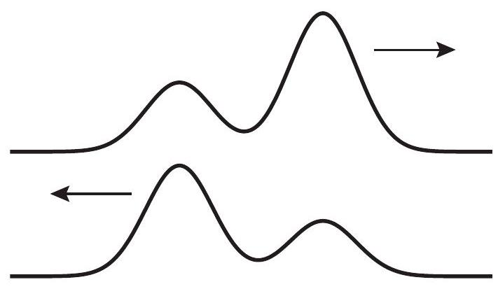

(sec-12.1)=
## 12.1 Traveling waves

In our study of mechanics we have so far dealt with particle-like objects (objects that have only translational energy), and extended, rigid objects, which may also have rotational energy. We have, however, implicitly assumed that all the objects we studied had some internal structure, or were to some extent deformable, whenever we allowed for the possibility of their storing other forms of energy, such as chemical or thermal.

This chapter deals with a very common type of organized (as opposed to incoherent) motion exhibited by extended elastic objects, namely, wave motion. (Often, the \"object\" in which the wave motion takes place is called a \"medium.\") Waves can be \"traveling\" or \"standing,\" and we will start with the traveling kind, since they are the ones that most clearly exhibit the characteristics typically associated with wave motion.

A traveling wave in a medium is a disturbance of the medium that propagates through it, in a definite direction and with a definite velocity. By a \"disturbance\" we typically mean a displacement of the parts that make up the medium, away from their rest or equilibrium position. The idea here is to regard each part of an elastic medium as, potentially, an oscillator, which couples to the neighboring parts by pushing or pulling on them (for an example of how to model this mathematically, see Advanced Topic 12.6.1 at the end of this chapter). When the traveling wave reaches a particular location in the medium, it sets that part of the medium in motion, by giving it some energy and momentum, which it then passes on to a neighboring part, and so on down the line.

You can see an example of how this works in a slinky. Start by stretching the slinky somewhat, then grab a few coils, bunch them up at one end, and release them. You should see a \"compression\
pulse\" traveling down the slinky, with very little distortion; you may even be able to see it being reflected at the other end, and coming back, before all its energy is dissipated away.

.jpg)
direction of displacement of the medium ( x )\

The compression pulse in the slinky in {numref}`Fig. %s <fig-12.1>` is an example of what is called a longitudinal wave, because the displacement of the parts that make up the medium (the rings, in this case) takes place along the same spatial dimension along which the wave travels (the horizontal direction, in the figure). The most important examples of longitudinal waves are sound waves, which work a bit like the longitudinal waves on the slinky: a region of air (or some other medium) is compressed, and as it expands it pushes on a neighboring region, causing it to compress, and passing the disturbance along. In the process, regions of rarefaction (where the density drops below its average value) are typically produced, alongside the regions of compression (increased density).

The opposite of a longitudinal wave is a transverse wave, in which the displacement of the medium's parts takes place in a direction perpendicular to the wave's direction of travel. It is actually also relatively easy to produce a transverse wave on a slinky: again, just stretch it somewhat and give one end a vigorous shake up and down. It is, however, a little hard to draw the resulting pulse on a long spring with all the coils, so in {numref}`Figure %s <fig-12.2>` below I have instead drawn a transverse wave pulse on a string, which you can produce in the same way. (Strings have other advantages: they are also easier to describe mathematically, and they are very relevant, particularly to the production of musical sounds.)

:::{figure} ../images/2024_09_14_9969b06773f10b6936e8g-298.jpg
:label: fig-12.1
:alt: A longitudinal (compression) wave pulse traveling down a slinky.
A longitudinal (compression) wave pulse traveling down a slinky.
:::

Perhaps the most important (and remarkable) property of wave motion is that it can carry energy and momentum over relatively long distances without an equivalent transport of matter. Again, think of the slinky: the \"pulse\" can travel through the slinky's entire length, carrying momentum and energy with it, but each individual ring does not move very far away from its equilibrium position. Ideally, after the pulse has passed through a particular location in the medium, the corresponding part of the medium returns to its equilibrium position and does not move any more: all the energy and momentum it momentarily acquired is passed forward. The same is (ideally) true for the transverse wave on the string in {numref}`Fig. %s <fig-12.2>`.

Since this is meant to be a very elementary introduction to waves, I will consider only this case of \"ideal\" (technically known as \"linear and dispersion-free\") wave propagation, in which the speed of the wave does not depend on the shape or size of the disturbance. In that case, the disturbance retains its \"shape\" as it travels, as I have tried to illustrate in figures 12.1 and 12.2.

(sec-12.1.1)=
### 12.1.1 The \"wave shape\" function: displacement and velocity of the medium.

In a slinky, what I have been calling the \"parts\" of the medium are very clearly seen (they are, naturally, the individual rings); in a \"homogeneous\" medium (one with no visible parts), the way to describe the wave is to break up the medium, in your mind, into infinitely many small parts or \"particles\" (as we have been doing for extended systems all semester), and write down equations that tell us how each part moves. Physically, you should think of each of these \"particles\" as being large enough to contain many molecules, but small enough that its position in the medium may be represented by a mathematical point.

The standard way to label each \"particle\" of the medium is by the position vector of its equilibrium position (the place where the particle sits at rest in the absence of a wave). In the presence of the wave, the particle that was initially at rest at the point $\vec{r}$ will undergo a displacement that I am going to represent by the vector $\vec{\xi}$ (where $\xi$ is the Greek letter \"xi\"). This displacement will in general be a function of time, and it may also be different for different particles, so it will also be a function of $\vec{r}$, the equilibrium position of the particle we are considering. The particle's position under the influence of the wave becomes then

:::{math}
:label: eq-12.1
\vec{r}+\vec{\xi}(\vec{r}, t)
:::

This is very general, and it can be given a simpler form for simple cases. For instance, for a transverse wave on a string, we can label each part of the string at rest by its $x$ coordinate, and then take the displacement to lie along the $y$ axis; the position vector, then, could be written in component form as $(x, \xi(x, t), 0)$. Similarly, we can consider a \"plane\" sound wave as a longitudinal wave traveling in the $x$ direction, where the density of the medium is independent of $y$ and $z$ (that is, it is constant on planes perpendicular to the direction of propagation). In that case, the equilibrium coordinate $x$ can be used to refer to a whole \"slice\" of the medium, and the position\
of that slice, along the $x$ axis, at the time $t$ will be given by $x+\xi(x, t)$. In both of these cases, the displacement vector $\xi$ reduces to a single nonzero component (along the $y$ or $x$ axis, respectively), which can, of course, be positive or negative. I will restrict myself implicitly to these simple cases and treat $\xi$ as a scalar from this point on.

Under these conditions, the function $\xi(x, t)$ (which is often called the wave function) gives us the shape of the \"displacement wave,\" that is to say, the displacement of every part of the medium, labeled by its equilibrium $x$-coordinate, at any instant in time. Accordingly, taking the derivative of $\xi$ gives us the velocity of the corresponding part of the medium:

:::{math}
:label: eq-12.2
v_{\text {med }}=\frac{d \xi}{d t}
:::

This is also, in general, a vector (along the direction of motion of the wave, if the wave is longitudinal, or perpendicular to it if the wave is transverse). It is also a function of time, and in general will be different from the speed of the wave itself, which we have taken to be constant, and which I will denote by $c$ instead.

(sec-12.1.2)=
### 12.1.2 Harmonic waves

An important class of waves are those for which the wave function is sinusoidal. This means that the different parts of the medium execute simple harmonic motion, all with the same frequency, but each (in general) with a different phase. Specifically, for a sinusoidal wave we have

:::{math}
:label: eq-12.3
\xi(x, t)=\xi_{0} \sin \left[\frac{2 \pi x}{\lambda}-2 \pi f t\right]
:::

In {numref}`Eq. %s <eq-12.3>`, $f$ stands for the frequency, and plays the same role it did in the previous chapter: it tells us how often (that is, how many times per second) the corresponding part of the medium oscillates around its equilibrium position. The constant $\xi_{0}$ is just the amplitude of the oscillation (what we used to call $A$ in the previous chapter). The constant $\lambda$, on the other hand, is sometimes known as the \"spatial period,\" or, most often, the wavelength of the wave: it tells you how far you have to travel along the $x$ axis, from a given point $x$, to find another one that is performing the same oscillation with the same amplitude and phase.

A couple of snapshots of a harmonic wave are shown in {numref}`Fig. %s <fig-12.3>` (next page). The figure shows the displacement $\xi$, at two different times, and as a function of the coordinate $x$ used to label the parts into which we have broken up the medium (as explained in the previous subsection). As such, the wave it represents could equally well be longitudinal or transverse. If it is transverse, like a wave on a string, then you can think of $\xi$ as being essentially just $y$, and then the displacement curve (the blue line) just gives you the shape of the string. If the wave is longitudinal, however, then it is a bit harder to visualize what is going on just from the plot of $\xi(x, t)$. This is what I have tried to do with the density plots at the bottom of the figure.

:::{figure} ../images/2024_09_14_9969b06773f10b6936e8g-301.jpg
:label: fig-12.2
:alt: A transverse wave pulse traveling down a string. This pulse can be generated by giving an end of the string a strong shake, while holding the string taut. (You can do this on a slinky, too.)
A transverse wave pulse traveling down a string. This pulse can be generated by giving an end of the string a strong shake, while holding the string taut. (You can do this on a slinky, too.)
:::

Imagine the wave is longitudinal, and consider the $x=\pi$ point on the $t=0$ curve (the first zero, not counting the origin). A particle of the medium immediately to the left of that point has a positive displacement, that is, it is pushed towards $x=\pi$, whereas a slice on the right has a negative displacement-which means it is also pushed towards $x=\pi$. We therefore expect the density of the medium to be highest around that point, whereas around $x=2 \pi$ the opposite occurs: particles to the left are pushed to the left and those to the right are pushed to the right, resulting in a low-density region. The density plot labeled $t=0$ attempts to show this using a grayscale where darker and lighter correspond to regions of higher and smaller density, respectively. At the later time $t=\Delta t$ the high and low density regions have moved a distance $c \Delta t$ to the right, as shown in the second density plot.

Regardless of whether the wave is longitudinal or transverse, if it is harmonic, the spatial pattern will repeat itself every wavelength; you can think of the wavelength $\lambda$ as the distance between two consecutive crests (or two consecutive troughs) of the displacement function, as shown in the figure. If the wave is traveling with a speed $c$, an observer sitting at a fixed point $x$ would see the disturbance pass through that point, the particles move up and down (or back and forth), and the motion repeat itself after the wave has traveled a distance $\lambda$, that is, after a time $\lambda / c$. This means the period of the oscillation at every point is $T=\lambda / c$, and the corresponding frequency $f=1 / T=c / \lambda:$

:::{math}
:label: eq-12.4
f=\frac{c}{\lambda}
:::

This is the most basic equation for harmonic waves. Making use of it, {numref}`Eq. %s <eq-12.3>` can be rewritten\
as

:::{math}
:label: eq-12.5
\xi(x, t)=\xi_{0} \sin \left[\frac{2 \pi}{\lambda}(x-c t)\right]
:::

This suggests that if we want to have a wave moving to the left instead, all we have to do is change the sign of the term proportional to $c$, which is indeed the case.

In contrast to the wave speed, which is a constant, the speed of any part of the medium, with equilibrium position $x$, at the time $t$, can be calculated from Eqs. {eq}`eq-12.2` and {eq}`eq-12.3` to be

:::{math}
:label: eq-12.6
v_{\text {med }}(x, t)=2 \pi f \xi_{0} \cos \left[\frac{2 \pi x}{\lambda}-2 \pi f t\right]=\omega \xi_{0} \cos \left[\frac{2 \pi x}{\lambda}-2 \pi f t\right]
:::

(where I have introduced the angular frequency $\omega=2 \pi f$ ). Again, this is a familiar result from the theory of simple harmonic motion: the velocity is \" 90 degrees out of phase\" with the displacement, so it is maximum or minimum where the displacement is zero (that is, when the particle is passing through its equilibrium position in one direction or the other).

Note that the result {eq}`eq-12.6` implies that, for a longitudinal wave, the \"velocity wave\" is in phase with the \"density wave\": that is, the medium velocity is large and positive where the density is largest, and large and negative where the density is smallest (compare the density plots in {numref}`Fig. %s <fig-12.3>`). If we think of the momentum of a volume element in the medium as being proportional to the product of the instantaneous density and velocity, we see that for this wave, which is traveling in the positive $x$ direction, there is more \"positive momentum\" than \"negative momentum\" in the medium at any given time (of course, if the wave had been traveling in the opposite direction, the sign of $v_{\text {med }}$ in {numref}`Eq. %s <eq-12.6>` would have been negative, and we would have found the opposite result). This confirms our expectation that the wave carries a net amount of momentum in the direction of propagation. A detailed calculation (which is beyond the scope of this book) shows that the time-average of the \"momentum density\" (momentum per unit volume) can be written as

:::{math}
:label: eq-12.7
\frac{p}{V}=\frac{1}{2 c} \rho_{0} \omega^{2} \xi_{0}^{2}
:::

where $\rho_{0}$ is the medium's average mass density (mass per unit volume). Interestingly, this result applies also to a transverse wave!

As mentioned in the introduction, the wave also carries energy. {numref}`Equation %s <eq-12.6>` could be used to calculate the kinetic energy of a small region of the medium (with volume $V$ and density $\rho_{0}$, and therefore $m=\rho_{0} V$ ), and its time average. This turns out to be equal to the time average of the elastic potential energy of the same part of the medium (recall that we had the same result for harmonic oscillators in the previous chapter). In the end, the total time-averaged energy density (energy per unit volume) in the region of the medium occupied by the wave is given by

:::{math}
:label: eq-12.8
\frac{E}{V}=\frac{1}{2} \rho_{0} \omega^{2} \xi_{0}^{2}
:::

Comparing {eq}`eq-12.7` and {eq}`eq-12.8`, you can see that

:::{math}
:label: eq-12.9
\frac{E}{V}=\frac{c p}{V}
:::

This relationship between the energy and momentum densities (one is just $c$ times the other) is an extremely general result that applies to all sorts of waves, including electromagnetic waves!

(sec-12.1.3)=
### 12.1.3 The wave velocity

You may ask, what determines the speed of a wave in a material medium? The answer, qualitatively speaking, is that $c$ always ends up being something of the form

:::{math}
:label: eq-12.10
c \sim \sqrt{\frac{\text { stiffness }}{\text { inertia }}}
:::

where \"stiffness\" is some measure of how rigid the material is (how hard it is to compress it or, in the case of a transverse wave, shear it), whereas \"inertia\" means some sort of mass density.

For a transverse wave on a string, for instance, we find

:::{math}
:label: eq-12.11
c=\sqrt{\frac{F^{t}}{\mu}}
:::

where $F^{t}$ is the tension in the string and $\mu$ is not the \"reduced mass\" of anything (sorry about the confusion!), but a common way to write the \"mass per unit length\" of the string. We could also just write $\mu=M / L$, where $M$ is the total mass of the string and $L$ its length. Note that the tension is a measure of the stiffness of the string, so this is, indeed, of the general form {eq}`eq-12.10`. For two strings under the same tension, but with different densities, the wave will travel more slowly on the denser one.

For a sound wave in a fluid (liquid or gas), the speed of sound is usually written

:::{math}
:label: eq-12.12
c=\sqrt{\frac{B}{\rho_{0}}}
:::

where $\rho_{0}$ is the regular density (mass per unit volume), and $B$ is the so-called bulk modulus, which gives the fluid's resistance to a change in volume when a pressure $P$ is applied to it: $B=P /(\Delta V / V)$. So, once again, we get something of the form {eq}`eq-12.10`. In this case, however, we find that for many fluids the density and the stiffness are linked, so they increase together, which means we cannot simply assume that the speed of sound will be automatically smaller in a denser medium. For gases, this does work well: the speed of sound in a lighter gas, like helium, is greater than in air,\
whereas in a denser gas like sulfur hexafluoride the speed of sound is less than in air ${ }^{1}$. However, if you compare the speed of sound in water to the speed of sound in air, you find it is much greater in water, since water is much harder to compress than air: in this case, the increase in stiffness more than makes up for the increase in density.

The same thing happens if you go from a liquid like water to a solid, where the speed of sound is given by

:::{math}
:label: eq-12.13
c=\sqrt{\frac{Y}{\rho_{0}}}
:::

where $Y$ is, again, a measure of the stiffness of the material, called the Young modulus. Since a solid is typically even harder to compress than a liquid, the speed of sound in solids such as metals is much greater than in water, despite their being also denser. For reference, the speed of sound in steel would be about $c=5,000 \mathrm{~m} / \mathrm{s}$; in water, about $1,500 \mathrm{~m} / \mathrm{s}$; and in air, \"only\" about $340 \mathrm{~m} / \mathrm{s}$.

(sec-12.1.4)=
### 12.1.4 Reflection and transmission of waves at a medium boundary

Suppose that you have two different elastic media, joined in some way at a common boundary, and you have a wave in the first medium traveling towards the boundary. Examples of media connected this way could be two different strings tied together, or two springs with different spring constants joined at the ends; or, for sound waves, it could just be something like water with air above it: a compression wave in air traveling towards the water surface will push on the surface and set up a sound wave there, and vice-versa.

The first thing to notice is that, if the incident wave has a frequency $f$, it will cause the medium boundary, when it arrives there, to oscillate at that frequency. As a result of that, the wave that is set up in the second medium-which we call the transmitted wave-will also have the same frequency $f$. Again, think of the two strings tied together, so the first string \"drives\" the second one at the frequency $f$; or the sound at the air-water boundary, driving (pushing) the water surface at the frequency $f$.

So, the incident and transmitted waves will have the same frequency, but it is clear that, if the wave speeds in the two media are different, they cannot have the same wavelength: since the relation {eq}`eq-12.4` has to hold, we will have $\lambda_{1}=c_{1} / f$, and $\lambda_{2}=c_{2} / f$. Thus, if a periodic wave goes from a slower to a faster medium, its wavelength will increase, and if it goes from a faster to a slower one, the wavelength will decrease.

It is easy to see physically why this happens, and how it has to be the case even for non-periodic

waves, that is, wave pulses: a pulse going into a faster medium will widen in length (stretch), whereas a pulse going into a slower medium will become narrower (squeezed). Imagine, for example, several people walking in line, separated by the same distance $d$, all at the same pace, until they reach a line beyond which they are supposed to start running. When the first person reaches the line, he starts running, but the second one is still walking, so by the time the second one reaches the line the first one has increased his distance from the second. The same thing will happen between the second and the third, and so on: the original \"bunch\" will become spread out. (If you watch car races, chances are you have seen this kind of thing happen already!)

Besides setting up a transmitted wave, with the properties I have just discussed, the incident wave will almost always cause a reflected wave to start traveling in the first medium, moving backwards from the boundary. The reflected wave also has the same frequency as the incident one, and since it is traveling in the same medium, it will also have the same wavelength. A non-periodic pulse, when reflected, will therefore not be stretched or squeezed, but it will be \"turned around\" back-to-front, since the first part to reach the boundary also has to be the first to leave. See {numref}`Figure %s <fig-12.4>` (the top part) for an example.\
:::{figure} ../images/2024_09_14_9969b06773f10b6936e8g-305.jpg
:label: fig-12.3
:alt: Top: two snapshots of a traveling harmonic wave at t=0 (solid) and at t=delta t (dashed). The quantity xi is the displacement of a typical particle of the medium at each point x (the wave is traveling in the positive x direction). Units for both x and xi are arbitrary. Bottom: The corresponding densities, for the case of a longitudinal wave.
Top: two snapshots of a traveling harmonic wave at $t=0$ (solid) and at $t=\Delta t$ (dashed). The quantity $\xi$ is the displacement of a typical particle of the medium at each point $x$ (the wave is traveling in the positive $x$ direction). Units for both $x$ and $\xi$ are arbitrary. Bottom: The corresponding densities, for the case of a longitudinal wave.
:::

What is the physical reason for the reflected wave? Ultimately, it has to do with the energy\
carried by the incident wave, and whether it is possible for the transmitted wave alone to handle the incoming energy flux or not. As we saw earlier ({numref}`Eq. %s <eq-12.8>`), the energy per unit volume in a harmonic wave of angular frequency $\omega$ and amplitude $\xi_{0}$ is $E / V=\frac{1}{2} \rho_{0} \omega^{2} \xi_{0}^{2}$. If the wave is traveling at a speed $c$, then the energy flux (energy transported per unit time per unit area) is equal to $(E / V) c$, which is to say

:::{math}
:label: eq-12.14
I=\frac{1}{2} c \rho_{0} \omega^{2} \xi_{0}^{2}
:::

This is often called the intensity of the wave. It can be written as $I=\frac{1}{2} Z \omega^{2} \xi_{0}^{2}$, where I have defined the medium's mechanical impedance (or simply the impedance) as

:::{math}
:label: eq-12.15
Z=c \rho_{0}
:::

(for a string, the mass per unit length $\mu$ instead of the mass per unit volume $\rho_{0}$ should be used). You can see that if the two media have the same impedance, then the energy flux in medium 2 will exactly match that in medium 1 , provided the incident and transmitted waves have the same amplitudes. In that case, there will be no reflected wave: even if the two media have different densities and wave velocities, as long as they have the same impedance, the wave will be completely transmitted.

On the other hand, if the media have different impedances, then it will in general be impossible to match the energy flux with only a transmitted wave, and reflection will occur. This is not immediately obvious, since it looks like all you have to do, to compensate for the different impedances in {numref}`Eq. %s <eq-12.14>`, is to give the transmitted wave an amplitude that is different from that of the incident wave. But the point is precisely that, mathematically, you cannot do that without introducing a reflected wave. This is because the actual amplitude of the oscillation at the boundary has to be the same on both sides, since the two media are connected there, and oscillating together; so, if $\xi_{0, \text { inc }}$ is going to be different from $\xi_{0, \text { trans }}$, you need to have another wave in medium 1 , the reflected wave, to insure that $\xi_{0, \text { inc }}+\xi_{0, \text { reff }}=\xi_{0, \text { trans }}$.

Another way to see this is to dig in a little deeper into the physical meaning of the impedance. This is a worthwhile detour, because impedance in various forms recurs in a number of physics and engineering problems. For a sound wave in a solid, for instance, we can see from Eqs. {eq}`eq-12.13` and {eq}`eq-12.15` that $Z=c \rho_{0}=\sqrt{Y \rho_{0}}$; so a medium can have a large impedance either by being very stiff (large $Y$ ) or very dense (large $\rho_{0}$ ) or both; either way, one would have to work harder to set up a wave in such a medium than in one with a smaller impedance. On the other hand, once the wave is set up, all that work gets stored as energy of the wave, so a wave in a medium with larger $Z$ will also carry a larger amount of energy (as is also clear from {numref}`Eq. %s <eq-12.14>` $)^{2}$ for a given displacement $\xi_{0}$.

So, when a wave is trying to go from a low impedance to a large impedance medium, it will find

it hard to set up a transmitted wave: the transmitted wave amplitude will be small (compared to that of the incident wave), and the only way to satisfy the condition $\xi_{0 \text {,inc }}+\xi_{0 \text {,ref }}=\xi_{0 \text {,trans }}$ will be to set up a reflected wave with a negative amplitude ${ }^{3}$-in effect, to flip the reflected wave upside down, in addition to left-to-right. This is the case illustrated in the bottom drawing in {numref}`Figure %s <fig-12.4>`.

Conversely, you might think that a wave trying to go from a high impedance to a low impedance medium would have no trouble setting up a transmitted wave there, and that is true - but because of its low impedance, the transmitted wave will still not be able to carry all the energy flux by itself. In this case, $\xi_{0, \text { trans }}$ will be greater than $\xi_{0, \text { inc }}$, and this will also call for a reflected wave in the first medium, only now it will be \"upright,\" that is, $\xi_{0, \text { reff }}=\xi_{0, \text { trans }}-\xi_{0, \text { inc }}>0$.

To finish up the subject of impedance, note that the observation we just made, that impedance will typically go as the square root of the product of the medium's \"stiffness\" times its density, is quite general. Hence, a medium's density will typically be a good proxy for its impedance, at least as long as the \"stiffness\" factor is independent of the density (as for strings, where it is just equal to the tension) or, even better, increases with it (as is typically the case for sound waves in most materials). Thus, you will often hear that a reflected wave is inverted (flipped upside down) when it is reflected from a denser medium, without any reference to the impedance - it is just understood that \"denser\" also means \"larger impedance\" in this case. Also note, along these lines, that a \"fixed end,\" such as the end of a string that is tied down (or, for sound waves, the closed end of an organ pipe), is essentially equivalent to a medium with \"infinite\" impedance, in which case there is no transmitted wave at that end, and all the energy is reflected.

Finally, the expression $\xi_{0 \text {,inc }}+\xi_{0 \text {,ref }}$ that I wrote earlier, for the amplitude of the wave in the first medium, implicitly assumes a very important property of waves, which is the phenomenon known as interference, or equivalently, the \"linear superposition principle.\" According to this principle, when two waves overlap in the same region of space, the total displacement is just equal to the algebraic sum of the displacements produced by each wave separately. Since the displacements are added with their signs, one may get destructive interference if the signs are different, or constructive interference if the signs are the same. This will play an important role in a moment, when we start the study of standing waves.

(sec-12.2)=
## 12.2 Standing waves and resonance

Imagine you have a sinusoidal traveling wave of the form {eq}`eq-12.5`, only traveling to the left, incident from the right on a \"fixed end\" at $x=0$. The incident wave will go as $\xi_{0} \sin [2 \pi(x+c t) / \lambda]$; the reflected wave should be flipped left to right and upside down, so change $x$ to $-x$ and put an overall

minus sign on the displacement, to get $-\xi_{0} \sin [2 \pi(-x+c t) / \lambda]$. The sum of the two waves in the region $x>0$ is then\
\$\$

:::{math}
:label: eq-12.16
\xi(x, t)=\xi_{0} \sin \left[\frac{2 \pi}{\lambda}(x+c t)\right]-\xi_{0} \sin \left[\frac{2 \pi}{\lambda}(-x+c t)\right]=2 \xi_{0} \sin \left(\frac{2 \pi x}{\lambda}\right) \cos (2 \pi f t)
:::

\$\$\
using a trigonometrical identity for $\sin (a+b)$, and $f=c / \lambda$.\
The result on the right-hand side of {numref}`Eq. %s <eq-12.16>` is called a standing wave. It does not travel anywhere, it just oscillates \"in place\": every point $x$ behaves like a separate oscillator with an amplitude $2 \xi_{0} \sin (2 \pi x / \lambda)$. This amplitude is zero at special points, where $2 x / \lambda$ is equal to an integer. These points are called nodes.

We could think of \"confining\" a wave of this sort to a string fixed at both ends, if we make the string have an end at $x=0$ and the other one at one of these points where the amplitude is zero; this means we want the length $L$ of the string to satisfy

:::{math}
:label: eq-12.17
2 L=n \lambda
:::

where $n=1,2, \ldots$. Alternatively, we can think of $L$ as being fixed and {numref}`Eq. %s <eq-12.17>` as giving us the possible values of $\lambda$ that will give us standing waves: $\lambda=2 L / n$. Since $f=c / \lambda$, we see that all these possible standing waves, for fixed $L$ and $c$, have different frequencies that we can write as

:::{math}
:label: eq-12.18
f_{n}=\frac{n c}{2 L}, \quad n=1,2,3, \ldots
:::

Note that these are all multiples of the frequency $f_{1}=c / 2 L$. We call this the fundamental frequency of oscillation of a string fixed at both ends. The period corresponding to this fundamental frequency is the roundtrip time of a wave pulse around the string, $2 L / c$.

The first three standing waves are plotted in {numref}`Figure %s <fig-12.5>` (next page). Their wave functions are given by the right-hand side of {numref}`Eq. %s <eq-12.16>`, for $0 \leq x \leq L$, with $\lambda=2 L / n \quad(n=1,2,3)$, and $f=f_{n}=n c / 2 L$. The amplitude is arbitrary; in the figure I have set it equal to 1 for convenience. Calling the corresponding function $u_{n}(x, t)$ is more or less common practice in other contexts:

:::{math}
:label: eq-12.19
u_{n}(x, t)=\sin \left(\frac{n \pi x}{L}\right) \cos \left(2 \pi f_{n} t\right)
:::

These functions are called the normal modes of vibration of the string. In {numref}`Figure %s <fig-12.5>` I have shown, for each of them, the displacement at the initial time, $t=0$, as a solid line, and then half a period later as a dashed line. In addition to this, notice that the wave function vanishes identically (the string is flat) at the quarter-period intervals, $t=1 / 4 f_{n}$ and $t=3 / 4 f_{n}$. At those times, the wave has no elastic potential energy (since the string is unstretched): as with a simple oscillator passing through the equilibrium position, all its energy is kinetic. For $n>1$, there are also nodes (places where the oscillation amplitude is always zero) at points other than the ends. Including the endpoints, the $n$-th normal mode has $n+1$ nodes. The places where the oscillation amplitude is largest are called antinodes.

:::{figure} ../images/2024_09_14_9969b06773f10b6936e8g-309.jpg
:label: fig-12.4
:alt: Reflection and transmission of a pulse at the boundary where two strings of different densities are joined. ("Before" and "after" situations are shown for each case.) Top figure: the string on the right is less dense, so the pulse travels faster (the tension on both strings is supposed to be the same). The reflected pulse is upright but reversed left-to-right. Bottom figure: the string on the right is more dense, so the transmitted pulse travels more slowly. The reflected pulse is reversed left-to-right and flipped upside down.
Reflection and transmission of a pulse at the boundary where two strings of different densities are joined. (\"Before\" and \"after\" situations are shown for each case.) Top figure: the string on the right is less dense, so the pulse travels faster (the tension on both strings is supposed to be the same). The reflected pulse is upright but reversed left-to-right. Bottom figure: the string on the right is more dense, so the transmitted pulse travels more slowly. The reflected pulse is reversed left-to-right and flipped upside down.
:::

Animations of these standing waves can be found in many places; one I particularly like is here: <http://newt.phys.unsw.edu.au/jw/strings.html#standing>. It also shows graphically how the standing wave can be considered as a superposition of two oppositely-directed traveling waves, as in {numref}`Eq. %s <eq-12.16>`.

If we initially bent the string into one of the shapes shown in {numref}`Fig. %s <fig-12.5>`, and then released it, it would oscillate at the corresponding frequency $f_{n}$, keeping the same shape, only scaling it up and down by a factor $\cos \left(2 \pi f_{n} t\right)$ as time elapsed. So, another way to think of standing waves is as the natural modes of vibration of an extended system - the string, in this case, although standing waves can be produced in any medium that can carry a traveling wave.

What I mean by a \"natural mode of vibration\" is the following: a single oscillator, say, a pendulum, has a single \"natural\" frequency; if you displace it or hit it, it just oscillates at that frequency with a constant amplitude. An extended system, like the string, can be viewed as a collection of coupled oscillators, which may in general oscillate in many different and complicated ways; yet, there is a specific set of frequencies - for the string with two ends fixed, the sequence $f_{n}$ of {numref}`Eq. %s <eq-12.18>` ---and associated shapes that will result in all the parts of the string performing simple harmonic motion, in synchrony, all at the same frequency.

Of course, to produce just one of these specific modes of oscillation requires some care (\"driving\" the string at the right frequency is probably the easiest way; see next paragraph); however, if you simply hit or pluck the string in any random way, a remarkable thing happens: the resulting motion will be, mathematically, described as a sum of sinusoidal standing waves, each with one\
of the frequencies $f_{n}$, and each with a different amplitude $A_{n}$. In a musical instrument, this will eventually generate a superposition of sound waves with frequencies $f_{1}=c / 2 L, f_{2}=2 f_{1}$, $f_{3}=3 f_{1} \ldots$ (called, in this context, the fundamental, $f_{1}$, and its overtones, $f_{n}=n f_{1}$ ). Each one of these frequencies corresponds to a different pitch, or musical note, and the result will sound a little like a chord, although not nearly as pronounced - we will mostly hear only the fundamental, which corresponds to the root note of the chord, but all the notes in a major triad are in fact present in the vibration of a single guitar or piano string ${ }^{4}$.

But wait, there's more! Suppose that you try to get the string to oscillate by \"driving\" it: that is to say, grabbing a hold of one end and shaking it at some frequency, only with a very small amplitude, so the displacement at that end remains always close to zero. In that case, you will typically get only very small amplitude oscillations, until the driving frequency hits one of the special frequencies $f_{n}$, at which point you will get a large oscillation with the shape of the corresponding standing wave. This is a phenomenon known as resonance, and the $f_{n}$ are the resonant frequencies of this system.

Note that the effect I just described is essentially the same as you experience when you are \"pumping,\" or simply pushing, a swing. Unless you do it at the right frequency, you do not get very far; but if you do it at the right frequency (which is the swing's natural frequency, the one at which it will swing on its own), you can get huge amplitude oscillations. So, the frequencies {eq}`eq-12.18` may be said to be the string's natural oscillation frequencies in the same two ways: they are the ones at which it will oscillate if you just pluck it, and they are the ones at which you have to drive it if you want to get large oscillations.

Pretty much everything I have just shown you above for standing waves on a string applies to sound waves inside a tube or pipe open at both ends. In that case, however, it is not the displacement, but the pressure (or density) wave that must have zeros at the ends (since the ends are open, the pressure there must be just the average atmospheric pressure; note that the pressure or density waves in a sound wave do not give the absolute pressure or density, but the deviation, positive or negative, from the average). The math, however, is identical, and one finds the same set of normal modes and resonance frequencies as above. These are then the frequencies that would be produced when blowing in a flute or an organ pipe open at both ends. So, both from pipes and strings we get the same \"harmonic series\" of frequencies {eq}`eq-12.18` that has been the foundation of Western music since at least the time of Pythagoras.

(sec-12.3)=
## 12.3 Conclusion, and further resources

This chapter on one-dimensional waves has barely scratched the surface of the extremely rich world of wave phenomena. I have only given you a passing glance at interference, and I have not said anything at all about diffraction, the Doppler effect, polarization, refraction\.... Many of these things you will learn about in later courses, most likely when you encounter electromagnetic waves (which are non-mechanical, but described by the same mathematical equation).

Waves are such an intrinsically kinetic phenomenon that they are best appreciated by watching them in action, or, as a second-best alternative, through animations. A wonderful repository of such movies and animations is PHYSCLIPS at the University of New South Wales: <http://www.animations.physics.unsw.edu.au/waves-sound/oscillations/index.html>

They also have a set of pages on the \"physics of music\" that I have already mentioned a couple of times. If you are interested in this topic, you should go spend some time there!\
<http://newt.phys.unsw.edu.au/music>\
Finally, closer to home, the fellows at PhET (University of Colorado), have this great interactive app to explore waves on a string:\
<https://phet.colorado.edu/en/simulation/wave-on-a-string>

(sec-12.4)=
## 12.4 In summary

1.  A traveling wave in an elastic medium is a collective disturbance of the particles in the medium (a displacement, or change in pressure or density) that carries energy and momentum from one point of the medium to another, over a distance that is typically much larger than the displacement of the individual particles making up the wave.

2.  In a longitudinal wave, the displacement of the particles is along the line of motion of the wave; in a transverse wave, it is perpendicular to the wave's motion.

3.  An important kind of waves are periodic waves, in which the disturbance repeats itself at each point in the medium with a period $T$. Sinusoidal, periodic waves are called harmonic waves. Their spatial period is called the wavelength $\lambda$. If the speed of the wave is $c$, one has $c=f \lambda$, where $f=1 / T$ is the wave frequency.

4.  The time-averaged energy density in a harmonic wave (sum of kinetic and elastic potential energy per unit volume) is $E / V=\rho_{0} \omega^{2} \xi_{0}^{2} / 2$, where $\rho_{0}$ is the medium's density, and $\xi_{0}$ the amplitude of the displacement oscillations. The time average momentum density is $E / c V$. The intensity of the wave (energy carried per unit time per unit area) is $c E / V$.

5.  Sound is a longitudinal compression-and-rarefaction wave in an elastic medium. It can be described in terms of displacement, pressure or density. The pressure or density disturbance is maximal where the displacement is zero, and vice-versa.

6.  The speed of sound in a solid with Young modulus $Y$ is $c=\sqrt{Y / \rho_{0}}$; in a fluid with bulk modulus $B$, it is $c=\sqrt{B / \rho_{0}}$. In an ideal gas, this depends only on the ratio of specific heats, the molar mass, and the temperature.

7.  Transverse waves on a string with mass per unit length $\mu$ and under a tension $F^{t}$ travel with a speed $c=\sqrt{F^{t} / \mu}$.

8.  When a wave reaches the boundary between two media, it is typically partly reflected and partly transmitted. The incident, reflected and transmitted waves all have the same frequency. The transmitted wave has a wavelength $c_{2} / f$, where $c_{2}$ is the wave speed in the second medium.

9.  The quantity that determines how much of the energy is reflected or transmitted is the mechanical impedance, defined for each medium as $Z=c \rho_{0}$. If $Z_{1}=Z_{2}$ there is no reflected wave. If $Z_{1}<Z_{2}$, the reflected wave is inverted (flipped upside-down) relative to the incident wave. If $Z_{1}>Z_{2}$, it is upright.

10. Standing waves arise in a medium that is confined to a region of space, and are the normal (or \"natural\") modes of vibration of the system. In a standing wave, each particle of the medium oscillates with an amplitude that is a fixed function of the particle's position (a sinusoidal function in one dimension). This amplitude is zero at points called nodes.

11. In one dimension, all the standing wave frequencies are multiples of a fundamental frequency $f_{1}=c / 2 L$, where $L$ is the length of the medium (as long as the boundary conditions at both ends of the medium are identical). These are the resonant frequencies of the system: if disturbed, it will naturally oscillate in a superposition of these frequencies, and if driven at one of these frequencies, one will obtain a large response.

(sec-12.5)=
## 12.5 Examples

(sec-12.5.1)=
### 12.5.1 Displacement and density/pressure in a longitudinal wave

The picture below shows the displacement of a medium (let's say air) as a sound pulse travels through it. (Don't worry about the units on the axes right now! We are only interested in qualitative results here.)

:::{figure} ../images/2024_09_14_9969b06773f10b6936e8g-313.jpg
:label: fig-12.5
:alt: The three lowest-frequency normal modes of vibration of a string held down at both ends, corresponding to, from top to bottom, n=1,2,3
The three lowest-frequency normal modes of vibration of a string held down at both ends, corresponding to, from top to bottom, $n=1,2,3$
:::

(a) Sketch the corresponding pressure (or density) pulse. Note: pressure and density are in phase, so one is large where the other is large. In either case what is always plotted is the difference between the actual pressure or density and the average pressure (for air, atmospheric pressure) or density of the medium.\
(b) If this sound pulse is incident on water, sketch the reflected pulse, both in a displacement and in a pressure/density plot.

(ch-12-solution)=
### Solution

\(a\) The purpose of this example is to help refine the intuition you may have gotten from {numref}`Figure %s <fig-12.3>` regarding the relationship between the displacement and the pressure/density in a longitudinal wave. When discussing {numref}`Fig. %s <fig-12.3>`, I argued that the density should be high at a point like $x=\pi$ in that figure, because the particles to the left of that point were being pushed to the right, and those to the right were being pushed to the left. However, a similar argument can be made to show that the density should be higher than its equilibrium value whenever the displacement curve has a negative slope, in general.

For instance, consider point $x=1$ in the figure above. Particles both to the left and the right of that point are being pushed to the right (positive displacement), but the displacement is larger for the ones on the left, which will result in a bunching at $x=1$.

Conversely, if you look at a point with positive slope, such as $x=0$, you see that the particles on the right are pushed farther to the right than the particles on the left, which means the density around $x=0$ will drop.

From this you may conclude that the density versus position graph will look somewhat like the negative of the derivative of the $\xi$-vs.-x graph: positive when $\xi$ falls, negative when it rises, and zero at the \"turning points\" (maxima or minima of $\xi(x)$ ). This is, in fact, mathematically true, and is illustrated in the figure below.

:::{figure} ../images/2024_09_14_9969b06773f10b6936e8g-314.jpg
:label: fig-12.6
:alt: Illustrating the relationship between displacement (blue curve) and pressure/density (red) in a longitudinal wave. The dashed lines separate the regions where the pressure (or density) is positive (higher than in the absence of the wave) from those where it is negative.
Illustrating the relationship between displacement (blue curve) and pressure/density (red) in a longitudinal wave. The dashed lines separate the regions where the pressure (or density) is positive (higher than in the absence of the wave) from those where it is negative.\
:::

(b) If this sound wave is incident from air into water, it means it is going from a low impedance to a high impedance medium (both the density and the speed of sound are much greater in water than in air, giving a much larger $Z=c \rho_{0}$; see {numref}`Eq. %s <eq-12.15>` for the definition of impedance). This means the reflected displacement pulse will be flipped upside down, as well as left to right (see the figure on the next page). This is just (except for the scale, which here is arbitrary) like the bottom part of {numref}`Fig. %s <fig-12.4>`.

However, if you now try to figure out the shape of the density/pressure wave based on the displacement wave, as we did in part (a), you'll see that it is only reversed left to right, but not flipped upside down! This is a general property of longitudinal waves: the reflected pressure/density wave behaves in exactly the opposite way as the displacement wave, as far as the upside-down \"flip\" is concerned: it gets flipped when going from high impedance to low impedance, and not when going from low to high.

:::{figure} ../images/2024_09_14_9969b06773f10b6936e8g-315.jpg
:label: fig-12.7
:alt: What the wave pulse in the previous figure would look like if reflected from a high-impedance medium. The displacement wave is reversed left to right and flipped upside down. The pressure/density wave is only reversed left to right.
What the wave pulse in the previous figure would look like if reflected from a high-impedance medium. The displacement wave is reversed left to right and flipped upside down. The pressure/density wave is only reversed left to right.
:::

If you are curious to see how this happens mathematically, the idea is that the density wave is proportional to $-d \xi / d x$, and the reflected displacement wave goes like $\xi_{\text {ref }}=-\xi_{\text {inc }}(-x)$, where the first minus sign gives the vertical flip and the second the horizontal one. Taking the derivative of this last expression with respect to $x$ then removes the minus sign in front.

(sec-12.5.2)=
### 12.5.2 Violin sounds

The \"sounding length\" of a violin string, from the bridge to the nut at the upper end of the fingerboard, is about 32 cm .\
(a) If the string is tuned so that its fundamental frequency corresponds to a concert A $(440 \mathrm{~Hz})$, what is the speed of a wave on that string?\
(b) If the string's density is $0.66 \mathrm{~g} / \mathrm{m}$ (note: the \"g\" stands for \"grams\"!), what is the tension on the string?\
(c) When the string is played, its vibration is transmitted through the bridge to the violin plates. At what frequency will the plates vibrate?\
(d) The vibration of the plates then sets up a sound wave in air. What is the wavelength of this wave?

(ch-12-solution-1)=
### Solution

\(a\) In {ref}`Section 12.2 <sec-12.2>` we saw that the fundamental frequency of a string fixed at both ends is $f_{1}=c / 2 L$ (corresponding to {numref}`Eq. %s <eq-12.18>` with $n=1$ ). Setting this equal to 440 Hz , and solving for $c$,

$$c=2 L f_{1}=2 \times(0.32 \mathrm{~m}) \times 440 \mathrm{~s}^{-1}=282 \frac{\mathrm{m}}{\mathrm{s}}$$

\(b\) From {ref}`Section 12.1.3 <sec-12.1.3>`, we have that the speed of a wave on a string is $c=\sqrt{F^{t} / \mu}$, where $F^{t}$ is the tension and $\mu$ the mass per unit length ({numref}`Eq. %s <eq-12.11>`. Solving for $F^{t}$,

$$F^{t}=c^{2} \mu=\left(282 \frac{\mathrm{m}}{\mathrm{s}}\right)^{2} \times 6.6 \times 10^{-4} \frac{\mathrm{kg}}{\mathrm{m}}=52.5 \mathrm{~N}$$

\(c\) The plates will vibrate at the same frequency as the string, 440 Hz , since they are driven by the motion of the string.\
(d) The basic relationship to use here is {numref}`Eq. %s <eq-12.4>`, $f=c / \lambda$, which we can solve for $\lambda$ if we know $c$, the speed of sound in air. In {ref}`Section 12.1.3 <sec-12.1.3>` it was stated that the speed of sound in air is about $340 \mathrm{~m} / \mathrm{s}$, so we have

$$\lambda=\frac{c}{f}=\frac{340 \mathrm{~m} / \mathrm{s}}{440 \mathrm{~s}^{-1}}=0.77 \mathrm{~m}$$

(sec-12.6)=
## 12.6 Advanced Topics

(sec-12.6.1)=
### 12.6.1 Chain of masses coupled with springs: dispersion, and long-wavelength limit.

Consider a model of an extended elastic medium in which, for simplicity, we separate the two main medium properties, inertia and elasticity, by describing it as a chain of point-like masses (particles) connected by massless springs, as in {numref}`Figure %s <fig-12.8>` below. I will show you here how one can get \"ideal\" wave behavior in this system, provided we work in the \"long-wavelength\" limit, that is to say, we consider only waves whose wavelength is much greater than the average distance between neighboring masses.

:::{figure} ../images/2024_09_14_9969b06773f10b6936e8g-317.jpg
:label: fig-12.8
:alt: A chain of masses connected by massless springs. The top picture shows the equilibrium positions with the springs relaxed, the bottom one the situation where each mass has undergone a displacement xi.
A chain of masses connected by massless springs. The top picture shows the equilibrium positions with the springs relaxed, the bottom one the situation where each mass has undergone a displacement $\xi$.
:::

In the figure above I have explicitly shown the $n$-th mass and the two springs that push and/or pull on it, both in equilibrium (top drawing) and when the chain is in motion (bottom). In the latter case, the length of the springs depends on the relative displacements of all three masses shown. Specifically, the length of the spring on the left is $d+\xi_{n}-\xi_{n-1}$, where $d$ is the distance between the masses in equilibrium, and the length of the spring on the right is $d+\xi_{n+1}-\xi_{n}$. If the left spring is stretched (length greater than $d$ ) it will pull to the left on the $n$-th mass, and, conversely, if the right spring is stretched (length greater than $d$ ) it will pull to the right on the $n$-th mass. So, if all the springs have the same constant $k$, the force equation $F=m a$ for mass $n$ is

:::{math}
:label: eq-12.20
m a_{n}=-k\left(\xi_{n}-\xi_{n-1}\right)+k\left(\xi_{n+1}-\xi_{n}\right)
:::

which we can rewrite as

:::{math}
:label: eq-12.21
m \frac{d^{2} \xi_{n}}{d t^{2}}=k \xi_{n-1}-2 k \xi_{n}+k \xi_{n+1}
:::

Now let us try to see if we can get a sinusoidal solution to this system of differential equations. By analogy with {numref}`Eq. %s <eq-12.3>` let

$$\xi_{n}(t)=A \sin \left[2 \pi\left(\frac{x_{n}}{\lambda}-f t\right)\right]$$

where $x_{n}=n d$ is the equilibrium position of the $n$-th mass. Then for each of the three masses considered, we have

:::{math}
:label: eq-12.22
\begin{align*}
\xi_{n-1}(t) & =A \sin [2 \pi((n-1) d / \lambda-f t)]=A \sin [2 \pi(n d / \lambda-f t)-2 \pi d / \lambda] \\
\xi_{n}(t) & =A \sin [2 \pi(n d / \lambda-f t)] \\
\xi_{n+1}(t) & =A \sin [2 \pi((n+1) d / \lambda-f t)]=A \sin [2 \pi(n d / \lambda-f t)+2 \pi d / \lambda]
\end{align*}
:::

We want to substitute all this in {numref}`Eq. %s <eq-12.21>`. We can use the trigonometric identity $\sin (a-b)+$ $\sin (a+b)=2 \sin a \cos b$ to simplify $\xi_{n-1}+\xi_{n+1}$ :

:::{math}
:label: eq-12.23
\xi_{n-1}+\xi_{n+1}=2 A \sin \left[2 \pi\left(\frac{n d}{\lambda}-f t\right)\right] \cos \left(\frac{2 \pi d}{\lambda}\right)
:::

then use $1-\cos x=2 \sin ^{2}(x / 2)$ to yield

:::{math}
:label: eq-12.24
k \xi_{n-1}-2 k \xi_{n}+k \xi_{n+1}=-4 k A \sin ^{2}\left(\frac{\pi d}{\lambda}\right) \sin \left[2 \pi\left(\frac{n d}{\lambda}-f t\right)\right]=-4 k \sin ^{2}\left(\frac{\pi d}{\lambda}\right) \xi_{n}
:::

It is clear now that {numref}`Eq. %s <eq-12.21>` will be satisfied provided the following condition holds:

:::{math}
:label: eq-12.25
m(2 \pi f)^{2}=4 k \sin ^{2}\left(\frac{\pi d}{\lambda}\right)
:::

Or, taking the square root and simplifying,

:::{math}
:label: eq-12.26
f=\frac{1}{\pi} \sqrt{\frac{k}{m}} \sin \left(\frac{\pi d}{\lambda}\right)
:::

This is clearly a more complicated relation between $f$ and $\lambda$ than just {numref}`Eq. %s <eq-12.4>`. However, since we can argue that {numref}`Eq. %s <eq-12.4>` must always hold for a sinusoidal wave, what we have actually found is that the chain of masses and springs in Fig. {eq}`eq-12.8` will support a sinusoidal wave provided the wave velocity depends on the wavelength as required by Eqs. {eq}`eq-12.4` and {eq}`eq-12.26`:

:::{math}
:label: eq-12.27
c=\lambda f=\sqrt{\frac{k}{m}} \frac{\lambda}{\pi} \sin \left(\frac{\pi d}{\lambda}\right)
:::

This is an instance of the phenomenon called dispersion: sinusoidal waves of different frequencies (or wavelengths) have different velocities. One thing that happens in the presence of dispersion is that, although a single (infinite), sinusoidal wave can travel without changing its shape (provided $f$ and $\lambda$ satisfy {numref}`Eq. %s <eq-12.26>`), a general pulse will be distorted as it propagates through the medium, often severely so.

In the long wavelength limit, however, the dispersion in this model disappears. We can see this as follows. In that limit, $\lambda \gg d$ (the wavelength is much greater than the distance between the masses), and therefore $\pi d / \lambda \ll 1$; we can then make the small-angle approximation in {numref}`Eq. %s <eq-12.27>`, $\sin (\pi d / \lambda) \simeq \pi d / \lambda$, and end up with

:::{math}
:label: eq-12.28
c \simeq d \sqrt{\frac{k}{m}}
:::

This is of the general form $\sqrt{\text { stiffness/inertia }}$ (as per {numref}`Eq. %s <eq-12.10>`). Basically, in the long-wavelength limit, the medium appears homogeneous to the wave - it cannot \"tell\" that it is a chain of discrete particles. When you consider that everything that looks homogeneous on a macroscopic scale is actually made of discrete atoms or molecules at the microscopic level, you can see that this model is perhaps not as artificial as it might seem, and that in general you should, in fact, expect some kind of dispersion to occur in any medium, at sufficiently small wavelengths.

(sec-12.7)=
## 12.7 Problems

(ch-12-problem-1)=
### Problem 1

When plucked, the D string on a guitar vibrates with a frequency of 147 Hz .\
(a) What would happen to this frequency if you were to increase the tension in the string?\
(b) The vibration of the string eventually produces a sound wave of the same frequency, traveling through the air. If the speed of sound in air is $340 \mathrm{~m} / \mathrm{s}$, what is the wavelength of this wave?

(ch-12-problem-2)=
### Problem 2

Think of a flute as basically a cylindrical tube of length 0.6 m , open to the atmosphere at both ends. If the speed of sound in air is $340 \mathrm{~m} / \mathrm{s}$\
(a) What is the fundamental (lowest) frequency of a sound wave in a flute?\
(b) Is this a transverse or a longitudinal wave?\
(c) The speed of sound in helium is about 3 times that in air. How would the flute's resonance frequencies change if you filled it with helium instead of air?\
Justify each of your answers briefly.

(ch-12-problem-3)=
### Problem 3

The top picture shows a wave pulse on a string (string 1) traveling to the right, where the string is attached to another one (string 2, not shown). The bottom picture shows the reflected wave some time later.

If the tension on both strings is the same,\
(a) Is string 2 more or less dense than string 1?\
(b) In which string will the wave travel faster?\
(c) Sketch what the reflected wave would look like if the strings' densities were the opposite of what you answered in part (a).\
Explain each of your answers briefly.
